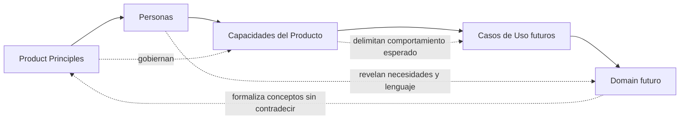
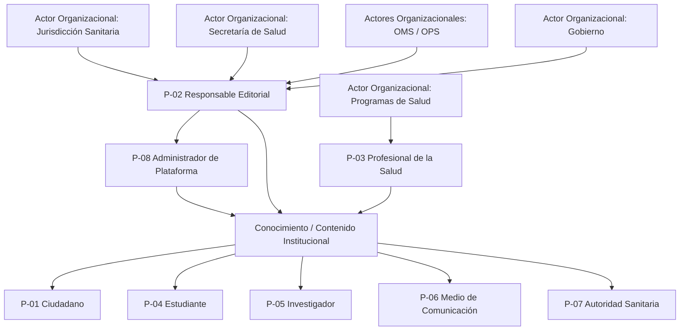
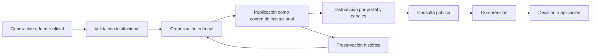
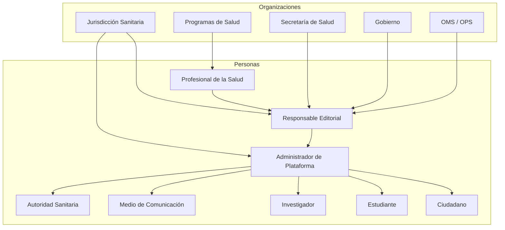
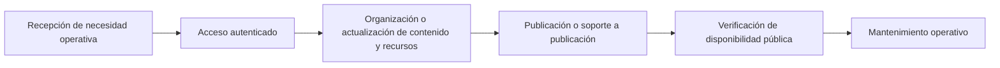
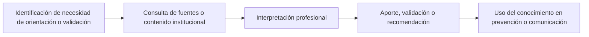
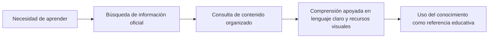

# Personas y Actores del Ecosistema de Conocimiento

| Campo | Valor |
|--------|-------|
| Proyecto | Plataforma de Gestión, Comunicación y Educación para la Salud |
| Cliente | Jurisdicción Sanitaria de Huejutla de Reyes, Hidalgo |
| Documento | Personas y Actores del Ecosistema de Conocimiento |
| Código | DOC-005 |
| Versión | 1.0.0 |
| Estado | Baseline |
| Autor | Equipo del Proyecto |
| Rol arquitectónico | Software Architect, Product Architect & Solution Architect |
| Fecha | 2026-07-03 |

---

## Índice Ejecutivo

| Clasificación | Elementos |
|---------------|-----------|
| Personas Primarias | P-01 Ciudadano; P-02 Responsable Editorial; P-08 Administrador de Plataforma |
| Personas Secundarias | P-03 Profesional de la Salud; P-04 Estudiante; P-07 Autoridad Sanitaria |
| Personas Terciarias | P-05 Investigador; P-06 Medio de Comunicación |
| Actores Organizacionales | AO-01 Jurisdicción Sanitaria de Huejutla de Reyes, Hidalgo; AO-02 Programas de Salud; AO-03 Secretaría de Salud; AO-04 Gobierno; AO-05 Organismos Internacionales |

Este índice resume el ecosistema modelado. No introduce nuevos roles ni modifica la clasificación definida en el documento.

---

# 1. Propósito del Documento

Este documento define el ecosistema de Personas y Actores Organizacionales de la **Plataforma de Gestión, Comunicación y Educación para la Salud**.

En este proyecto, una Persona representa un rol dentro del ciclo de vida del conocimiento institucional. No representa un perfil demográfico, una historia ficticia ni un arquetipo tradicional de UX.

El centro de este documento no son los usuarios. El centro es el conocimiento institucional: quién lo genera, quién lo valida, quién lo organiza, quién lo publica, quién lo consulta, quién lo utiliza para decidir, quién lo preserva y quién garantiza su calidad.

Este documento prepara el trabajo posterior de:

- `ubiquitous-language.md`;
- `domain.md`;
- `business-rules.md`;
- `use-cases.md`.

No define casos de uso, modelo de dominio, reglas de negocio, arquitectura, base de datos, API, frontend, backend, inteligencia artificial ni infraestructura.

---

# 2. Relación con Documentos Oficiales

Este documento deriva de la documentación oficial existente:

- `PROJECT_TRANSFER_PACKAGE.md`;
- `CONTEXT_TRANSFER_PACKAGE.md`;
- `docs/00-foundation/project-charter.md`;
- `docs/00-foundation/architecture-guide.md`;
- `docs/01-product/vision.md`;
- `docs/01-product/scope.md`;
- `docs/01-product/product-principles.md`.

La documentación establece que:

- la capacidad central del producto es **publicar información confiable**;
- el conocimiento institucional es el activo principal;
- el contenido institucional es la forma publicable y reutilizable de ese conocimiento;
- la población general es el público principal;
- existen públicos secundarios como personal de salud, estudiantes, autoridades, investigadores y medios de comunicación;
- la publicación requiere responsabilidad institucional;
- la plataforma no es un sistema clínico, hospitalario ni de diagnóstico;
- las capacidades deben preservar, organizar, publicar, distribuir o facilitar el acceso al conocimiento en salud pública.

Las Personas y Actores Organizacionales definidos en este documento existen únicamente porque participan en ese ciclo de vida del conocimiento institucional.

---

# 3. Principios Aplicados

Este documento aplica los Product Principles vigentes:

- `CP-01`: Información confiable como capacidad central.
- `CP-02`: Conocimiento institucional como activo principal.
- `CP-03`: Claridad y comprensión para la población.
- `CP-04`: Prevención y educación en salud como prioridad.
- `CP-05`: Frontera institucional no clínica.
- `SP-01`: Contenido institucional unificado.
- `SP-02`: Separación entre conocimiento, contenido y canales.
- `SP-03`: Evolución sostenible a largo plazo.
- `SP-04`: Automatización responsable y secundaria.
- `SP-05`: MVP protegido y orientado a valor temprano.
- `OP-01`: Responsabilidad institucional de publicación.
- `OP-02`: Actualización y vigencia del contenido.
- `OP-03`: Organización editorial comprensible.
- `OP-04`: Uso de recursos visuales para comprensión.
- `OP-05`: Documentación como fuente de verdad operativa.
- `OP-06`: Accesibilidad básica del conocimiento.

Cada Persona y Actor Organizacional deberá mantener coherencia con estos principios.

---

## Trazabilidad Product Principles - Personas - Capacidades - Casos de Uso - Domain

Este diagrama establece la relación de trazabilidad documental. Las Personas no definen casos de uso ni modelo de dominio; preparan su elaboración futura mediante necesidades, lenguaje, responsabilidades y relación con capacidades.

---

## Matriz Persona - Product Principles

| Persona | CP-01 | CP-02 | CP-03 | CP-04 | CP-05 | SP-01 | SP-02 | SP-03 | SP-05 | OP-01 | OP-02 | OP-03 | OP-04 | OP-05 | OP-06 |
|---------|-------|-------|-------|-------|-------|-------|-------|-------|-------|-------|-------|-------|-------|-------|-------|
| P-01 Ciudadano | Sí | Sí | Sí | Sí | Sí | No directo | No directo | No directo | No directo | No directo | No directo | Sí | Sí | No directo | Sí |
| P-02 Responsable Editorial | Sí | Sí | Sí | No directo | No directo | Sí | Sí | No directo | Sí | Sí | Sí | Sí | Sí | Sí | No directo |
| P-03 Profesional de la Salud | Sí | Sí | No directo | Sí | Sí | No directo | No directo | No directo | No directo | Sí | No directo | No directo | Sí | No directo | No directo |
| P-04 Estudiante | Sí | Sí | Sí | Sí | No directo | No directo | No directo | No directo | No directo | No directo | No directo | No directo | Sí | No directo | Sí |
| P-05 Investigador | Sí | Sí | No directo | No directo | No directo | No directo | No directo | Sí | No directo | No directo | Sí | No directo | No directo | Sí | No directo |
| P-06 Medio de Comunicación | Sí | No directo | Sí | No directo | No directo | No directo | Sí | No directo | No directo | Sí | No directo | Sí | No directo | No directo | Sí |
| P-07 Autoridad Sanitaria | Sí | Sí | No directo | Sí | No directo | No directo | No directo | Sí | No directo | Sí | Sí | No directo | No directo | Sí | No directo |
| P-08 Administrador de Plataforma | Sí | Sí | No directo | No directo | No directo | No directo | No directo | No directo | Sí | Sí | Sí | Sí | No directo | Sí | No directo |

La matriz identifica impacto principal de principios sobre cada Persona. "No directo" significa que el principio puede influir indirectamente, pero no gobierna de forma central la existencia del rol.

---

# 4. Criterios de Clasificación

Las Personas se clasifican por criticidad para el éxito del producto.

La clasificación no depende de jerarquía institucional, cantidad de usuarios, nivel técnico, edad, profesión o dispositivo utilizado.

## 4.1 Personas Primarias

Son roles indispensables para que el producto cumpla su capacidad central. Sin ellas, el conocimiento no se publica, no se consulta o no se preserva de forma confiable.

## 4.2 Personas Secundarias

Son roles que aportan, validan, interpretan, amplifican o utilizan el conocimiento institucional de forma relevante, pero que no son el flujo mínimo indispensable del MVP.

## 4.3 Personas Terciarias

Son roles que consumen o reutilizan conocimiento institucional con fines complementarios como investigación, difusión o referencia pública.

## 4.4 Actores Organizacionales

Son instituciones u organizaciones que participan en el ciclo de vida del conocimiento. No representan personas, módulos ni sistemas externos.

---

# 5. Capacidades del Producto Referenciadas

Las Personas utilizan capacidades de negocio derivadas de `scope.md`, no módulos técnicos.

Capacidades consideradas:

- Gestión central de contenido institucional.
- Publicación de información oficial.
- Consulta pública de contenido.
- Navegación por tipos y categorías.
- Búsqueda básica.
- Línea del tiempo pública y administrable.
- Gestión multimedia básica.
- Preparación para compartir en canales de comunicación.
- Configuración básica del sitio.
- Contenido destacado.
- Acceso autenticado al panel administrativo.
- Trazabilidad básica de fuente, autoría y responsabilidad institucional.

---

# 6. Ecosistema del Producto

Este diagrama representa relaciones de participación en el ecosistema de conocimiento. No representa arquitectura técnica.

---

# 7. Flujo del Conocimiento

El flujo describe cómo el conocimiento institucional se transforma en contenido accesible y útil para las Personas.

---

# 8. Mapa de Relaciones

El mapa muestra relaciones de colaboración, consulta y responsabilidad institucional, no flujos de pantalla.

---

# 9. Matriz Persona - Capacidad

| Persona | Gestión de contenido | Publicación oficial | Consulta pública | Búsqueda básica | Línea del tiempo | Multimedia básica | Canales de comunicación | Trazabilidad |
|---------|----------------------|---------------------|------------------|-----------------|------------------|-------------------|-------------------------|--------------|
| P-01 Ciudadano | No | No | Sí | Sí | Sí | Sí | Sí, como receptor | No |
| P-02 Responsable Editorial | Sí | Sí | Sí | Sí | Sí | Sí | Sí | Sí |
| P-03 Profesional de la Salud | Parcial, como fuente | Parcial, mediante responsabilidad institucional | Sí | Sí | Sí | Sí | No directo | Sí, como fuente |
| P-04 Estudiante | No | No | Sí | Sí | Sí | Sí | Sí, como receptor | No |
| P-05 Investigador | No | No | Sí | Sí | Sí | Sí | Sí, como receptor | No |
| P-06 Medio de Comunicación | No | No | Sí | Sí | Sí | Sí | Sí, como difusor externo | No |
| P-07 Autoridad Sanitaria | Parcial, como solicitante o validador | Parcial, mediante responsabilidad institucional | Sí | Sí | Sí | Sí | Sí | Sí |
| P-08 Administrador de Plataforma | Sí, operación | Sí, soporte operativo | Sí | Sí | Sí | Sí | Sí | Sí |

---

# 10. Mapa de Participación en el Ciclo del Conocimiento

| Participante | Generación | Validación | Organización | Publicación | Distribución | Consulta | Comprensión | Aplicación | Preservación |
|--------------|------------|------------|--------------|-------------|--------------|----------|-------------|------------|--------------|
| Ciudadano | No | No | No | No | No | Sí | Sí | Sí | No |
| Responsable Editorial | Parcial | Sí | Sí | Sí | Sí | Sí | Sí | Parcial | Sí |
| Profesional de la Salud | Sí | Sí | Parcial | No directo | No directo | Sí | Sí | Sí | Parcial |
| Estudiante | No | No | No | No | No | Sí | Sí | Sí | No |
| Investigador | No | No | No | No | No | Sí | Sí | Sí | Parcial |
| Medio de Comunicación | No | No | No | No | Sí | Sí | Sí | Sí | No |
| Autoridad Sanitaria | Parcial | Sí | Parcial | Parcial | Parcial | Sí | Sí | Sí | Sí |
| Administrador de Plataforma | No | No | Sí, operativa | Sí, operativa | Sí, operativa | Sí | Parcial | No | Sí, operativa |
| Jurisdicción Sanitaria | Sí | Sí | Sí | Sí | Sí | Sí | Sí | Sí | Sí |
| Programas de Salud | Sí | Sí | Parcial | No directo | Parcial | Sí | Sí | Sí | Parcial |
| Secretaría de Salud | Sí | Sí | No directo | No directo | Parcial | Sí | Sí | Sí | Sí |
| Gobierno | Sí | Sí | No directo | No directo | Parcial | Sí | Sí | Sí | Sí |
| OMS / OPS | Sí | Sí | No directo | No directo | Parcial | Sí | Sí | Sí | Sí |

---

## Matriz de Dependencias entre Personas y Actores Organizacionales

| Rol dependiente | Depende de | Naturaleza de la dependencia | Etapa del ciclo del conocimiento |
|-----------------|------------|------------------------------|----------------------------------|
| P-01 Ciudadano | P-02 Responsable Editorial; P-08 Administrador de Plataforma; AO-01 Jurisdicción Sanitaria | Requiere información oficial organizada, publicada y disponible | Consulta, comprensión y aplicación |
| P-02 Responsable Editorial | AO-01 Jurisdicción Sanitaria; AO-02 Programas de Salud; AO-03 Secretaría de Salud; AO-04 Gobierno; AO-05 OMS / OPS; P-03 Profesional de la Salud; P-07 Autoridad Sanitaria | Requiere conocimiento validado, fuentes oficiales, contexto institucional y criterios de prioridad | Validación, organización, publicación y preservación |
| P-03 Profesional de la Salud | AO-02 Programas de Salud; AO-01 Jurisdicción Sanitaria; P-02 Responsable Editorial | Requiere alineación institucional para aportar, validar o reutilizar conocimiento | Generación, validación y aplicación |
| P-04 Estudiante | P-02 Responsable Editorial; AO-01 Jurisdicción Sanitaria | Requiere contenido claro, organizado y confiable para aprendizaje | Consulta, comprensión y aplicación educativa |
| P-05 Investigador | P-02 Responsable Editorial; AO-01 Jurisdicción Sanitaria; AO-05 OMS / OPS | Requiere conocimiento preservado, fuentes trazables y contexto histórico | Consulta, análisis y preservación |
| P-06 Medio de Comunicación | P-02 Responsable Editorial; AO-01 Jurisdicción Sanitaria | Requiere enlaces, comunicados y materiales oficiales verificables | Consulta y distribución externa |
| P-07 Autoridad Sanitaria | AO-01 Jurisdicción Sanitaria; AO-02 Programas de Salud; P-02 Responsable Editorial | Requiere información vigente, organizada y trazable para priorizar o validar comunicación | Validación, decisión y aplicación |
| P-08 Administrador de Plataforma | P-02 Responsable Editorial; AO-01 Jurisdicción Sanitaria | Requiere criterios operativos, responsabilidad institucional y contenido listo para gestión | Organización, publicación, distribución y preservación operativa |

Esta matriz representa dependencias de conocimiento y responsabilidad. No define jerarquías, permisos, flujos de aprobación ni estructura organizacional definitiva.

---

# 11. I. Personas (Roles Humanos)

Las Personas representan roles humanos dentro del ecosistema del conocimiento institucional. Su clasificación depende de su criticidad para el éxito del producto, no de jerarquía institucional, volumen de usuarios o características demográficas.

## 11.1 Personas Primarias

### P-01. Ciudadano

| Campo | Valor |
|-------|-------|
| Identificador | P-01 |
| Nombre del rol | Ciudadano |
| Clasificación | Persona Primaria |
| Tipo | Consumidor principal de conocimiento institucional |

**Descripción**

Rol que representa a la población general que necesita consultar información oficial, clara y confiable sobre salud pública.

**Objetivo dentro del producto**

Acceder a conocimiento institucional comprensible para orientarse, prevenir enfermedades, identificar campañas vigentes y tomar decisiones informadas de cuidado.

**Valor para el producto**

Es el destinatario principal del producto. Si el Ciudadano no puede encontrar, comprender y confiar en la información, la plataforma no cumple su propósito.

**Necesidades de información**

- Información oficial y vigente.
- Campañas preventivas.
- Enfermedades y medidas de prevención.
- Avisos, comunicados y eventos relevantes.
- Infografías y materiales visuales claros.
- Información institucional básica.

**Decisiones que toma utilizando el conocimiento institucional**

- Cómo prevenir una enfermedad.
- Qué campaña vigente puede atender o consultar.
- Qué información es oficial.
- Cuándo regresar al portal para orientación confiable.
- Qué contenido compartir con otras personas.

**Capacidades del producto que utiliza**

- Consulta pública de contenido.
- Búsqueda básica.
- Navegación por tipos y categorías.
- Línea del tiempo pública.
- Contenido destacado.
- Recursos multimedia.
- Enlaces para compartir contenido.

**Knowledge Journey**

**Lenguaje utilizado**

El Ciudadano habla en términos cotidianos: "campaña", "aviso", "enfermedad", "prevención", "vacuna", "síntomas", "qué debo hacer", "dónde consultar", "información oficial".

No utiliza lenguaje técnico del sistema ni conceptos internos de administración de contenido.

**Nivel de influencia sobre el producto**

Alto. Su capacidad de comprensión y confianza determina si el producto cumple su misión.

**Frecuencia de interacción**

Variable. Puede ser ocasional, recurrente durante campañas o alta durante contingencias sanitarias.

**Nivel de conocimiento esperado**

Básico. No se debe asumir conocimiento técnico ni especializado en salud pública.

**Riesgos si el producto no satisface sus necesidades**

- Persistencia de desinformación.
- Baja confianza en la fuente institucional.
- Menor alcance de campañas preventivas.
- Abandono del portal como punto de consulta.

**Product Principles relacionados**

CP-01, CP-02, CP-03, CP-04, CP-05, OP-03, OP-04, OP-06.

**Casos de Uso relacionados (referencia futura)**

- Consultar contenido publicado.
- Buscar información de salud pública.
- Consultar campañas vigentes.
- Consultar detalle de una enfermedad.
- Consultar línea del tiempo.
- Compartir contenido oficial.

**Observaciones arquitectónicas**

El producto deberá optimizarse para comprensión pública. Las capacidades públicas deberán priorizar claridad, confiabilidad y acceso sobre complejidad funcional.

---

### P-02. Responsable Editorial

| Campo | Valor |
|-------|-------|
| Identificador | P-02 |
| Nombre del rol | Responsable Editorial |
| Clasificación | Persona Primaria |
| Tipo | Curador, organizador y publicador institucional |

**Descripción**

Rol responsable de convertir conocimiento institucional validado en contenido claro, organizado, trazable y publicable.

**Objetivo dentro del producto**

Gestionar el ciclo editorial del contenido institucional para asegurar que la información publicada sea oficial, confiable, comprensible y vigente.

**Valor para el producto**

Es el rol que conecta el conocimiento institucional con la publicación pública. Sin este rol, la plataforma no puede garantizar confiabilidad, organización ni responsabilidad institucional.

**Necesidades de información**

- Fuentes oficiales.
- Materiales de programas de salud.
- Contenido histórico.
- Recursos multimedia.
- Criterios de publicación.
- Estado de contenidos.
- Datos de responsabilidad institucional.

**Decisiones que toma utilizando el conocimiento institucional**

- Qué contenido debe publicarse.
- Qué contenido debe destacarse.
- Qué fuente respalda una publicación.
- Qué contenido debe archivarse.
- Cómo organizar contenido por tipo, categoría y etiquetas.
- Qué contenido puede prepararse para canales de comunicación.

**Capacidades del producto que utiliza**

- Gestión central de contenido institucional.
- Publicación de información oficial.
- Estados básicos de publicación.
- Clasificación por tipo, categoría y etiquetas.
- Gestión multimedia básica.
- Línea del tiempo administrable.
- Preparación para canales de comunicación.
- Trazabilidad básica.

**Knowledge Journey**

**Lenguaje utilizado**

El Responsable Editorial habla de "publicar información", "fuente oficial", "contenido vigente", "campaña", "aviso", "comunicado", "material", "infografía", "responsable", "fecha de publicación", "destacado".

No debería depender de lenguaje técnico de base de datos, API o componentes.

**Nivel de influencia sobre el producto**

Muy alto. Define la calidad, claridad, vigencia y trazabilidad del conocimiento publicado.

**Frecuencia de interacción**

Alta. Interactúa con la plataforma cada vez que se crea, actualiza, publica, destaca, distribuye o archiva contenido.

**Nivel de conocimiento esperado**

Medio a alto en operación editorial institucional. No se requiere conocimiento técnico de implementación.

**Riesgos si el producto no satisface sus necesidades**

- Información desorganizada.
- Publicaciones sin fuente o responsabilidad clara.
- Retrasos en campañas.
- Contenido duplicado o desactualizado.
- Pérdida de confianza institucional.

**Product Principles relacionados**

CP-01, CP-02, CP-03, SP-01, SP-02, SP-05, OP-01, OP-02, OP-03, OP-04, OP-05.

**Casos de Uso relacionados (referencia futura)**

- Crear contenido institucional.
- Editar contenido institucional.
- Publicar contenido.
- Archivar contenido.
- Clasificar contenido.
- Asociar recursos multimedia.
- Preparar contenido para canales de comunicación.
- Administrar eventos de línea del tiempo.

**Observaciones arquitectónicas**

Este rol requiere capacidades editoriales coherentes, pero el documento no define flujos de revisión avanzados. Dichos flujos pertenecen a versiones posteriores según `scope.md`.

---

### P-08. Administrador de Plataforma

| Campo | Valor |
|-------|-------|
| Identificador | P-08 |
| Nombre del rol | Administrador de Plataforma |
| Clasificación | Persona Primaria |
| Tipo | Operador institucional de administración inicial |

**Descripción**

Rol responsable de operar las capacidades administrativas iniciales de la plataforma, proteger el acceso al panel y apoyar la administración básica del sitio.

**Objetivo dentro del producto**

Asegurar que la plataforma pueda ser operada institucionalmente para publicar, organizar y mantener contenido confiable.

**Valor para el producto**

Permite que la Jurisdicción publique información sin depender de desarrolladores para operaciones cotidianas.

**Necesidades de información**

- Contenido institucional a administrar.
- Datos de publicación.
- Recursos multimedia.
- Configuración básica del sitio.
- Elementos destacados.
- Trazabilidad de autoría o responsabilidad.

**Decisiones que toma utilizando el conocimiento institucional**

- Qué elementos operativos deben quedar disponibles para publicación.
- Qué recursos se asocian a contenidos.
- Qué configuración básica apoya la comunicación pública.
- Qué elementos destacados deben mantenerse visibles según indicación institucional.

**Capacidades del producto que utiliza**

- Acceso autenticado al panel administrativo.
- Gestión central de contenido institucional.
- Gestión multimedia básica.
- Configuración básica del sitio.
- Contenido destacado.
- Línea del tiempo administrable.
- Preparación para canales de comunicación.
- Trazabilidad básica.

**Knowledge Journey**

**Lenguaje utilizado**

El Administrador de Plataforma habla de "panel", "publicar", "editar", "archivar", "recurso", "banner", "contenido destacado", "configuración del sitio", "acceso", "responsable".

Su lenguaje puede ser operativo, pero no debe requerir términos técnicos internos de arquitectura.

**Nivel de influencia sobre el producto**

Alto. Su operación permite que el MVP funcione institucionalmente.

**Frecuencia de interacción**

Alta durante publicación, actualización y mantenimiento del sitio.

**Nivel de conocimiento esperado**

Medio en operación de plataforma. No se requiere conocimiento técnico de desarrollo.

**Riesgos si el producto no satisface sus necesidades**

- Dependencia continua de desarrolladores.
- Dificultad para mantener contenido vigente.
- Baja adopción institucional.
- Problemas de trazabilidad operativa.

**Product Principles relacionados**

CP-01, CP-02, SP-05, OP-01, OP-02, OP-03, OP-05.

**Casos de Uso relacionados (referencia futura)**

- Iniciar sesión.
- Cerrar sesión.
- Gestionar contenido.
- Gestionar recursos multimedia.
- Configurar elementos destacados.
- Administrar línea del tiempo.

**Observaciones arquitectónicas**

Este rol no implica modelar múltiples roles o permisos avanzados en el MVP. `scope.md` establece administración inicial mediante acceso autenticado para un responsable institucional.

---

## 11.2 Personas Secundarias

### P-03. Profesional de la Salud

| Campo | Valor |
|-------|-------|
| Identificador | P-03 |
| Nombre del rol | Profesional de la Salud |
| Clasificación | Persona Secundaria |
| Tipo | Generador, validador y consumidor especializado de conocimiento |

**Descripción**

Rol que representa al personal de salud que puede aportar conocimiento, validar información o consultar contenido institucional para orientar su labor de comunicación y prevención.

**Objetivo dentro del producto**

Contribuir a que el conocimiento de salud pública publicado sea correcto, útil y alineado con fuentes institucionales.

**Valor para el producto**

Aporta criterio profesional y conocimiento institucional que fortalece la confiabilidad del contenido.

**Necesidades de información**

- Campañas vigentes.
- Información institucional validada.
- Materiales preventivos.
- Documentos oficiales.
- Contenido organizado sobre enfermedades.
- Recursos visuales reutilizables.

**Decisiones que toma utilizando el conocimiento institucional**

- Qué información puede orientar a la población.
- Qué contenido necesita validación o actualización.
- Qué material puede utilizarse en actividades preventivas.
- Qué información requiere comunicarse con mayor claridad.

**Capacidades del producto que utiliza**

- Consulta pública de contenido.
- Búsqueda básica.
- Línea del tiempo.
- Recursos multimedia.
- Participación como fuente o validador institucional.

**Knowledge Journey**

**Lenguaje utilizado**

El Profesional de la Salud habla de "prevención", "campaña", "paciente", "población", "riesgo", "medida preventiva", "lineamiento", "enfermedad", "material de apoyo".

El documento posterior de lenguaje ubicuo deberá distinguir este lenguaje profesional del lenguaje ciudadano.

**Nivel de influencia sobre el producto**

Medio a alto. Influye en la confiabilidad y calidad del conocimiento, aunque no necesariamente publica directamente.

**Frecuencia de interacción**

Variable. Puede ser recurrente durante campañas o cuando se requiere validación de contenido.

**Nivel de conocimiento esperado**

Alto en salud pública o atención sanitaria. Bajo o medio en operación de plataforma.

**Riesgos si el producto no satisface sus necesidades**

- Contenido con baja precisión.
- Dificultad para reutilizar materiales preventivos.
- Desalineación entre operación sanitaria y comunicación pública.

**Product Principles relacionados**

CP-01, CP-02, CP-04, CP-05, OP-01, OP-04.

**Casos de Uso relacionados (referencia futura)**

- Consultar contenido institucional.
- Proponer contenido o actualización.
- Validar información.
- Consultar materiales preventivos.

**Observaciones arquitectónicas**

Este rol no convierte al producto en sistema clínico. Su participación se limita al conocimiento institucional y comunicación pública.

---

### P-04. Estudiante

| Campo | Valor |
|-------|-------|
| Identificador | P-04 |
| Nombre del rol | Estudiante |
| Clasificación | Persona Secundaria |
| Tipo | Consumidor educativo de conocimiento institucional |

**Descripción**

Rol que consulta información institucional para aprendizaje, tareas, investigación formativa o comprensión de temas de salud pública.

**Objetivo dentro del producto**

Acceder a conocimiento claro, oficial y organizado que facilite aprendizaje sobre salud pública, prevención, campañas y contexto institucional.

**Valor para el producto**

Amplía el impacto educativo del producto y fortalece su propósito de educación en salud.

**Necesidades de información**

- Información clara sobre enfermedades.
- Materiales visuales.
- Documentos institucionales.
- Línea del tiempo.
- Campañas y programas.
- Fuentes oficiales.

**Decisiones que toma utilizando el conocimiento institucional**

- Qué información utilizar como referencia oficial.
- Qué tema consultar para aprendizaje.
- Qué material visual o documento revisar.
- Cómo comprender un tema de salud pública desde una fuente confiable.

**Capacidades del producto que utiliza**

- Consulta pública de contenido.
- Búsqueda básica.
- Navegación por categorías.
- Línea del tiempo.
- Recursos multimedia.

**Knowledge Journey**

**Lenguaje utilizado**

El Estudiante habla de "tema", "información", "material", "campaña", "enfermedad", "fuente confiable", "historia", "documento", "infografía".

No utiliza lenguaje técnico de administración ni modelado de dominio.

**Nivel de influencia sobre el producto**

Medio. Su uso refuerza el valor educativo del producto, pero no participa directamente en publicación.

**Frecuencia de interacción**

Ocasional o recurrente según necesidades educativas.

**Nivel de conocimiento esperado**

Básico a medio. Puede requerir información clara y estructurada.

**Riesgos si el producto no satisface sus necesidades**

- Uso de fuentes no oficiales.
- Baja utilidad educativa del portal.
- Menor alcance de conocimiento preventivo.

**Product Principles relacionados**

CP-01, CP-02, CP-03, CP-04, OP-04, OP-06.

**Casos de Uso relacionados (referencia futura)**

- Buscar contenido.
- Consultar detalle de contenido.
- Consultar línea del tiempo.
- Consultar documentos e infografías.

**Observaciones arquitectónicas**

Este rol ayudará a identificar términos para `ubiquitous-language.md` desde una perspectiva educativa no técnica.

---

### P-07. Autoridad Sanitaria

| Campo | Valor |
|-------|-------|
| Identificador | P-07 |
| Nombre del rol | Autoridad Sanitaria |
| Clasificación | Persona Secundaria |
| Tipo | Consumidor decisor y validador institucional |

**Descripción**

Rol que utiliza conocimiento institucional para tomar decisiones, solicitar comunicación pública, validar prioridades o consultar información publicada.

**Objetivo dentro del producto**

Contar con una fuente institucional confiable que permita seguimiento, priorización y apoyo a decisiones de comunicación y prevención.

**Valor para el producto**

Refuerza la gobernanza institucional, la priorización de campañas y la alineación del contenido con objetivos sanitarios.

**Necesidades de información**

- Campañas publicadas.
- Comunicados y avisos vigentes.
- Contenido institucional relevante.
- Línea del tiempo.
- Evidencia de publicación y trazabilidad.
- Información organizada para toma de decisiones.

**Decisiones que toma utilizando el conocimiento institucional**

- Qué campañas deben priorizarse.
- Qué información requiere publicación o actualización.
- Qué temas requieren mayor difusión.
- Qué conocimiento debe preservarse como memoria institucional.

**Capacidades del producto que utiliza**

- Consulta pública de contenido.
- Búsqueda básica.
- Línea del tiempo.
- Contenido destacado.
- Trazabilidad básica.
- Preparación para canales de comunicación.

**Knowledge Journey**

**Lenguaje utilizado**

La Autoridad Sanitaria habla de "prioridad", "campaña", "comunicado", "programa", "población", "alcance", "información oficial", "evidencia", "seguimiento".

**Nivel de influencia sobre el producto**

Alto. Puede orientar prioridades institucionales, aunque no necesariamente opere la plataforma.

**Frecuencia de interacción**

Variable, con mayor intensidad durante campañas, contingencias o revisiones institucionales.

**Nivel de conocimiento esperado**

Alto en contexto institucional y salud pública. Medio o bajo en operación del sistema.

**Riesgos si el producto no satisface sus necesidades**

- Falta de visibilidad sobre comunicación pública.
- Priorización deficiente de campañas.
- Baja confianza institucional en la plataforma.
- Decisiones basadas en información dispersa.

**Product Principles relacionados**

CP-01, CP-02, CP-04, SP-03, OP-01, OP-02, OP-05.

**Casos de Uso relacionados (referencia futura)**

- Consultar contenido publicado.
- Revisar campañas vigentes.
- Consultar línea del tiempo.
- Solicitar publicación o actualización.
- Validar prioridad de comunicación.

**Observaciones arquitectónicas**

Este rol no implica crear flujos complejos de aprobación en el MVP. `scope.md` pospone roles avanzados y flujos editoriales.

---

## 11.3 Personas Terciarias

### P-05. Investigador

| Campo | Valor |
|-------|-------|
| Identificador | P-05 |
| Nombre del rol | Investigador |
| Clasificación | Persona Terciaria |
| Tipo | Consumidor analítico de conocimiento institucional |

**Descripción**

Rol que consulta información institucional, histórica o documental para análisis, referencia o investigación.

**Objetivo dentro del producto**

Acceder a conocimiento oficial, organizado y preservado que pueda servir como referencia confiable.

**Valor para el producto**

Refuerza el valor de preservación, memoria institucional y consulta estructurada de largo plazo.

**Necesidades de información**

- Documentos oficiales.
- Información histórica.
- Línea del tiempo.
- Campañas pasadas.
- Fuentes institucionales.
- Contenido organizado por tema.

**Decisiones que toma utilizando el conocimiento institucional**

- Qué información usar como referencia.
- Qué eventos o campañas consultar.
- Qué fuentes institucionales considerar.
- Qué conocimiento histórico aporta contexto.

**Capacidades del producto que utiliza**

- Consulta pública de contenido.
- Búsqueda básica.
- Línea del tiempo.
- Documentos e infografías.
- Navegación por categorías.

**Knowledge Journey**

**Lenguaje utilizado**

El Investigador habla de "fuente", "documento", "antecedente", "histórico", "programa", "campaña", "referencia", "evidencia", "contexto".

**Nivel de influencia sobre el producto**

Medio. Influye en la necesidad de preservación y consulta histórica, pero no es el destinatario principal.

**Frecuencia de interacción**

Ocasional, según necesidades de investigación o consulta documental.

**Nivel de conocimiento esperado**

Medio a alto en análisis documental. No requiere conocimiento técnico del sistema.

**Riesgos si el producto no satisface sus necesidades**

- Pérdida de valor histórico.
- Dificultad para consultar información institucional pasada.
- Uso de fuentes externas incompletas o no oficiales.

**Product Principles relacionados**

CP-01, CP-02, SP-03, OP-02, OP-05.

**Casos de Uso relacionados (referencia futura)**

- Consultar línea del tiempo.
- Buscar documentos.
- Consultar contenido histórico.
- Consultar fuente institucional.

**Observaciones arquitectónicas**

Este rol justifica preservar memoria institucional, pero no justifica analítica avanzada ni búsqueda semántica en el MVP.

---

### P-06. Medio de Comunicación

| Campo | Valor |
|-------|-------|
| Identificador | P-06 |
| Nombre del rol | Medio de Comunicación |
| Clasificación | Persona Terciaria |
| Tipo | Consumidor y amplificador de información oficial |

**Descripción**

Rol que consulta información institucional para difundir, citar o referenciar comunicación oficial de salud pública.

**Objetivo dentro del producto**

Acceder a información oficial, vigente y verificable para apoyar difusión pública responsable.

**Valor para el producto**

Amplifica el alcance de información institucional y ayuda a reducir dispersión cuando utiliza la plataforma como fuente oficial.

**Necesidades de información**

- Comunicados.
- Avisos.
- Campañas vigentes.
- Información oficial verificable.
- Enlaces públicos.
- Recursos visuales.

**Decisiones que toma utilizando el conocimiento institucional**

- Qué información citar o difundir.
- Qué enlace usar como fuente oficial.
- Qué campaña o aviso amplificar.
- Qué recurso visual puede acompañar una nota o publicación.

**Capacidades del producto que utiliza**

- Consulta pública de contenido.
- Búsqueda básica.
- Contenido destacado.
- Enlaces para compartir.
- Recursos multimedia.
- Canales de comunicación como receptor externo.

**Knowledge Journey**

**Lenguaje utilizado**

El Medio de Comunicación habla de "comunicado", "aviso oficial", "fuente", "campaña", "declaración", "material", "enlace oficial", "información confirmada".

**Nivel de influencia sobre el producto**

Medio. Puede aumentar el alcance de la información, pero no gobierna el contenido institucional.

**Frecuencia de interacción**

Ocasional o alta durante campañas, avisos relevantes o contingencias.

**Nivel de conocimiento esperado**

Medio en comunicación pública. No requiere conocimiento técnico de salud ni del sistema.

**Riesgos si el producto no satisface sus necesidades**

- Difusión de información incompleta.
- Uso de fuentes no oficiales.
- Menor alcance de campañas preventivas.
- Mayor dispersión informativa.

**Product Principles relacionados**

CP-01, CP-03, SP-02, OP-01, OP-03, OP-06.

**Casos de Uso relacionados (referencia futura)**

- Consultar comunicado.
- Consultar aviso.
- Compartir enlace oficial.
- Descargar o consultar recurso asociado.

**Observaciones arquitectónicas**

Este rol refuerza la necesidad de enlaces públicos, contenido claro y fuente institucional visible.

---

# 12. II. Actores Organizacionales

Los Actores Organizacionales representan instituciones o cuerpos organizativos que participan en la generación, validación, consumo o preservación del conocimiento institucional. No representan personas, módulos técnicos ni sistemas externos.

## AO-01. Jurisdicción Sanitaria

| Campo | Valor |
|-------|-------|
| Identificador | AO-01 |
| Nombre | Jurisdicción Sanitaria de Huejutla de Reyes, Hidalgo |

**Descripción**

Institución cliente y principal responsable del producto.

**Rol institucional**

Fuente institucional primaria, responsable de la comunicación, publicación, preservación y gobierno del conocimiento local de salud pública.

**Responsabilidades**

- Validar información institucional.
- Gobernar la publicación.
- Mantener responsabilidad institucional.
- Preservar memoria institucional.
- Priorizar campañas, avisos y contenidos relevantes.

**Conocimiento que genera**

- Información institucional.
- Campañas regionales.
- Avisos y comunicados.
- Eventos relevantes.
- Contenido propio validado.
- Memoria histórica.

**Conocimiento que valida**

- Contenido institucional a publicar.
- Información proveniente de programas.
- Materiales externos adaptados a comunicación local.

**Conocimiento que consume**

- Información publicada.
- Fuentes oficiales externas.
- Materiales de programas.
- Información histórica.

**Interacción con la plataforma**

Gobierna el producto, publica información confiable, consulta conocimiento institucional y preserva memoria.

**Dependencias**

- Contenido validado.
- Responsables institucionales.
- Fuentes oficiales.
- Mantenimiento editorial.

**Product Principles relacionados**

CP-01, CP-02, CP-03, CP-04, CP-05, SP-03, OP-01, OP-05.

**Casos de Uso relacionados (referencia futura)**

- Publicar contenido institucional.
- Validar información.
- Administrar línea del tiempo.
- Consultar trazabilidad.
- Preparar comunicación pública.

**Observaciones arquitectónicas**

La Jurisdicción Sanitaria es la fuente institucional central. Ningún canal externo deberá reemplazarla como fuente de verdad.

---

## AO-02. Programas de Salud

| Campo | Valor |
|-------|-------|
| Identificador | AO-02 |
| Nombre | Programas de Salud |

**Descripción**

Unidades institucionales que generan o aportan conocimiento especializado sobre campañas, programas, enfermedades y acciones preventivas.

**Rol institucional**

Generadores y validadores de conocimiento temático.

**Responsabilidades**

- Proporcionar información programática.
- Validar contenido relacionado con su área.
- Mantener vigencia de campañas y acciones.
- Aportar materiales o recursos de prevención.

**Conocimiento que genera**

- Campañas.
- Programas.
- Materiales preventivos.
- Información temática de salud pública.
- Eventos o actividades específicas.

**Conocimiento que valida**

- Contenido relacionado con su programa.
- Materiales preventivos.
- Información de enfermedades o campañas.

**Conocimiento que consume**

- Contenido publicado.
- Información institucional organizada.
- Materiales reutilizables.

**Interacción con la plataforma**

Aporta conocimiento para que sea organizado, validado y publicado por responsables institucionales.

**Dependencias**

- Responsable Editorial.
- Jurisdicción Sanitaria.
- Fuentes oficiales.

**Product Principles relacionados**

CP-01, CP-02, CP-04, SP-01, OP-01, OP-02, OP-04.

**Casos de Uso relacionados (referencia futura)**

- Proponer contenido.
- Validar contenido.
- Consultar campañas publicadas.
- Reutilizar recursos institucionales.

**Observaciones arquitectónicas**

Los programas son fuente de conocimiento, pero no necesariamente publicadores directos en el MVP.

---

## AO-03. Secretaría de Salud

| Campo | Valor |
|-------|-------|
| Identificador | AO-03 |
| Nombre | Secretaría de Salud |

**Descripción**

Institución oficial que puede actuar como fuente normativa, informativa o de referencia para contenido de salud pública.

**Rol institucional**

Fuente oficial externa o superior de conocimiento institucional.

**Responsabilidades**

- Emitir lineamientos, campañas o información oficial.
- Proporcionar materiales y referencias.
- Respaldar información sanitaria institucional.

**Conocimiento que genera**

- Lineamientos.
- Campañas.
- Comunicados.
- Información oficial de salud.
- Documentos de referencia.

**Conocimiento que valida**

- Información alineada con criterios oficiales de salud.
- Materiales institucionales derivados de sus fuentes.

**Conocimiento que consume**

- Información publicada por la Jurisdicción cuando sea pertinente.
- Evidencia de comunicación pública.

**Interacción con la plataforma**

Actúa principalmente como fuente oficial de conocimiento que puede ser referenciada, adaptada y publicada institucionalmente.

**Dependencias**

- Jurisdicción Sanitaria.
- Responsable Editorial.
- Programas de Salud.

**Product Principles relacionados**

CP-01, CP-02, CP-04, OP-01.

**Casos de Uso relacionados (referencia futura)**

- Registrar fuente oficial.
- Asociar documento oficial.
- Validar contenido derivado de fuente externa.

**Observaciones arquitectónicas**

Debe distinguirse fuente institucional externa de responsable local de publicación.

---

## AO-04. Gobierno

| Campo | Valor |
|-------|-------|
| Identificador | AO-04 |
| Nombre | Gobierno |

**Descripción**

Actor organizacional mencionado como posible fuente de información oficial para la plataforma.

**Rol institucional**

Fuente oficial complementaria de información pública.

**Responsabilidades**

- Emitir información pública oficial.
- Proporcionar comunicados o materiales relevantes.
- Respaldar información institucional cuando aplique.

**Conocimiento que genera**

- Comunicados.
- Avisos.
- Información pública institucional.
- Campañas gubernamentales.

**Conocimiento que valida**

- Información oficial emitida por su propio ámbito institucional.

**Conocimiento que consume**

- Información publicada por la Jurisdicción cuando sea pertinente para coordinación.

**Interacción con la plataforma**

Su conocimiento puede ser utilizado como fuente oficial cuando aplique al ámbito de salud pública.

**Dependencias**

- Jurisdicción Sanitaria.
- Responsable Editorial.
- Validación institucional.

**Product Principles relacionados**

CP-01, CP-02, SP-02, OP-01.

**Casos de Uso relacionados (referencia futura)**

- Registrar fuente oficial gubernamental.
- Publicar comunicado derivado de fuente oficial.

**Observaciones arquitectónicas**

Este actor está respaldado por la documentación oficial como fuente posible de información. Debe interpretarse como fuente gubernamental oficial aplicable al ámbito de salud pública, no como apertura del alcance hacia una plataforma gubernamental general.

---

## AO-05. Organismos Internacionales

| Campo | Valor |
|-------|-------|
| Identificador | AO-05 |
| Nombre | OMS / OPS |

**Descripción**

Organismos internacionales identificados como fuentes oficiales de conocimiento en salud pública.

**Rol institucional**

Fuente externa de referencia técnica y sanitaria.

**Responsabilidades**

- Emitir recomendaciones, materiales o información oficial de salud.
- Servir como fuente de conocimiento para contenido institucional.

**Conocimiento que genera**

- Recomendaciones.
- Guías.
- Información técnica de salud pública.
- Materiales de referencia.

**Conocimiento que valida**

- La validez de sus propios lineamientos y publicaciones.

**Conocimiento que consume**

- No aplica como consumidor operativo del producto en el MVP.

**Interacción con la plataforma**

Sus materiales pueden utilizarse como fuentes oficiales para contenido institucional, previa responsabilidad y adaptación institucional.

**Dependencias**

- Responsable Editorial.
- Profesional de la Salud.
- Jurisdicción Sanitaria.

**Product Principles relacionados**

CP-01, CP-02, CP-04, OP-01.

**Casos de Uso relacionados (referencia futura)**

- Registrar fuente oficial internacional.
- Asociar documento de referencia.
- Publicar contenido basado en fuente oficial.

**Observaciones arquitectónicas**

La existencia de estos actores no implica integración con sistemas externos. Representan fuentes organizacionales de conocimiento.

---

# 13. Roles Excluidos o no Modelados

Los siguientes perfiles no se modelan como Personas en este documento:

- Paciente individual: el producto no es una plataforma clínica ni de atención médica individual.
- Médico tratante individual: el producto no gestiona consultas ni diagnósticos.
- Usuario de red social: los canales son mecanismos de distribución, no fuente de verdad del producto.
- Visitante anónimo como rol separado: queda cubierto por Ciudadano cuando consulta conocimiento público.
- Editor técnico o desarrollador: no participa en el ciclo institucional del conocimiento como Persona de producto.

Estas exclusiones mantienen coherencia con `CP-05` y con las exclusiones de `vision.md` y `scope.md`.

---

# 14. Relación con Documentos Posteriores

Este documento prepara:

- `ubiquitous-language.md`, al identificar lenguaje natural utilizado por cada Persona;
- `domain.md`, al mostrar relaciones alrededor del conocimiento institucional sin definir entidades;
- `business-rules.md`, al señalar responsabilidades y riesgos sin formalizar reglas;
- `use-cases.md`, al listar referencias futuras de casos de uso sin desarrollarlos.

Ninguna ficha debe interpretarse como definición final de casos de uso o modelo de dominio.

---

# 15. Evolución del Modelo de Personas

El modelo de Personas y Actores Organizacionales podrá evolucionar en versiones futuras únicamente cuando exista justificación documental y arquitectónica.

Una nueva Persona podrá incorporarse si cumple todas las condiciones siguientes:

- participa de forma diferenciada en el ciclo de vida del conocimiento institucional;
- tiene necesidades de información distintas a las Personas existentes;
- utiliza capacidades del producto de forma relevante;
- contribuye a publicar, consultar, comprender, validar, distribuir, aplicar o preservar información confiable;
- puede trazarse a `vision.md`, `scope.md` o `product-principles.md`;
- no representa una variante demográfica, ficticia o redundante de una Persona existente.

Un nuevo Actor Organizacional podrá incorporarse si cumple todas las condiciones siguientes:

- representa una institución u organización, no una persona, sistema externo o módulo;
- genera, valida, consume o respalda conocimiento institucional relevante para salud pública;
- cuenta con respaldo documental suficiente como fuente, responsable o participante institucional;
- no amplía el producto hacia un alcance ajeno a comunicación, educación y publicación de información confiable en salud pública.

Toda incorporación futura deberá actualizar la trazabilidad con Product Principles, capacidades, matriz de dependencias y referencias futuras a casos de uso. Si la incorporación modifica prioridades, alcance o responsabilidades institucionales, deberá revisarse primero `scope.md` o el documento arquitectónico correspondiente.

---

# 16. Autoevaluación de Calidad

Antes de cerrar este documento se verificó que:

- todas las Personas derivan de la documentación oficial;
- todos los Actores Organizacionales están justificados por documentos previos;
- no existen perfiles ficticios;
- no existen datos demográficos irrelevantes;
- las Personas representan roles dentro del ecosistema del conocimiento;
- las capacidades derivan de `scope.md`;
- el lenguaje utilizado prepara `ubiquitous-language.md`;
- el documento mantiene consistencia con `product-principles.md`;
- el documento puede utilizarse como base para `domain.md`, `business-rules.md` y `use-cases.md`;
- no se definen casos de uso, reglas de negocio, entidades, arquitectura, base de datos, API, frontend, backend, inteligencia artificial ni infraestructura.

---

# 17. Estado del Documento

**Estado:** Baseline

Este documento representa la primera versión del modelo de Personas y Actores Organizacionales del ecosistema de conocimiento institucional.

Deberá revisarse y validarse antes de considerarse línea base.

Cualquier cambio futuro deberá mantener trazabilidad con la documentación oficial y justificar la existencia de nuevas Personas o Actores Organizacionales desde la perspectiva del producto.
