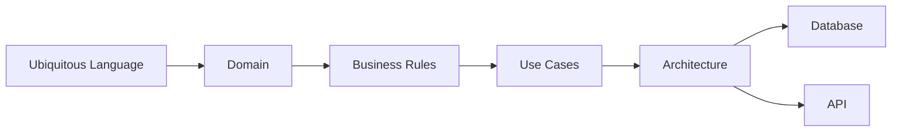
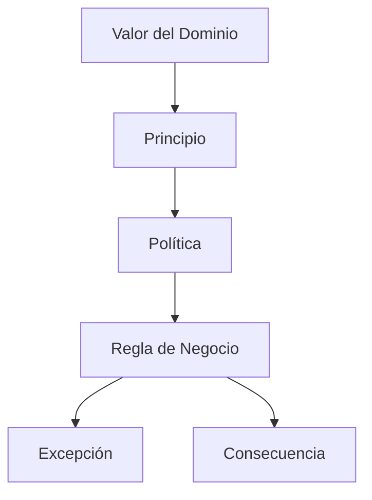

# Reglas de Negocio del Dominio

| Campo | Valor |
|-------|-------|
| Proyecto | Plataforma de Gestión, Comunicación y Educación para la Salud |
| Cliente | Jurisdicción Sanitaria de Huejutla de Reyes, Hidalgo |
| Documento | Reglas de Negocio del Dominio |
| Código | DOC-008 |
| Versión | 1.0.0 |
| Estado | Draft |
| Autor | Equipo del Proyecto |
| Rol arquitectónico | Lead Domain Architect, Software Architect & Product Architect |
| Fecha | 2026-07-03 |

---

# 1. Información del Documento

Este documento pertenece a la Fase 02 - Domain.

Su alcance es definir el comportamiento oficial del dominio de negocio de la **Plataforma de Gestión, Comunicación y Educación para la Salud**.

No define implementación, base de datos, API, endpoints, entidades técnicas, agregados, repositorios, controladores, DTOs, clases, pantallas, flujos de interfaz, microservicios ni persistencia.

---

# 2. Propósito

El propósito de este documento es especificar las reglas de negocio que protegen el ciclo de vida del Conocimiento Institucional.

No es un catálogo de validaciones técnicas. Es la constitución del comportamiento del dominio.

Cada regla deberá responder:

> ¿Qué comportamiento institucional protege esta regla?

Las reglas existen para proteger:

- Conocimiento Institucional;
- Confiabilidad;
- Veracidad;
- Responsabilidad Institucional;
- Trazabilidad;
- Vigencia;
- Memoria Institucional;
- Acceso público a información confiable.

Si una regla no protege alguno de estos valores, no pertenece a este documento.

---

# 3. Relación con Domain

Este documento deriva directamente de:

- `docs/02-domain/ubiquitous-language.md`;
- `docs/02-domain/domain.md`.

`domain.md` define qué es el dominio, qué valores protege, cuáles son sus principios, políticas, capacidades, ciclos de vida, invariantes y antiobjetivos.

Este documento convierte esos fundamentos en reglas de comportamiento del dominio.

No modifica el dominio aprobado. No reinterpreta la visión. No amplía el alcance.

---

# 4. Papel dentro de la Arquitectura Documental

Dentro de la arquitectura documental, este documento se ubica después de `domain.md` y antes de `use-cases.md`.



Las reglas aquí definidas condicionarán casos de uso, arquitectura, persistencia y API, pero no las diseñan.

---

# 5. Cómo Interpretar una Regla de Negocio

Una regla de negocio expresa una condición de comportamiento que el dominio debe respetar para proteger sus valores.

## 5.1 Diferencias Conceptuales

| Concepto | Significado | Ejemplo |
|----------|-------------|---------|
| Valor del Dominio | Valor permanente que el dominio protege. | Trazabilidad. |
| Principio | Orientación atemporal del comportamiento. | La trazabilidad nunca debe perderse. |
| Política | Decisión permanente del negocio. | Toda publicación debe conservar referencia a fuente, responsabilidad institucional y vigencia. |
| Regla de Negocio | Condición verificable del comportamiento del dominio. | Una publicación retirada de consulta pública debe conservar trazabilidad. |
| Excepción | Condición controlada donde una regla se aplica con tratamiento especial. | Retiro por error, confiabilidad comprometida o pérdida de pertinencia pública. |



Una regla no debe confundirse con validación de datos ni con implementación técnica.

---

# 6. Valores Protegidos por el Dominio

| Valor protegido | Capacidades que lo protegen | Comportamiento esperado |
|-----------------|-----------------------------|-------------------------|
| Conocimiento Institucional | adquirir, generar, validar, organizar, preservar | El conocimiento debe mantenerse como activo principal. |
| Confiabilidad | validar, publicar, actualizar, mantener trazabilidad | La información pública debe poder ser confiada por la población. |
| Veracidad | adquirir, generar, validar, mantener trazabilidad | La información debe corresponder con fuente, evidencia o conocimiento institucional validado. |
| Responsabilidad Institucional | publicar, actualizar, distribuir, mantener trazabilidad | Toda publicación debe conservar responsabilidad de la Jurisdicción Sanitaria. |
| Trazabilidad | todas las capacidades | El origen, validación, responsabilidad, estado y vigencia no deben perderse. |
| Vigencia | validar, actualizar, retirar, archivar | La información disponible debe mantenerse actual, pertinente o contextualizada. |
| Accesibilidad | redactar, organizar, distribuir, consulta pública, búsqueda | La población debe poder encontrar y comprender información confiable. |
| Memoria Institucional | preservar, archivar, línea del tiempo, trazabilidad | El conocimiento relevante debe conservarse aunque deje de estar vigente como publicación activa. |

---

# 7. Principios del Comportamiento

Los principios del comportamiento orientan cómo debe actuar el dominio.

1. El Conocimiento Institucional debe protegerse antes que la publicación individual.
2. La Publicación es consecuencia de conocimiento validado y redactado.
3. Ninguna Publicación debe existir sin responsabilidad institucional.
4. La responsabilidad institucional no debe confundirse con autoría operativa.
5. La trazabilidad debe conservarse aun cuando una Publicación se retire de consulta pública.
6. La vigencia debe protegerse mientras la información sea consultable por la población.
7. Los Canales deben distribuir información, no crear verdad institucional.
8. Las Campañas deben organizar publicaciones alrededor de necesidades institucionales temporales.
9. Las Enfermedades deben tratarse como conceptos temáticos, no como publicaciones simples.
10. La Memoria Institucional debe preservarse sin convertir la Línea del Tiempo en agenda general.
11. La Consulta Pública debe facilitar acceso a información confiable, no atención médica.

---

# 8. Políticas Institucionales

Las políticas representan decisiones permanentes del negocio. Las reglas detalladas se formalizan en las secciones posteriores.

## 8.1 BR-POL-001. Responsabilidad Institucional

La Jurisdicción Sanitaria es responsable institucional de toda publicación.

La responsabilidad nunca pertenece al operador que captura información.

## 8.2 BR-POL-002. Retiro de Consulta Pública

Una publicación puede retirarse de la consulta pública cuando:

- contenga errores;
- comprometa la confiabilidad institucional;
- deje de ser apropiada para consulta pública.

El retiro no implica perder trazabilidad ni memoria institucional.

## 8.3 BR-POL-003. Profundidad de Validación por Origen

La profundidad de la validación depende del origen del conocimiento.

Si la información proviene de una fuente oficial, como Secretaría de Salud, OMS, OPS u otra fuente oficial equivalente, se valida:

- autenticidad;
- vigencia;
- pertinencia.

No se vuelve a validar el contenido científico.

Si el conocimiento es generado por la Jurisdicción Sanitaria, debe pasar por validación institucional completa.

## 8.4 BR-POL-004. Finalización de Campañas

La finalización de una campaña no obliga a retirar automáticamente sus publicaciones.

Si la publicación sigue siendo útil para la población, puede permanecer disponible indicando claramente su contexto histórico.

---

# 9. Clasificación Oficial de Reglas

Cada grupo de reglas se documenta con la misma estructura:

```text
Valor protegido
↓
Principio
↓
Política
↓
Reglas
↓
Excepciones
↓
Consecuencias
```

| Grupo | Propósito |
|-------|-----------|
| Reglas Fundamentales | Proteger identidad, valores e invariantes del dominio. |
| Reglas del Conocimiento | Gobernar adquisición, generación y organización del conocimiento institucional. |
| Reglas de Validación | Determinar comportamiento de validación según origen y riesgo. |
| Reglas Editoriales | Proteger claridad, redacción, clasificación y comprensión pública. |
| Reglas de Publicación | Regular cuándo la información puede convertirse en publicación. |
| Reglas de Distribución | Gobernar distribución por portal y canales desacoplados. |
| Reglas de Actualización | Mantener vigencia, claridad y confiabilidad de publicaciones ya publicadas. |
| Reglas de Vigencia | Definir comportamiento frente a actualidad, pertinencia y retiro. |
| Reglas de Trazabilidad | Proteger origen, responsabilidad, autoría operativa, estado y contexto. |
| Reglas de Consulta Pública | Proteger acceso público a información confiable. |
| Reglas de Campañas | Gobernar campañas como iniciativas institucionales temporales. |
| Reglas de Enfermedades | Gobernar enfermedades como conceptos temáticos. |
| Reglas de Recursos | Gobernar uso de recursos como apoyo a comprensión. |
| Reglas de Clasificación | Proteger organización editorial para búsqueda y navegación. |
| Reglas de Memoria Institucional | Preservar conocimiento histórico e institucional. |

---

# 10. Reglas Fundamentales

**Valor protegido**

Conocimiento Institucional, Confiabilidad, Responsabilidad Institucional y Trazabilidad.

**Principio**

El Conocimiento Institucional es el activo principal y la Publicación es una manifestación visible de ese conocimiento.

**Política**

Toda regla del dominio debe proteger el ciclo de vida del Conocimiento Institucional.

**Reglas**

- BR-FUN-001: Toda decisión de dominio deberá preservar que el Conocimiento Institucional es el activo principal.
- BR-FUN-002: `Content` deberá tratarse como abstracción conceptual central, pero no como sustituto del Conocimiento Institucional.
- BR-FUN-003: Publicación deberá utilizarse como término institucional operativo para información publicada.
- BR-FUN-004: Ninguna regla deberá convertir el dominio en sistema clínico, hospitalario, de diagnóstico, citas, farmacia o inventario.
- BR-FUN-005: Ninguna regla deberá convertir redes sociales o canales en fuente oficial de verdad.

**Excepciones**

No aplican excepciones. Estas reglas protegen la identidad del dominio.

**Consecuencias**

Si estas reglas se rompen, el producto pierde coherencia estratégica y puede derivar hacia un sistema ajeno a comunicación y educación en salud pública.

---

# 11. Reglas del Conocimiento

**Valor protegido**

Conocimiento Institucional, Veracidad y Memoria Institucional.

**Principio**

El dominio administra el ciclo de vida del conocimiento institucional, no publicaciones aisladas.

**Política**

El conocimiento puede ser adquirido desde fuentes externas o generado por la Jurisdicción Sanitaria.

**Reglas**

- BR-CON-001: Todo conocimiento incorporado deberá identificar si proviene de fuente externa, fuente interna o generación propia de la Jurisdicción.
- BR-CON-002: El conocimiento adquirido no deberá publicarse sin pasar por validación correspondiente.
- BR-CON-003: El conocimiento generado por la Jurisdicción deberá pasar por validación institucional completa.
- BR-CON-004: El conocimiento institucional deberá poder organizarse para redacción, publicación, actualización, consulta o preservación.
- BR-CON-005: El conocimiento no deberá duplicarse conceptualmente cuando pueda reutilizarse o relacionarse.

**Excepciones**

Una comunicación urgente podrá priorizar rapidez operativa, pero no podrá omitir responsabilidad institucional ni trazabilidad mínima.

**Consecuencias**

Si el conocimiento se trata como piezas aisladas, aumenta la duplicación, disminuye la veracidad y se debilita la memoria institucional.

---

# 12. Reglas de Validación

**Valor protegido**

Confiabilidad, Veracidad, Vigencia y Responsabilidad Institucional.

**Principio**

La Publicación es consecuencia de conocimiento validado y redactado.

**Política**

La profundidad de validación depende del origen del conocimiento.

**Reglas**

- BR-VAL-001: Toda información deberá validarse antes de convertirse en Publicación.
- BR-VAL-002: Cuando la información provenga de fuente oficial externa, deberá validarse autenticidad, vigencia y pertinencia.
- BR-VAL-003: Cuando la información provenga de fuente oficial externa, no deberá revalidarse el contenido científico salvo que exista duda institucional documentada.
- BR-VAL-004: Cuando el conocimiento sea generado por la Jurisdicción, deberá aplicarse validación institucional completa.
- BR-VAL-005: Una información no deberá publicarse si su fuente, vigencia o pertinencia no pueden sostenerse institucionalmente.
- BR-VAL-006: La validación no deberá confundirse con autenticación de usuario ni permiso técnico.

**Excepciones**

Si una fuente oficial externa resulta contradictoria con otra fuente oficial, la publicación deberá detenerse hasta resolver criterio institucional.

**Consecuencias**

La validación insuficiente puede producir información incorrecta, obsoleta o institucionalmente riesgosa.

---

# 13. Reglas Editoriales

**Valor protegido**

Accesibilidad, Confiabilidad y Veracidad.

**Principio**

La redacción transforma información validada en comunicación clara, útil y comprensible.

**Política**

Toda publicación deberá redactarse para comprensión pública sin perder respaldo institucional.

**Reglas**

- BR-EDI-001: La redacción deberá preservar el significado de la información validada.
- BR-EDI-002: La redacción deberá privilegiar claridad para la población general.
- BR-EDI-003: La redacción no deberá introducir afirmaciones no respaldadas por fuente o conocimiento validado.
- BR-EDI-004: La organización editorial deberá facilitar búsqueda, navegación, comprensión o reutilización.
- BR-EDI-005: La redacción deberá evitar lenguaje clínico individual cuando el propósito sea comunicación pública.

**Excepciones**

El lenguaje técnico podrá conservarse cuando sea necesario para precisión institucional, siempre que se contextualice para la población.

**Consecuencias**

Una redacción deficiente puede hacer que información confiable sea incomprensible o se interprete incorrectamente.

---

# 14. Reglas de Publicación

**Valor protegido**

Confiabilidad, Responsabilidad Institucional, Trazabilidad y Acceso público.

**Principio**

Ninguna Publicación existe sin responsabilidad institucional.

**Política**

Toda Publicación deberá expresar información oficial con responsabilidad de la Jurisdicción Sanitaria.

**Reglas**

- BR-PUB-001: Toda Publicación deberá estar asociada a responsabilidad institucional de la Jurisdicción Sanitaria.
- BR-PUB-002: La responsabilidad de una Publicación nunca deberá pertenecer únicamente al operador que captura información.
- BR-PUB-003: Una Publicación deberá provenir de información validada y redactada.
- BR-PUB-004: Una Publicación deberá conservar trazabilidad mínima antes de estar disponible para consulta pública.
- BR-PUB-005: Una Publicación no deberá presentarse como diagnóstico, consulta médica, indicación clínica individual ni sustituto del personal de salud.

**Excepciones**

No se admite excepción a responsabilidad institucional. Una publicación sin responsabilidad institucional no deberá existir en el dominio.

**Consecuencias**

Publicar sin responsabilidad institucional compromete la confianza pública y contradice el propósito del producto.

---

# 15. Reglas de Distribución

**Valor protegido**

Accesibilidad, Confiabilidad y Responsabilidad Institucional.

**Principio**

Los Canales distribuyen información; no generan verdad institucional.

**Política**

Toda distribución deberá partir de una Publicación existente.

**Reglas**

- BR-DIS-001: Ningún Canal deberá tratarse como Fuente oficial del dominio.
- BR-DIS-002: La distribución deberá derivar de una Publicación publicada o preparada institucionalmente.
- BR-DIS-003: La distribución no deberá modificar el sentido de la Publicación.
- BR-DIS-004: Si un Canal requiere adaptación de formato, dicha adaptación deberá preservar fuente, claridad y responsabilidad institucional.
- BR-DIS-005: La dependencia de un Canal externo no deberá comprometer disponibilidad del conocimiento institucional en el Portal Público.

**Excepciones**

Cuando un canal externo limite formato o contenido, la versión institucional deberá permanecer como referencia principal.

**Consecuencias**

Si el canal se vuelve fuente de verdad, se pierde autonomía institucional y aumenta la dispersión de información.

---

# 16. Reglas de Actualización

**Valor protegido**

Vigencia, Confiabilidad, Trazabilidad y Acceso público.

**Principio**

Toda actualización busca preservar la vigencia del conocimiento publicado.

**Política**

Actualizar una Publicación significa editar información publicada para mantener vigencia, claridad, pertinencia o confiabilidad.

**Reglas**

- BR-ACT-001: Una Publicación deberá actualizarse cuando su información deje de ser clara, vigente, pertinente o confiable.
- BR-ACT-002: Una actualización deberá conservar trazabilidad de responsabilidad institucional y autoría operativa.
- BR-ACT-003: Una actualización no deberá interpretarse como versionado avanzado dentro del MVP.
- BR-ACT-004: Cuando una actualización cambie información relevante para la población, deberá evaluarse si requiere nueva distribución por Canales.
- BR-ACT-005: Una actualización no deberá eliminar memoria institucional necesaria para contexto futuro.

**Excepciones**

Si la publicación contiene errores que comprometen confiabilidad, podrá retirarse de consulta pública antes de actualizarse.

**Consecuencias**

No actualizar publicaciones puede mantener información obsoleta y afectar decisiones de la población.

---

# 17. Reglas de Vigencia

**Valor protegido**

Vigencia, Veracidad, Confiabilidad y Memoria Institucional.

**Principio**

La información disponible para consulta pública debe ser vigente o estar claramente contextualizada.

**Política**

Una publicación puede retirarse de consulta pública cuando contenga errores, comprometa la confiabilidad institucional o deje de ser apropiada para consulta pública.

**Reglas**

- BR-VIG-001: Toda Publicación disponible para consulta pública deberá conservar vigencia o contexto histórico claro.
- BR-VIG-002: Una Publicación deberá retirarse de consulta pública si contiene errores que puedan afectar a la población.
- BR-VIG-003: Una Publicación deberá retirarse de consulta pública si compromete la confiabilidad institucional.
- BR-VIG-004: Una Publicación podrá retirarse de consulta pública si deja de ser apropiada para consulta pública.
- BR-VIG-005: El retiro de consulta pública no deberá eliminar trazabilidad ni memoria institucional.
- BR-VIG-006: Una publicación ya no vigente podrá conservarse si se presenta con contexto histórico claro.

**Excepciones**

Una Publicación asociada a campaña finalizada puede permanecer disponible si sigue siendo útil para la población y muestra su contexto histórico.

**Consecuencias**

La falta de control de vigencia puede provocar información desactualizada, confusión pública o pérdida de confianza.

---

# 18. Reglas de Trazabilidad

**Valor protegido**

Trazabilidad, Confiabilidad, Veracidad, Responsabilidad Institucional y Memoria Institucional.

**Principio**

La trazabilidad nunca debe perderse.

**Política**

Toda Publicación deberá conservar referencia a fuente, responsabilidad institucional, autoría operativa, estado, vigencia y relaciones relevantes.

**Reglas**

- BR-TRA-001: Toda Publicación deberá conservar trazabilidad mínima.
- BR-TRA-002: La trazabilidad deberá distinguir Fuente, Validación, Responsabilidad Institucional y Autoría Operativa.
- BR-TRA-003: El retiro de una Publicación de consulta pública no deberá eliminar su trazabilidad.
- BR-TRA-004: La actualización de una Publicación no deberá romper su trazabilidad.
- BR-TRA-005: Las relaciones con campañas, enfermedades, recursos o eventos históricos deberán mantenerse comprensibles cuando existan.

**Excepciones**

No se admite pérdida total de trazabilidad. Cuando falte información histórica, deberá identificarse como limitación documental antes de reutilizar el conocimiento.

**Consecuencias**

Sin trazabilidad, el dominio pierde capacidad de justificar, actualizar, preservar o retirar información responsablemente.

---

# 19. Reglas de Consulta Pública

**Valor protegido**

Accesibilidad, Confiabilidad, Vigencia y Veracidad.

**Principio**

La Consulta Pública facilita acceso a información confiable, no atención médica individual.

**Política**

La población deberá consultar información clara, oficial, vigente o contextualizada.

**Reglas**

- BR-CONP-001: La Consulta Pública deberá mostrar únicamente información publicada o históricamente contextualizada.
- BR-CONP-002: La Consulta Pública deberá favorecer comprensión ciudadana.
- BR-CONP-003: La Consulta Pública no deberá presentarse como consulta médica, diagnóstico o atención individual.
- BR-CONP-004: La búsqueda básica deberá localizar información publicada sin sustituir validación institucional.
- BR-CONP-005: La consulta de información histórica deberá diferenciarse de información vigente cuando sea necesario.

**Excepciones**

Una publicación archivada podrá consultarse públicamente solo si su contexto histórico es claro y su consulta no compromete confiabilidad institucional.

**Consecuencias**

Si la consulta pública no distingue vigencia y contexto, puede inducir interpretaciones incorrectas.

---

# 20. Reglas de Campañas

**Valor protegido**

Conocimiento Institucional, Vigencia, Accesibilidad y Memoria Institucional.

**Principio**

Una Campaña organiza publicaciones alrededor de una necesidad institucional temporal.

**Política**

La finalización de una Campaña no obliga a retirar automáticamente sus publicaciones.

**Reglas**

- BR-CAM-001: Una Campaña deberá responder a una necesidad de prevención, promoción, comunicación o salud pública.
- BR-CAM-002: Una Campaña no deberá tratarse como Publicación individual.
- BR-CAM-003: Las Publicaciones de una Campaña podrán permanecer disponibles después de finalizar la Campaña si siguen siendo útiles.
- BR-CAM-004: Una Publicación asociada a Campaña finalizada deberá indicar contexto histórico cuando sea pertinente.
- BR-CAM-005: Una Campaña no deberá sustituir la responsabilidad institucional de cada Publicación.

**Excepciones**

Una Publicación de Campaña deberá retirarse si contiene errores, compromete confiabilidad o deja de ser apropiada para consulta pública.

**Consecuencias**

Retirar automáticamente publicaciones útiles al finalizar campañas puede destruir memoria institucional y reducir acceso a información preventiva.

---

# 21. Reglas de Enfermedades

**Valor protegido**

Conocimiento Institucional, Veracidad, Accesibilidad y frontera no clínica.

**Principio**

Una Enfermedad es un concepto temático del dominio, no una Publicación.

**Política**

La Enfermedad organiza conocimiento de salud pública sin convertirse en diagnóstico ni atención clínica.

**Reglas**

- BR-ENF-001: Una Enfermedad deberá tratarse como concepto temático de salud pública.
- BR-ENF-002: Una Enfermedad podrá relacionarse con publicaciones, campañas, documentos, infografías, preguntas frecuentes y recursos.
- BR-ENF-003: La información sobre Enfermedad deberá orientarse a prevención, educación y comunicación pública.
- BR-ENF-004: La información sobre Enfermedad no deberá presentarse como diagnóstico individual.
- BR-ENF-005: Una Enfermedad no deberá modelarse como Publicación simple.

**Excepciones**

No hay excepción para diagnóstico individual. Cualquier necesidad clínica queda fuera del dominio.

**Consecuencias**

Confundir Enfermedad con diagnóstico o publicación simple puede romper la frontera no clínica y empobrecer el modelo temático.

---

# 22. Reglas de Recursos

**Valor protegido**

Accesibilidad, Veracidad, Confiabilidad y Memoria Institucional.

**Principio**

Los Recursos apoyan comprensión, consulta o distribución del conocimiento.

**Política**

Los Recursos deberán asociarse a conocimiento o publicaciones sin sustituir fuente, validación ni responsabilidad institucional.

**Reglas**

- BR-REC-001: Todo Recurso asociado a una Publicación deberá apoyar comprensión, consulta o distribución.
- BR-REC-002: Un Recurso no deberá sustituir la información oficial que respalda una Publicación.
- BR-REC-003: Una infografía o documento podrá ser parte de la expresión pública de conocimiento, pero deberá conservar responsabilidad institucional cuando se publique.
- BR-REC-004: Un Recurso proveniente de fuente externa deberá conservar identificación de fuente cuando sea relevante.
- BR-REC-005: La gestión de Recursos no deberá convertirse en gestor documental avanzado dentro del MVP.

**Excepciones**

Un Recurso puede funcionar como Fuente documental cuando respalde información, pero deberá tratarse semánticamente como Fuente en ese contexto.

**Consecuencias**

Recursos sin respaldo o contexto pueden difundir información incompleta o poco confiable.

---

# 23. Reglas de Clasificación

**Valor protegido**

Accesibilidad, Vigencia, Organización Editorial y Consulta Pública.

**Principio**

La clasificación existe para facilitar comprensión, búsqueda, navegación y reutilización.

**Política**

Toda clasificación deberá responder a utilidad pública y coherencia editorial.

**Reglas**

- BR-CLA-001: Una Publicación deberá clasificarse con criterios comprensibles para consulta pública.
- BR-CLA-002: El Tipo de Publicación deberá describir la forma comunicativa, no crear sistemas aislados.
- BR-CLA-003: Categorías y etiquetas deberán apoyar búsqueda, navegación o comprensión.
- BR-CLA-004: La clasificación no deberá depender de conveniencia técnica.
- BR-CLA-005: La clasificación deberá poder relacionar publicaciones con campañas, enfermedades o recursos cuando sea pertinente.

**Excepciones**

Una publicación urgente podrá publicarse con clasificación mínima, pero deberá completarse cuando se estabilice la comunicación institucional.

**Consecuencias**

Una clasificación deficiente dificulta consulta pública, búsqueda, reutilización y mantenimiento de vigencia.

---

# 24. Reglas de Memoria Institucional

**Valor protegido**

Memoria Institucional, Trazabilidad, Conocimiento Institucional y Vigencia.

**Principio**

La memoria institucional debe preservarse sin convertir la Línea del Tiempo en agenda general.

**Política**

La Línea del Tiempo representa únicamente eventos históricos institucionales.

**Reglas**

- BR-MEM-001: La Línea del Tiempo deberá incluir únicamente eventos históricos institucionales.
- BR-MEM-002: Un Evento de Línea del Tiempo deberá tener relevancia institucional, histórica o de salud pública.
- BR-MEM-003: La Línea del Tiempo no deberá utilizarse como agenda, calendario operativo ni bitácora general.
- BR-MEM-004: Un Evento Histórico Institucional podrá relacionarse con Publicaciones o Recursos cuando aporte contexto.
- BR-MEM-005: La preservación de memoria no deberá presentar información histórica como si fuera vigente.

**Excepciones**

Un evento relacionado con una campaña o publicación puede incorporarse si tiene valor histórico institucional, no solo por haber ocurrido.

**Consecuencias**

Si la Línea del Tiempo se convierte en agenda, se pierde su valor como memoria institucional.

---

# 25. Matriz de Trazabilidad

| Grupo de reglas | Domain | Ubiquitous Language | Vision | Scope | Product Principles |
|-----------------|--------|---------------------|--------|-------|--------------------|
| Fundamentales | Core Domain Values, Principios, Invariantes | Jerarquía conceptual | Propósito central | Alcance y exclusiones | CP-01, CP-02, CP-05 |
| Conocimiento | Ciclo de vida del conocimiento | Conocimiento Institucional, Información Oficial | Filosofía del producto | Gestión central de contenido | CP-02 |
| Validación | Capacidades y políticas | Fuente, Validación | Confiabilidad | Trazabilidad básica | CP-01, OP-01 |
| Editoriales | Organización y redacción | Redacción, Organización Editorial | Claridad | Portal público | CP-03, OP-03 |
| Publicación | Publicar información confiable | Publicación, Content | Capacidad principal | Estados básicos | CP-01, OP-01 |
| Distribución | Canales desacoplados | Canal de Comunicación | Canales como distribución | Canales parciales | SP-02 |
| Actualización | Actualizar publicaciones | Vigencia, Estado | Información vigente | Archivo y actualización | OP-02 |
| Vigencia | Trazabilidad y vigencia | Vigencia | Impacto esperado | Contenido vigente | OP-02 |
| Trazabilidad | Responsabilidad y autoría | Trazabilidad | Confiabilidad | Fuente y responsabilidad | OP-01 |
| Consulta Pública | Acceso público | Consulta Pública, Búsqueda | Población principal | Portal y búsqueda | CP-03, OP-06 |
| Campañas | Campañas temporales | Campaña | Prevención | Campañas y destacados | CP-04 |
| Enfermedades | Conceptos temáticos | Enfermedad | Educación en salud | Navegación por tipos | CP-04, CP-05 |
| Recursos | Recursos asociados | Recurso | Recursos visuales | Multimedia básica | OP-04 |
| Clasificación | Organización editorial | Clasificación, Categoría, Etiqueta | Claridad | Categorías y etiquetas | OP-03 |
| Memoria Institucional | Línea del Tiempo | Evento Histórico Institucional | Memoria institucional | Línea del tiempo | CP-02, SP-03 |

---

# 26. Preparación para Use Cases

`use-cases.md` deberá usar estas reglas como condiciones de comportamiento.

Los casos de uso deberán:

- indicar qué reglas aplican;
- respetar el ciclo de vida del Conocimiento Institucional;
- mantener diferencia entre Publicación, Campaña, Enfermedad, Fuente, Recurso y Canal;
- expresar excepciones de negocio cuando correspondan;
- evitar convertir reglas en flujos de interfaz;
- evitar introducir roles avanzados fuera del MVP;
- mantener la frontera no clínica.

No se escriben casos de uso en este documento.

---

# 27. Preparación para Architecture

Estas reglas influirán posteriormente en arquitectura, persistencia y API porque establecen comportamientos que deberán preservarse.

Influencia esperada:

- la arquitectura deberá proteger responsabilidad institucional, trazabilidad, vigencia y separación entre fuente, publicación y canal;
- la persistencia futura deberá permitir conservar memoria y trazabilidad sin diseñarse desde este documento;
- la API futura deberá expresar comportamiento coherente con el lenguaje del dominio sin introducir términos técnicos que contradigan estas reglas.

Este documento no diseña arquitectura, persistencia ni API.

---

# 28. Riesgos Arquitectónicos

| Riesgo | Consecuencia |
|--------|--------------|
| Publicaciones sin respaldo | Pérdida de veracidad y confiabilidad. |
| Publicaciones sin responsabilidad institucional | Dilución de autoridad y confianza pública. |
| Pérdida de trazabilidad | Imposibilidad de actualizar, retirar o justificar información. |
| Información desactualizada | Riesgo de orientación pública incorrecta. |
| Canales tratados como fuente | Dependencia de redes sociales y dispersión del conocimiento. |
| Campañas tratadas como publicaciones | Pérdida de contexto institucional temporal. |
| Enfermedades tratadas como publicaciones | Ruptura del modelo temático de salud pública. |
| Recursos sin contexto | Difusión de material incompleto o no confiable. |
| Línea del Tiempo como agenda | Pérdida de memoria institucional. |
| Reglas convertidas en implementación | Acoplamiento prematuro y pérdida de claridad del dominio. |
| Cruce hacia dominio clínico | Contradicción con visión, alcance y antiobjetivos. |

---

# 29. Autoevaluación

Se verificó que este documento:

- mantiene coherencia con Foundation;
- mantiene coherencia con Product;
- mantiene coherencia con Ubiquitous Language;
- mantiene coherencia con Domain;
- formaliza las políticas aprobadas BR-POL-001 a BR-POL-004;
- organiza reglas por capacidades y comportamiento del dominio, no por entidades;
- protege Conocimiento Institucional, Confiabilidad, Veracidad, Responsabilidad Institucional, Trazabilidad, Vigencia, Memoria Institucional y Acceso público;
- no introduce reglas técnicas;
- no diseña base de datos, API, endpoints, DTOs, controladores, repositorios, clases, tablas, persistencia, microservicios ni pantallas;
- no cruza hacia expediente clínico, diagnóstico, citas, inventario, farmacia ni sistemas hospitalarios;
- prepara `use-cases.md`, `architecture.md`, `database.md` y `api.md` sin diseñarlos.

---

# 30. Observaciones Arquitectónicas para la siguiente fase

## 30.1 Contradicciones

No se identifican contradicciones bloqueantes con `domain.md` ni `ubiquitous-language.md`.

## 30.2 Observaciones para `use-cases.md`

`use-cases.md` deberá cuidar especialmente:

- no convertir reglas en pantallas o flujos de interfaz;
- no omitir reglas de validación, responsabilidad y trazabilidad;
- no presentar actualización como versionado avanzado;
- no tratar retiro de consulta pública como eliminación de memoria;
- no convertir consulta pública en consulta médica.

## 30.3 Observaciones para Documentos Técnicos Posteriores

Cuando se avance a documentos técnicos, deberá preservarse:

- separación entre Fuente, Publicación, Canal y Recurso;
- responsabilidad institucional distinta de autoría operativa;
- trazabilidad incluso en retiro o actualización;
- campañas como iniciativas temporales;
- enfermedades como conceptos temáticos;
- Línea del Tiempo como memoria institucional.

---

# 31. Estado del Documento

**Estado:** Baseline

Este documento representa la especificación oficial del comportamiento del dominio.

Está preparado para revisión y posterior aprobación como Baseline.

Cualquier modificación futura deberá preservar trazabilidad con Foundation, Product, Ubiquitous Language y Domain.
