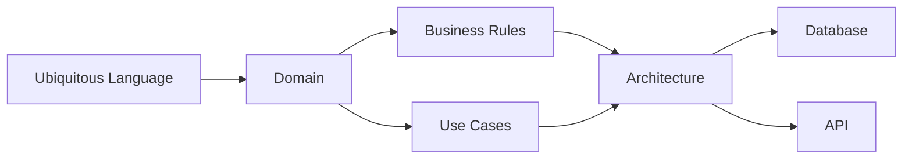
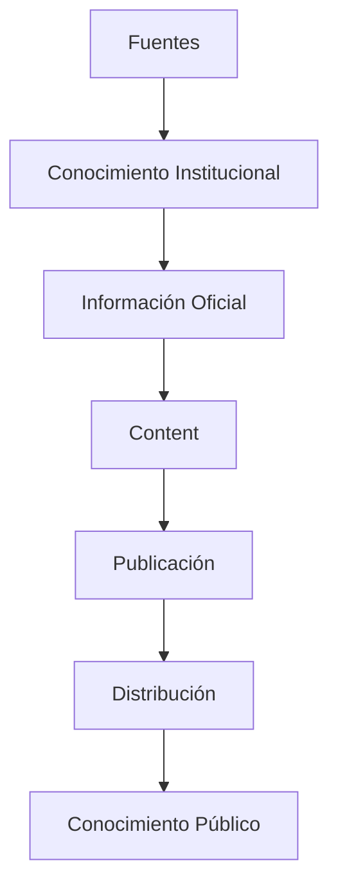
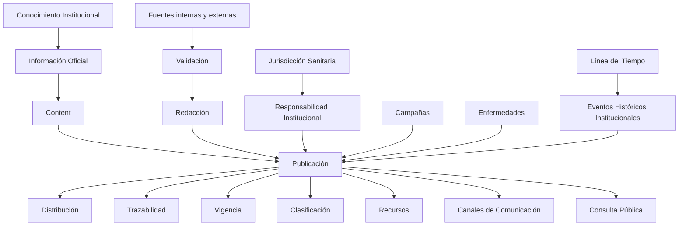
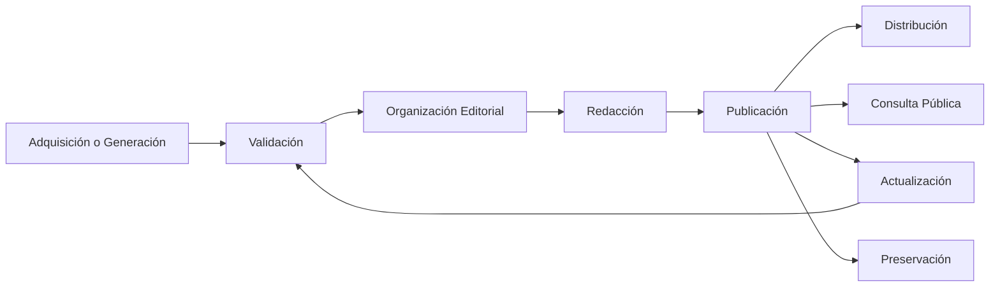
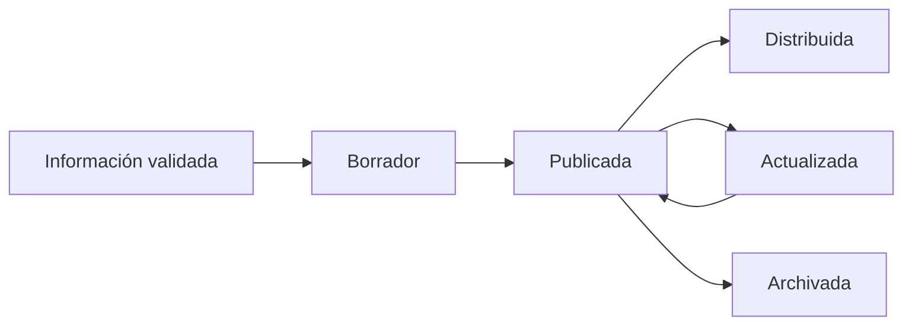

# Modelo Conceptual del Dominio

| Campo | Valor |
|-------|-------|
| Proyecto | Plataforma de Gestión, Comunicación y Educación para la Salud |
| Cliente | Jurisdicción Sanitaria de Huejutla de Reyes, Hidalgo |
| Documento | Modelo Conceptual del Dominio |
| Código | DOC-007 |
| Versión | 1.0.0 |
| Estado | Baseline |
| Autor | Equipo del Proyecto |
| Rol arquitectónico | Domain Architect, Software Architect & Product Architect |
| Fecha | 2026-07-03 |

---

# 1. Información del Documento

Este documento pertenece a la Fase 02 - Domain.

Su alcance es conceptual y de negocio. No define implementación, base de datos, API, pantallas, componentes, clases, controladores, repositorios, DTOs ni estructuras técnicas.

Este documento toma como base directa el Lenguaje Ubicuo aprobado en `docs/02-domain/ubiquitous-language.md`.

---

# 2. Propósito

El propósito de este documento es modelar el dominio de negocio de la **Plataforma de Gestión, Comunicación y Educación para la Salud**.

El dominio se entiende como:

> Gestión del ciclo de vida del conocimiento institucional para transformarlo en información oficial, confiable, clara, publicable, distribuible, actualizable y preservable.

Este documento deberá servir como base directa para:

- `business-rules.md`;
- `use-cases.md`;
- `architecture.md`;
- `database.md`;
- `api.md`.

La función de este documento no es describir funcionalidades aisladas. Su función es explicar cómo se relacionan los conceptos del negocio para cumplir la capacidad central del producto:

> **Publicar información confiable.**

---

# 3. Relación con Foundation, Product y Ubiquitous Language

Este documento deriva de la baseline oficial de Foundation, Product y Ubiquitous Language.

Documentos de referencia:

- `docs/00-foundation/project-charter.md`;
- `docs/00-foundation/architecture-guide.md`;
- `docs/01-product/vision.md`;
- `docs/01-product/scope.md`;
- `docs/01-product/product-principles.md`;
- `docs/01-product/personas.md`;
- `docs/02-domain/ubiquitous-language.md`;
- `CONTEXT_TRANSFER_PACKAGE.md`;
- `PHASE_01_TRANSFER_PACKAGE.md`;
- `ARCHITECTURE_ROADMAP.md`.

La documentación previa establece que:

- el activo principal es el Conocimiento Institucional;
- `Content` permanece como abstracción conceptual central, pero no reemplaza al Conocimiento Institucional;
- Publicación es el término institucional operativo;
- la Jurisdicción Sanitaria es responsable institucional de toda publicación;
- los Programas de Salud son fuentes institucionales de conocimiento, no propietarios del contenido;
- los Canales distribuyen información y no son fuente de verdad;
- el dominio no debe cruzar hacia expediente clínico, diagnóstico, citas médicas, inventarios, farmacia ni sistemas hospitalarios.

Este documento no modifica esas decisiones. Las organiza en un modelo conceptual del dominio.

---

# 4. Papel del Documento dentro de la Arquitectura Documental

Este documento ocupa el segundo lugar dentro de la Fase 02 - Domain, después de `ubiquitous-language.md`.

Su papel es:

- convertir el lenguaje ubicuo en modelo conceptual del dominio;
- identificar capacidades de dominio sin diseñar implementación;
- describir ciclos de vida del conocimiento y de la publicación;
- definir relaciones conceptuales que deberán respetar reglas de negocio y casos de uso;
- prevenir ambigüedades antes de avanzar a arquitectura, base de datos y API.



Este documento no sustituye a `business-rules.md` ni a `use-cases.md`. Los prepara.

---

# 5. Definición del Dominio

El dominio del producto es la gestión institucional del conocimiento de salud pública para convertirlo en información oficial, confiable y accesible para la población.

El dominio abarca:

- adquisición de conocimiento desde fuentes internas y externas;
- generación de conocimiento propio por la Jurisdicción Sanitaria;
- validación institucional;
- organización editorial;
- redacción para publicación;
- publicación de información confiable;
- distribución desacoplada por canales;
- actualización para mantener vigencia;
- preservación de memoria institucional;
- consulta pública;
- trazabilidad de fuente, responsabilidad, vigencia y publicación.

El dominio no abarca atención clínica individual, diagnóstico, expediente clínico, inventario médico, farmacia, citas médicas ni operación hospitalaria.

---

# 6. Objetivo Central del Dominio

El objetivo central del dominio es:

> Transformar Conocimiento Institucional en Publicaciones confiables, claras, vigentes, trazables, distribuibles y consultables por la población.

Este objetivo se expresa mediante la jerarquía conceptual aprobada:

```text
Conocimiento Institucional
↓
Información Oficial
↓
Content
↓
Publicación
↓
Distribución
```

`Content` es central para organizar conceptualmente el contenido institucional, pero el dominio no se reduce a `Content`. El activo principal sigue siendo el Conocimiento Institucional.

---

# 7. Core Domain Values

Los Core Domain Values no son valores organizacionales. Son valores que el dominio debe proteger permanentemente para que el producto cumpla su propósito institucional.

| Valor | Qué representa | Por qué existe | Capacidades que lo protegen | Riesgos si se pierde |
|-------|----------------|----------------|-----------------------------|----------------------|
| Confiabilidad | La posibilidad de confiar en que la información publicada es oficial, validada y responsable. | La capacidad central del producto es publicar información confiable. | Validar conocimiento; publicar información confiable; mantener trazabilidad; actualizar publicaciones. | Pérdida de confianza pública, difusión de información incorrecta o abandono del portal. |
| Veracidad | Correspondencia entre la información publicada y fuentes, conocimiento validado o experiencia institucional comprobable. | La salud pública requiere mensajes correctos y verificables. | Adquirir conocimiento; generar conocimiento; validar conocimiento; mantener trazabilidad. | Publicaciones imprecisas, contradicciones institucionales o desinformación. |
| Responsabilidad Institucional | La Jurisdicción Sanitaria asume la responsabilidad final sobre toda publicación. | La publicación pública no puede depender de responsabilidad individual aislada. | Publicar información confiable; mantener trazabilidad; separar autoría operativa de responsabilidad institucional. | Dilución de responsabilidad, publicaciones anónimas o pérdida de autoridad institucional. |
| Trazabilidad | Capacidad de conocer origen, validación, redacción, autoría operativa, estado, vigencia y relaciones de una publicación. | La confianza institucional requiere saber de dónde viene y cómo se sostiene la información. | Mantener trazabilidad; validar conocimiento; organizar conocimiento; actualizar publicaciones. | Imposibilidad de auditar origen conceptual, actualizar con seguridad o justificar una publicación. |
| Vigencia | Condición de actualidad, pertinencia y utilidad pública de la información. | La información de salud pública puede cambiar y debe mantenerse útil para la población. | Validar conocimiento; actualizar publicaciones; preservar memoria institucional; facilitar consulta pública. | Información obsoleta, campañas confusas o decisiones ciudadanas basadas en datos no actuales. |
| Accesibilidad | Capacidad de que la población encuentre, comprenda y consulte conocimiento publicado. | El conocimiento institucional solo genera valor si llega de forma clara a la sociedad. | Redactar conocimiento; organizar conocimiento; distribuir publicaciones; facilitar consulta pública; búsqueda básica. | Conocimiento disponible pero incomprensible, difícil de encontrar o poco útil. |
| Memoria Institucional | Preservación de conocimiento, contexto histórico y eventos relevantes de la Jurisdicción. | El producto debe sostener continuidad institucional más allá de publicaciones actuales. | Preservar memoria institucional; Línea del Tiempo; trazabilidad; organización editorial. | Pérdida de historia institucional, baja reutilización de conocimiento y dependencia de memoria informal. |

Estos valores deberán convertirse posteriormente en fundamento de reglas de negocio. `business-rules.md` deberá transformarlos en criterios verificables sin alterar su significado estratégico.

---

# 8. Principios del Dominio

Los Principios del Dominio son principios arquitectónicos del negocio. No son reglas operativas, políticas técnicas ni decisiones de implementación.

Principios atemporales:

1. El Conocimiento Institucional es el activo principal del dominio.
2. `Content` organiza conceptualmente contenido institucional, pero no reemplaza al Conocimiento Institucional.
3. La Publicación es una manifestación visible del conocimiento, no el fin último del dominio.
4. Ninguna Publicación existe sin responsabilidad institucional.
5. La Publicación es consecuencia de conocimiento validado y redactado.
6. La Trazabilidad nunca debe perderse.
7. La Vigencia debe preservarse mientras la información siga disponible para consulta pública.
8. Los Canales distribuyen información; no generan verdad institucional.
9. Toda actualización busca preservar o restaurar la vigencia, claridad o confiabilidad del conocimiento publicado.
10. La Línea del Tiempo preserva memoria histórica, no actividades generales.
11. Una Campaña organiza publicaciones alrededor de una necesidad institucional temporal.
12. Una Enfermedad organiza conocimiento temático de salud pública, no representa una publicación individual.
13. El dominio debe permanecer fuera de atención clínica, diagnóstico, expediente clínico, citas, inventarios, farmacia y operación hospitalaria.

Estos principios deberán guiar `business-rules.md`, `use-cases.md` y las decisiones arquitectónicas posteriores.

---

# 9. Políticas del Dominio

Las Políticas del Dominio representan decisiones permanentes del negocio. Son más concretas que los principios, pero todavía no son reglas de negocio detalladas.

| Nivel | Naturaleza | Ejemplo |
|-------|------------|---------|
| Principio | Orienta el dominio de forma atemporal. | La Trazabilidad nunca debe perderse. |
| Política | Define una decisión permanente del negocio. | Toda Publicación debe conservar referencia a fuente, responsabilidad institucional y vigencia. |
| Regla de negocio | Especifica una condición verificable. | Se documentará posteriormente en `business-rules.md`. |

Políticas de dominio:

- Toda Publicación deberá estar respaldada por Fuente, conocimiento propio validado o responsabilidad institucional explícita.
- Toda Publicación deberá conservar responsabilidad institucional de la Jurisdicción Sanitaria.
- Toda actualización deberá buscar vigencia, claridad, pertinencia o confiabilidad.
- Toda distribución deberá partir de una Publicación existente.
- Toda Campaña deberá responder a una necesidad institucional temporal.
- Toda Enfermedad deberá tratarse como concepto temático, no como pieza editorial aislada.
- Todo Canal deberá considerarse mecanismo de distribución, no origen de verdad.
- Todo Evento de Línea del Tiempo deberá tener valor histórico institucional.
- Toda Consulta Pública deberá mantenerse dentro de comunicación y educación en salud pública, no atención clínica.

Las reglas específicas derivadas de estas políticas deberán documentarse en `business-rules.md`.

---

# 10. Transformación del Conocimiento

El producto no administra publicaciones como fin último. Administra el ciclo de vida del Conocimiento Institucional para convertirlo en conocimiento público útil.



La Publicación no constituye el fin del dominio. Es el mecanismo mediante el cual el Conocimiento Institucional llega a la sociedad como conocimiento público confiable, claro, vigente y útil.

Esta transformación protege la filosofía central del producto:

> El producto no administra publicaciones; administra el ciclo de vida del Conocimiento Institucional.

---

# 11. Fronteras del Dominio

## 11.1 Dentro del Dominio

Pertenecen al dominio:

- Conocimiento Institucional;
- Información Oficial;
- Content;
- Publicaciones;
- Fuentes internas y externas;
- Validación;
- Redacción;
- Organización Editorial;
- Campañas;
- Enfermedades;
- Recursos;
- Línea del Tiempo;
- Eventos Históricos Institucionales;
- Canales de Comunicación;
- Consulta Pública;
- Búsqueda básica;
- Clasificación;
- Vigencia;
- Trazabilidad;
- Responsabilidad Institucional;
- Autoría Operativa.

## 11.2 Fuera del Dominio

Quedan fuera del dominio:

- expedientes clínicos;
- diagnósticos;
- consulta médica individual;
- citas médicas;
- inventarios médicos;
- farmacia;
- recetas;
- tratamientos personalizados;
- sistemas hospitalarios;
- administración hospitalaria;
- datos clínicos personales;
- red social como fuente oficial;
- automatización editorial sin supervisión institucional.

## 11.3 Regla de Frontera

Una capacidad pertenece al dominio solo si contribuye a publicar información confiable, preservar conocimiento institucional, organizar contenido, facilitar consulta pública, mantener vigencia, distribuir publicaciones o sostener trazabilidad institucional.

---

# 12. Capacidades del Dominio

Las capacidades del dominio se dividen en Capacidades Principales y Capacidades Transversales.

Las Capacidades Principales describen la transformación del conocimiento. Las Capacidades Transversales atraviesan todo el dominio y protegen confiabilidad, responsabilidad, vigencia, trazabilidad y acceso.

## 12.1 Capacidades Principales

### 12.1.1 Adquirir Conocimiento

El dominio deberá permitir incorporar conocimiento proveniente de fuentes internas y externas.

Fuentes externas pueden incluir Secretaría de Salud, Gobierno, OMS, OPS y documentos oficiales. Fuentes internas pueden incluir Programas de Salud, experiencia institucional, información histórica y conocimiento generado por la Jurisdicción Sanitaria.

Adquirir conocimiento no significa publicarlo. El conocimiento adquirido debe pasar por validación antes de convertirse en Publicación.

### 12.1.2 Generar Conocimiento

La Jurisdicción Sanitaria puede generar conocimiento propio a partir de su experiencia institucional, memoria histórica, campañas regionales, avisos, comunicados, eventos relevantes y criterios de comunicación pública.

Este conocimiento propio también debe mantener responsabilidad institucional y trazabilidad.

### 12.1.3 Validar Conocimiento

Validar conocimiento significa confirmar que la información puede utilizarse como base para una Publicación confiable.

La validación protege:

- confiabilidad;
- vigencia;
- pertinencia;
- claridad institucional;
- alineación con salud pública;
- responsabilidad de publicación.

### 12.1.4 Organizar Conocimiento

Organizar conocimiento significa estructurarlo mediante criterios editoriales y conceptuales para facilitar su uso.

Incluye:

- clasificar publicaciones;
- relacionar publicaciones con campañas;
- relacionar publicaciones con enfermedades;
- asociar recursos;
- distinguir fuentes;
- identificar vigencia;
- preservar eventos históricos.

### 12.1.5 Redactar Conocimiento para Publicación

Redactar conocimiento significa transformar información validada en comunicación clara, útil y comprensible para la población.

La redacción debe adaptar lenguaje técnico o institucional a lenguaje público sin perder confiabilidad.

### 12.1.6 Publicar Información Confiable

Publicar información confiable es la capacidad central del producto.

Una Publicación debe expresar información oficial con responsabilidad institucional de la Jurisdicción Sanitaria.

### 12.1.7 Distribuir Publicaciones

Distribuir publicaciones significa ponerlas al alcance de la población mediante el Portal Público y Canales de Comunicación.

Los Canales distribuyen, pero no son fuente de verdad.

### 12.1.8 Actualizar Publicaciones

Actualizar una publicación significa editar información ya publicada para mantener su vigencia, claridad, pertinencia o confiabilidad.

Cuando sea pertinente, una publicación actualizada podrá volver a distribuirse en canales.

El MVP no incluye versionado avanzado. Por tanto, actualizar no debe interpretarse como gestión avanzada de versiones.

### 12.1.9 Preservar Memoria Institucional

Preservar memoria institucional significa conservar conocimiento relevante para consulta futura.

La Línea del Tiempo participa en esta capacidad únicamente mediante eventos históricos institucionales.

## 12.2 Capacidades Transversales

Las Capacidades Transversales no son etapas aisladas. Atraviesan adquisición, validación, organización, publicación, actualización, distribución y preservación.

### 12.2.1 Mantener Trazabilidad

Mantener trazabilidad significa conservar claridad sobre:

- fuente;
- validación;
- redacción;
- responsabilidad institucional;
- autoría operativa;
- estado;
- vigencia;
- relaciones conceptuales relevantes.

La trazabilidad es parte de la confianza institucional.

### 12.2.2 Proteger Responsabilidad Institucional

Proteger responsabilidad institucional significa asegurar que toda Publicación conserve responsabilidad de la Jurisdicción Sanitaria.

Esta capacidad atraviesa validación, redacción, publicación, actualización, distribución y preservación.

### 12.2.3 Mantener Clasificación

Mantener clasificación significa sostener criterios editoriales que permitan organizar, buscar y consultar conocimiento publicado.

Incluye tipo de publicación, categorías, etiquetas y relaciones con campañas, enfermedades o recursos.

### 12.2.4 Preservar Vigencia

Preservar vigencia significa asegurar que la información disponible para consulta pública conserve actualidad, pertinencia y claridad.

La vigencia puede motivar actualización, redistribución o archivo.

### 12.2.5 Facilitar Consulta Pública

Facilitar consulta pública significa permitir que la población y actores externos encuentren, comprendan y utilicen información publicada.

Incluye consulta de publicaciones, búsqueda básica, navegación por clasificación, recursos visuales y acceso a información vigente.

No significa consulta médica.

---

# 13. Actores y Responsabilidades del Dominio

## 13.1 Jurisdicción Sanitaria

La Jurisdicción Sanitaria es la responsable institucional de toda Publicación.

Responsabilidades de dominio:

- generar conocimiento propio;
- consumir conocimiento de fuentes externas;
- validar conocimiento institucional;
- decidir campañas e iniciativas institucionales;
- asumir responsabilidad sobre publicaciones;
- preservar memoria institucional;
- mantener coherencia con comunicación y educación en salud pública.

## 13.2 Responsable Editorial

Rol humano responsable de organizar, preparar, validar operativamente y publicar contenido institucional conforme a responsabilidad institucional.

No reemplaza a la Jurisdicción Sanitaria como responsable institucional.

## 13.3 Administrador de Plataforma

Rol operativo que gestiona publicaciones, recursos, configuración básica y soporte de publicación.

Su autoría operativa no equivale a responsabilidad institucional.

## 13.4 Programas de Salud

Son fuentes institucionales de conocimiento.

Pueden aportar información, contexto, materiales y validación temática, pero no son propietarios del contenido publicado.

## 13.5 Profesional de la Salud

Puede aportar interpretación profesional, validación temática o contexto de salud pública.

No convierte el producto en consulta médica ni diagnóstico.

## 13.6 Autoridad Sanitaria

Puede orientar prioridades, validar pertinencia institucional y tomar decisiones con base en conocimiento publicado.

## 13.7 Ciudadano

Es el consumidor principal de información oficial, clara y confiable.

Consulta, comprende y aplica conocimiento publicado para prevención, orientación y cuidado general.

## 13.8 Estudiante, Investigador y Medio de Comunicación

Son actores consumidores, reutilizadores o amplificadores de conocimiento institucional.

No gobiernan el contenido ni sustituyen la responsabilidad institucional.

---

# 14. Modelo Conceptual del Dominio

El modelo conceptual del dominio se organiza alrededor del Conocimiento Institucional.



Este diagrama describe relaciones conceptuales del dominio. No representa diseño técnico ni persistencia.

---

# 15. Conceptos Centrales del Dominio

## 15.1 Conocimiento Institucional

Activo principal del dominio.

Incluye información oficial, fuentes, contexto histórico, experiencia institucional, criterios de comunicación, recursos y memoria institucional.

## 15.2 Información Oficial

Mensaje institucional comunicable que cuenta con respaldo, fuente o validación suficiente para orientar a la población.

## 15.3 Content

Abstracción conceptual central para organizar contenido institucional publicable, trazable y reutilizable.

No reemplaza al Conocimiento Institucional.

## 15.4 Publicación

Término institucional operativo para una pieza pública que comunica información oficial con responsabilidad de la Jurisdicción Sanitaria.

## 15.5 Fuente

Origen o respaldo de conocimiento o información.

Puede ser interna o externa, pero no es Publicación.

## 15.6 Validación

Confirmación institucional de que la información puede transformarse en Publicación confiable.

## 15.7 Redacción

Preparación de información validada para convertirla en comunicación pública clara.

## 15.8 Campaña

Iniciativa institucional temporal decidida por la Jurisdicción Sanitaria.

Organiza publicaciones alrededor de una necesidad de prevención, promoción, comunicación o salud pública.

## 15.9 Enfermedad

Concepto temático de salud pública.

Alrededor de una Enfermedad pueden existir publicaciones, campañas, documentos, infografías, preguntas frecuentes y recursos.

## 15.10 Línea del Tiempo

Capacidad conceptual de memoria histórica institucional.

Solo representa eventos históricos institucionales, no actividades generales.

## 15.11 Canal de Comunicación

Medio de distribución de publicaciones.

No es fuente de verdad.

## 15.12 Trazabilidad

Capacidad de identificar fuente, validación, responsabilidad, autoría operativa, estado, vigencia y contexto.

## 15.13 Vigencia

Condición que indica si una publicación o información sigue siendo actual, pertinente y confiable para consulta pública.

---

# 16. Relaciones Conceptuales

| Origen | Relación | Destino |
|--------|----------|---------|
| Conocimiento Institucional | contiene | Información Oficial |
| Información Oficial | se organiza como | Content |
| Content | se expresa institucionalmente como | Publicación |
| Fuente | respalda | Información Oficial |
| Fuente | alimenta | Validación |
| Validación | habilita | Redacción |
| Redacción | produce | Publicación |
| Jurisdicción Sanitaria | asume | Responsabilidad Institucional |
| Responsabilidad Institucional | aplica a | Publicación |
| Publicación | conserva | Trazabilidad |
| Publicación | posee | Vigencia |
| Publicación | posee | Estado de Publicación |
| Publicación | pertenece a | Categoría |
| Publicación | puede tener | Etiquetas |
| Publicación | utiliza | Recursos |
| Publicación | se distribuye por | Canal de Comunicación |
| Publicación | se consulta mediante | Portal Público |
| Campaña | organiza | Publicaciones |
| Campaña | responde a | Necesidad institucional temporal |
| Enfermedad | organiza temáticamente | Publicaciones |
| Línea del Tiempo | contiene | Eventos Históricos Institucionales |
| Evento Histórico Institucional | puede relacionarse con | Publicación |
| Programa de Salud | actúa como | Fuente institucional |
| Consulta Pública | consume | Publicaciones publicadas |
| Búsqueda | localiza | Publicaciones publicadas |

Estas relaciones son semánticas. No representan cardinalidades, estructuras técnicas ni persistencia.

---

# 17. Ciclo de Vida del Conocimiento Institucional

El ciclo de vida del Conocimiento Institucional describe cómo el conocimiento pasa de origen o generación a publicación, consulta, actualización y preservación.



Etapas:

1. Adquisición o generación de conocimiento.
2. Validación institucional.
3. Organización editorial.
4. Redacción clara y comprensible.
5. Publicación con responsabilidad institucional.
6. Distribución por portal y canales.
7. Consulta pública.
8. Actualización para mantener vigencia.
9. Preservación como memoria institucional.

---

# 18. Estados del Conocimiento

Los Estados del Conocimiento representan la evolución conceptual del conocimiento institucional. No son estados técnicos, no son estados de una entidad y no definen implementación.


| Estado Conceptual | Propósito |
|-------------------|-----------|
| Conocimiento Detectado | Identificar información, necesidad, fuente, tema o situación relevante para salud pública. |
| Conocimiento Adquirido | Incorporar conocimiento desde fuente interna, fuente externa o experiencia institucional. |
| Conocimiento Validado | Confirmar confiabilidad, pertinencia y uso institucional del conocimiento. |
| Conocimiento Organizado | Estructurar conocimiento mediante redacción, clasificación, campaña, enfermedad, recursos o memoria institucional. |
| Conocimiento Comunicado | Expresar conocimiento mediante Publicación y distribución para consulta pública. |
| Conocimiento Preservado | Conservar conocimiento para memoria institucional, reutilización, trazabilidad o consulta futura. |

Estos estados refuerzan que el producto administra el ciclo de vida del Conocimiento Institucional. Las Publicaciones son una manifestación visible dentro de ese ciclo.

---

# 19. Ciclo de Vida de una Publicación

Una Publicación es el resultado operativo del flujo oficial:

```text
Fuente → Validación → Redacción → Publicación
```

El ciclo conceptual de una Publicación incluye:



Interpretación:

- Borrador representa preparación editorial.
- Publicada representa disponibilidad para consulta pública.
- Distribuida representa difusión mediante canales.
- Actualizada representa edición para mantener vigencia.
- Archivada representa retiro de vigencia pública sin pérdida de memoria.

El MVP no incluye versionado avanzado. Por tanto, actualización no deberá interpretarse como historial editorial completo.

---

# 20. Campañas como Iniciativas Institucionales

Una Campaña es una iniciativa institucional temporal decidida por la Jurisdicción Sanitaria.

No es solo un agrupador. Una Campaña organiza publicaciones alrededor de una necesidad de:

- prevención;
- promoción de la salud;
- comunicación pública;
- orientación institucional;
- salud pública regional.

Una Campaña puede:

- tener publicaciones asociadas;
- usar recursos visuales;
- relacionarse con enfermedades;
- apoyarse en fuentes internas o externas;
- ser destacada en el portal;
- distribuirse mediante canales.

Una Campaña no es:

- una publicación individual;
- una fuente;
- un programa de salud;
- un evento histórico por sí misma;
- un sistema separado.

`domain.md` establece que Campaña debe conservar su naturaleza institucional y temporal.

---

# 21. Enfermedades como Conceptos Temáticos

Una Enfermedad es un concepto temático del dominio.

No es una publicación.

Alrededor de una Enfermedad pueden existir:

- publicaciones;
- campañas;
- documentos;
- infografías;
- preguntas frecuentes;
- noticias;
- avisos;
- recursos;
- fuentes oficiales.

La Enfermedad organiza conocimiento sanitario para facilitar comprensión, prevención y consulta pública.

El dominio no debe modelar Enfermedad como diagnóstico, caso clínico, expediente o tratamiento individual.

---

# 22. Fuentes Internas y Externas de Conocimiento

## 22.1 Fuentes Internas

Son fuentes internas:

- Jurisdicción Sanitaria;
- Programas de Salud;
- experiencia institucional;
- información histórica;
- campañas regionales;
- criterios de comunicación institucional;
- materiales propios validados.

La Jurisdicción Sanitaria puede generar conocimiento propio y también validar conocimiento proveniente de otras fuentes.

## 22.2 Fuentes Externas

Son fuentes externas:

- Secretaría de Salud;
- Gobierno;
- OMS;
- OPS;
- documentos oficiales;
- lineamientos;
- recomendaciones institucionales externas.

Las fuentes externas respaldan información, pero no sustituyen la responsabilidad institucional local de publicación.

---

# 23. Responsabilidad Institucional y Autoría Operativa

La responsabilidad institucional de toda Publicación pertenece a la Jurisdicción Sanitaria.

La autoría operativa representa quién captura, prepara, edita, gestiona o publica dentro del flujo operativo.

Estas dos responsabilidades no deben confundirse.

| Concepto | Significado |
|----------|-------------|
| Responsabilidad Institucional | La Jurisdicción asume confiabilidad y publicación oficial. |
| Autoría Operativa | Una persona o rol ejecuta acciones de gestión o captura. |
| Fuente | Origen o respaldo de la información. |
| Validación | Confirmación institucional de uso confiable. |

Esta separación protege confianza pública, trazabilidad y continuidad institucional.

---

# 24. Trazabilidad y Vigencia

## 24.1 Trazabilidad

La Trazabilidad permite responder:

- de dónde proviene la información;
- quién o qué fuente la respalda;
- si fue validada;
- quién la preparó operativamente;
- qué responsabilidad institucional tiene;
- cuál es su estado;
- si sigue vigente;
- con qué campaña, enfermedad, recurso o evento se relaciona.

## 24.2 Vigencia

La Vigencia indica si la información sigue siendo pertinente para consulta pública.

Una publicación puede:

- estar vigente y publicada;
- requerir actualización;
- dejar de estar vigente y archivarse;
- preservarse históricamente aunque ya no sea vigente.

La vigencia debe evaluarse institucionalmente. No debe depender de automatización sin supervisión.

---

# 25. Línea del Tiempo como Memoria Histórica

La Línea del Tiempo representa exclusivamente eventos históricos institucionales.

Su propósito es preservar memoria institucional.

Debe incluir únicamente acontecimientos relevantes para la historia, comunicación o salud pública de la Jurisdicción.

No debe convertirse en:

- agenda de actividades;
- calendario operativo;
- registro general de eventos;
- bitácora administrativa;
- listado de publicaciones.

Un Evento Histórico Institucional puede relacionarse con publicaciones o recursos, pero su razón de existir es preservar memoria histórica.

---

# 26. Canales de Comunicación como Distribución Desacoplada

Los Canales de Comunicación distribuyen publicaciones.

No son fuente de verdad.

El contenido institucional debe existir independientemente del canal por el que se comparta.

Canales posibles:

- Portal Público;
- Facebook;
- Instagram;
- X;
- TikTok;
- YouTube;
- WhatsApp;
- otros canales futuros.

Reglas conceptuales:

- el canal no crea confiabilidad;
- el canal no valida información;
- el canal no sustituye la publicación institucional;
- el canal puede amplificar alcance;
- el canal debe poder cambiar sin alterar el núcleo del dominio.

---

# 27. Mapa Estratégico del Dominio

El Mapa Estratégico del Dominio identifica la importancia relativa de áreas del negocio. No representa arquitectura técnica, módulos, microservicios, equipos, paquetes ni componentes.

| Clasificación Estratégica | Áreas Conceptuales | Razón |
|---------------------------|-------------------|-------|
| Core Domain | Gestión del Conocimiento Institucional | Es el núcleo estratégico: transforma conocimiento institucional en información pública confiable. |
| Supporting Domains | Organización Editorial; Distribución; Clasificación; Recursos; Línea del Tiempo; Campañas | Apoyan la transformación, acceso, preservación y comunicación del conocimiento. |
| Generic Domains | Usuarios; Autenticación; Configuración; Auditoría; Notificaciones | Son capacidades necesarias o útiles, pero no definen la ventaja estratégica del dominio. |

Reglas de interpretación:

- El Core Domain debe recibir máxima protección conceptual.
- Los Supporting Domains deben servir al ciclo de vida del conocimiento.
- Los Generic Domains no deben dirigir el lenguaje del negocio ni fragmentar el dominio.
- Esta clasificación no autoriza decisiones de arquitectura técnica.

---

# 28. Invariantes del Dominio

Las siguientes condiciones deberán mantenerse siempre:

1. El activo principal es el Conocimiento Institucional.
2. `Content` no reemplaza al Conocimiento Institucional.
3. Publicación es el término institucional operativo.
4. Toda Publicación debe tener responsabilidad institucional.
5. La Jurisdicción Sanitaria es responsable institucional de toda Publicación.
6. Una Fuente respalda información, pero no es Publicación.
7. Los Programas de Salud son fuentes, no propietarios del contenido.
8. El flujo oficial es Fuente → Validación → Redacción → Publicación.
9. Una Campaña organiza publicaciones alrededor de una necesidad institucional temporal.
10. Una Enfermedad es concepto temático, no Publicación.
11. La Línea del Tiempo solo representa eventos históricos institucionales.
12. Los Canales distribuyen, no validan ni gobiernan contenido.
13. Actualizar una Publicación busca mantener vigencia.
14. No existe versionado avanzado en el MVP.
15. El dominio no cruza hacia expediente clínico, diagnóstico, citas, inventarios, farmacia ni sistemas hospitalarios.

---

# 29. Antiobjetivos del Dominio

El dominio no pretende:

- modelar atención médica individual;
- modelar pacientes;
- emitir diagnósticos;
- gestionar expedientes clínicos;
- administrar citas médicas;
- administrar inventarios médicos;
- administrar farmacia;
- gestionar operación hospitalaria;
- convertir redes sociales en fuente oficial;
- automatizar publicación sin supervisión institucional;
- crear sistemas aislados por tipo de publicación;
- tratar campañas como publicaciones individuales;
- tratar enfermedades como publicaciones simples;
- tratar Programas de Salud como propietarios del contenido.

---

# 30. Riesgos de Modelado

| Riesgo | Impacto | Mitigación conceptual |
|--------|---------|-----------------------|
| Reducir el dominio a Content | Se pierde el valor del Conocimiento Institucional como activo principal. | Mantener la jerarquía Conocimiento Institucional → Información Oficial → Content → Publicación. |
| Tratar Campaña como Publicación | Se debilita la comprensión de campañas como iniciativas institucionales. | Modelar Campaña como iniciativa temporal que organiza publicaciones. |
| Tratar Enfermedad como Publicación | Se pierde su papel temático y preventivo. | Mantener Enfermedad como concepto temático. |
| Confundir Fuente con Publicación | Se debilita trazabilidad y confiabilidad. | Separar origen, validación, redacción y publicación. |
| Confundir Canal con Fuente | Se vuelve dependiente de redes sociales. | Mantener canales como distribución desacoplada. |
| Confundir Autoría Operativa con Responsabilidad Institucional | Se diluye responsabilidad de la Jurisdicción. | Separar operación individual de responsabilidad institucional. |
| Convertir Línea del Tiempo en agenda | Se pierde memoria histórica. | Restringirla a eventos históricos institucionales. |
| Introducir versionado avanzado en MVP | Aumenta complejidad fuera de alcance. | Limitar actualización a mantener vigencia sin versionado avanzado. |
| Cruzar hacia dominio clínico | Contradice visión, alcance y antiobjetivos. | Mantener frontera no clínica explícita. |

---

# 31. Preparación para `business-rules.md`

`business-rules.md` deberá formalizar reglas derivadas de este modelo conceptual.

Áreas que deberán convertirse en reglas:

- protección de Core Domain Values;
- aplicación de políticas del dominio;
- condiciones para considerar válida una Fuente;
- condiciones de Validación;
- criterios mínimos para publicar;
- criterios de responsabilidad institucional;
- criterios de autoría operativa;
- criterios de actualización y vigencia;
- criterios de archivo;
- criterios para relacionar publicaciones con campañas;
- criterios para relacionar publicaciones con enfermedades;
- criterios para incluir eventos en Línea del Tiempo;
- criterios para distribución por canales;
- criterios de trazabilidad mínima;
- criterios para preservar vigencia y memoria institucional;
- restricciones no clínicas.

`business-rules.md` no deberá diseñar implementación.

---

# 32. Preparación para `use-cases.md`

`use-cases.md` deberá describir interacciones de actores con el dominio.

Casos de uso futuros deberán derivarse de capacidades como:

- detectar conocimiento;
- adquirir conocimiento;
- generar conocimiento;
- validar conocimiento;
- organizar conocimiento;
- redactar publicación;
- publicar información confiable;
- actualizar publicación;
- archivar publicación;
- consultar publicación;
- buscar información publicada;
- consultar campaña;
- consultar enfermedad;
- administrar Línea del Tiempo;
- distribuir publicación en canales;
- consultar trazabilidad.

Los casos de uso deberán usar lenguaje institucional para acciones humanas y lenguaje conceptual para comportamiento del dominio.

No deberán introducir endpoints, pantallas, controladores ni estructuras técnicas.

Cada caso de uso deberá mostrar cómo contribuye al ciclo de vida del Conocimiento Institucional. Ningún caso de uso deberá tratar la Publicación como fin aislado del producto.

---

# 33. Trazabilidad con Documentos Anteriores

| Decisión o Concepto | Fuente Documental |
|---------------------|------------------|
| Publicar información confiable | Project Charter, Vision, Scope, Product Principles |
| Conocimiento Institucional como activo principal | Vision, Product Principles, Ubiquitous Language |
| `Content` como abstracción conceptual central | Architecture Guide, Vision, Scope, Ubiquitous Language |
| Publicación como lenguaje institucional | Ubiquitous Language |
| Flujo Fuente → Validación → Redacción → Publicación | Ubiquitous Language |
| Campaña como iniciativa institucional temporal | Ubiquitous Language y decisión de dominio aprobada |
| Enfermedad como concepto temático | Ubiquitous Language |
| Programas de Salud como fuentes | Personas, Ubiquitous Language |
| Jurisdicción Sanitaria responsable de toda publicación | Project Charter, Product Principles, Personas, Ubiquitous Language |
| Canales como distribución desacoplada | Vision, Scope, Product Principles, Architecture Guide |
| Línea del Tiempo como memoria histórica | Vision, Scope, Ubiquitous Language |
| Frontera no clínica | Project Charter, Vision, Scope, Product Principles |
| MVP sin versionado avanzado | Scope |
| Core Domain Values | Vision, Product Principles, Ubiquitous Language |
| Principios y políticas del dominio | Project Charter, Architecture Guide, Product Principles, Ubiquitous Language |
| Transformación hacia Conocimiento Público | Vision, Impacto esperado en la población, Ubiquitous Language |
| Mapa Estratégico del Dominio | Architecture Guide, Product Principles, Domain |

---

# 34. Autoevaluación

Se verificó que este documento:

- respeta Project Charter, Architecture Guide, Vision, Scope, Product Principles y Personas;
- deriva directamente del Lenguaje Ubicuo aprobado;
- mantiene Conocimiento Institucional como activo principal;
- conserva `Content` como abstracción conceptual central sin reemplazar al Conocimiento Institucional;
- mantiene Publicación como término institucional operativo;
- respeta el flujo Fuente → Validación → Redacción → Publicación;
- modela Campaña como iniciativa institucional temporal;
- modela Enfermedad como concepto temático;
- distingue fuentes internas y externas;
- separa responsabilidad institucional de autoría operativa;
- mantiene Línea del Tiempo como memoria histórica;
- mantiene Canales como distribución desacoplada;
- incorpora Core Domain Values como fundamentos para reglas de negocio;
- incorpora Principios del Dominio y Políticas del Dominio sin convertirlos en reglas detalladas;
- incorpora Estados del Conocimiento como evolución conceptual, no como estados técnicos;
- incorpora Mapa Estratégico del Dominio sin convertirlo en arquitectura técnica;
- refuerza que el producto administra el ciclo de vida del Conocimiento Institucional y no publicaciones como fin aislado;
- evita diseño de base de datos, API, clases, DTOs, repositorios, controladores y persistencia;
- evita cruzar hacia dominio clínico, hospitalario o administrativo ajeno al producto.

---

# 35. Observaciones Arquitectónicas para la Fase 02

## 35.1 Contradicciones

No se identifican contradicciones bloqueantes con la baseline aprobada.

## 35.2 Decisiones que deberán cuidarse en `business-rules.md`

Las reglas de negocio deberán ser especialmente cuidadosas con:

- conversión de Core Domain Values en criterios verificables;
- distinción entre principios, políticas y reglas;
- criterios de validación institucional;
- criterios de actualización sin versionado avanzado;
- criterios de vigencia;
- criterios para campañas como iniciativas temporales;
- criterios para eventos históricos institucionales;
- criterios de trazabilidad mínima;
- separación entre fuente, autoría operativa y responsabilidad institucional.

## 35.3 Decisiones que deberán cuidarse en `use-cases.md`

Los casos de uso deberán evitar:

- convertir publicación en operación técnica;
- presentar publicaciones como fin último del dominio;
- llamar campaña a una publicación;
- tratar enfermedad como contenido simple;
- convertir consulta pública en consulta médica;
- convertir distribución a canales en integración automática avanzada;
- introducir roles avanzados fuera del MVP.

## 35.4 Riesgos para Documentos Posteriores

Los riesgos principales son:

- que `database.md` reduzca conceptos a estructuras antes de completar reglas de negocio;
- que `api.md` use nombres técnicos no alineados con el dominio;
- que `architecture.md` fragmente por tipos de publicación;
- que el Core Domain se diluya en capacidades genéricas como usuarios, autenticación o configuración;
- que el frontend trate canales como fuente principal;
- que la IA futura use conocimiento no validado;
- que el producto derive hacia funciones clínicas.

---

# 36. Estado del Documento

**Estado:** Baseline

Este documento representa el modelo conceptual del dominio del proyecto SSA.

Cualquier modificación futura deberá preservar trazabilidad con el Lenguaje Ubicuo, Foundation y Product, y deberá evaluarse por su impacto en `business-rules.md`, `use-cases.md`, `architecture.md`, `database.md` y `api.md`.
