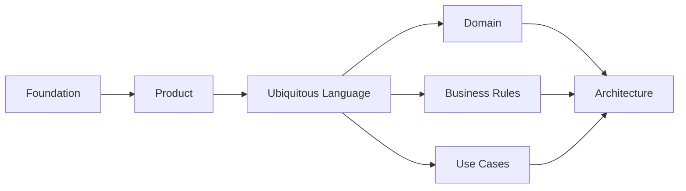
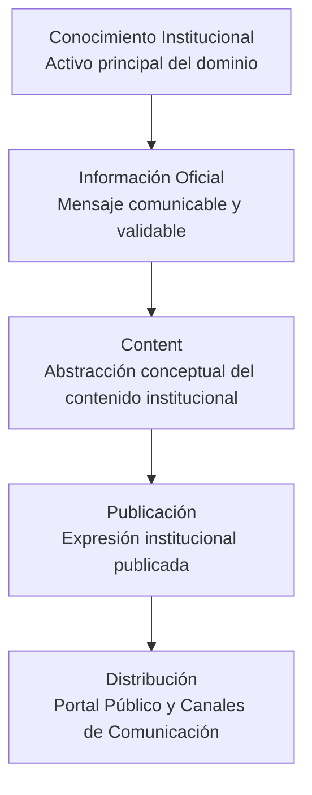
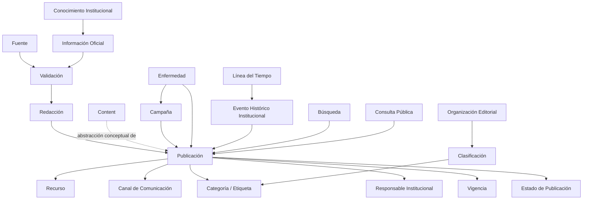
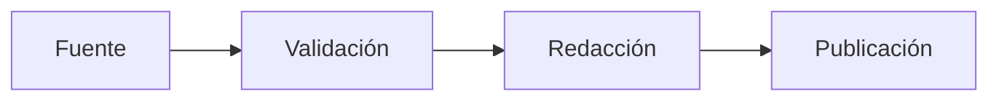
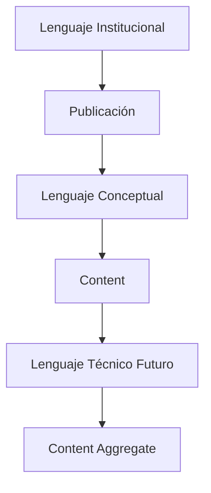
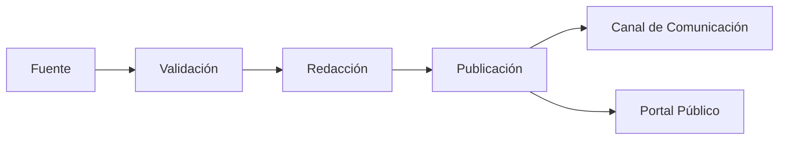
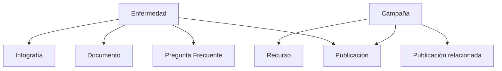

# Lenguaje Ubicuo

| Campo | Valor |
|-------|-------|
| Proyecto | Plataforma de Gestión, Comunicación y Educación para la Salud |
| Cliente | Jurisdicción Sanitaria de Huejutla de Reyes, Hidalgo |
| Documento | Lenguaje Ubicuo |
| Código | DOC-006 |
| Versión | 1.0.0 |
| Estado | Baseline |
| Autor | Equipo del Proyecto |
| Rol arquitectónico | Domain Architect, Software Architect & Product Architect |
| Fecha | 2026-07-03 |

---

# 1. Propósito

Este documento define la especificación oficial del Lenguaje Ubicuo de la **Plataforma de Gestión, Comunicación y Educación para la Salud**.

No es un glosario simple. Es el contrato semántico que deberá gobernar la comunicación entre negocio, dominio, arquitectura, desarrollo, documentación y agentes de IA durante la evolución del producto.

Su propósito es:

- establecer un significado oficial para los conceptos centrales del dominio;
- eliminar ambigüedades entre lenguaje institucional, conceptual y técnico;
- proteger la coherencia entre visión, alcance, principios, personas y documentos posteriores;
- evitar que decisiones técnicas prematuras distorsionen el dominio;
- preparar el modelado posterior de `domain.md`, `business-rules.md` y `use-cases.md`.

La capacidad central que gobierna este lenguaje es:

> **Publicar información confiable.**

---

# 2. Relación con Foundation y Product

Este documento deriva de la baseline de Foundation y Product.

Fuentes oficiales utilizadas:

1. `docs/00-foundation/project-charter.md`
2. `docs/00-foundation/architecture-guide.md`
3. `docs/01-product/vision.md`
4. `docs/01-product/scope.md`
5. `docs/01-product/product-principles.md`
6. `docs/01-product/personas.md`
7. `CONTEXT_TRANSFER_PACKAGE.md`
8. `PHASE_01_TRANSFER_PACKAGE.md`
9. `ARCHITECTURE_ROADMAP.md`

La baseline establece que:

- el conocimiento institucional es el activo principal del sistema;
- la documentación es fuente de verdad;
- el producto existe para publicar información confiable;
- la plataforma no es clínica, hospitalaria ni de diagnóstico;
- el dominio deberá separar conocimiento, contenido, publicación, fuente, canal y recurso;
- `Content` será una abstracción conceptual central;
- la arquitectura técnica no deberá invadir el modelado del dominio.

Este documento no modifica visión, alcance, principios ni personas. Formaliza el lenguaje que permitirá modelar el dominio sin contradicciones.

---

# 3. Papel dentro de la Arquitectura Documental

El Lenguaje Ubicuo es el primer documento de la Fase 02 - Domain.

Su papel es establecer las reglas semánticas que deberán utilizar:

- `domain.md`, para modelar conceptos y relaciones del dominio;
- `business-rules.md`, para expresar reglas institucionales sin ambigüedad;
- `use-cases.md`, para describir interacciones desde lenguaje de negocio;
- `architecture.md`, para preservar los límites del dominio al definir arquitectura;
- `database.md`, para evitar que la persistencia introduzca conceptos no aprobados;
- `api.md`, para asegurar que la comunicación del sistema respete el lenguaje del dominio.



Este documento condiciona los documentos posteriores, pero no los reemplaza.

---

# 4. Cómo Utilizar este Documento

Este documento deberá utilizarse como referencia obligatoria cuando se:

- redacten documentos de dominio, reglas de negocio o casos de uso;
- nombren conceptos dentro de documentación técnica;
- evalúen nuevas funcionalidades;
- revisen propuestas de arquitectura;
- diseñen nombres futuros de modelos, servicios, rutas o componentes;
- preparen prompts o instrucciones para agentes de IA.

Reglas de uso:

- Si un término aparece en este documento, deberá usarse con el significado aquí definido.
- Si un concepto nuevo no aparece en este documento, deberá evaluarse antes de introducirse en `domain.md`.
- Si una palabra tiene varios sentidos posibles, deberá preferirse el sentido oficial documentado.
- Si existe contradicción entre lenguaje operativo y conceptual, deberá aplicarse la matriz de concordancia.
- Si un documento posterior necesita modificar un término, deberá registrar la razón arquitectónica.

---

# 5. Principios Semánticos

## 5.1 Un Concepto, un Significado

Cada concepto central deberá tener un significado oficial único dentro del proyecto.

No deberá utilizarse una misma palabra para representar conceptos diferentes, salvo que la diferencia esté explícitamente documentada.

## 5.2 Lenguaje Institucional Primero

El lenguaje de la Jurisdicción Sanitaria deberá preservarse cuando represente operación real del negocio.

Por decisión aprobada `DA-UL-001`, el término institucional para referirse al contenido publicado es:

> **Publicación**

## 5.3 Lenguaje Conceptual como Puente

El lenguaje conceptual deberá traducir el lenguaje institucional a conceptos estables del dominio.

Por decisión aprobada `DA-UL-002`, la abstracción conceptual principal se mantiene como:

> **Content**

`Content` no sustituye el lenguaje institucional. Lo organiza conceptualmente para preservar coherencia con Vision, Scope y Product Principles.

## 5.4 Lenguaje Técnico Diferido

El lenguaje técnico deberá derivarse del lenguaje conceptual y no introducir diseño prematuro.

Este documento puede mencionar términos técnicos futuros solo como concordancia semántica, no como diseño.

Ejemplo aprobado:

```text
Publicación
↓
Content
↓
Content Aggregate (futuro)
```

## 5.5 Separación entre Fuente, Validación, Redacción y Publicación

El flujo oficial del conocimiento es:

```text
Fuente
↓
Validación
↓
Redacción
↓
Publicación
```

Ninguna publicación deberá entenderse como confiable si omite este ciclo semántico.

## 5.6 Confiabilidad antes que Velocidad

El lenguaje del dominio deberá favorecer responsabilidad institucional, trazabilidad y claridad, incluso cuando eso requiera distinguir más conceptos.

## 5.7 Dominio antes que Persistencia

Los términos de este documento no son tablas, clases, endpoints ni DTOs.

La persistencia, API e implementación deberán derivarse posteriormente del dominio, no al revés.

---

# 6. Reglas del Lenguaje

1. Se deberá usar **Publicación** cuando se hable en lenguaje institucional u operativo sobre una pieza publicada para la población.
2. Se deberá usar **Content** cuando se hable del concepto central del dominio que agrupa contenido institucional publicable, trazable y reutilizable.
3. Se deberá usar **Fuente** para toda información proveniente de Secretaría de Salud, Programas, Gobierno, OMS u OPS.
4. No se deberá llamar contenido a una Fuente.
5. No se deberá llamar publicación a una Campaña.
6. No se deberá llamar Programa de Salud al propietario del contenido.
7. No se deberá llamar Enfermedad a una simple publicación.
8. No se deberá usar Línea del Tiempo como registro general de actividades.
9. No se deberá confundir Canal de Comunicación con Fuente.
10. No se deberá confundir usuario que captura con responsable institucional.
11. La responsabilidad institucional de una publicación pertenece a la Jurisdicción Sanitaria.
12. El lenguaje público deberá privilegiar claridad para la población.
13. El lenguaje conceptual deberá privilegiar estabilidad del dominio.
14. El lenguaje técnico deberá esperar a los documentos técnicos correspondientes.

---

# 7. Reglas de Nomenclatura

## 7.1 Lenguaje Institucional

Se utilizará en:

- conversaciones con responsables institucionales;
- documentación orientada a negocio;
- textos editoriales y operativos;
- casos de uso desde perspectiva de actores.

Ejemplos:

- Publicación
- Campaña
- Aviso
- Comunicado
- Fuente
- Responsable institucional
- Línea del tiempo
- Canal de comunicación

## 7.2 Lenguaje Conceptual

Se utilizará en:

- `domain.md`;
- `business-rules.md`;
- `use-cases.md`;
- decisiones de arquitectura de dominio;
- análisis de relaciones entre conceptos.

Ejemplos:

- Content
- Fuente
- Validación
- Redacción
- Publicación
- Campaña
- Enfermedad
- Recurso
- Canal
- Evento Histórico Institucional

## 7.3 Lenguaje Técnico

Se utilizará únicamente en documentos técnicos posteriores, cuando corresponda.

Ejemplos futuros:

- Content Aggregate
- Repository
- DTO
- Endpoint
- Schema

Este documento no define estos elementos. Solo establece que deberán derivarse del lenguaje conceptual.

---

# 8. Matriz de Concordancia Terminológica

| Lenguaje Institucional | Lenguaje Conceptual | Lenguaje Técnico Futuro | Uso Correcto |
|------------------------|---------------------|-------------------------|--------------|
| Publicación | Content | Content Aggregate | Pieza institucional publicable y trazable. |
| Información oficial | Información validada | Content data / metadata | Mensaje institucional comunicado a la población. |
| Fuente oficial | Fuente | Source | Origen del conocimiento o información. |
| Revisión institucional | Validación | Validation policy / workflow | Confirmación institucional antes de publicar. |
| Redacción | Redacción editorial | Editorial preparation | Preparación comprensible del mensaje. |
| Campaña | Campaña | Campaign concept | Conjunto organizado de publicaciones relacionadas. |
| Enfermedad | Enfermedad | Disease concept | Concepto de salud pública alrededor del cual existen publicaciones. |
| Documento | Recurso documental o Content documental | Document resource / Content subtype | Material institucional consultable o asociable. |
| Infografía | Recurso visual o Content visual | Visual resource / Content subtype | Material visual para comprensión pública. |
| Aviso | Publicación de aviso | Content classified as notice | Publicación institucional breve y oportuna. |
| Comunicado | Publicación de comunicado | Content classified as statement | Publicación institucional formal. |
| Línea del tiempo | Línea del Tiempo Institucional | Timeline capability | Eventos históricos institucionales. |
| Evento histórico | Evento Histórico Institucional | Timeline event | Hito institucional con fecha o periodo. |
| Red social | Canal de Comunicación | Channel adapter | Medio de distribución, no fuente de verdad. |
| Portal | Portal Público | Public interface | Espacio público de consulta. |
| Responsable | Responsable institucional | Institutional responsibility | Responsabilidad atribuida a la institución. |
| Capturista / administrador | Operador de plataforma | Authenticated operator | Persona que captura u opera, no propietaria del contenido. |

La columna técnica es orientativa y futura. No autoriza diseño de clases, agregados, tablas ni endpoints.

---

# 9. Jerarquía Conceptual del Dominio

El verdadero activo principal del dominio es el **Conocimiento Institucional**.

`Content` es una abstracción conceptual principal para organizar contenido institucional publicable, trazable y reutilizable, pero no reemplaza al Conocimiento Institucional. Esta distinción deberá preservarse durante `domain.md`, `business-rules.md`, `use-cases.md`, arquitectura, base de datos, API e implementación.

La jerarquía semántica oficial es:

```text
Conocimiento Institucional
↓
Información Oficial
↓
Content
↓
Publicación
↓
Distribución
```



Reglas de interpretación:

- Conocimiento Institucional es el activo principal.
- Información Oficial es el mensaje institucional comunicable.
- `Content` organiza conceptualmente el contenido institucional publicable.
- Publicación es el término institucional operativo para la pieza publicada.
- Distribución lleva la Publicación a la población mediante Portal Público o Canales de Comunicación.

Ningún documento posterior deberá invertir esta jerarquía ni tratar `Content` como sustituto del Conocimiento Institucional.

---

# 10. Conceptos Fundamentales

Los conceptos fundamentales se agrupan por naturaleza semántica para facilitar el modelado posterior del dominio. Esta organización no elimina conceptos existentes ni introduce diseño técnico.

## 10.1 Core Concepts

### 10.1.1 Conocimiento Institucional

**Definición oficial**

Conjunto organizado, preservado y reutilizable de información oficial, contenido, fuentes, contexto histórico, experiencia institucional y criterios de comunicación de la Jurisdicción Sanitaria.

**Significado**

Es el activo principal del sistema. No es una pieza aislada ni un archivo individual. Es la base que permite comunicar, educar, prevenir y preservar memoria institucional.

**Contexto**

Aparece en Vision, Scope, Product Principles y Personas como el centro conceptual del producto.

**Relaciones**

- Se origina o respalda en Fuentes.
- Se transforma mediante Validación y Redacción.
- Se expresa públicamente mediante Publicaciones.
- Se preserva parcialmente mediante Línea del Tiempo.
- Se distribuye mediante Canales.

**Ejemplos**

- Criterios institucionales sobre una campaña de vacunación.
- Información histórica sobre una acción sanitaria.
- Material preventivo validado por la Jurisdicción.
- Guías o recomendaciones provenientes de fuentes oficiales.

**Términos relacionados**

- Información oficial
- Content
- Fuente
- Publicación
- Memoria institucional

**Términos que NO deben utilizarse**

- Base de datos
- Archivo suelto
- Post de red social
- Registro técnico

**Implicaciones para el dominio**

El dominio deberá modelar el conocimiento institucional como núcleo conceptual, evitando reducirlo a archivos, publicaciones aisladas o datos técnicos.

---

### 10.1.2 Información Oficial

**Definición oficial**

Mensaje o conjunto de datos comunicables que cuenta con respaldo institucional, fuente identificable o validación adecuada para orientar a la población.

**Significado**

La información oficial es el contenido semántico que la institución comunica. Puede formar parte de una Publicación, de una Fuente o de material institucional.

**Contexto**

Debe utilizarse cuando se hable del mensaje que se comunica a la población, no del contenedor editorial ni del conocimiento acumulado.

**Relaciones**

- Proviene de una Fuente o de conocimiento propio validado.
- Requiere Validación antes de publicarse.
- Se redacta para convertirse en Publicación.

**Ejemplos**

- Fecha de una campaña.
- Medida preventiva oficial.
- Aviso sanitario.
- Recomendación institucional.

**Términos relacionados**

- Fuente
- Validación
- Redacción
- Publicación

**Términos que NO deben utilizarse**

- Content, cuando se hable solo del mensaje.
- Recurso, cuando no sea un archivo o material asociado.
- Canal, cuando no sea medio de distribución.

**Implicaciones para el dominio**

El dominio deberá distinguir información oficial de la Publicación que la presenta y de la Fuente que la respalda.

---

### 10.1.3 Content

**Definición oficial**

Abstracción conceptual principal del dominio que representa contenido institucional publicable, trazable, reutilizable y relacionado con conocimiento de salud pública.

**Significado**

`Content` es el puente conceptual entre el lenguaje institucional de Publicación y futuros modelos técnicos. No reemplaza el término Publicación en operación institucional.

**Contexto**

Se utiliza en análisis de dominio y arquitectura conceptual para evitar tratar noticias, avisos, comunicados, documentos o infografías como sistemas aislados.

**Relaciones**

- Puede expresarse institucionalmente como Publicación.
- Puede estar respaldado por Fuentes.
- Puede asociarse a Recursos.
- Puede clasificarse mediante taxonomía editorial.
- Puede distribuirse por Canales.

**Ejemplos**

- Publicación de aviso.
- Publicación de comunicado.
- Publicación documental.
- Publicación asociada a una enfermedad.
- Publicación relacionada con una campaña.

**Términos relacionados**

- Publicación
- Contenido institucional
- Información oficial
- Recurso
- Fuente

**Términos que NO deben utilizarse**

- Fuente
- Canal
- Campaña, cuando se refiera al conjunto organizado.
- Enfermedad, cuando se refiera al concepto sanitario.

**Implicaciones para el dominio**

`Content` deberá permanecer como abstracción central, pero el dominio deberá distinguir cuándo un concepto es publicación, agrupador, fuente, recurso o tema sanitario.

---

### 10.1.4 Publicación

**Definición oficial**

Pieza institucional preparada para consulta pública que comunica información oficial de salud pública con responsabilidad de la Jurisdicción Sanitaria.

**Significado**

Es el término operativo del negocio para referirse al contenido publicado. Una Publicación es el resultado del flujo Fuente → Validación → Redacción → Publicación.

**Contexto**

Debe usarse en lenguaje institucional, casos de uso y comunicación operativa.

**Relaciones**

- Se deriva de Información Oficial.
- Puede estar respaldada por una o varias Fuentes.
- Tiene responsabilidad institucional.
- Puede pertenecer o relacionarse con una Campaña.
- Puede tratar sobre una Enfermedad.
- Puede tener Recursos asociados.
- Puede compartirse por Canales.

**Ejemplos**

- Aviso publicado sobre una jornada de vacunación.
- Comunicado oficial sobre prevención.
- Infografía publicada para explicar medidas preventivas.
- Documento publicado para consulta pública.

**Términos relacionados**

- Content
- Redacción
- Validación
- Fuente
- Responsable institucional

**Términos que NO deben utilizarse**

- Post, como término oficial.
- Registro.
- Fuente.
- Campaña.
- Expediente.

**Implicaciones para el dominio**

El dominio deberá reconocer Publicación como lenguaje institucional equivalente a la expresión pública de `Content`, sin confundirla con agrupadores o fuentes.

---

## 10.2 Supporting Concepts

### 10.2.1 Fuente

**Definición oficial**

Origen institucional, documental u organizacional del conocimiento o información que respalda una Publicación.

**Significado**

La Fuente no es contenido publicado. Es el respaldo que permite validar, contextualizar o justificar la información.

**Contexto**

Por decisión `DA-UL-004`, toda información proveniente de Secretaría de Salud, Programas, Gobierno, OMS u OPS debe modelarse como Fuente, no como contenido.

**Relaciones**

- Alimenta la Validación.
- Respalda Información Oficial.
- Puede provenir de Actores Organizacionales.
- No reemplaza la responsabilidad de la Jurisdicción.

**Ejemplos**

- Secretaría de Salud.
- Programa de Salud.
- Gobierno.
- OMS.
- OPS.
- Documento oficial.
- Información histórica validada.

**Términos relacionados**

- Validación
- Información oficial
- Actor Organizacional
- Trazabilidad

**Términos que NO deben utilizarse**

- Publicación.
- Content.
- Autor final.
- Propietario del contenido.

**Implicaciones para el dominio**

El dominio deberá permitir distinguir claramente entre quién origina o respalda información y quién asume la responsabilidad institucional de publicarla.

---

### 10.2.2 Validación

**Definición oficial**

Confirmación institucional de que la información puede utilizarse como base para una Publicación confiable.

**Significado**

La Validación protege confiabilidad, vigencia, pertinencia y responsabilidad institucional.

**Contexto**

Forma parte del flujo oficial del conocimiento y no debe confundirse con aprobación técnica o autenticación de usuario.

**Relaciones**

- Recibe información desde Fuentes.
- Precede a la Redacción.
- Involucra responsabilidad institucional.
- Puede apoyarse en Profesionales de la Salud, Programas o Autoridad Sanitaria.

**Ejemplos**

- Confirmar que una campaña sigue vigente.
- Confirmar que una recomendación proviene de una fuente oficial.
- Verificar que un aviso es pertinente para la población local.

**Términos relacionados**

- Fuente
- Redacción
- Responsable institucional
- Confiabilidad

**Términos que NO deben utilizarse**

- Login.
- Permiso.
- Moderación automática.
- Diagnóstico.

**Implicaciones para el dominio**

Las reglas de negocio deberán definir condiciones de validación sin convertir el MVP en un flujo editorial avanzado fuera de alcance.

---

## 10.3 Organizing Concepts

### 10.3.1 Redacción

**Definición oficial**

Proceso institucional de preparar información validada para convertirla en una Publicación clara, comprensible y útil para la población.

**Significado**

La Redacción transforma información validada en comunicación pública. Incluye claridad, contexto, estructura editorial y adaptación al lenguaje ciudadano.

**Contexto**

Es la tercera etapa del flujo oficial del conocimiento.

**Relaciones**

- Recibe información validada.
- Produce una Publicación.
- Puede asociar Recursos.
- Debe respetar claridad, prevención y responsabilidad institucional.

**Ejemplos**

- Convertir lineamientos técnicos en un aviso comprensible.
- Redactar preguntas frecuentes.
- Preparar resumen de una campaña.
- Adaptar información oficial para población general.

**Términos relacionados**

- Organización editorial
- Publicación
- Información oficial
- Recurso visual

**Términos que NO deben utilizarse**

- Generación automática sin supervisión.
- Formateo técnico.
- Diseño de interfaz.

**Implicaciones para el dominio**

`business-rules.md` deberá distinguir reglas de claridad y responsabilidad sin diseñar pantallas ni flujos técnicos.

---

### 10.3.2 Campaña

**Definición oficial**

Conjunto organizado de publicaciones relacionadas por un objetivo preventivo, educativo o institucional común.

**Significado**

Una Campaña no es una Publicación. Es una estructura de coordinación y agrupación de publicaciones, recursos, mensajes y acciones relacionadas.

**Contexto**

Por decisión `DA-UL-006`, Campaña debe modelarse como conjunto organizado, no como publicación individual.

**Relaciones**

- Puede agrupar varias Publicaciones.
- Puede relacionarse con Enfermedades.
- Puede usar Fuentes.
- Puede tener Recursos.
- Puede ser destacada o difundida por Canales.

**Ejemplos**

- Campaña de vacunación.
- Campaña de prevención de dengue.
- Campaña de salud materna.

**Términos relacionados**

- Publicación
- Enfermedad
- Programa de Salud
- Recurso
- Canal

**Términos que NO deben utilizarse**

- Publicación única.
- Fuente.
- Programa de Salud.
- Evento histórico.

**Implicaciones para el dominio**

`domain.md` deberá resolver Campaña como concepto agrupador. Cuando documentos previos mencionan campañas dentro de contenido, deberá interpretarse como capacidad de administrar información de campaña y sus publicaciones asociadas.

---

## 10.4 Thematic Concepts

### 10.4.1 Programa de Salud

**Definición oficial**

Fuente institucional de conocimiento especializada en un tema, línea de acción o estrategia de salud pública.

**Significado**

Un Programa de Salud aporta conocimiento, materiales o validación temática, pero no es propietario del contenido publicado.

**Contexto**

Por decisión `DA-UL-007`, Programa de Salud representa una fuente institucional de conocimiento.

**Relaciones**

- Puede actuar como Fuente.
- Puede validar información temática.
- Puede aportar materiales preventivos.
- Puede relacionarse con Campañas y Enfermedades.
- No asume propiedad final de Publicaciones.

**Ejemplos**

- Programa asociado a vacunación.
- Programa preventivo.
- Programa de vigilancia o promoción de salud.

**Términos relacionados**

- Fuente
- Campaña
- Validación
- Profesional de la Salud

**Términos que NO deben utilizarse**

- Propietario del contenido.
- Publicador final.
- Módulo técnico.

**Implicaciones para el dominio**

El dominio deberá separar origen temático, validación y responsabilidad institucional final.

---

### 10.4.2 Enfermedad

**Definición oficial**

Concepto de salud pública alrededor del cual pueden organizarse publicaciones, campañas, documentos, infografías, noticias y preguntas frecuentes.

**Significado**

Una Enfermedad no es una simple Publicación. Es un tema sanitario que puede articular múltiples expresiones de conocimiento institucional.

**Contexto**

Por decisión `DA-UL-008`, Enfermedad debe tratarse como concepto del dominio.

**Relaciones**

- Puede tener Publicaciones relacionadas.
- Puede relacionarse con Campañas.
- Puede tener preguntas frecuentes.
- Puede tener documentos o infografías asociadas.
- Puede depender de Fuentes oficiales.

**Ejemplos**

- Dengue.
- Influenza.
- COVID-19.
- Enfermedades transmitidas por vector.

**Términos relacionados**

- Campaña
- Publicación
- Pregunta frecuente
- Documento
- Infografía

**Términos que NO deben utilizarse**

- Publicación.
- Archivo.
- Diagnóstico.
- Expediente clínico.

**Implicaciones para el dominio**

El modelado posterior deberá evitar reducir Enfermedad a un tipo editorial simple. Deberá conservar su papel como concepto sanitario organizador.

---

## 10.5 Institutional Memory Concepts

### 10.5.1 Línea del Tiempo

**Definición oficial**

Capacidad conceptual para representar exclusivamente eventos históricos institucionales relevantes de la Jurisdicción Sanitaria.

**Significado**

La Línea del Tiempo preserva memoria institucional. No es un calendario operativo ni un registro general de actividades.

**Contexto**

Por decisión `DA-UL-010`, la Línea del Tiempo representa exclusivamente eventos históricos institucionales.

**Relaciones**

- Contiene Eventos Históricos Institucionales.
- Puede relacionarse con Publicaciones.
- Preserva memoria institucional.
- Puede consultar la población, investigadores o autoridades.

**Ejemplos**

- Hito sanitario regional.
- Evento histórico de la Jurisdicción.
- Campaña histórica relevante.
- Acontecimiento institucional de salud pública.

**Términos relacionados**

- Evento Histórico Institucional
- Memoria institucional
- Publicación relacionada

**Términos que NO deben utilizarse**

- Agenda.
- Calendario.
- Actividad general.
- Bitácora operativa.

**Implicaciones para el dominio**

`domain.md` deberá proteger la Línea del Tiempo de convertirse en una lista genérica de eventos operativos.

---

### 10.5.2 Evento Histórico Institucional

**Definición oficial**

Hito o acontecimiento relevante para la memoria institucional de la Jurisdicción Sanitaria, representado dentro de la Línea del Tiempo.

**Significado**

Es la unidad conceptual de la Línea del Tiempo. Su valor está en preservar contexto, fecha o periodo y relevancia institucional.

**Contexto**

Deriva del alcance del MVP y de la necesidad de preservar memoria institucional.

**Relaciones**

- Pertenece a Línea del Tiempo.
- Puede relacionarse con Publicaciones.
- Puede tener Recursos asociados.

**Ejemplos**

- Inicio de una campaña histórica.
- Evento regional de salud pública.
- Hito institucional relevante.

**Términos relacionados**

- Línea del Tiempo
- Memoria institucional
- Recurso

**Términos que NO deben utilizarse**

- Actividad cotidiana.
- Cita médica.
- Evento operativo sin valor histórico.

**Implicaciones para el dominio**

Los criterios para incluir eventos deberán formalizarse en `business-rules.md`.

---

## 10.6 Delivery Concepts

### 10.6.1 Canal de Comunicación

**Definición oficial**

Medio mediante el cual una Publicación o contenido institucional se distribuye o comparte con la población.

**Significado**

El Canal permite difusión. No es fuente de verdad ni origen del conocimiento.

**Contexto**

La documentación exige desacoplar canales del contenido y evitar dependencia exclusiva de redes sociales.

**Relaciones**

- Distribuye Publicaciones.
- Depende de contenido publicado.
- Puede cambiar con el tiempo.
- No reemplaza el portal público ni la responsabilidad institucional.

**Ejemplos**

- Portal público.
- Facebook.
- Instagram.
- X.
- TikTok.
- YouTube.
- WhatsApp.

**Términos relacionados**

- Distribución
- Publicación
- Enlace público

**Términos que NO deben utilizarse**

- Fuente.
- Repositorio oficial.
- Propietario del contenido.

**Implicaciones para el dominio**

El dominio deberá permitir nuevos canales sin alterar el núcleo de conocimiento y publicación.

---

## 10.7 Expression Concepts

### 10.7.1 Recurso

**Definición oficial**

Material asociado o reutilizable que apoya la comprensión, consulta o distribución de una Publicación o conocimiento institucional.

**Significado**

Un Recurso puede ser visual, documental o multimedia. No todo Recurso es una Publicación, aunque algunos recursos pueden publicarse como parte de Content.

**Contexto**

El MVP incluye gestión multimedia básica y reutilización de recursos.

**Relaciones**

- Puede asociarse a Publicaciones.
- Puede apoyar Campañas.
- Puede ayudar a explicar Enfermedades.
- Puede provenir de Fuentes.

**Ejemplos**

- Imagen.
- Infografía.
- Documento PDF.
- Video enlazado.

**Términos relacionados**

- Recurso visual
- Documento
- Infografía
- Multimedia básica

**Términos que NO deben utilizarse**

- DAM avanzado.
- Expediente.
- Fuente, salvo que el recurso funcione como documento fuente.

**Implicaciones para el dominio**

El dominio deberá distinguir recurso asociado de publicación y evitar convertir la gestión multimedia básica en un gestor documental avanzado.

---

## 10.8 Governance Concepts

### 10.8.1 Responsable Institucional

**Definición oficial**

Rol o responsabilidad atribuida institucionalmente a la Jurisdicción Sanitaria respecto a la confiabilidad, publicación y preservación de la información.

**Significado**

La responsabilidad final de una Publicación pertenece a la Jurisdicción Sanitaria, no al usuario que captura información.

**Contexto**

Por decisión `DA-UL-009`, la responsabilidad institucional de una publicación pertenece a la Jurisdicción Sanitaria.

**Relaciones**

- Se asocia a Publicaciones.
- Se apoya en Responsable Editorial y Administrador de Plataforma.
- Es distinta de autoría operativa.
- Refuerza trazabilidad.

**Ejemplos**

- Jurisdicción Sanitaria como responsable de una publicación.
- Responsable Editorial como participante operativo.
- Administrador de Plataforma como operador de captura.

**Términos relacionados**

- Jurisdicción Sanitaria
- Trazabilidad
- Autoría operativa
- Validación

**Términos que NO deben utilizarse**

- Propietario individual.
- Usuario dueño.
- Autor técnico.

**Implicaciones para el dominio**

Las reglas de negocio deberán distinguir responsabilidad institucional, autoría operativa, fuente y validación.

---

### 10.8.2 Trazabilidad

**Definición oficial**

Capacidad de identificar origen, validación, responsabilidad, estado y contexto de una Publicación o conocimiento institucional.

**Significado**

La Trazabilidad sostiene confianza pública y continuidad institucional.

**Contexto**

El alcance MVP exige trazabilidad básica de fuente, autoría o responsabilidad institucional.

**Relaciones**

- Vincula Fuente, Validación, Redacción y Publicación.
- Refuerza responsabilidad institucional.
- Apoya mantenimiento y vigencia.

**Ejemplos**

- Saber qué fuente respalda una publicación.
- Saber si una publicación está vigente o archivada.
- Saber quién operó la captura sin confundirlo con responsabilidad final.

**Términos relacionados**

- Fuente
- Estado de publicación
- Responsable institucional
- Autoría operativa

**Términos que NO deben utilizarse**

- Auditoría avanzada, cuando se hable del MVP.
- Historial completo, si no está dentro del alcance.

**Implicaciones para el dominio**

La trazabilidad básica deberá formalizarse en reglas de negocio antes de diseñar persistencia.

---

## 10.9 Classification Concepts

### 10.9.1 Estado de Publicación

**Definición oficial**

Condición editorial básica que indica si una Publicación está en preparación, disponible para consulta pública o retirada de vigencia pública.

**Significado**

Permite administrar el ciclo operativo mínimo de una Publicación.

**Contexto**

El MVP contempla estados básicos: borrador, publicado y archivado.

**Relaciones**

- Aplica a Publicaciones.
- Apoya vigencia y trazabilidad.
- No equivale a flujo editorial avanzado.

**Ejemplos**

- Borrador.
- Publicado.
- Archivado.

**Términos relacionados**

- Publicación
- Vigencia
- Trazabilidad

**Términos que NO deben utilizarse**

- Workflow avanzado.
- Aprobación multinivel.
- Versionado avanzado.

**Implicaciones para el dominio**

Las reglas de negocio deberán limitar estados básicos del MVP sin impedir evolución futura.

---

### 10.9.2 Categoría y Etiqueta

**Definición oficial**

Criterios editoriales para organizar Publicaciones y facilitar navegación, búsqueda y comprensión pública.

**Significado**

La Categoría agrupa por criterio editorial más estable. La Etiqueta permite clasificación complementaria y flexible.

**Contexto**

El alcance incluye clasificación por tipo, categoría y etiquetas.

**Relaciones**

- Apoyan búsqueda básica.
- Apoyan navegación pública.
- Pueden relacionarse con temas, campañas o enfermedades.

**Ejemplos**

- Categoría: Prevención.
- Categoría: Vacunación.
- Etiqueta: dengue.
- Etiqueta: jornada.

**Términos relacionados**

- Tipo de publicación
- Búsqueda básica
- Organización editorial

**Términos que NO deben utilizarse**

- Módulo.
- Tabla.
- Menú técnico.

**Implicaciones para el dominio**

La taxonomía deberá definirse desde comprensión pública, no desde conveniencia técnica.

---

### 10.9.3 Tipo de Publicación

**Definición oficial**

Clasificación editorial que describe la forma comunicativa principal de una Publicación.

**Significado**

El tipo permite distinguir cómo se presenta una publicación sin convertir cada tipo en un sistema separado.

**Contexto**

El alcance menciona noticias, eventos, comunicados, avisos, documentos, infografías, preguntas frecuentes e información institucional como variantes de contenido institucional.

**Relaciones**

- Clasifica Publicaciones.
- No sustituye Campaña, Enfermedad ni Fuente cuando actúan como conceptos distintos.
- Apoya navegación y búsqueda.

**Ejemplos**

- Noticia.
- Aviso.
- Comunicado.
- Documento.
- Infografía.
- Pregunta frecuente.
- Información institucional.

**Términos relacionados**

- Publicación
- Content
- Categoría
- Etiqueta

**Términos que NO deben utilizarse**

- Sistema independiente.
- Módulo aislado.
- Tabla específica por defecto.

**Implicaciones para el dominio**

`domain.md` deberá evitar fragmentar el modelo por tipo de publicación sin justificación explícita.

---

### 10.9.4 Vigencia

**Definición oficial**

Condición semántica que indica si una Publicación o información oficial sigue siendo actual, pertinente y confiable para consulta pública.

**Significado**

La Vigencia permite distinguir información activa de información preservada, histórica o archivada. No equivale necesariamente al Estado de Publicación, aunque ambos conceptos se relacionan.

**Contexto**

Deriva de Vision, Scope y Product Principles, que exigen información oficial, clara, confiable y vigente.

**Relaciones**

- Se evalúa sobre Publicaciones.
- Se apoya en Validación y Trazabilidad.
- Puede motivar actualización o archivo.
- Puede afectar contenido destacado, campañas y consulta pública.

**Ejemplos**

- Una campaña vigente.
- Un aviso sanitario todavía aplicable.
- Una publicación archivada por dejar de ser actual.

**Términos relacionados**

- Estado de Publicación
- Validación
- Trazabilidad
- Actualización

**Términos que NO deben utilizarse**

- Fecha técnica.
- Caducidad automática sin criterio institucional.
- Estado de sistema.

**Implicaciones para el dominio**

`business-rules.md` deberá definir criterios de vigencia sin introducir automatización avanzada fuera del MVP.

---

### 10.9.5 Organización Editorial

**Definición oficial**

Proceso conceptual de estructurar información, publicaciones, recursos y criterios de clasificación para facilitar comprensión, búsqueda, navegación y reutilización.

**Significado**

La Organización Editorial ordena el conocimiento para hacerlo accesible. No es diseño de interfaz ni estructura técnica.

**Contexto**

Deriva de la necesidad de organizar contenido institucional mediante tipo, categoría, etiquetas, contenido destacado, línea del tiempo y recursos asociados.

**Relaciones**

- Apoya Redacción.
- Usa Clasificación.
- Facilita Consulta Pública y Búsqueda.
- Ordena Publicaciones, Campañas, Enfermedades y Recursos.

**Ejemplos**

- Agrupar publicaciones por prevención.
- Relacionar una infografía con una enfermedad.
- Destacar una campaña vigente.
- Clasificar un aviso para consulta pública.

**Términos relacionados**

- Redacción
- Clasificación
- Categoría
- Etiqueta
- Tipo de Publicación

**Términos que NO deben utilizarse**

- Arquitectura de información técnica.
- Diseño visual.
- Menú de interfaz.

**Implicaciones para el dominio**

El dominio deberá distinguir la organización editorial del diseño de pantallas y de la persistencia.

---

### 10.9.6 Clasificación

**Definición oficial**

Acto semántico de asignar criterios editoriales a una Publicación o conocimiento relacionado para facilitar navegación, búsqueda, comprensión y reutilización.

**Significado**

La Clasificación es el uso coordinado de Tipo de Publicación, Categoría, Etiqueta y relaciones temáticas.

**Contexto**

Deriva del alcance MVP: clasificación por tipo, categorías y etiquetas.

**Relaciones**

- Utiliza Tipo de Publicación, Categoría y Etiqueta.
- Apoya Búsqueda y Consulta Pública.
- Puede relacionar Publicaciones con Campañas o Enfermedades.

**Ejemplos**

- Clasificar una publicación como Aviso.
- Asignar categoría Prevención.
- Asociar etiqueta dengue.
- Relacionar contenido con una campaña vigente.

**Términos relacionados**

- Tipo de Publicación
- Categoría
- Etiqueta
- Organización Editorial

**Términos que NO deben utilizarse**

- Indexación técnica.
- Tabla clasificadora.
- Menú.

**Implicaciones para el dominio**

Las reglas de clasificación deberán definirse desde utilidad pública y coherencia editorial, no desde estructura técnica.

---

### 10.9.7 Búsqueda

**Definición oficial**

Capacidad conceptual que permite localizar Publicaciones, Recursos o conocimiento publicado mediante criterios comprensibles para la población.

**Significado**

La Búsqueda facilita acceso al conocimiento institucional. En el MVP es básica y depende de contenido publicado, clasificación correcta y lenguaje claro.

**Contexto**

Deriva directamente de Scope, que incluye búsqueda básica pública y excluye búsqueda semántica avanzada en v1.0.

**Relaciones**

- Depende de Clasificación.
- Consulta Publicaciones publicadas.
- Apoya Consulta Pública.
- Puede evolucionar posteriormente hacia búsqueda semántica.

**Ejemplos**

- Buscar una campaña vigente.
- Buscar información sobre una enfermedad.
- Buscar un documento publicado.

**Términos relacionados**

- Consulta Pública
- Clasificación
- Categoría
- Etiqueta

**Términos que NO deben utilizarse**

- Búsqueda semántica, cuando se hable del MVP.
- Motor avanzado.
- RAG.

**Implicaciones para el dominio**

`use-cases.md` deberá describir búsqueda básica sin adelantar motor semántico, IA o diseño técnico.

---

### 10.9.8 Consulta Pública

**Definición oficial**

Interacción conceptual mediante la cual la población o actores externos acceden a Publicaciones, Recursos o conocimiento institucional publicado.

**Significado**

La Consulta Pública representa el consumo confiable del conocimiento publicado. No implica autenticación, administración ni atención clínica.

**Contexto**

Deriva del Portal Público, público principal, accesibilidad del conocimiento e impacto esperado en la población.

**Relaciones**

- Consume Publicaciones publicadas.
- Usa Búsqueda, Clasificación, Canales y Portal Público.
- Requiere claridad, vigencia y fuente visible.

**Ejemplos**

- Consultar un aviso.
- Consultar una campaña.
- Consultar información de una enfermedad.
- Consultar un recurso visual.

**Términos relacionados**

- Portal Público
- Publicación
- Búsqueda
- Canal de Comunicación

**Términos que NO deben utilizarse**

- Consulta médica.
- Atención individual.
- Diagnóstico.
- Trámite clínico.

**Implicaciones para el dominio**

La Consulta Pública deberá mantenerse dentro de comunicación y educación en salud pública, sin derivar a servicios clínicos.

---

# 11. Clasificación Semántica de Conceptos

Esta clasificación organiza todos los conceptos del dominio según su naturaleza semántica. Su propósito es guiar el modelado posterior sin convertir los conceptos en entidades, tablas, clases o agregados.

| Clasificación Semántica | Conceptos | Criterio de Clasificación | Uso en Modelado Posterior |
|-------------------------|-----------|---------------------------|---------------------------|
| Concepto Central | Conocimiento Institucional; Información Oficial; Content; Publicación | Define el centro del producto y la jerarquía principal del dominio. | Mantener como núcleo semántico del dominio. |
| Concepto de Respaldo | Fuente; Validación; Trazabilidad; Vigencia | Protege confiabilidad, origen, revisión y actualidad de la información. | Definir reglas de confiabilidad y control semántico. |
| Concepto de Organización | Redacción; Organización Editorial; Campaña; Línea del Tiempo | Ordena conocimiento para comunicar, agrupar o preservar. | Modelar relaciones editoriales y memoria institucional. |
| Concepto Temático | Programa de Salud; Enfermedad | Representa origen temático o tema sanitario organizador. | Evitar reducir temas sanitarios a publicaciones simples. |
| Concepto de Clasificación | Clasificación; Estado de Publicación; Tipo de Publicación; Categoría; Etiqueta | Permite ordenar, navegar, buscar y mantener publicaciones. | Definir taxonomía editorial y reglas de uso. |
| Concepto de Distribución | Canal de Comunicación; Portal Público; Consulta Pública; Búsqueda | Permite acceso y localización de conocimiento publicado. | Modelar acceso público sin diseñar interfaz ni infraestructura. |
| Concepto de Expresión | Recurso; Evento Histórico Institucional; Documento; Infografía; Aviso; Comunicado; Pregunta Frecuente | Representa formas concretas de expresar o consultar conocimiento. | Definir variantes comunicativas sin fragmentar el dominio. |
| Concepto de Gobierno | Responsable Institucional; Autoría Operativa; Jurisdicción Sanitaria | Define responsabilidad, operación y autoridad institucional. | Separar responsabilidad institucional de operación individual. |

Reglas de clasificación:

- Un concepto puede relacionarse con varias categorías, pero deberá tener una naturaleza semántica principal.
- La clasificación no define módulos técnicos.
- La clasificación no define persistencia.
- La clasificación deberá utilizarse para detectar duplicidades o conceptos mal ubicados en `domain.md`.

---

# 12. Fronteras Semánticas del Dominio

Las fronteras semánticas delimitan qué conceptos pertenecen al dominio del producto y qué conceptos quedan fuera por contradecir visión, alcance, principios o antiobjetivos.

## 12.1 Dentro del Dominio

Los siguientes conceptos pertenecen al dominio:

- Conocimiento Institucional.
- Información Oficial.
- Content.
- Publicaciones.
- Fuentes.
- Validación.
- Redacción.
- Organización Editorial.
- Campañas.
- Enfermedades.
- Programas de Salud como Fuentes.
- Recursos.
- Documentos.
- Infografías.
- Preguntas frecuentes.
- Avisos.
- Comunicados.
- Línea del Tiempo.
- Eventos Históricos Institucionales.
- Canales de Comunicación.
- Portal Público.
- Consulta Pública.
- Búsqueda básica.
- Clasificación.
- Categorías.
- Etiquetas.
- Estado de Publicación.
- Vigencia.
- Trazabilidad.
- Responsable Institucional.

## 12.2 Fuera del Dominio

Los siguientes conceptos quedan fuera del dominio del producto:

- Expedientes clínicos.
- Diagnósticos.
- Consulta médica individual.
- Hospitales como operación clínica.
- Sistemas hospitalarios.
- Inventarios médicos.
- Citas médicas.
- Farmacia.
- Tratamientos personalizados.
- Recetas.
- Historial clínico personal.
- Datos clínicos personales.
- Plataforma clínica.
- Sistema administrativo hospitalario.
- Red social como fuente oficial.
- Automatización editorial sin supervisión institucional.

## 12.3 Regla de Frontera

Un concepto solo podrá incorporarse al dominio si fortalece publicar información confiable, preservar conocimiento institucional, organizar contenido, facilitar consulta pública o distribuir información oficial sin cruzar hacia atención clínica, diagnóstico, operación hospitalaria o administración ajena a comunicación y educación en salud pública.

---

# 13. Taxonomía Oficial

La taxonomía oficial distingue niveles semánticos:

| Nivel | Conceptos | Propósito |
|------|-----------|-----------|
| Núcleo | Conocimiento Institucional, Información Oficial, Content, Publicación | Definir el centro del producto. |
| Respaldo | Fuente, Validación, Responsable Institucional, Trazabilidad, Vigencia | Proteger confiabilidad, actualidad y responsabilidad. |
| Preparación | Redacción, Organización Editorial, Estado de Publicación, Categoría, Etiqueta, Clasificación | Preparar información para consulta pública. |
| Agrupación | Campaña, Enfermedad, Línea del Tiempo | Organizar conocimiento alrededor de objetivos, temas o memoria. |
| Expresión | Tipo de Publicación, Recurso, Evento Histórico Institucional | Representar formas concretas de comunicación o preservación. |
| Distribución | Canal de Comunicación, Portal Público, Enlace Público, Consulta Pública, Búsqueda | Llevar información a la población y facilitar localización. |

Reglas taxonómicas:

- Una Fuente respalda, no publica.
- Una Publicación comunica, no valida por sí misma.
- Una Campaña agrupa, no sustituye Publicaciones.
- Una Enfermedad organiza conocimiento sanitario, no equivale a una Publicación.
- Un Canal distribuye, no gobierna contenido.
- La Línea del Tiempo preserva memoria institucional, no agenda actividades.
- La Búsqueda localiza información publicada, no sustituye validación.
- La Consulta Pública no equivale a consulta médica.

---

# 14. Relaciones Conceptuales



Este mapa representa relaciones semánticas. No representa arquitectura técnica, base de datos ni agregados.

---

# 15. Matriz Oficial de Relaciones Semánticas

Esta matriz describe relaciones semánticas del dominio. No representa relaciones de base de datos, cardinalidades, entidades, agregados, clases, endpoints ni dependencias técnicas.

| Origen | Relación | Destino | Interpretación Semántica |
|--------|----------|---------|--------------------------|
| Conocimiento Institucional | contiene y preserva | Información Oficial | El conocimiento institucional incluye información comunicable y contexto institucional. |
| Información Oficial | se organiza como | Content | La información oficial puede convertirse en contenido institucional publicable. |
| Content | se expresa institucionalmente como | Publicación | `Content` es la abstracción conceptual; Publicación es el lenguaje operativo. |
| Publicación | se distribuye por | Canal de Comunicación | La publicación puede difundirse por canales sin que estos sean fuente de verdad. |
| Publicación | se consulta mediante | Portal Público | El portal permite consulta pública de información publicada. |
| Fuente | respalda | Información Oficial | La fuente da origen, soporte o referencia a la información. |
| Fuente | alimenta | Validación | La validación revisa información proveniente de fuentes. |
| Validación | habilita | Redacción | Solo información validada debe prepararse para publicación confiable. |
| Redacción | transforma | Información Oficial | La redacción convierte información validada en comunicación clara. |
| Redacción | produce | Publicación | La redacción culmina en una pieza publicable. |
| Campaña | agrupa | Publicaciones | Una campaña contiene publicaciones relacionadas por objetivo común. |
| Campaña | puede tratar sobre | Enfermedad | Las campañas pueden organizarse alrededor de enfermedades o temas preventivos. |
| Enfermedad | organiza | Publicaciones relacionadas | La enfermedad actúa como concepto temático de salud pública. |
| Enfermedad | puede relacionarse con | Preguntas Frecuentes | Las dudas frecuentes pueden articularse alrededor de una enfermedad. |
| Enfermedad | puede relacionarse con | Documentos e Infografías | Los recursos y contenidos pueden explicar o contextualizar enfermedades. |
| Publicación | utiliza | Recursos | Los recursos apoyan comprensión, consulta o difusión. |
| Publicación | trata sobre | Enfermedad | Una publicación puede comunicar información sobre un tema sanitario. |
| Publicación | pertenece a | Categoría | La categoría organiza de forma editorial y comprensible. |
| Publicación | puede tener | Etiquetas | Las etiquetas complementan clasificación y búsqueda. |
| Publicación | posee | Estado de Publicación | El estado expresa condición editorial básica. |
| Publicación | posee | Vigencia | La vigencia indica actualidad o pertinencia pública. |
| Publicación | requiere | Responsable Institucional | La responsabilidad final pertenece a la Jurisdicción Sanitaria. |
| Publicación | conserva | Trazabilidad | La trazabilidad permite identificar fuente, responsabilidad, estado y contexto. |
| Programa de Salud | aporta | Fuente | El programa actúa como fuente institucional temática. |
| Secretaría de Salud | aporta | Fuente | La Secretaría puede respaldar información oficial. |
| Gobierno | aporta | Fuente | El Gobierno puede respaldar información aplicable a salud pública. |
| OMS / OPS | aportan | Fuente | Los organismos internacionales pueden servir como fuentes oficiales externas. |
| Línea del Tiempo | contiene | Evento Histórico Institucional | La línea del tiempo preserva memoria institucional. |
| Evento Histórico Institucional | puede relacionarse con | Publicación | Un evento histórico puede tener publicaciones asociadas. |
| Organización Editorial | usa | Clasificación | La organización editorial estructura contenido para consulta pública. |
| Clasificación | utiliza | Tipo de Publicación | El tipo describe forma comunicativa principal. |
| Clasificación | utiliza | Categoría | La categoría agrupa por criterio editorial estable. |
| Clasificación | utiliza | Etiqueta | La etiqueta permite clasificación flexible. |
| Búsqueda | depende de | Clasificación | La búsqueda básica mejora cuando el contenido está bien clasificado. |
| Consulta Pública | consume | Publicaciones publicadas | La población accede a conocimiento institucional mediante publicaciones. |
| Canal de Comunicación | distribuye | Publicación | El canal amplifica alcance sin reemplazar la fuente institucional. |

Reglas de lectura:

- La matriz expresa vocabulario y relaciones del dominio, no diseño técnico.
- La dirección de la relación indica sentido semántico, no dependencia de implementación.
- Las relaciones podrán profundizarse en `domain.md`, pero no deberán reinterpretarse sin justificación.

---

# 16. Flujo Oficial del Conocimiento

El flujo oficial del conocimiento es:



## 16.1 Fuente

La Fuente aporta o respalda información. Puede provenir de Secretaría de Salud, Programas de Salud, Gobierno, OMS, OPS, documentos oficiales, información histórica o experiencia institucional.

## 16.2 Validación

La Validación confirma que la información puede convertirse en comunicación pública confiable.

## 16.3 Redacción

La Redacción transforma información validada en lenguaje claro, útil y comprensible para la población.

## 16.4 Publicación

La Publicación pone la información al alcance público con responsabilidad institucional de la Jurisdicción Sanitaria.

---

# 17. Matriz Concepto ↔ Personas

| Concepto | Ciudadano | Responsable Editorial | Administrador de Plataforma | Profesional de la Salud | Estudiante | Autoridad Sanitaria | Investigador | Medio de Comunicación |
|----------|-----------|-----------------------|-----------------------------|-------------------------|------------|--------------------|--------------|------------------------|
| Conocimiento Institucional | Consume | Organiza | Preserva operativamente | Aporta / valida | Consume | Decide / valida | Consulta | Cita |
| Información Oficial | Consulta | Redacta | Publica operativamente | Interpreta | Consulta | Prioriza | Analiza | Verifica |
| Publicación | Consulta | Prepara | Gestiona | Consulta / propone | Consulta | Consulta / solicita | Consulta | Difunde |
| Content | No usa el término | Usa conceptualmente | Usa operativamente si aplica | No directo | No directo | No directo | No directo | No directo |
| Fuente | Confía en ella | Registra / verifica | Conserva referencia | Aporta / valida | Consulta indirecta | Valida | Consulta | Cita |
| Validación | No participa | Coordina | No decide | Participa | No participa | Participa | No participa | No participa |
| Redacción | Recibe resultado | Ejecuta / coordina | Soporta | Aporta claridad técnica | Recibe resultado | Orienta prioridad | No participa | Recibe resultado |
| Campaña | Consulta | Organiza | Gestiona publicaciones asociadas | Aporta | Consulta | Prioriza | Consulta | Difunde |
| Enfermedad | Consulta | Organiza contenido relacionado | Gestiona relaciones | Aporta conocimiento | Consulta | Prioriza | Analiza | Consulta |
| Línea del Tiempo | Consulta | Administra contenido relacionado | Gestiona eventos | Aporta contexto | Consulta | Consulta | Consulta | Consulta |
| Canal | Recibe | Prepara distribución | Soporta distribución | No directo | Recibe | Decide prioridad | No directo | Difunde |
| Recurso | Consulta | Asocia | Gestiona | Aporta | Consulta | Consulta | Consulta | Reutiliza |

---

# 18. Términos Permitidos

Los siguientes términos están permitidos con el significado definido en este documento:

- Conocimiento Institucional
- Información Oficial
- Content
- Contenido Institucional
- Publicación
- Fuente
- Validación
- Redacción
- Campaña
- Programa de Salud
- Enfermedad
- Línea del Tiempo
- Evento Histórico Institucional
- Canal de Comunicación
- Portal Público
- Recurso
- Infografía
- Documento
- Aviso
- Comunicado
- Pregunta Frecuente
- Responsable Institucional
- Autoría Operativa
- Trazabilidad
- Estado de Publicación
- Vigencia
- Organización Editorial
- Clasificación
- Consulta Pública
- Búsqueda
- Categoría
- Etiqueta
- Tipo de Publicación

---

# 19. Términos Prohibidos

Los siguientes términos no deberán utilizarse como lenguaje oficial del dominio:

| Término prohibido | Razón |
|-------------------|-------|
| Post | Reduce la Publicación a una lógica de red social. |
| Entrada | Es ambiguo y no expresa responsabilidad institucional. |
| Artículo genérico | No distingue salud pública, fuente ni responsabilidad. |
| Registro | Introduce sesgo técnico o de base de datos. |
| Tabla de contenido | Introduce diseño de persistencia prematuro. |
| Dueño del contenido | Contradice responsabilidad institucional de la Jurisdicción. |
| Usuario propietario | Confunde operador con responsabilidad institucional. |
| Red social como fuente | Contradice separación entre fuente y canal. |
| Campaña como publicación | Contradice `DA-UL-006`. |
| Enfermedad como publicación | Contradice `DA-UL-008`. |
| Programa como propietario | Contradice `DA-UL-007`. |
| Línea del tiempo como agenda | Contradice `DA-UL-010`. |
| Diagnóstico | Fuera del alcance y de la frontera no clínica. |
| Expediente clínico | Fuera del alcance y del propósito del producto. |
| Paciente | No corresponde al modelo de Personas aprobado. |
| Búsqueda semántica como MVP | Contradice el alcance de v1.0, donde solo se contempla búsqueda básica. |
| Consulta médica como consulta pública | Confunde acceso a información con atención clínica individual. |
| Vigencia automática sin validación | Debilita responsabilidad institucional y criterios editoriales. |

---

# 20. Sinónimos

| Término oficial | Sinónimos permitidos | Condición de uso |
|-----------------|----------------------|------------------|
| Publicación | Contenido publicado | Solo cuando se hable de la pieza ya disponible públicamente. |
| Content | Contenido Institucional | Permitido en lenguaje conceptual, manteniendo `Content` como abstracción oficial. |
| Fuente | Fuente oficial, fuente institucional, fuente externa | Debe conservarse la idea de origen o respaldo. |
| Redacción | Preparación editorial, organización editorial | Permitido si no se pierde el flujo oficial Fuente → Validación → Redacción → Publicación. |
| Canal de Comunicación | Canal de Publicación, canal externo | Permitido cuando represente distribución. |
| Recurso | Recurso multimedia, recurso visual, recurso documental | Debe aclararse el tipo cuando sea relevante. |
| Responsable Institucional | Responsabilidad institucional | Permitido para enfatizar la responsabilidad de la Jurisdicción. |
| Evento Histórico Institucional | Hito institucional | Permitido cuando conserve sentido histórico. |
| Organización Editorial | Preparación editorial, orden editorial | Permitido cuando se refiera a estructurar contenido para comprensión pública. |
| Consulta Pública | Consulta ciudadana, consulta del portal | Permitido si no implica consulta médica. |
| Búsqueda | Búsqueda básica | Permitido para el MVP; no equivale a búsqueda semántica. |

Sinónimos no listados deberán evitarse hasta ser evaluados.

---

# 21. Ambigüedades Resueltas

## 21.1 Publicación vs Content

**Resolución:** Publicación es el término institucional. `Content` es la abstracción conceptual central. Ambos se relacionan, pero no se usan en el mismo contexto.

## 21.2 Campaña como contenido

**Resolución:** Campaña no es una publicación. Es un conjunto organizado de publicaciones relacionadas. Cuando documentos previos mencionan campañas como contenido, deberá entenderse como gestión de información y publicaciones asociadas a una campaña.

## 21.3 Programa de Salud como propietario

**Resolución:** Programa de Salud es Fuente institucional de conocimiento. No es propietario final del contenido ni responsable institucional de publicación.

## 21.4 Enfermedad como publicación

**Resolución:** Enfermedad es concepto del dominio. Alrededor de ella pueden existir publicaciones, campañas, documentos, infografías y preguntas frecuentes.

## 21.5 Fuente vs Canal

**Resolución:** Fuente respalda información. Canal distribuye publicaciones. Una red social puede ser Canal, no Fuente de verdad institucional.

## 21.6 Usuario que captura vs responsable

**Resolución:** El operador puede capturar o gestionar una publicación, pero la responsabilidad institucional pertenece a la Jurisdicción Sanitaria.

## 21.7 Línea del Tiempo vs eventos generales

**Resolución:** Línea del Tiempo representa eventos históricos institucionales. No es agenda, calendario ni bitácora general.

## 21.8 Información vs Contenido vs Conocimiento

**Resolución:** Información es el mensaje oficial comunicable. Content es la abstracción conceptual publicable. Conocimiento Institucional es el activo organizado y preservado que incluye información, fuentes, contexto, experiencia y memoria.

---

# 22. Mapas Semánticos

## 22.1 Concordancia de Lenguajes



## 22.2 Separación Fuente - Publicación - Canal



## 22.3 Campaña y Enfermedad



---

# 23. Reglas para Documentos Posteriores

## 23.1 Reglas para `domain.md`

`domain.md` deberá:

- usar los conceptos oficiales de este documento;
- modelar relaciones sin diseñar base de datos;
- respetar la jerarquía Conocimiento Institucional → Información Oficial → Content → Publicación → Distribución;
- respetar que Campaña, Enfermedad, Fuente, Canal y Línea del Tiempo no son simples publicaciones;
- mantener `Content` como abstracción conceptual central;
- distinguir responsabilidad institucional de autoría operativa;
- utilizar la clasificación semántica para evitar mezclar conceptos centrales, de respaldo, de organización, temáticos, de clasificación, de distribución, de expresión y de gobierno;
- registrar cualquier nueva ambigüedad antes de resolverla.

## 23.2 Reglas para `business-rules.md`

`business-rules.md` deberá:

- expresar reglas usando términos oficiales;
- formalizar condiciones de validación, publicación, vigencia, archivo y trazabilidad;
- definir reglas de responsabilidad institucional;
- definir reglas de clasificación, consulta pública y búsqueda básica cuando correspondan al MVP;
- evitar flujos editoriales avanzados fuera del alcance del MVP;
- mantener la frontera no clínica.

## 23.3 Reglas para `use-cases.md`

`use-cases.md` deberá:

- usar lenguaje institucional cuando describa interacción humana;
- usar lenguaje conceptual cuando describa comportamiento del dominio;
- evitar términos técnicos como endpoint, DTO, tabla o componente;
- expresar casos de uso alrededor del flujo Fuente → Validación → Redacción → Publicación;
- expresar Consulta Pública y Búsqueda como capacidades de acceso a información publicada, no como atención médica ni búsqueda semántica avanzada;
- respetar las Personas y Actores Organizacionales aprobados.

---

# 24. Trazabilidad

| Concepto | Vision | Scope | Product Principles | Personas |
|----------|--------|-------|--------------------|----------|
| Conocimiento Institucional | Filosofía, propuesta de valor, visión | Mapa conceptual, dependencias | CP-02 | Centro del ecosistema |
| Información Oficial | Propósito, misión, impacto | Portal público, contenido publicado | CP-01, CP-03 | Necesidad principal del Ciudadano |
| Content | Decisión estratégica inicial | Gestión central de contenido | SP-01 | Capacidad de gestión |
| Publicación | Capacidad principal | Publicar contenido institucional | CP-01, OP-01 | Responsable Editorial / Administrador |
| Fuente | Fuentes del conocimiento | Fuente y responsabilidad institucional | OP-01 | Actores Organizacionales |
| Validación | Confiabilidad | Trazabilidad básica | CP-01, OP-01 | Profesional de la Salud / Autoridad |
| Redacción | Claridad y comprensión | Portal claro, contenido comprensible | CP-03 | Responsable Editorial |
| Campaña | Prevención, campañas vigentes | Contenido, destacados, canales | CP-04, OP-03 | Ciudadano / Autoridad |
| Programa de Salud | Fuentes del conocimiento | Fuente institucional | CP-02, OP-01 | Actor Organizacional |
| Enfermedad | Organización de salud pública | Tipos y navegación | CP-04 | Ciudadano / Profesional |
| Línea del Tiempo | Memoria institucional | Capacidad incluida | CP-02, SP-03 | Investigador / Ciudadano |
| Canal de Comunicación | Distribución desacoplada | Capacidad parcial | SP-02 | Medio de Comunicación |
| Recurso | Recursos visuales | Multimedia básica | OP-04 | Todas las Personas consumidoras |
| Responsable Institucional | Confiabilidad | Trazabilidad | OP-01 | Jurisdicción Sanitaria |
| Vigencia | Información oficial vigente | Estados, archivo y actualización | OP-02 | Responsable Editorial / Autoridad Sanitaria |
| Organización Editorial | Claridad y comprensión | Clasificación, contenido destacado y navegación | CP-03, OP-03 | Responsable Editorial |
| Clasificación | Organización temática | Tipo, categoría y etiquetas | OP-03 | Responsable Editorial / Administrador |
| Búsqueda | Facilidad para encontrar información | Búsqueda básica | OP-03, OP-06 | Ciudadano / Estudiante / Investigador |
| Consulta Pública | Impacto esperado en población | Portal público | CP-03, OP-06 | Ciudadano / Medio de Comunicación |

---

# 25. Autoevaluación

Antes de cerrar este documento se verificó que:

- no contradice Project Charter, Architecture Guide, Vision, Scope, Product Principles ni Personas;
- respeta la capacidad central de publicar información confiable;
- preserva `Content` como abstracción conceptual principal;
- mantiene Publicación como lenguaje institucional operativo;
- distingue conocimiento, información, Content, publicación, fuente, canal y recurso;
- incorpora las decisiones aprobadas `DA-UL-001` a `DA-UL-010`;
- no introduce entidades, tablas, base de datos, Prisma, APIs, DTOs, endpoints, clases, agregados ni value objects;
- no redefine alcance ni visión;
- resuelve ambigüedades necesarias antes de `domain.md`;
- incorpora clasificación semántica, fronteras del dominio, jerarquía conceptual y matriz oficial de relaciones semánticas;
- refuerza que el activo principal es Conocimiento Institucional y que `Content` no lo reemplaza;
- puede ser utilizado por arquitectos, desarrolladores, analistas y agentes de IA.

---

# 26. Observaciones Arquitectónicas para la Fase 02

## 26.1 Contradicciones

No se identifican contradicciones bloqueantes con la baseline de Foundation + Product.

## 26.2 Ambigüedades resueltas

Las principales ambigüedades resueltas fueron:

- Campaña deja de interpretarse como publicación individual y queda definida como conjunto organizado de publicaciones relacionadas.
- Enfermedad deja de interpretarse como tipo editorial simple y queda definida como concepto de salud pública.
- Programa de Salud queda definido como Fuente institucional de conocimiento, no como propietario de contenido.
- Gobierno, Secretaría de Salud, Programas, OMS y OPS quedan definidos como Fuentes cuando aportan información.
- Redacción se adopta como etapa oficial del flujo, compatible con el lenguaje previo de organización editorial.

## 26.3 Decisiones que deberán cuidarse en `domain.md`

`domain.md` deberá resolver cuidadosamente:

- cómo representar `Content` sin convertir todo concepto en publicación;
- cómo relacionar Campaña con Publicaciones sin tratarla como publicación;
- cómo relacionar Enfermedad con Publicaciones, Campañas, Documentos, Infografías y Preguntas Frecuentes;
- cómo preservar la Línea del Tiempo como memoria histórica, no como agenda;
- cómo diferenciar Fuente, Validación, Redacción, Publicación y Responsabilidad Institucional.

## 26.4 Riesgos semánticos para fases posteriores

Los riesgos principales son:

- que la base de datos fuerce nombres antes de completar el dominio;
- que API o frontend adopten términos técnicos no alineados;
- que redes sociales sean tratadas como origen del contenido;
- que automatización o IA debiliten validación institucional;
- que se creen módulos por tipo de publicación sin respetar la abstracción `Content`.

Estos riesgos deberán revisarse al iniciar `domain.md`, `business-rules.md` y `use-cases.md`.

---

# 27. Estado del Documento

**Estado:** Baseline

Este documento representa la especificación oficial del Lenguaje Ubicuo del proyecto.

Cualquier modificación futura deberá preservar trazabilidad con Foundation y Product, registrar la razón arquitectónica del cambio y evaluar su impacto sobre `domain.md`, `business-rules.md`, `use-cases.md`, `architecture.md`, `database.md` y `api.md`.
