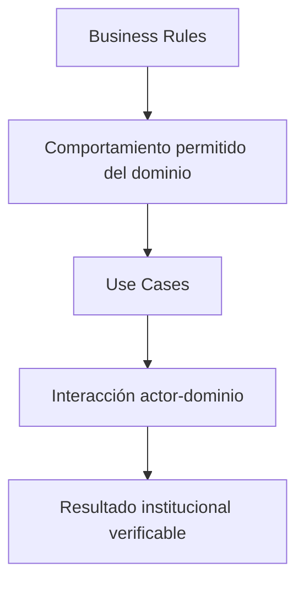

# Casos de Uso del Dominio

## 1. Información del Documento

| Campo | Valor |
|---|---|
| Proyecto | Plataforma de Gestión, Comunicación y Educación para la Salud |
| Cliente | Jurisdicción Sanitaria de Huejutla de Reyes, Hidalgo |
| Documento | Casos de Uso del Dominio |
| Código | DOC-009 |
| Versión | 1.0.0 |
| Estado | Draft |
| Autor | Equipo del Proyecto |
| Rol arquitectónico | Lead Domain Architect, Software Architect & Product Architect |
| Fecha | 2026-07-03 |

## 2. Propósito

Este documento define la especificación oficial de Casos de Uso del dominio para la Plataforma de Gestión, Comunicación y Educación para la Salud.

Su propósito es describir cómo los actores interactúan con el dominio para gestionar el ciclo de vida del Conocimiento Institucional y transformarlo en información oficial, confiable, clara, publicable, distribuible, actualizable y preservable.

La capacidad central que gobierna todos los casos de uso es:

**Publicar información confiable.**

Este documento no describe pantallas, componentes, endpoints, tablas, clases, repositorios, controladores ni flujos técnicos. Describe comportamiento del negocio y resultados institucionales esperados.

## 3. Relación con Business Rules

Los casos de uso definidos en este documento deberán respetar las reglas de negocio establecidas en `docs/02-domain/business-rules.md`.

La relación entre ambos documentos es normativa:

- `business-rules.md` define qué comportamientos protege el dominio.
- `use-cases.md` define cómo los actores interactúan con el dominio respetando esos comportamientos.
- Ningún caso de uso deberá habilitar acciones que contradigan reglas de negocio aprobadas.
- Si un caso de uso requiere una excepción no prevista, la excepción deberá documentarse antes de avanzar a diseño técnico.

## 4. Papel dentro de la Arquitectura Documental

Este documento cierra la Fase 02 - Domain y prepara el paso hacia la Fase 03 - Architecture.

Su papel dentro de la arquitectura documental es:

- traducir el Lenguaje Ubicuo, el Modelo de Dominio y las Reglas de Negocio en interacciones observables;
- establecer el alcance conductual del MVP sin introducir implementación;
- servir como base para `architecture.md`, `database.md` y `api.md`;
- evitar que el diseño técnico reinterprete el negocio;
- proteger la trazabilidad entre actores, capacidades, reglas y resultados institucionales.

## 5. Cómo interpretar un Caso de Uso

Un Caso de Uso describe una interacción entre un actor y el dominio para producir un resultado de negocio.

Un Caso de Uso:

- deberá expresar intención del actor;
- deberá describir comportamiento del dominio;
- deberá respetar el Lenguaje Ubicuo aprobado;
- deberá aplicar reglas de negocio;
- deberá producir un resultado institucional verificable;
- no deberá describir pantallas;
- no deberá describir endpoints;
- no deberá describir base de datos;
- no deberá introducir arquitectura técnica.

## 6. Actores Participantes

Los actores participantes derivan de `personas.md`, `domain.md` y `business-rules.md`.

| Actor | Tipo | Participación en v1.0 |
|---|---|---|
| Ciudadano | Persona primaria | Consulta información oficial, campañas, enfermedades y memoria histórica. |
| Responsable Editorial / Administrador de Plataforma | Actor administrativo operativo unificado | Gestiona publicaciones, recursos, campañas, enfermedades, eventos históricos y preparación para canales. |
| Jurisdicción Sanitaria | Actor organizacional | Asume responsabilidad institucional sobre toda publicación. |
| Profesional de la Salud | Persona secundaria | Aporta, consulta o utiliza conocimiento institucional para orientación pública. |
| Autoridad Sanitaria | Actor institucional / decisor | Puede requerir información publicada, contexto, trazabilidad o acciones institucionales. |
| Estudiante | Persona terciaria | Consulta conocimiento institucional para aprendizaje y comprensión. |
| Investigador | Persona terciaria | Consulta información y memoria institucional con fines de análisis. |
| Medio de Comunicación | Persona secundaria | Consulta información oficial para comunicarla sin sustituir a la fuente institucional. |

En la versión 1.0, el actor administrativo se mantiene unificado como **Responsable Editorial / Administrador de Plataforma**. La separación futura entre Responsable de Publicaciones y Administrador General podrá evaluarse en versiones posteriores, pero no constituye requisito obligatorio del MVP.

## 7. Clasificación de Casos de Uso

Los casos de uso se clasifican por capacidades del dominio, no por módulos técnicos.

| Capacidad del dominio | Casos de uso relacionados |
|---|---|
| Consulta Pública | UC-001, UC-002, UC-003, UC-004, UC-005 |
| Gestión del Conocimiento | UC-007, UC-008, UC-013, UC-017 |
| Validación y Redacción | UC-008, UC-009, UC-010 |
| Publicación | UC-009, UC-011, UC-012 |
| Actualización y Vigencia | UC-010, UC-011, UC-012 |
| Distribución | UC-015 |
| Campañas | UC-003, UC-016 |
| Enfermedades | UC-004, UC-017 |
| Recursos | UC-014 |
| Línea del Tiempo | UC-005, UC-018 |
| Trazabilidad | UC-019 |
| Administración Inicial | UC-006 |

## 8. Formato oficial de Caso de Uso

Cada caso de uso de este documento utiliza la siguiente estructura:

- ID;
- Nombre;
- Actor principal;
- Actores secundarios;
- Propósito;
- Precondiciones;
- Disparador;
- Flujo principal;
- Flujos alternos;
- Reglas de negocio aplicables;
- Resultado esperado;
- Fuera de alcance;
- Observaciones arquitectónicas.

## 9. Casos de Uso Primarios del MVP

### UC-001. Consultar publicación

| Campo | Descripción |
|---|---|
| Actor principal | Ciudadano |
| Actores secundarios | Estudiante, Investigador, Medio de Comunicación, Profesional de la Salud |
| Propósito | Consultar una Publicación disponible para obtener información oficial, clara y confiable. |
| Precondiciones | La Publicación deberá estar publicada o históricamente contextualizada. |
| Disparador | El actor necesita orientación confiable sobre un tema de salud pública o institucional. |

**Flujo principal**

1. El actor expresa una necesidad de consulta pública.
2. El dominio presenta una Publicación disponible para consulta.
3. El actor accede a información redactada para comprensión pública.
4. El dominio conserva el contexto de vigencia, fuente y responsabilidad institucional cuando corresponda.
5. El actor utiliza la información para orientarse, prevenir o comunicar con respaldo oficial.

**Flujos alternos**

- Si la Publicación ya no es vigente, deberá presentarse con contexto histórico claro o no estar disponible para consulta pública.
- Si la información pudiera interpretarse como atención clínica individual, deberá mantenerse dentro de comunicación pública y prevención.

**Reglas de negocio aplicables**

BR-CONP-001, BR-CONP-002, BR-CONP-003, BR-CONP-005, BR-VIG-001, BR-VIG-006, BR-PUB-005.

**Resultado esperado**

El actor consulta información oficial sin confundirla con diagnóstico, consulta médica o atención individual.

**Fuera de alcance**

Diagnóstico, recomendación clínica individual, expediente clínico y consulta médica.

**Observaciones arquitectónicas**

La consulta pública deberá preservar la diferencia entre información vigente e información histórica.

### UC-002. Buscar información publicada

| Campo | Descripción |
|---|---|
| Actor principal | Ciudadano |
| Actores secundarios | Estudiante, Investigador, Medio de Comunicación, Profesional de la Salud |
| Propósito | Localizar información oficial publicada mediante criterios comprensibles para la población. |
| Precondiciones | Deberá existir contenido publicado y correctamente clasificado. |
| Disparador | El actor necesita encontrar información sin conocer previamente una Publicación específica. |

**Flujo principal**

1. El actor formula una necesidad de búsqueda.
2. El dominio localiza Publicaciones publicadas o históricamente contextualizadas.
3. El dominio utiliza clasificación, categorías, etiquetas y contenido comprensible para facilitar resultados.
4. El actor identifica información pertinente.
5. El actor consulta la Publicación correspondiente.

**Flujos alternos**

- Si no existen resultados, el dominio no deberá inventar información ni sustituir validación institucional.
- Si existen resultados históricos, deberán diferenciarse de información vigente cuando sea necesario.

**Reglas de negocio aplicables**

BR-CONP-004, BR-CLA-001, BR-CLA-003, BR-CLA-004, BR-EDI-004, BR-VIG-001.

**Resultado esperado**

El actor encuentra información publicada de forma clara, sin que la búsqueda sustituya el criterio institucional de publicación.

**Fuera de alcance**

Búsqueda semántica avanzada, recomendación automatizada con IA y personalización clínica.

**Observaciones arquitectónicas**

La búsqueda básica depende de clasificación editorial consistente.

### UC-003. Consultar campaña

| Campo | Descripción |
|---|---|
| Actor principal | Ciudadano |
| Actores secundarios | Profesional de la Salud, Medio de Comunicación, Estudiante |
| Propósito | Consultar una Campaña como iniciativa institucional temporal relacionada con prevención, promoción, comunicación o salud pública. |
| Precondiciones | La Campaña deberá existir como iniciativa institucional y tener publicaciones relacionadas cuando aplique. |
| Disparador | El actor busca orientación sobre una campaña vigente o histórica. |

**Flujo principal**

1. El actor consulta una Campaña.
2. El dominio presenta su propósito institucional, contexto y publicaciones relacionadas.
3. El actor identifica mensajes, recursos y acciones de comunicación asociados.
4. El dominio conserva la diferencia entre campaña vigente e histórica.
5. El actor utiliza la información para comprender o difundir mensajes oficiales.

**Flujos alternos**

- Si la Campaña finalizó, sus Publicaciones podrán permanecer disponibles si siguen siendo útiles.
- Si una Publicación asociada requiere contexto histórico, deberá indicarse claramente.

**Reglas de negocio aplicables**

BR-CAM-001, BR-CAM-002, BR-CAM-003, BR-CAM-004, BR-CAM-005, BR-CONP-001.

**Resultado esperado**

El actor comprende la Campaña sin confundirla con una Publicación individual ni con una fuente de verdad independiente.

**Fuera de alcance**

Agenda operativa, medición avanzada de campaña y automatización de redes sociales.

**Observaciones arquitectónicas**

La Campaña organiza publicaciones alrededor de una necesidad institucional temporal.

### UC-004. Consultar enfermedad

| Campo | Descripción |
|---|---|
| Actor principal | Ciudadano |
| Actores secundarios | Estudiante, Investigador, Profesional de la Salud, Medio de Comunicación |
| Propósito | Consultar información pública relacionada con una Enfermedad entendida como concepto temático del dominio. |
| Precondiciones | La Enfermedad deberá estar tratada como concepto temático y no como Publicación simple. |
| Disparador | El actor necesita comprender medidas de prevención, orientación pública o información institucional sobre una enfermedad. |

**Flujo principal**

1. El actor consulta un tema de Enfermedad.
2. El dominio presenta información orientada a prevención, educación y comunicación pública.
3. El dominio relaciona publicaciones, campañas, documentos, infografías, preguntas frecuentes o recursos cuando existan.
4. El actor consulta información respaldada institucionalmente.
5. El actor utiliza el conocimiento para comprensión o prevención.

**Flujos alternos**

- Si la información pudiera interpretarse como diagnóstico individual, deberá limitarse a orientación pública.
- Si existen publicaciones históricas relacionadas, deberán distinguirse de información vigente cuando corresponda.

**Reglas de negocio aplicables**

BR-ENF-001, BR-ENF-002, BR-ENF-003, BR-ENF-004, BR-ENF-005, BR-PUB-005.

**Resultado esperado**

El actor accede a conocimiento temático de salud pública sin recibir diagnóstico ni atención clínica individual.

**Fuera de alcance**

Diagnóstico, tratamiento individual, consulta médica, expediente clínico y seguimiento de pacientes.

**Observaciones arquitectónicas**

Enfermedad es un concepto temático que puede organizar publicaciones y recursos, pero no se reduce a una Publicación.

### UC-005. Consultar línea del tiempo

| Campo | Descripción |
|---|---|
| Actor principal | Ciudadano |
| Actores secundarios | Investigador, Estudiante, Medio de Comunicación, Jurisdicción Sanitaria |
| Propósito | Consultar eventos históricos institucionales relevantes de la Jurisdicción Sanitaria. |
| Precondiciones | Deberán existir eventos con relevancia histórica, institucional o de salud pública. |
| Disparador | El actor necesita comprender memoria institucional o contexto histórico. |

**Flujo principal**

1. El actor consulta la Línea del Tiempo.
2. El dominio presenta eventos históricos institucionales.
3. El dominio diferencia memoria histórica de información vigente cuando sea necesario.
4. El actor consulta contexto, descripción y recursos asociados cuando existan.
5. El actor utiliza la memoria institucional para comprensión, análisis o comunicación.

**Flujos alternos**

- Si un evento no tiene relevancia institucional, no deberá formar parte de la Línea del Tiempo.
- Si un evento se relaciona con una Publicación, la relación deberá aportar contexto.

**Reglas de negocio aplicables**

BR-MEM-001, BR-MEM-002, BR-MEM-003, BR-MEM-004, BR-MEM-005, BR-CONP-005.

**Resultado esperado**

El actor consulta memoria histórica institucional sin convertir la Línea del Tiempo en agenda o bitácora general.

**Fuera de alcance**

Calendario operativo, agenda de eventos, bitácora administrativa y registro general de actividades.

**Observaciones arquitectónicas**

La Línea del Tiempo preserva memoria institucional; no es un repositorio de actividades cotidianas.

### UC-006. Iniciar sesión administrativa

| Campo | Descripción |
|---|---|
| Actor principal | Responsable Editorial / Administrador de Plataforma |
| Actores secundarios | Jurisdicción Sanitaria |
| Propósito | Acceder al espacio administrativo inicial para operar capacidades de gestión institucional. |
| Precondiciones | El actor deberá ser un responsable institucional autorizado para operar el producto. |
| Disparador | El actor necesita administrar conocimiento, publicaciones o recursos. |

**Flujo principal**

1. El actor solicita acceso administrativo.
2. El dominio reconoce la operación como acción administrativa autorizada.
3. El actor queda habilitado para ejecutar capacidades operativas del MVP.
4. El dominio mantiene la separación entre autoría operativa y responsabilidad institucional.

**Flujos alternos**

- Si el actor no está autorizado, no deberá operar capacidades administrativas.
- Si se requiere conocer quién ejecutó una acción, deberá conservarse autoría operativa.

**Reglas de negocio aplicables**

BR-PUB-001, BR-PUB-002, BR-TRA-001, BR-TRA-002.

**Resultado esperado**

El responsable autorizado puede operar el producto sin sustituir la responsabilidad institucional de la Jurisdicción Sanitaria.

**Fuera de alcance**

Roles avanzados, permisos complejos, aprobación multinivel y separación obligatoria de perfiles administrativos.

**Observaciones arquitectónicas**

El MVP mantiene un actor administrativo unificado; el diseño conceptual no deberá impedir separación futura.

### UC-007. Crear publicación

| Campo | Descripción |
|---|---|
| Actor principal | Responsable Editorial / Administrador de Plataforma |
| Actores secundarios | Jurisdicción Sanitaria, Profesional de la Salud |
| Propósito | Crear una Publicación como expresión operativa de información institucional que podrá avanzar hacia validación, redacción y publicación. |
| Precondiciones | Deberá existir conocimiento, fuente o necesidad institucional que justifique la Publicación. |
| Disparador | La Jurisdicción o el responsable identifica información que debe organizarse para consulta pública. |

**Flujo principal**

1. El actor identifica conocimiento institucional, fuente o necesidad de comunicación.
2. El actor inicia una Publicación como expresión operativa del conocimiento.
3. El dominio exige distinguir fuente, origen, propósito y responsabilidad institucional.
4. La Publicación queda preparada para validación, redacción, clasificación y publicación posterior.

**Flujos alternos**

- Si no existe respaldo institucional suficiente, la Publicación no deberá avanzar a publicación pública.
- Si el conocimiento ya existe, deberá evitarse duplicación conceptual innecesaria.

**Reglas de negocio aplicables**

BR-FUN-001, BR-FUN-002, BR-CON-001, BR-CON-004, BR-CON-005, BR-PUB-003.

**Resultado esperado**

Se crea una Publicación como pieza institucional trazable, no como contenido aislado sin respaldo.

**Fuera de alcance**

Generación automática de contenido sin supervisión institucional y versionado avanzado.

**Observaciones arquitectónicas**

Crear una Publicación no equivale a publicarla; antes deberá pasar por el comportamiento protegido del dominio.

### UC-008. Preparar información para publicación

| Campo | Descripción |
|---|---|
| Actor principal | Responsable Editorial / Administrador de Plataforma |
| Actores secundarios | Profesional de la Salud, Jurisdicción Sanitaria |
| Propósito | Transformar conocimiento validable en información redactada, clara y apta para publicación pública. |
| Precondiciones | La información deberá tener origen identificable y propósito institucional. |
| Disparador | Existe conocimiento que necesita redactarse para la población. |

**Flujo principal**

1. El actor identifica el origen del conocimiento.
2. El dominio diferencia si proviene de fuente externa oficial, fuente interna o generación propia.
3. El actor prepara redacción comprensible para población general.
4. El dominio preserva el significado de la información validada.
5. La información queda preparada para publicación confiable.

**Flujos alternos**

- Si la información proviene de fuente oficial externa, se valida autenticidad, vigencia y pertinencia.
- Si la información es generada por la Jurisdicción, requiere validación institucional completa.
- Si la redacción introduce afirmaciones sin respaldo, no deberá avanzar.

**Reglas de negocio aplicables**

BR-CON-001, BR-CON-002, BR-CON-003, BR-VAL-001, BR-VAL-002, BR-VAL-004, BR-EDI-001, BR-EDI-002, BR-EDI-003.

**Resultado esperado**

La información queda redactada con claridad y respaldo institucional para avanzar hacia publicación.

**Fuera de alcance**

Producción automatizada sin revisión, diagnóstico y aprobación editorial multinivel avanzada.

**Observaciones arquitectónicas**

Este caso separa Validación y Redacción como etapas distintas del flujo oficial.

### UC-009. Publicar información confiable

| Campo | Descripción |
|---|---|
| Actor principal | Responsable Editorial / Administrador de Plataforma |
| Actores secundarios | Jurisdicción Sanitaria |
| Propósito | Hacer disponible una Publicación para consulta pública con responsabilidad institucional, trazabilidad y claridad. |
| Precondiciones | La información deberá estar validada, redactada, clasificada y respaldada institucionalmente. |
| Disparador | La Publicación está lista para ponerse a disposición de la población. |

**Flujo principal**

1. El actor verifica que la Publicación proviene de información validada y redactada.
2. El dominio confirma responsabilidad institucional de la Jurisdicción Sanitaria.
3. El dominio conserva trazabilidad mínima.
4. El actor publica la información para consulta pública.
5. La población puede consultar la Publicación como información oficial.

**Flujos alternos**

- Si falta fuente, vigencia, pertinencia, clasificación o trazabilidad mínima, la Publicación no deberá estar disponible públicamente.
- Si el contenido se presenta como diagnóstico o consulta médica, no deberá publicarse en esos términos.

**Reglas de negocio aplicables**

BR-POL-001, BR-PUB-001, BR-PUB-002, BR-PUB-003, BR-PUB-004, BR-PUB-005, BR-VAL-005, BR-TRA-001.

**Resultado esperado**

La Publicación queda disponible como información oficial confiable de la Jurisdicción Sanitaria.

**Fuera de alcance**

Publicación automática sin supervisión institucional, publicación programada avanzada y flujos editoriales multinivel.

**Observaciones arquitectónicas**

Este es el caso de uso central del MVP.

### UC-010. Actualizar publicación

| Campo | Descripción |
|---|---|
| Actor principal | Responsable Editorial / Administrador de Plataforma |
| Actores secundarios | Jurisdicción Sanitaria, Profesional de la Salud |
| Propósito | Mantener una Publicación clara, vigente, pertinente y confiable. |
| Precondiciones | La Publicación existe y requiere ajuste por claridad, vigencia, pertinencia o confiabilidad. |
| Disparador | Se identifica cambio de información, corrección, mejora editorial o necesidad de actualización. |

**Flujo principal**

1. El actor identifica la necesidad de actualización.
2. El dominio evalúa si la Publicación requiere cambio por vigencia, claridad, pertinencia o confiabilidad.
3. El actor actualiza la información preservando significado y responsabilidad institucional.
4. El dominio conserva trazabilidad de autoría operativa y responsabilidad institucional.
5. Cuando sea pertinente, se evalúa nueva distribución por canales.

**Flujos alternos**

- Si la actualización cambia información relevante para la población, deberá evaluarse distribución.
- Si la Publicación ya no puede sostenerse, podrá requerir retiro de consulta pública.

**Reglas de negocio aplicables**

BR-ACT-001, BR-ACT-002, BR-ACT-003, BR-ACT-004, BR-ACT-005, BR-VIG-001, BR-TRA-004.

**Resultado esperado**

La Publicación se mantiene útil y confiable sin perder trazabilidad ni memoria institucional.

**Fuera de alcance**

Versionado avanzado, historial editorial detallado y automatización de republicación.

**Observaciones arquitectónicas**

Actualizar no equivale a versionado avanzado dentro del MVP.

### UC-011. Retirar publicación de consulta pública

| Campo | Descripción |
|---|---|
| Actor principal | Responsable Editorial / Administrador de Plataforma |
| Actores secundarios | Jurisdicción Sanitaria, Autoridad Sanitaria |
| Propósito | Retirar de consulta pública una Publicación cuando su permanencia afecte confiabilidad, pertinencia o seguridad informativa. |
| Precondiciones | La Publicación existe y está disponible para consulta pública. |
| Disparador | Se detecta error, pérdida de confiabilidad o falta de pertinencia para consulta pública. |

**Flujo principal**

1. El actor identifica motivo institucional para retiro.
2. El dominio valida que el retiro responde a error, confiabilidad comprometida o falta de pertinencia.
3. El actor retira la Publicación de consulta pública.
4. El dominio conserva trazabilidad y memoria institucional.
5. La Publicación deja de estar disponible para consulta pública.

**Flujos alternos**

- Si la Publicación todavía es útil como contexto histórico, podrá conservarse con contexto claro.
- Si el retiro es por error que afecta a población, deberá priorizarse protección de confiabilidad pública.

**Reglas de negocio aplicables**

BR-POL-002, BR-VIG-002, BR-VIG-003, BR-VIG-004, BR-VIG-005, BR-TRA-003, BR-MEM-005.

**Resultado esperado**

La información inapropiada para consulta pública se retira sin borrar trazabilidad ni memoria institucional.

**Fuera de alcance**

Borrado físico como comportamiento funcional, flujos legales especializados y versionado avanzado.

**Observaciones arquitectónicas**

Retirar no significa perder memoria institucional.

### UC-012. Archivar publicación

| Campo | Descripción |
|---|---|
| Actor principal | Responsable Editorial / Administrador de Plataforma |
| Actores secundarios | Jurisdicción Sanitaria |
| Propósito | Preservar una Publicación que ya no opera como información vigente pero conserva valor institucional, histórico o documental. |
| Precondiciones | La Publicación existe y se determina que debe conservarse con contexto. |
| Disparador | La Publicación pierde vigencia operativa o deja de ser prioritaria para consulta pública vigente. |

**Flujo principal**

1. El actor identifica una Publicación candidata a archivo.
2. El dominio evalúa su valor de memoria institucional o contexto histórico.
3. El actor marca su condición como archivada o históricamente contextualizada.
4. El dominio conserva trazabilidad, fuente y responsabilidad institucional.
5. La Publicación queda preservada sin presentarse como información vigente.

**Flujos alternos**

- Si la Publicación sigue siendo útil para población, podrá mantenerse disponible con contexto.
- Si la Publicación contiene error que compromete confianza, deberá retirarse de consulta pública antes de considerarse archivo.

**Reglas de negocio aplicables**

BR-VIG-005, BR-VIG-006, BR-TRA-001, BR-TRA-003, BR-MEM-005, BR-ACT-005.

**Resultado esperado**

La memoria institucional se preserva sin confundir información histórica con información vigente.

**Fuera de alcance**

Sistema de archivo documental avanzado y versionado histórico detallado.

**Observaciones arquitectónicas**

El archivo protege memoria institucional; no debe utilizarse como sustituto del retiro cuando existe riesgo de confiabilidad.

### UC-013. Clasificar publicación

| Campo | Descripción |
|---|---|
| Actor principal | Responsable Editorial / Administrador de Plataforma |
| Actores secundarios | Jurisdicción Sanitaria |
| Propósito | Organizar una Publicación con criterios comprensibles para búsqueda, navegación, comprensión y reutilización. |
| Precondiciones | Existe una Publicación en preparación o actualización. |
| Disparador | La Publicación requiere tipo, categoría, etiquetas o relaciones semánticas. |

**Flujo principal**

1. El actor identifica la forma comunicativa de la Publicación.
2. El actor asigna criterios de clasificación comprensibles.
3. El dominio relaciona la Publicación con campañas, enfermedades o recursos cuando corresponda.
4. La clasificación mejora consulta pública, búsqueda y organización editorial.

**Flujos alternos**

- Si una clasificación responde solo a conveniencia técnica, no deberá considerarse criterio de dominio.
- Si la Publicación pertenece a una Campaña o trata una Enfermedad, la relación deberá mantenerse comprensible.

**Reglas de negocio aplicables**

BR-CLA-001, BR-CLA-002, BR-CLA-003, BR-CLA-004, BR-CLA-005, BR-EDI-004.

**Resultado esperado**

La Publicación queda organizada para consulta pública y preservación institucional.

**Fuera de alcance**

Taxonomía técnica cerrada, clasificación automática avanzada y búsqueda semántica.

**Observaciones arquitectónicas**

La clasificación pertenece al lenguaje del dominio, no a conveniencia de implementación.

### UC-014. Asociar recurso a publicación

| Campo | Descripción |
|---|---|
| Actor principal | Responsable Editorial / Administrador de Plataforma |
| Actores secundarios | Jurisdicción Sanitaria, Profesional de la Salud |
| Propósito | Asociar recursos visuales o documentales que apoyen comprensión, consulta o distribución de una Publicación. |
| Precondiciones | Existe una Publicación y un recurso pertinente. |
| Disparador | La Publicación requiere imagen, documento, infografía, enlace o material asociado para mejorar comprensión. |

**Flujo principal**

1. El actor identifica un recurso pertinente.
2. El dominio verifica que el recurso apoye comprensión, consulta o distribución.
3. El actor asocia el recurso a la Publicación.
4. El dominio conserva identificación de fuente cuando sea relevante.
5. El recurso queda disponible como apoyo de la información oficial.

**Flujos alternos**

- Si el recurso proviene de fuente externa, deberá conservarse identificación de fuente cuando sea relevante.
- Si el recurso sustituye información oficial en lugar de apoyarla, no deberá usarse como único respaldo.

**Reglas de negocio aplicables**

BR-REC-001, BR-REC-002, BR-REC-003, BR-REC-004, BR-REC-005, BR-TRA-005.

**Resultado esperado**

La Publicación mejora su claridad sin convertir los recursos en fuente de verdad independiente.

**Fuera de alcance**

Gestor documental avanzado, repositorio multimedia complejo y edición profesional de activos digitales.

**Observaciones arquitectónicas**

La gestión multimedia del MVP es básica y orientada a comunicación pública.

### UC-015. Preparar publicación para canales

| Campo | Descripción |
|---|---|
| Actor principal | Responsable Editorial / Administrador de Plataforma |
| Actores secundarios | Jurisdicción Sanitaria, Medio de Comunicación |
| Propósito | Preparar una Publicación para su distribución en canales de comunicación sin convertir los canales en fuente oficial. |
| Precondiciones | La Publicación deberá estar publicada o preparada institucionalmente. |
| Disparador | Se requiere compartir información oficial por canales relevantes para la población. |

**Flujo principal**

1. El actor selecciona una Publicación publicada o preparada institucionalmente.
2. El dominio prepara información para distribución conservando título, sentido, fuente, enlace y responsabilidad institucional.
3. El actor elige canales de comunicación pertinentes.
4. El dominio asegura que la distribución no modifique el sentido de la Publicación.
5. La información queda lista para publicación manual asistida o flujo preparado.

**Flujos alternos**

- Si un canal exige adaptación de formato, deberá preservarse claridad y responsabilidad institucional.
- Si un canal externo no está disponible, el conocimiento institucional deberá seguir disponible en el Portal Público.

**Reglas de negocio aplicables**

BR-DIS-001, BR-DIS-002, BR-DIS-003, BR-DIS-004, BR-DIS-005, BR-FUN-005.

**Resultado esperado**

La Publicación puede distribuirse por canales sin depender de ellos como fuente de verdad.

**Fuera de alcance**

Publicación programada, métricas de redes sociales, republicación avanzada, reintentos automáticos e integración completa con APIs externas.

**Observaciones arquitectónicas**

Los canales son reemplazables y desacoplados del conocimiento institucional.

### UC-016. Gestionar campaña

| Campo | Descripción |
|---|---|
| Actor principal | Responsable Editorial / Administrador de Plataforma |
| Actores secundarios | Jurisdicción Sanitaria, Profesional de la Salud, Autoridad Sanitaria |
| Propósito | Gestionar una Campaña como iniciativa institucional temporal que organiza publicaciones alrededor de una necesidad de salud pública. |
| Precondiciones | Existe una necesidad institucional de prevención, promoción, comunicación o salud pública. |
| Disparador | La Jurisdicción define o actualiza una Campaña. |

**Flujo principal**

1. El actor identifica la necesidad institucional que justifica la Campaña.
2. El dominio registra la Campaña como iniciativa temporal, no como Publicación individual.
3. El actor relaciona publicaciones pertinentes.
4. El dominio conserva responsabilidad institucional por cada Publicación asociada.
5. La Campaña queda disponible para consulta o gestión según su estado y contexto.

**Flujos alternos**

- Si la Campaña finaliza, sus Publicaciones podrán permanecer disponibles si siguen siendo útiles.
- Si la Campaña pierde contexto, deberá indicarse su condición histórica cuando corresponda.

**Reglas de negocio aplicables**

BR-CAM-001, BR-CAM-002, BR-CAM-003, BR-CAM-004, BR-CAM-005, BR-VIG-006.

**Resultado esperado**

La Campaña organiza conocimiento institucional temporal sin sustituir publicaciones ni responsabilidad institucional.

**Fuera de alcance**

Automatización avanzada de campañas, métricas, segmentación publicitaria y planificación multicanal compleja.

**Observaciones arquitectónicas**

La Campaña no es un agrupador técnico; es una iniciativa institucional con propósito.

### UC-017. Gestionar enfermedad como concepto temático

| Campo | Descripción |
|---|---|
| Actor principal | Responsable Editorial / Administrador de Plataforma |
| Actores secundarios | Profesional de la Salud, Jurisdicción Sanitaria |
| Propósito | Gestionar una Enfermedad como concepto temático que organiza conocimiento de salud pública. |
| Precondiciones | Existe necesidad de organizar información pública relacionada con una enfermedad. |
| Disparador | Se requiere estructurar publicaciones, campañas, documentos, infografías o preguntas frecuentes alrededor de una Enfermedad. |

**Flujo principal**

1. El actor identifica una Enfermedad como tema de salud pública.
2. El dominio la trata como concepto temático, no como Publicación simple.
3. El actor relaciona publicaciones, campañas, recursos o preguntas frecuentes pertinentes.
4. El dominio mantiene orientación a prevención, educación y comunicación pública.
5. El concepto temático queda disponible para organización y consulta pública.

**Flujos alternos**

- Si la información deriva en diagnóstico individual, deberá excluirse de la comunicación pública.
- Si existen materiales relacionados, deberán conservar respaldo y responsabilidad institucional.

**Reglas de negocio aplicables**

BR-ENF-001, BR-ENF-002, BR-ENF-003, BR-ENF-004, BR-ENF-005, BR-PUB-005.

**Resultado esperado**

La Enfermedad organiza conocimiento público sin convertirse en expediente clínico, diagnóstico o Publicación aislada.

**Fuera de alcance**

Registro de pacientes, seguimiento clínico, tratamiento individual, diagnóstico y sistema hospitalario.

**Observaciones arquitectónicas**

Este caso de uso protegerá el futuro modelo de dominio contra reducciones editoriales incorrectas.

### UC-018. Gestionar evento histórico institucional

| Campo | Descripción |
|---|---|
| Actor principal | Responsable Editorial / Administrador de Plataforma |
| Actores secundarios | Jurisdicción Sanitaria, Investigador, Medio de Comunicación |
| Propósito | Gestionar eventos históricos institucionales que preserven memoria de la Jurisdicción Sanitaria. |
| Precondiciones | El evento deberá tener relevancia histórica, institucional o de salud pública. |
| Disparador | Se identifica un evento que debe formar parte de la memoria institucional. |

**Flujo principal**

1. El actor identifica un evento con valor histórico institucional.
2. El dominio evalúa que no sea agenda, calendario operativo ni bitácora general.
3. El actor documenta el evento con contexto y recursos cuando existan.
4. El dominio permite relacionarlo con Publicaciones o Recursos cuando aporte contexto.
5. El evento queda disponible como parte de la Línea del Tiempo.

**Flujos alternos**

- Si el evento no tiene relevancia institucional, no deberá integrarse a la Línea del Tiempo.
- Si el evento contiene información histórica, no deberá presentarse como información vigente.

**Reglas de negocio aplicables**

BR-MEM-001, BR-MEM-002, BR-MEM-003, BR-MEM-004, BR-MEM-005.

**Resultado esperado**

La Línea del Tiempo conserva memoria histórica institucional clara, útil y diferenciada de actividades generales.

**Fuera de alcance**

Agenda institucional, calendario administrativo, bitácora operativa y registro general de actividades.

**Observaciones arquitectónicas**

La memoria institucional forma parte del valor del producto, pero tiene frontera explícita.

### UC-019. Consultar trazabilidad

| Campo | Descripción |
|---|---|
| Actor principal | Responsable Editorial / Administrador de Plataforma |
| Actores secundarios | Jurisdicción Sanitaria, Autoridad Sanitaria |
| Propósito | Consultar origen, validación, responsabilidad institucional, autoría operativa y relaciones relevantes de una Publicación. |
| Precondiciones | La Publicación o elemento institucional deberá conservar trazabilidad mínima. |
| Disparador | Se requiere justificar, auditar, actualizar, retirar o contextualizar información institucional. |

**Flujo principal**

1. El actor solicita revisar la trazabilidad de una Publicación.
2. El dominio presenta fuente, validación, responsabilidad institucional y autoría operativa.
3. El dominio muestra relaciones con campañas, enfermedades, recursos o eventos históricos cuando existan.
4. El actor utiliza la trazabilidad para tomar una decisión institucional.
5. La responsabilidad institucional permanece separada de la autoría operativa.

**Flujos alternos**

- Si falta trazabilidad mínima, la Publicación no deberá avanzar a disponibilidad pública.
- Si una Publicación fue retirada, su trazabilidad deberá seguir preservada.

**Reglas de negocio aplicables**

BR-TRA-001, BR-TRA-002, BR-TRA-003, BR-TRA-004, BR-TRA-005, BR-PUB-001, BR-PUB-002.

**Resultado esperado**

La Jurisdicción puede sostener institucionalmente el origen, cambios y relaciones de la información publicada.

**Fuera de alcance**

Auditoría técnica avanzada, bitácoras de seguridad detalladas y versionado editorial completo.

**Observaciones arquitectónicas**

La trazabilidad es una capacidad transversal que condicionará decisiones posteriores de arquitectura, persistencia y API.

## 10. Casos de Uso Secundarios o de Evolución Futura

Los siguientes casos no pertenecen al alcance obligatorio de la versión 1.0. Se documentan para preservar dirección evolutiva sin comprometer el MVP.

| ID | Nombre | Estado frente a v1.0 | Justificación |
|---|---|---|---|
| UC-FUT-001 | Separar roles administrativos | Evolución futura | El MVP opera con Responsable Editorial / Administrador de Plataforma unificado. |
| UC-FUT-002 | Gestionar aprobación editorial multinivel | Evolución futura | Primero debe validarse el flujo básico de publicación confiable. |
| UC-FUT-003 | Programar publicación en canales | Evolución futura | Requiere capacidades de calendario, cola y dependencia de canales externos. |
| UC-FUT-004 | Consultar chatbot RAG | Evolución futura | Depende de repositorio confiable de conocimiento institucional. |
| UC-FUT-005 | Realizar búsqueda semántica | Evolución futura | Depende de contenido clasificado, corpus validado y criterios de recuperación. |
| UC-FUT-006 | Consultar analítica avanzada | Evolución futura | No es necesaria para entregar valor temprano de publicación confiable. |
| UC-FUT-007 | Integrar publicación automática completa con redes sociales | Evolución futura | Depende de APIs externas y no debe comprometer el MVP. |
| UC-FUT-008 | Gestionar versionado avanzado | Evolución futura | El MVP requiere trazabilidad mínima, no historial editorial completo. |

## 11. Matriz Persona - Caso de Uso

| Persona / Actor | Casos de uso principales |
|---|---|
| Ciudadano | UC-001, UC-002, UC-003, UC-004, UC-005 |
| Responsable Editorial / Administrador de Plataforma | UC-006, UC-007, UC-008, UC-009, UC-010, UC-011, UC-012, UC-013, UC-014, UC-015, UC-016, UC-017, UC-018, UC-019 |
| Jurisdicción Sanitaria | UC-007, UC-008, UC-009, UC-010, UC-011, UC-012, UC-016, UC-018, UC-019 |
| Profesional de la Salud | UC-001, UC-003, UC-004, UC-007, UC-008, UC-010, UC-016, UC-017 |
| Autoridad Sanitaria | UC-011, UC-016, UC-019 |
| Estudiante | UC-001, UC-002, UC-003, UC-004, UC-005 |
| Investigador | UC-001, UC-002, UC-004, UC-005, UC-018 |
| Medio de Comunicación | UC-001, UC-002, UC-003, UC-004, UC-005, UC-015, UC-018 |

## 12. Matriz Caso de Uso - Reglas de Negocio

| Caso de uso | Reglas relevantes |
|---|---|
| UC-001 | BR-CONP-001, BR-CONP-002, BR-CONP-003, BR-CONP-005, BR-VIG-001, BR-PUB-005 |
| UC-002 | BR-CONP-004, BR-CLA-001, BR-CLA-003, BR-CLA-004, BR-EDI-004 |
| UC-003 | BR-CAM-001, BR-CAM-002, BR-CAM-003, BR-CAM-004, BR-CAM-005 |
| UC-004 | BR-ENF-001, BR-ENF-002, BR-ENF-003, BR-ENF-004, BR-ENF-005 |
| UC-005 | BR-MEM-001, BR-MEM-002, BR-MEM-003, BR-MEM-004, BR-MEM-005 |
| UC-006 | BR-PUB-001, BR-PUB-002, BR-TRA-001, BR-TRA-002 |
| UC-007 | BR-FUN-001, BR-FUN-002, BR-CON-001, BR-CON-004, BR-CON-005 |
| UC-008 | BR-CON-001, BR-CON-002, BR-CON-003, BR-VAL-001, BR-VAL-002, BR-VAL-004, BR-EDI-001, BR-EDI-002, BR-EDI-003 |
| UC-009 | BR-POL-001, BR-PUB-001, BR-PUB-002, BR-PUB-003, BR-PUB-004, BR-PUB-005, BR-VAL-005 |
| UC-010 | BR-ACT-001, BR-ACT-002, BR-ACT-003, BR-ACT-004, BR-ACT-005, BR-TRA-004 |
| UC-011 | BR-POL-002, BR-VIG-002, BR-VIG-003, BR-VIG-004, BR-VIG-005, BR-TRA-003 |
| UC-012 | BR-VIG-005, BR-VIG-006, BR-TRA-001, BR-MEM-005, BR-ACT-005 |
| UC-013 | BR-CLA-001, BR-CLA-002, BR-CLA-003, BR-CLA-004, BR-CLA-005 |
| UC-014 | BR-REC-001, BR-REC-002, BR-REC-003, BR-REC-004, BR-REC-005 |
| UC-015 | BR-DIS-001, BR-DIS-002, BR-DIS-003, BR-DIS-004, BR-DIS-005 |
| UC-016 | BR-CAM-001, BR-CAM-002, BR-CAM-003, BR-CAM-004, BR-CAM-005 |
| UC-017 | BR-ENF-001, BR-ENF-002, BR-ENF-003, BR-ENF-004, BR-ENF-005 |
| UC-018 | BR-MEM-001, BR-MEM-002, BR-MEM-003, BR-MEM-004, BR-MEM-005 |
| UC-019 | BR-TRA-001, BR-TRA-002, BR-TRA-003, BR-TRA-004, BR-TRA-005 |

## 13. Matriz Caso de Uso - Alcance MVP

| Caso de uso | Estado en v1.0 | Comentario |
|---|---|---|
| UC-001 | Incluido en MVP | Consulta pública de publicaciones. |
| UC-002 | Incluido en MVP | Búsqueda básica de información publicada. |
| UC-003 | Incluido en MVP | Consulta de campañas. |
| UC-004 | Incluido en MVP | Consulta de enfermedades como conceptos temáticos. |
| UC-005 | Incluido en MVP | Línea del Tiempo pública. |
| UC-006 | Incluido en MVP | Administración inicial mediante acceso autenticado. |
| UC-007 | Incluido en MVP | Gestión central de publicaciones. |
| UC-008 | Incluido en MVP | Preparación editorial e institucional de información. |
| UC-009 | Incluido en MVP | Capacidad central del producto. |
| UC-010 | Incluido en MVP | Actualización básica sin versionado avanzado. |
| UC-011 | Incluido en MVP | Retiro de consulta pública con trazabilidad. |
| UC-012 | Incluido en MVP | Archivo y contexto histórico básico. |
| UC-013 | Incluido en MVP | Clasificación mediante tipo, categorías, etiquetas y relaciones pertinentes. |
| UC-014 | Incluido en MVP | Gestión multimedia básica asociada a publicaciones. |
| UC-015 | Parcialmente incluido | Preparación o publicación manual asistida; sin integración automática avanzada. |
| UC-016 | Incluido en MVP | Gestión de campañas como iniciativas institucionales. |
| UC-017 | Incluido en MVP | Gestión conceptual de enfermedades para organización de conocimiento. |
| UC-018 | Incluido en MVP | Gestión de eventos históricos institucionales. |
| UC-019 | Incluido en MVP | Trazabilidad mínima necesaria para responsabilidad institucional. |
| UC-FUT-001 a UC-FUT-008 | Evolución futura | Fuera del alcance de v1.0. |

## 14. Preparación para Architecture

Los casos de uso dejan las siguientes implicaciones conceptuales para `architecture.md`:

- la arquitectura deberá proteger el flujo Fuente -> Validación -> Redacción -> Publicación;
- la responsabilidad institucional deberá separarse de la autoría operativa;
- la consulta pública deberá operar sobre información publicada o históricamente contextualizada;
- los canales deberán mantenerse desacoplados de la fuente de verdad;
- las campañas, enfermedades, recursos y eventos históricos deberán relacionarse con publicaciones sin convertirse en sistemas aislados;
- la administración inicial deberá permitir operación institucional sin imponer roles avanzados en el MVP;
- la trazabilidad deberá considerarse transversal a publicación, actualización, retiro, archivo y distribución.

Estas implicaciones no definen componentes técnicos. Solo establecen restricciones de comportamiento que la arquitectura deberá respetar.

## 15. Preparación para Database

Los casos de uso indican que en documentos posteriores deberá preservarse información conceptual sobre:

- origen del conocimiento;
- fuente interna o externa;
- validación;
- redacción;
- responsabilidad institucional;
- autoría operativa;
- estado de publicación;
- vigencia o contexto histórico;
- clasificación;
- recursos asociados;
- campañas relacionadas;
- enfermedades relacionadas;
- eventos históricos institucionales;
- preparación para canales;
- trazabilidad mínima.

Esta sección no diseña tablas, relaciones físicas ni modelo de persistencia.

## 16. Preparación para API

Los casos de uso indican que en documentos posteriores deberán exponerse comportamientos relacionados con:

- consulta pública de información publicada;
- búsqueda básica;
- administración inicial;
- gestión de publicaciones;
- preparación, publicación, actualización, retiro y archivo;
- clasificación;
- asociación de recursos;
- preparación para canales;
- gestión de campañas;
- gestión de enfermedades como conceptos temáticos;
- gestión de Línea del Tiempo;
- consulta de trazabilidad.

Esta sección no define endpoints, rutas, contratos, DTOs ni controladores.

## 17. Riesgos Arquitectónicos

| Riesgo | Impacto | Mitigación desde casos de uso |
|---|---|---|
| Convertir los casos de uso en pantallas | La arquitectura quedaría condicionada por interfaz y no por dominio. | Mantenerlos como interacciones actor-dominio. |
| Publicar sin validación | Pérdida de confianza pública e institucional. | UC-008 y UC-009 separan validación, redacción y publicación. |
| Confundir autoría operativa con responsabilidad institucional | Dilución de responsabilidad oficial. | UC-006, UC-009 y UC-019 separan ambos conceptos. |
| Tratar canales como fuente de verdad | Dependencia de redes sociales y pérdida de control institucional. | UC-015 protege distribución desacoplada. |
| Convertir Enfermedad en publicación simple | Pérdida de organización temática y riesgo clínico. | UC-004 y UC-017 protegen su naturaleza conceptual. |
| Convertir Línea del Tiempo en agenda | Ruido documental y pérdida de memoria histórica. | UC-005 y UC-018 limitan su alcance. |
| Implementar IA antes de consolidar conocimiento | Respuestas no confiables y alucinaciones. | UC-FUT-004 queda fuera de v1.0. |
| Sobrepasar el MVP con roles complejos | Riesgo de retraso y sobreingeniería. | UC-006 mantiene actor administrativo unificado. |
| Perder trazabilidad en actualización o retiro | Imposibilidad de justificar decisiones institucionales. | UC-010, UC-011, UC-012 y UC-019 protegen trazabilidad. |

## 18. Autoevaluación

| Criterio | Resultado |
|---|---|
| Coherencia con Foundation | Cumple. No contradice Project Charter ni Architecture Guide. |
| Coherencia con Product | Cumple. Mantiene la capacidad central de publicar información confiable. |
| Coherencia con Ubiquitous Language | Cumple. Usa Publicación, Content, Fuente, Validación, Redacción, Campaña, Enfermedad, Canal y Línea del Tiempo según baseline. |
| Coherencia con Domain | Cumple. Respeta conocimiento institucional como activo principal. |
| Coherencia con Business Rules | Cumple. Cada caso de uso referencia reglas aplicables. |
| Ausencia de implementación técnica | Cumple. No define endpoints, tablas, clases, DTOs ni arquitectura técnica. |
| Cobertura del alcance MVP | Cumple. Cubre consulta pública, CMS conceptual, Línea del Tiempo, recursos, administración inicial y canales parcialmente incluidos. |
| Respeto de exclusiones | Cumple. Mantiene fuera IA funcional, roles avanzados, publicación programada, analítica avanzada y sistemas clínicos. |

## 19. Observaciones Arquitectónicas para la siguiente fase

No se detectan contradicciones con `ubiquitous-language.md`, `domain.md` o `business-rules.md`.

Observaciones para `architecture.md`:

- La arquitectura deberá representar explícitamente el flujo Fuente -> Validación -> Redacción -> Publicación sin convertirlo en una secuencia rígida de pantallas.
- La trazabilidad mínima deberá diseñarse como preocupación transversal.
- El actor administrativo unificado deberá implementarse sin impedir separación futura de responsabilidades.
- La preparación para canales deberá mantenerse desacoplada de redes sociales específicas.
- La consulta pública deberá diferenciar información vigente, retirada, archivada e histórica cuando sea necesario.
- La arquitectura no deberá cruzar hacia sistemas clínicos, expediente médico, citas, farmacia, inventarios o diagnóstico.

Revisión de casos críticos del MVP:

- No se identifican casos críticos faltantes dentro del alcance aprobado.
- La publicación manual asistida a canales queda cubierta como capacidad parcial mediante UC-015.
- La gestión básica de configuración del sitio no se modela como caso de uso primario independiente porque su detalle pertenece a alcance administrativo del MVP y no modifica el comportamiento central del dominio; podrá tratarse en arquitectura funcional sin ampliar dominio.

## 20. Estado del Documento

Estado: Baseline.

Este documento queda preparado para revisión arquitectónica y para servir como cierre documental de la Fase 02 - Domain antes de iniciar `docs/03-architecture/architecture.md`.
