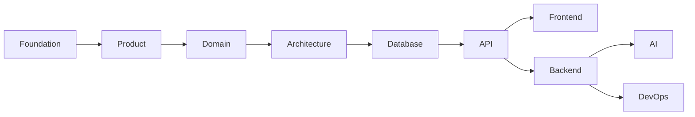
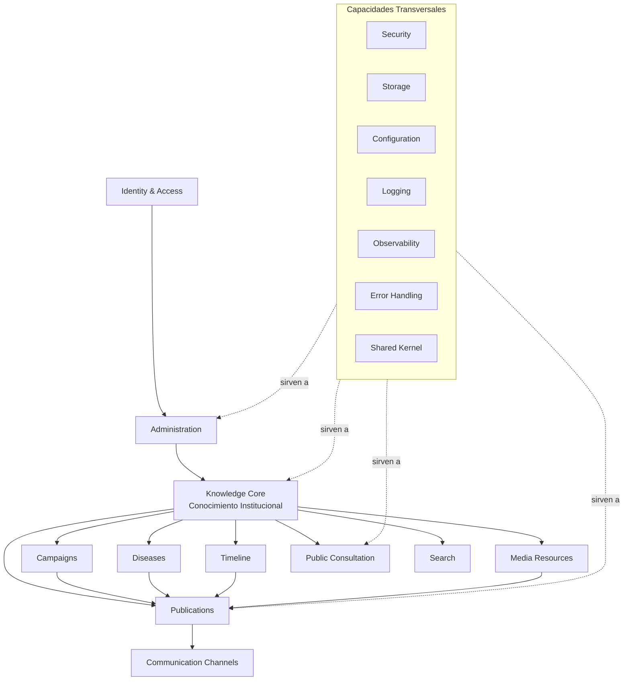
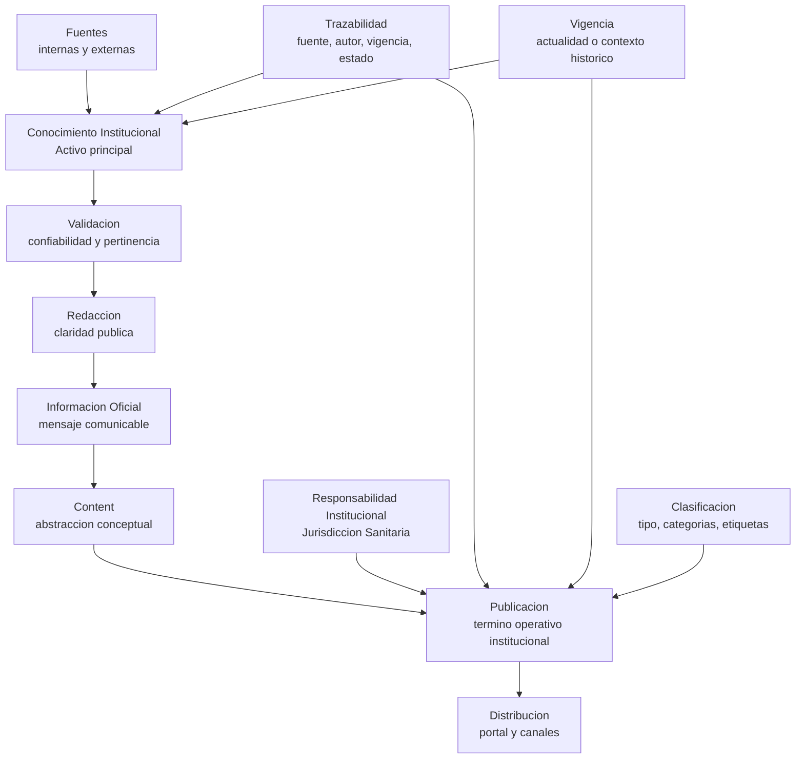
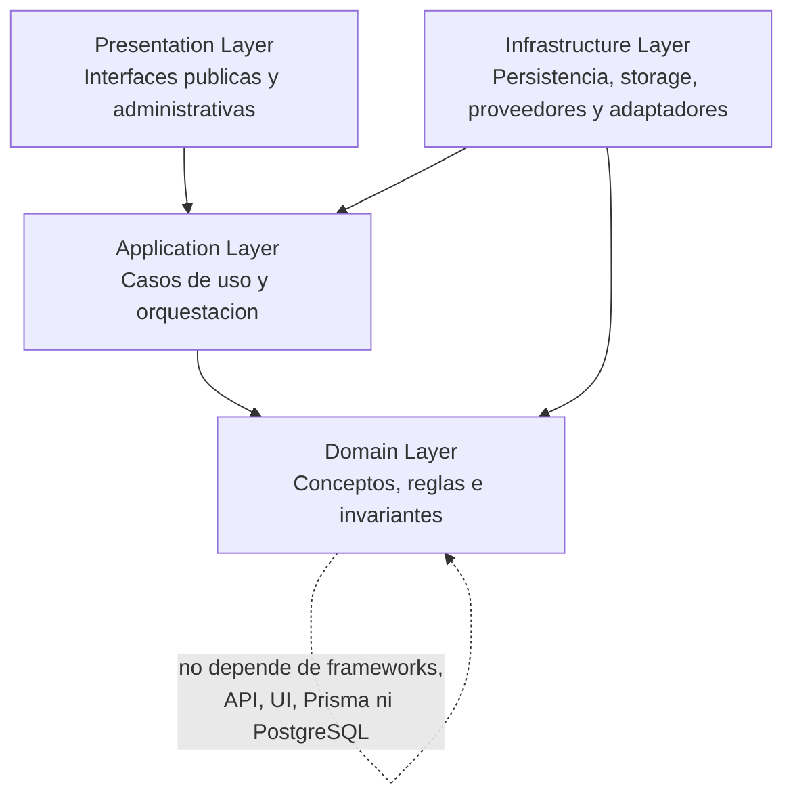
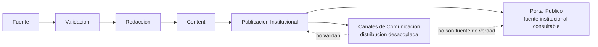
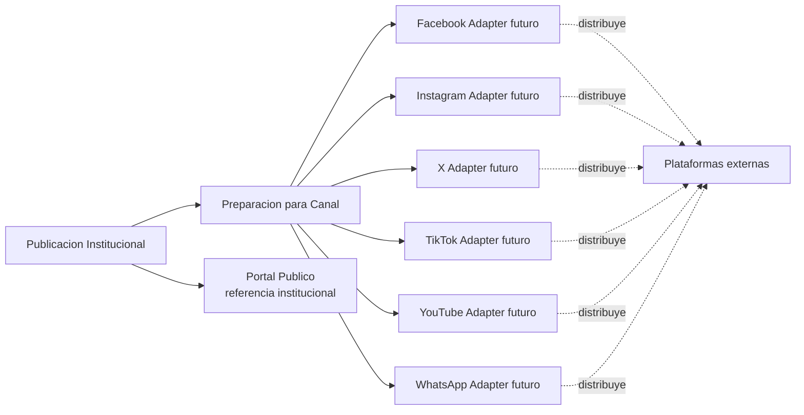

# Arquitectura del Sistema

| Campo | Valor |
|-------|-------|
| Proyecto | Plataforma de Gestion, Comunicacion y Educacion para la Salud |
| Cliente | Jurisdiccion Sanitaria de Huejutla de Reyes, Hidalgo |
| Documento | Arquitectura del Sistema |
| Codigo | DOC-010 |
| Version | 1.0.0 |
| Estado | Draft |
| Fase | Phase 03 - Architecture |
| Autor | Equipo del Proyecto |
| Rol arquitectonico | Lead Software Architect, Solution Architect & Domain Architect |
| Fecha | 2026-07-03 |

---

## 1. Informacion del Documento

Este documento pertenece a la **Fase 03 - Architecture** del proyecto.

Su alcance es definir la arquitectura tecnica formal que debera guiar las fases posteriores del sistema, sin invadir decisiones que pertenecen a base de datos, API, frontend, backend, inteligencia artificial, DevOps o implementacion.

El estado actual del proyecto es:

| Area | Estado |
|------|--------|
| Foundation | Baseline |
| Product | Baseline |
| Domain | Baseline |
| Architecture | En progreso |
| Database | Pendiente |
| API | Pendiente |
| Frontend | Pendiente |
| Backend | Pendiente |
| AI | Pendiente |
| DevOps | Pendiente |

Este documento toma como fuente oficial los paquetes de transferencia, Foundation, Product, Domain y el roadmap de arquitectura. No redefine vision, alcance, principios, personas, lenguaje ubicuo, dominio, reglas de negocio ni casos de uso.

---

## 2. Proposito

El proposito de este documento es establecer la arquitectura rectora del sistema para que las fases posteriores puedan disenarse e implementarse de forma coherente, mantenible y alineada con el dominio aprobado.

La arquitectura debe proteger la capacidad central del producto:

> **Publicar informacion confiable.**

Tambien debe proteger el activo principal del sistema:

> **Conocimiento Institucional.**

La arquitectura no debe tratar el sistema como un CMS generico centrado solamente en registros de contenido. El sistema administra el ciclo de vida del Conocimiento Institucional para convertirlo en informacion oficial, clara, vigente, trazable, publicable, distribuible y consultable por la poblacion.

Este documento funciona como puente entre:



La arquitectura aqui definida debera habilitar las siguientes fases sin adelantar sus disenos.

---

## 3. Alcance del Documento

Este documento define:

- principios arquitectonicos obligatorios;
- drivers de arquitectura;
- restricciones arquitectonicas;
- estilo arquitectonico adoptado;
- decisiones arquitectonicas principales;
- vista general del sistema;
- Knowledge Core como nucleo conceptual;
- capas arquitectonicas;
- reglas de dependencia;
- modulos arquitectonicos como capacidades;
- comunicacion entre modulos;
- capacidades transversales;
- lineamientos de seguridad;
- preparacion para busqueda, canales, inteligencia artificial y cloud-ready;
- reglas obligatorias para fases posteriores;
- riesgos, mitigaciones y antipatrones prohibidos;
- trazabilidad entre producto, dominio, reglas, casos de uso y decisiones arquitectonicas.

Este documento no define:

- base de datos;
- Prisma Schema;
- tablas;
- ERD;
- API;
- endpoints;
- DTOs;
- controllers;
- services;
- repositories;
- componentes React;
- codigo;
- estructura final de carpetas;
- implementacion detallada.

La arquitectura debe preparar esas decisiones, no sustituirlas.

---

## 4. Relacion con Foundation, Product y Domain

La arquitectura deriva de documentos ya aprobados. Su funcion es convertir la vision, el alcance, el lenguaje ubicuo, el modelo de dominio, las reglas de negocio y los casos de uso en una estructura tecnica gobernable.

| Fuente | Aporte a la arquitectura |
|--------|--------------------------|
| Foundation | Define la razon institucional, el orden documental, la documentacion como fuente de verdad y la necesidad de evitar decisiones prematuras. |
| Product | Define la capacidad central, los principios, el MVP, las fronteras no clinicas y el horizonte superior a diez anos. |
| Personas | Define actores como participantes del ciclo de vida del conocimiento, no como perfiles demograficos. |
| Ubiquitous Language | Define el contrato semantico: Conocimiento Institucional, Informacion Oficial, Content, Publicacion, Fuente, Validacion, Redaccion, Canal, Recurso, Campana, Enfermedad y Linea del Tiempo. |
| Domain | Define el dominio como gestion del ciclo de vida del Conocimiento Institucional. |
| Business Rules | Define comportamientos obligatorios: validacion, responsabilidad institucional, trazabilidad, vigencia, distribucion, memoria y frontera no clinica. |
| Use Cases | Define interacciones actor-dominio que la arquitectura debe soportar sin convertirlas en pantallas, rutas ni tablas. |
| Architecture Roadmap | Establece que Architecture debe completarse antes de Database, API, Frontend, Backend, AI y DevOps. |

Regla documental obligatoria:

> Si una decision tecnica futura contradice Foundation, Product o Domain, la decision tecnica debe cambiar. El dominio aprobado no debe modificarse para facilitar implementacion.

---

## 5. Principios Arquitectonicos

### 5.1 Documentation First

La documentacion es parte del producto y constituye la fuente oficial de verdad.

La arquitectura no puede depender del historial del chat, supuestos informales ni decisiones tacitas. Toda decision relevante debe poder trazarse a documentos aprobados o registrarse como decision arquitectonica.

Problema que resuelve:

- evita reinterpretaciones del dominio;
- permite continuidad para desarrolladores, arquitectos y agentes de IA;
- reduce retrabajo por decisiones no documentadas.

Riesgo introducido:

- puede percibirse como avance mas lento al inicio.

Mitigacion:

- mantener documentos concisos, normativos y directamente utiles para fases posteriores.

### 5.2 Domain First

La arquitectura debe seguir al dominio.

El dominio aprobado establece que el producto administra Conocimiento Institucional, no solo publicaciones. Por tanto, la arquitectura se organiza alrededor del ciclo:

```text
Conocimiento Institucional
-> Informacion Oficial
-> Content
-> Publicacion
-> Distribucion
```

Problema que resuelve:

- evita disenar desde tablas, endpoints, pantallas o frameworks;
- protege el significado de Campana, Enfermedad, Fuente, Canal y Linea del Tiempo.

Alternativa descartada:

- arquitectura centrada en CRUD por tipo de contenido.

Razon de descarte:

- duplicaria modelos y reduciria el sistema a CMS generico.

### 5.3 Architecture First

Las fases de Database, API, Frontend, Backend, AI y DevOps deberan derivarse de esta arquitectura.

La arquitectura define fronteras, dependencias, responsabilidades y reglas de evolucion. No define implementacion, pero si impone restricciones para que la implementacion no contamine el dominio.

### 5.4 La tecnologia se adapta al dominio

React, TypeScript, Vite, Material UI, NestJS, PostgreSQL, Prisma, JWT, Refresh Tokens, Cookies HttpOnly, Argon2 y Tiptap ya estan aprobados como decisiones tecnicas del proyecto.

Este documento no los justifica como nuevas decisiones ni disena su implementacion. Solo establece el criterio arquitectonico con el que deberan utilizarse en fases posteriores para proteger el dominio:

- React y Material UI deberan expresar interfaces publicas y administrativas sin contener reglas de negocio cuando se disene Frontend.
- NestJS debera alojar orquestacion y adaptadores sin mezclar dominio con controllers cuando se disene Backend.
- Prisma y PostgreSQL deberan quedar en infraestructura futura, sin contaminar conceptos de dominio.
- JWT, refresh tokens, cookies HttpOnly y Argon2 deberan tratarse como mecanismos aprobados para autenticacion futura, sin sustituir responsabilidad institucional.
- Tiptap debera apoyar redaccion institucional clara como herramienta de edicion futura, sin convertirse en fuente de verdad.

### 5.5 Separacion entre conocimiento, contenido y canales

La arquitectura debe preservar tres conceptos distintos:

| Concepto | Significado arquitectonico |
|----------|----------------------------|
| Conocimiento Institucional | Activo principal que debe preservarse, validarse, organizarse y reutilizarse. |
| Content / Publicacion | Expresion conceptual y operativa del conocimiento preparado para consulta publica. |
| Canales | Mecanismos de distribucion desacoplados, reemplazables y no autoritativos. |

Los canales nunca deben gobernar el contenido ni modificar el sentido institucional de una publicacion.

### 5.6 Evolucion a diez anos

La arquitectura debe permitir que el producto evolucione durante mas de diez anos.

Por ello se adopta un monolito modular con limites internos claros, capaz de evolucionar hacia integraciones, nuevos canales, busqueda semantica, IA, almacenamiento cloud y roles mas avanzados sin reescribir el nucleo del dominio.

---

## 6. Drivers Arquitectonicos

Los drivers arquitectonicos son fuerzas que condicionan el diseno.

| Driver | Implicacion arquitectonica |
|--------|-----------------------------|
| Confiabilidad institucional | La arquitectura debe impedir publicacion anonima, sin fuente, sin validacion o sin responsabilidad institucional. |
| Trazabilidad | Debe preservarse en publicacion, actualizacion, retiro, archivo y distribucion. |
| Vigencia | La arquitectura debe permitir distinguir informacion vigente, historica, retirada o archivada sin definir todavia persistencia. |
| Claridad publica | La arquitectura debe separar reglas de dominio de presentacion para que el portal sea comprensible y evolucionable. |
| Reutilizacion | Recursos, fuentes, publicaciones, campanas y enfermedades no deben duplicarse conceptualmente. |
| Desacoplamiento de canales | Los canales externos deben integrarse como adaptadores futuros. |
| MVP protegido | La arquitectura debe permitir valor temprano sin roles avanzados, IA funcional completa ni automatizacion compleja. |
| Cloud-ready | El sistema no debe depender rigidamente de un proveedor de infraestructura o almacenamiento. |
| Seguridad | El panel administrativo requiere acceso autenticado, proteccion de sesiones y separacion entre operador y responsabilidad institucional. |
| Frontera no clinica | El sistema no debe incorporar diagnostico, expediente clinico, citas, inventarios, farmacia ni atencion individual. |

---

## 7. Restricciones Arquitectonicas

Las siguientes restricciones son obligatorias:

- No disenar base de datos en esta fase.
- No disenar Prisma Schema.
- No disenar tablas ni ERD.
- No disenar API, endpoints, DTOs ni contratos HTTP.
- No disenar controllers, services o repositories concretos.
- No disenar componentes React.
- No definir estructura final de carpetas.
- No generar codigo.
- No convertir cada tipo de publicacion en un sistema aislado.
- No convertir `Content` en sustituto del Conocimiento Institucional.
- No tratar Campana como Publicacion individual.
- No tratar Enfermedad como Publicacion simple.
- No tratar Linea del Tiempo como agenda.
- No tratar canales como fuente de verdad.
- No introducir IA como capacidad funcional del MVP.
- No introducir roles avanzados como requisito del MVP.
- No modificar el dominio para ajustarlo a tecnologia, ORM, rutas o pantallas.

---

## 8. Estilo Arquitectonico Adoptado

El estilo adoptado es:

```text
Clean Architecture
+ Modular Monolith
+ DDD Lite
+ SOLID
+ Separation of Concerns
+ DRY
+ KISS
```

### 8.1 Clean Architecture

Clean Architecture se adopta como regla de dependencia para proteger el dominio.

El dominio debe permanecer independiente de frameworks, persistencia, API, UI, proveedores externos y canales.

Problema que resuelve:

- evita que NestJS, Prisma, React o APIs externas dicten el modelo del negocio;
- permite reemplazar infraestructura sin alterar conceptos centrales.

Alternativa descartada:

- arquitectura framework-centric.

Razon de descarte:

- facilitaria implementacion inicial, pero contaminaria el dominio con detalles de NestJS, Prisma o React.

### 8.2 Modular Monolith

El sistema iniciara como monolito modular.

Esta decision evita complejidad operativa prematura y permite desarrollar el MVP de forma coherente, manteniendo limites internos claros.

Problema que resuelve:

- permite modularidad sin introducir microservicios prematuros;
- facilita transacciones conceptuales dentro del mismo despliegue;
- reduce costos operativos iniciales.

Alternativas descartadas:

- microservicios desde v1.0;
- monolito sin limites internos.

Razon de descarte:

- microservicios aumentarian complejidad antes de validar el producto;
- monolito sin limites internos generaria acoplamiento y deuda estructural.

### 8.3 DDD Lite

DDD Lite se adopta para modelar capacidades y lenguaje sin sobrecargar el MVP con patrones complejos innecesarios.

Se utilizaran conceptos de dominio, modulos, invariantes, servicios publicos y contratos, pero sin forzar tacticas avanzadas antes de que el dominio las requiera.

### 8.4 SOLID, DRY y KISS

SOLID se aplicara como criterio de mantenibilidad. DRY evitara duplicidad de reglas entre tipos de publicacion. KISS evitara soluciones ingeniosas cuando una solucion estandar preserve mejor claridad y evolucion.

---

## 9. Decisiones Arquitectonicas Principales

Las siguientes decisiones quedan aceptadas dentro de este documento. No se crean archivos ADR separados todavia porque la convencion documental vigente permite registrar decisiones principales dentro de `architecture.md`.

| ADR | Estado | Decision |
|-----|--------|----------|
| ADR-001 | Aceptada | Knowledge Core como nucleo arquitectonico |
| ADR-002 | Aceptada | Modular Monolith como estilo inicial |
| ADR-003 | Aceptada | Clean Architecture como regla de dependencia |
| ADR-004 | Aceptada | Modulos orientados al dominio con capacidades transversales |
| ADR-005 | Aceptada | Canales desacoplados mediante adaptadores futuros |
| ADR-006 | Aceptada | IA como capacidad futura basada en conocimiento institucional |

### ADR-001 - Knowledge Core como nucleo arquitectonico

**Estado:** Aceptada.

**Contexto**

El dominio aprobado establece que el activo principal es el Conocimiento Institucional. `Content` es una abstraccion conceptual central, pero no reemplaza al conocimiento. El flujo oficial incluye Fuente, Validacion, Redaccion y Publicacion, y los canales solo distribuyen.

**Decision**

La arquitectura se organizara alrededor de un **Knowledge Core** que represente el ciclo conceptual:

```text
Conocimiento Institucional
-> Informacion Oficial
-> Content
-> Publicacion
-> Distribucion
```

**Justificacion**

Esta decision evita que el sistema se convierta en un CMS generico centrado en tipos de contenido. Permite proteger validacion, redaccion, responsabilidad institucional, trazabilidad, vigencia, clasificacion y distribucion desde el nucleo.

El Knowledge Core no se aprueba como carpeta obligatoria, clase, servicio unico, microservicio ni megamodulo fisico. Es un criterio de organizacion arquitectonica para que las capacidades futuras se alineen alrededor del conocimiento institucional sin concentrar toda la logica del sistema en un unico artefacto.

**Consecuencias**

- Los modulos deben relacionarse con el Knowledge Core.
- Publicaciones, campanas, enfermedades, recursos, busqueda, linea del tiempo y canales deben existir como capacidades alrededor del conocimiento.
- Database y API deberan derivar de este nucleo, no de CRUD por tabla o ruta.

**Riesgos**

- El termino Knowledge Core puede interpretarse como modulo tecnico unico y excesivamente grande.

**Mitigacion**

- Tratarlo como nucleo conceptual y arquitectonico, no como carpeta obligatoria, clase unica, servicio unico, microservicio ni contenedor de toda la logica.

**Alternativas descartadas**

- CMS tradicional centrado en `Content`.
- Arquitectura por tipos: noticias, avisos, documentos, infografias y FAQ como sistemas independientes.

### ADR-002 - Modular Monolith como estilo inicial

**Estado:** Aceptada.

**Contexto**

El MVP debe entregarse con recursos limitados y evolucionar a largo plazo. Se requiere modularidad, pero no complejidad operativa prematura.

**Decision**

El sistema iniciara como monolito modular.

**Justificacion**

Permite separar capacidades de negocio sin desplegar, monitorear y coordinar microservicios desde v1.0.

**Consecuencias**

- Los limites entre modulos deberan ser explicitos.
- La comunicacion entre modulos se hara mediante servicios publicos, contratos o eventos internos cuando corresponda.
- La evolucion a servicios separados queda preparada, no implementada.

**Riesgos**

- Si no se respetan limites, el monolito puede degradarse en acoplamiento interno.

**Mitigacion**

- Reglas de dependencia, contratos publicos y prohibicion de dependencias cruzadas directas.

**Alternativas descartadas**

- Microservicios iniciales.
- Monolito sin fronteras modulares.

### ADR-003 - Clean Architecture como regla de dependencia

**Estado:** Aceptada.

**Contexto**

El dominio no conoce tecnologia, persistencia ni API. El stack tecnico esta aprobado, pero debe adaptarse al dominio.

**Decision**

La arquitectura aplicara Clean Architecture con capas Presentation, Application, Domain e Infrastructure.

**Justificacion**

Protege reglas del dominio frente a frameworks, ORM, almacenamiento, canales externos e interfaces.

**Consecuencias**

- El Domain Layer no importa NestJS, Prisma, React, PostgreSQL ni APIs externas.
- La infraestructura implementa detalles reemplazables.
- Los casos de uso se orquestan en Application.

**Riesgos**

- Puede introducir separaciones innecesarias si se aplica de forma dogmatica.

**Mitigacion**

- Aplicar DDD Lite y KISS: separar donde protege reglas, evitar abstracciones sin uso real.

**Alternativas descartadas**

- Business logic in controllers.
- Domain dependiendo de Prisma.
- Arquitectura centrada en framework.

### ADR-004 - Modulos orientados al dominio con capacidades transversales

**Estado:** Aceptada.

**Contexto**

El dominio tiene capacidades centrales y de soporte: Knowledge Core, publicaciones, campanas, enfermedades, recursos, linea del tiempo, canales, consulta publica, busqueda, administracion e identidad.

**Decision**

Los modulos principales representaran capacidades de negocio y dominio. Las capacidades tecnicas seran transversales.

**Justificacion**

Esta decision protege el lenguaje del negocio y evita que seguridad, almacenamiento, configuracion o logging se conviertan en el centro del sistema.

**Consecuencias**

- Los modulos no deben corresponder automaticamente a tablas.
- Los modulos deben proteger conceptos de dominio.
- Las capacidades transversales sirven al dominio.

**Riesgos**

- Ambiguedad inicial sobre limites exactos entre capacidades.

**Mitigacion**

- Mantener definiciones por responsabilidad, relaciones y riesgos de acoplamiento; profundizar detalles en fases posteriores.

**Alternativas descartadas**

- One module per table.
- One module per CRUD resource.
- Arquitectura dominada por capacidades tecnicas.

### ADR-005 - Canales desacoplados mediante adaptadores futuros

**Estado:** Aceptada.

**Contexto**

Los canales pueden incluir Facebook, Instagram, X, TikTok, YouTube, WhatsApp u otros. El dominio establece que distribuyen informacion, pero no son fuente de verdad.

**Decision**

Los canales se integraran posteriormente mediante adaptadores desacoplados. En v1.0 puede existir publicacion manual asistida o preparacion para compartir.

**Justificacion**

Protege al Knowledge Core de APIs externas, cambios de plataforma y restricciones de terceros.

**Consecuencias**

- La publicacion institucional existe antes que la distribucion.
- El canal no valida, no gobierna y no redefine contenido.
- Las integraciones automaticas avanzadas quedan para evolucion futura.

**Riesgos**

- La distribucion inicial puede ser menos automatizada.

**Mitigacion**

- Priorizar publicacion manual asistida y enlaces oficiales mientras maduran integraciones.

**Alternativas descartadas**

- Social-network-centric design.
- Publicar directamente desde redes como fuente principal.
- Integracion automatica avanzada en el MVP.

### ADR-006 - IA como capacidad futura basada en conocimiento institucional

**Estado:** Aceptada.

**Contexto**

La IA no forma parte funcional completa del MVP. La vision futura contempla chatbot RAG y busqueda semantica con pgvector, usando conocimiento institucional validado.

**Decision**

La arquitectura se preparara para IA futura, pero no la tratara como nucleo funcional del MVP.

**Justificacion**

Un asistente inteligente solo seria confiable si recupera conocimiento validado, publicado o aprobado. Introducir IA antes de consolidar el corpus aumentaria riesgo de alucinaciones, perdida de fuente y respuestas no institucionales.

**Consecuencias**

- El conocimiento debera conservar trazabilidad y clasificacion para recuperacion futura.
- La IA no generara informacion publica sin supervision institucional.
- El chatbot no reemplazara diagnostico, consulta medica ni criterio profesional.

**Riesgos**

- Disenar excesivamente para IA antes de contar con contenido suficiente.

**Mitigacion**

- Preparar trazabilidad y estructura conceptual; posponer embeddings, RAG operativo y prompts tecnicos a documentos de AI.

**Alternativas descartadas**

- AI-first product.
- Entrenar modelo propio.
- Respuestas generativas sin recuperacion de fuentes institucionales.

---

## 10. Vista General de la Arquitectura

La arquitectura se organiza alrededor del Knowledge Core y de modulos orientados al dominio. Las capacidades transversales sirven a esos modulos sin dominar el modelo. Esta organizacion no implica crear un megamodulo fisico llamado `knowledge`; implica que las capacidades futuras deben preservar el ciclo de vida del conocimiento institucional.



Esta vista no representa carpetas, tablas, endpoints, componentes, clases, servicios ni microservicios. Representa capacidades arquitectonicas y dependencias conceptuales.

---

## 11. Knowledge Core

El **Knowledge Core** es la decision arquitectonica central del sistema.

No es un CMS tradicional. No es una tabla. No es una carpeta obligatoria. No es una clase. No es un servicio unico. No es un microservicio. No es un modulo fisico donde deba concentrarse toda la logica del sistema.

El Knowledge Core es un nucleo conceptual y arquitectonico: una forma de proteger el ciclo de vida del Conocimiento Institucional y de alinear los modulos de dominio alrededor de ese ciclo. Las fases posteriores deberan evitar crear un "megamodulo knowledge" que absorba Publications, Campaigns, Diseases, Timeline, Media Resources, Search, Administration o Communication Channels.



El Knowledge Core protege:

- Conocimiento Institucional;
- Informacion Oficial;
- Fuente;
- Validacion;
- Redaccion;
- Content;
- Publicacion;
- Responsabilidad Institucional;
- Trazabilidad;
- Vigencia;
- Clasificacion;
- Distribucion.

### 11.1 Knowledge Lifecycle

El Knowledge Core se complementa con un **Knowledge Lifecycle** operativo. Este ciclo describe como el conocimiento institucional se transforma, se publica, se consulta y se preserva.

```text
Fuente
-> Validacion
-> Redaccion
-> Content
-> Publicacion
-> Distribucion
-> Consulta publica
-> Actualizacion / Retiro / Archivo
-> Memoria institucional
```

Este ciclo no sustituye el flujo conceptual aprobado:

```text
Conocimiento Institucional
-> Informacion Oficial
-> Content
-> Publicacion
-> Distribucion
```

Ambos niveles deben coexistir. El flujo conceptual explica la jerarquia del dominio. El Knowledge Lifecycle explica el comportamiento arquitectonico que las fases posteriores deberan soportar sin convertirlo en una secuencia rigida de pantallas, endpoints, tablas o servicios.

El ciclo protege:

- que toda Publicacion tenga origen y responsabilidad;
- que la Validacion y la Redaccion ocurran antes de la consulta publica;
- que la Distribucion dependa de una Publicacion institucional;
- que la Consulta publica no sustituya atencion medica;
- que Actualizacion, Retiro y Archivo preserven trazabilidad;
- que la Memoria institucional no se pierda cuando una publicacion deja de estar vigente.

### 11.2 Content dentro del Knowledge Core

`Content` sigue siendo una abstraccion conceptual central porque permite evitar duplicidad entre noticias, avisos, comunicados, documentos, infografias, preguntas frecuentes y otros tipos de publicacion.

Sin embargo, `Content` no reemplaza al Conocimiento Institucional.

La arquitectura debe preservar esta jerarquia:

```text
Conocimiento Institucional
-> Informacion Oficial
-> Content
-> Publicacion
-> Distribucion
```

Si una fase posterior disena directamente desde `Content` sin representar fuente, validacion, redaccion, responsabilidad, trazabilidad, vigencia y clasificacion, habra reducido indebidamente el dominio.

### 11.3 Problema que resuelve

El Knowledge Core evita:

- fragmentacion por tipo de publicacion;
- diseno de base de datos primero;
- dependencia de redes sociales;
- publicacion sin responsabilidad institucional;
- IA futura sin fuentes trazables;
- perdida de memoria institucional;
- reduccion de campanas y enfermedades a piezas editoriales simples.

### 11.4 Riesgos que introduce

El riesgo principal es que el Knowledge Core se convierta en una abstraccion demasiado grande o generica.

Mitigacion:

- mantener modulos alrededor del nucleo;
- usar contratos publicos entre capacidades;
- evitar que todo comportamiento se concentre en un unico servicio futuro;
- evitar que todo comportamiento se concentre en una carpeta o modulo fisico llamado `knowledge`;
- distinguir claramente entre nucleo conceptual y detalles de implementacion.

---

## 12. Capas Arquitectonicas

La arquitectura conceptual adopta cuatro capas:



### 12.1 Presentation Layer

Responsable de interfaces publicas y administrativas.

Incluye conceptualmente:

- portal publico;
- panel administrativo;
- experiencia de consulta publica;
- experiencia de operacion institucional.

No contiene reglas de negocio. No decide si una publicacion es valida, vigente, trazable o publicable. Solicita casos de uso a Application y muestra resultados de forma clara.

En fases posteriores, React, TypeScript, Vite y Material UI deberan tratarse como tecnologias aprobadas para esta frontera de presentacion, sin que este documento disene componentes, rutas de interfaz o implementacion concreta, y sin contaminar Domain.

### 12.2 Application Layer

Responsable de orquestar casos de uso.

Coordina:

- gestion de publicaciones;
- preparacion de informacion;
- publicacion;
- actualizacion;
- retiro;
- archivo;
- distribucion asistida;
- consulta de trazabilidad;
- gestion de campanas, enfermedades, recursos y eventos historicos.

No contiene infraestructura directa. No debe conocer detalles de almacenamiento fisico, Prisma, APIs externas ni componentes UI. Esos elementos pertenecen a decisiones tecnicas aprobadas o a mecanismos de implementacion futura, no al diseno de esta capa en Fase 03.

### 12.3 Domain Layer

Contiene conceptos, reglas e invariantes del dominio.

Protege:

- Conocimiento Institucional;
- Informacion Oficial;
- Fuente;
- Validacion;
- Redaccion;
- Content;
- Publicacion;
- Campana;
- Enfermedad;
- Canal;
- Recurso;
- Linea del Tiempo;
- Trazabilidad;
- Vigencia;
- Responsabilidad Institucional.

No conoce frameworks, persistencia, API, UI ni proveedores externos.

### 12.4 Infrastructure Layer

Implementa detalles tecnicos reemplazables en fases posteriores.

Incluye conceptualmente:

- persistencia futura;
- ORM futuro;
- almacenamiento de archivos mediante un contrato tipo StorageProvider;
- autenticacion tecnica mediante mecanismos aprobados cuando se disene la implementacion;
- integraciones externas;
- proveedores de canales;
- correo o notificaciones futuras;
- logging tecnico;
- observabilidad;
- adaptadores de infraestructura.

Infrastructure depende de contratos definidos hacia Application o Domain. El dominio no depende de infraestructura.

---

## 13. Reglas de Dependencia

Las reglas de dependencia son obligatorias:

- Presentation puede depender de Application.
- Application puede depender de Domain.
- Application puede declarar contratos para infraestructura cuando necesite capacidades tecnicas.
- Infrastructure puede implementar contratos definidos hacia Application o Domain.
- Domain no depende de ninguna otra capa.
- Domain no importa frameworks.
- Domain no conoce Prisma como mecanismo futuro de ORM.
- Domain no conoce NestJS como framework futuro de backend.
- Domain no conoce React como tecnologia futura de frontend.
- Domain no conoce PostgreSQL como base de datos futura.
- Domain no conoce APIs externas.
- Domain no conoce redes sociales.
- Domain no accede directamente al sistema de archivos.
- Los modulos de negocio no acceden directamente al almacenamiento; todo acceso a archivos debera pasar por una abstraccion de almacenamiento tipo StorageProvider cuando se disene implementacion.
- Los canales externos nunca deben contaminar el Knowledge Core.
- Los controllers futuros no contendran reglas de negocio.
- Los repositories futuros no decidiran reglas de validacion, vigencia ni publicacion.
- La UI futura no decidira comportamiento del dominio.

Regla de proteccion:

> Si una dependencia tecnica obliga a cambiar el lenguaje del dominio, la dependencia tecnica debe aislarse o reemplazarse.

---

## 14. Modulos Arquitectonicos

Los siguientes modulos son capacidades arquitectonicas. No son carpetas, tablas, servicios concretos ni microservicios.

### 14.1 Knowledge Core

**Responsabilidad**

Proteger el ciclo de vida del Conocimiento Institucional y su transformacion en Informacion Oficial, Content, Publicacion y Distribucion.

Esta responsabilidad no convierte Knowledge Core en carpeta, clase, servicio unico, microservicio ni modulo fisico obligatorio. Es una capacidad rectora que debera expresarse mediante varios modulos y contratos futuros, sin concentrar toda la logica del sistema.

**Que protege del dominio**

- Conocimiento Institucional como activo principal.
- Flujo Fuente -> Validacion -> Redaccion -> Publicacion.
- Responsabilidad institucional.
- Trazabilidad.
- Vigencia.
- Clasificacion.

**Que no debe hacer**

- No debe convertirse en CMS generico.
- No debe concentrar todos los casos de uso como objeto tecnico unico.
- No debe convertirse en megamodulo fisico.
- No debe absorber Publications, Campaigns, Diseases, Timeline, Media Resources, Search, Administration ni Communication Channels.
- No debe conocer persistencia, API, UI ni canales externos.

**Relaciones**

- Es base para Publications, Campaigns, Diseases, Timeline, Media Resources, Public Consultation y Search.
- Entrega publicaciones institucionales a Communication Channels para distribucion.

**Riesgos de acoplamiento**

- Acoplar Knowledge Core a Prisma, NestJS o modelos de canal.
- Reducirlo a `Content` sin fuente, validacion o responsabilidad.

### 14.2 Publications

**Responsabilidad**

Gestionar el ciclo operativo de Publicacion: creacion conceptual, preparacion, publicacion, actualizacion, retiro, archivo y consulta de trazabilidad.

**Que protege del dominio**

- Publicacion como termino institucional operativo.
- Publicacion como resultado de informacion validada y redactada.
- Separacion entre publicacion, campana, enfermedad, fuente y canal.

**Que no debe hacer**

- No debe validar autenticacion tecnica por si mismo.
- No debe publicar sin responsabilidad institucional.
- No debe representar cada tipo de publicacion como sistema independiente.
- No debe tratar el retiro como eliminacion de memoria.

**Relaciones**

- Depende conceptualmente del Knowledge Core.
- Se relaciona con Campaigns, Diseases, Media Resources, Timeline, Search y Communication Channels.

**Riesgos de acoplamiento**

- Convertir tipos de publicacion en modulos duplicados.
- Mezclar reglas de publicacion con controllers o UI futura.

### 14.3 Campaigns

**Responsabilidad**

Gestionar Campanas como iniciativas institucionales temporales orientadas a prevencion, promocion, comunicacion o salud publica.

**Que protege del dominio**

- Campana como iniciativa, no como publicacion individual.
- Relacion entre campana y publicaciones asociadas.
- Contexto de campanas vigentes o historicas.

**Que no debe hacer**

- No debe sustituir responsabilidad institucional de cada publicacion.
- No debe convertirse en agenda.
- No debe gobernar automaticamente retiro de publicaciones al finalizar.

**Relaciones**

- Organiza Publications.
- Puede relacionarse con Diseases, Media Resources y Communication Channels.

**Riesgos de acoplamiento**

- Crear un sub-CMS de campanas aislado.
- Duplicar reglas de publicacion dentro de Campaigns.

### 14.4 Diseases

**Responsabilidad**

Gestionar Enfermedades como conceptos tematicos de salud publica para organizar conocimiento, publicaciones, campanas, documentos, infografias y preguntas frecuentes.

**Que protege del dominio**

- Enfermedad como concepto tematico.
- Frontera no clinica.
- Orientacion a prevencion, educacion y comunicacion publica.

**Que no debe hacer**

- No debe emitir diagnosticos.
- No debe gestionar pacientes, tratamientos o expedientes.
- No debe tratar enfermedad como publicacion simple.

**Relaciones**

- Relaciona Publications, Campaigns, Media Resources, Search y Public Consultation.

**Riesgos de acoplamiento**

- Derivar hacia sistema clinico.
- Duplicar publicaciones dentro de enfermedad en lugar de relacionarlas.

### 14.5 Timeline

**Responsabilidad**

Preservar memoria historica institucional mediante eventos historicos relevantes.

**Que protege del dominio**

- Memoria Institucional.
- Eventos historicos institucionales.
- Contexto historico diferenciado de informacion vigente.

**Que no debe hacer**

- No debe ser agenda.
- No debe ser calendario operativo.
- No debe ser bitacora administrativa.
- No debe ser listado general de publicaciones.

**Relaciones**

- Puede relacionarse con Publications y Media Resources.
- Alimenta Public Consultation y Search.

**Riesgos de acoplamiento**

- Convertir cada actividad institucional en evento historico.
- Usar Timeline como solucion de calendario por conveniencia.

### 14.6 Media Resources

**Responsabilidad**

Gestionar recursos reutilizables que apoyan comprension, consulta o distribucion: imagenes, infografias, PDF, videos o recursos vinculados.

**Que protege del dominio**

- Uso de recursos como apoyo a comprension.
- Reutilizacion sin duplicacion innecesaria.
- Distincion entre recurso, fuente y publicacion.

**Que no debe hacer**

- No debe convertirse en DAM avanzado en el MVP.
- No debe acceder directamente al filesystem.
- No debe sustituir fuente ni validacion.

**Relaciones**

- Se asocia con Publications, Campaigns, Diseases y Timeline.
- Usa Storage como capacidad transversal.

**Riesgos de acoplamiento**

- Acoplar modulos de negocio a rutas fisicas de archivos.
- Duplicar archivos por publicacion.

### 14.7 Communication Channels

**Responsabilidad**

Preparar y distribuir publicaciones hacia canales desacoplados.

**Que protege del dominio**

- Canales como distribucion, no fuente de verdad.
- Adaptacion de formato sin alterar sentido institucional.
- Independencia frente a plataformas externas.

**Que no debe hacer**

- No debe validar informacion.
- No debe crear contenido institucional.
- No debe gobernar publicacion.
- No debe acoplar el dominio a APIs externas.

**Relaciones**

- Consume Publications ya publicadas o preparadas institucionalmente.
- Puede integrarse con adaptadores futuros: Facebook, Instagram, X, TikTok, YouTube, WhatsApp u otros.

**Riesgos de acoplamiento**

- Disenar desde APIs de redes sociales.
- Perder trazabilidad entre publicacion institucional y adaptacion de canal.

### 14.8 Public Consultation

**Responsabilidad**

Facilitar consulta ciudadana de informacion publicada, vigente o historicamente contextualizada.

**Que protege del dominio**

- Acceso publico a informacion confiable.
- Claridad y comprension para la poblacion.
- Frontera entre consulta publica y consulta medica.

**Que no debe hacer**

- No debe presentar diagnostico.
- No debe mostrar informacion retirada sin contexto.
- No debe decidir reglas de vigencia en UI.

**Relaciones**

- Consume Publications, Campaigns, Diseases, Timeline, Media Resources y Search.

**Riesgos de acoplamiento**

- Condicionar el dominio por la presentacion del portal.
- Confundir busqueda de informacion con orientacion medica individual.

### 14.9 Search

**Responsabilidad**

Permitir busqueda basica sobre informacion publicada y contextualizada.

**Que protege del dominio**

- Acceso a publicaciones mediante clasificacion, categorias, etiquetas y contenido comprensible.
- No invencion de informacion cuando no hay resultados.

**Que no debe hacer**

- No debe sustituir validacion institucional.
- No debe implementar busqueda semantica en el MVP.
- No debe recomendar diagnosticos ni acciones clinicas.

**Relaciones**

- Indexa o consulta informacion de Publications, Campaigns, Diseases, Timeline y Media Resources segun las fases posteriores.
- Prepara evolucion futura hacia busqueda semantica sin implementarla ahora.

**Riesgos de acoplamiento**

- Disenar busqueda desde motor tecnico antes de definir corpus.
- Mezclar busqueda basica con IA prematura.

### 14.10 Administration

**Responsabilidad**

Soportar operacion institucional inicial del MVP: configuracion basica, contenido destacado, menus, banners, parametros y operacion administrativa controlada.

**Que protege del dominio**

- Operacion institucional sin dependencia de desarrolladores.
- Separacion entre administracion del sitio y reglas del Knowledge Core.

**Que no debe hacer**

- No debe convertirse en centro del dominio.
- No debe crear reglas paralelas de publicacion.
- No debe introducir roles avanzados fuera del MVP.

**Relaciones**

- Usa Identity & Access.
- Opera capacidades de Knowledge Core, Publications, Timeline, Media Resources y configuracion basica.

**Riesgos de acoplamiento**

- Mezclar configuracion con reglas de negocio.
- Convertir parametros tecnicos en decisiones de dominio.

### 14.11 Identity & Access

**Responsabilidad**

Proteger acceso administrativo autenticado y separar autoria operativa de responsabilidad institucional.

**Que protege del dominio**

- Publicacion no anonima.
- Operacion administrativa autorizada.
- Trazabilidad de autoria operativa.

**Que no debe hacer**

- No debe sustituir responsabilidad institucional.
- No debe introducir roles avanzados como requisito v1.0.
- No debe filtrar reglas de negocio hacia autenticacion tecnica.

**Relaciones**

- Protege Administration y operaciones administrativas de Publications, Campaigns, Diseases, Timeline y Media Resources.

**Riesgos de acoplamiento**

- Confundir usuario operador con propietario del contenido.
- Disenar permisos complejos antes de validar el flujo basico.

---

## 15. Comunicacion entre Modulos

La comunicacion entre modulos debe preservar bajo acoplamiento.

Reglas:

- Un modulo no debe acceder a detalles internos de otro modulo.
- La comunicacion debe realizarse mediante servicios publicos, contratos o eventos internos conceptuales.
- Los modulos no deben compartir modelos de persistencia futuros.
- Las capacidades transversales no deben crear modelos paralelos del negocio.
- Communication Channels debe consumir publicaciones preparadas sin modificar el Knowledge Core.
- Public Consultation debe consultar informacion publicada sin conocer detalles administrativos internos.
- Search debe depender de informacion publicable y clasificada, no de tablas futuras.

Patrones permitidos conceptualmente para fases posteriores:

- llamadas de Application Services entre capacidades;
- contratos de lectura para consulta publica;
- eventos internos para indicar cambios relevantes como publicacion, actualizacion, retiro o archivo;
- adaptadores para infraestructura externa.

Patrones no permitidos:

- dependencias circulares;
- importaciones directas de infraestructura desde dominio;
- acceso compartido a tablas como mecanismo de integracion entre modulos;
- usar canales externos como bus de negocio;
- duplicar reglas de dominio en cada modulo.

---

## 16. Capacidades Transversales

Las capacidades transversales sirven al dominio. No son el centro del sistema.

### 16.1 Security

Protege acceso administrativo, sesiones, credenciales, autorizacion minima futura y operaciones sensibles. En esta fase se define la responsabilidad arquitectonica; el diseno concreto de tokens, cookies, hashing y flujos de sesion pertenece a documentos posteriores.

No define responsabilidad institucional. Solo asegura que operadores autorizados puedan ejecutar acciones.

### 16.2 Storage

Provee acceso a archivos mediante contratos reemplazables.

Regla obligatoria:

> Ningun modulo de negocio accedera directamente al sistema de archivos.

El almacenamiento inicial puede ser local, pero la arquitectura debe permitir evolucion a Amazon S3, Azure Blob Storage o Google Cloud Storage mediante una abstraccion tipo StorageProvider. Este documento no define su interfaz, metodos, clases ni implementacion.

### 16.3 Configuration

Gestiona parametros tecnicos y configuracion operativa basica.

No debe convertirse en mecanismo para alterar reglas del dominio sin decision formal.

### 16.4 Logging

Registra eventos tecnicos y operativos utiles para diagnostico.

No sustituye trazabilidad de dominio. La trazabilidad de fuente, responsabilidad, vigencia y publicacion pertenece al dominio; logging es soporte tecnico.

### 16.5 Observability

Permite monitorear salud del sistema, errores, latencia y disponibilidad.

No forma parte del MVP como analitica avanzada de producto, pero la arquitectura debe permitir incorporarla sin alterar dominio.

### 16.6 Error Handling

Define manejo consistente de errores.

Debe distinguir:

- errores de dominio;
- errores de validacion de entrada futura;
- errores de infraestructura;
- errores de integracion externa;
- errores de autenticacion o autorizacion.

No debe ocultar fallas que comprometan confiabilidad institucional.

### 16.7 Shared Kernel

Contiene conceptos compartidos minimos y estables que no pertenecen a un modulo especifico.

Debe mantenerse pequeno.

Riesgo:

- convertirse en cajon generico de logica.

Mitigacion:

- solo aceptar elementos realmente transversales, estables y usados por multiples modulos sin crear acoplamiento indebido.

---

## 17. Seguridad Arquitectonica

La seguridad debe proteger tanto el sistema como la confianza institucional.

### 17.1 Principios de seguridad

- El panel administrativo requiere acceso autenticado.
- No debe existir publicacion publica anonima.
- La autoria operativa debe diferenciarse de la responsabilidad institucional.
- La responsabilidad institucional pertenece a la Jurisdiccion Sanitaria.
- Toda entrada futura debera validarse y sanitizarse.
- El contenido enriquecido futuro debera protegerse contra inyeccion y uso indebido.
- Cookies HttpOnly, refresh tokens y JWT son mecanismos aprobados para diseno posterior de autenticacion; este documento no define su flujo tecnico.
- Argon2 es el mecanismo aprobado para proteccion futura de contrasenas; este documento no define parametros ni implementacion.
- JWT y refresh tokens se usaran como mecanismos tecnicos, no como reglas de dominio.
- El principio de menor privilegio debera preparar evolucion futura, sin imponer roles avanzados en el MVP.

### 17.2 Separacion entre operador y responsabilidad

El operador puede capturar, editar o publicar operativamente.

La responsabilidad institucional no se transfiere al operador. La arquitectura debe conservar esta separacion en reglas, trazabilidad y futuras interfaces.

### 17.3 Proteccion del panel administrativo

El panel administrativo no debe exponerse como superficie publica abierta.

Las fases posteriores deberan considerar:

- autenticacion;
- renovacion de sesion;
- cierre de sesion;
- proteccion CSRF segun estrategia final;
- validacion de entrada;
- sanitizacion de contenido;
- manejo de errores sin filtrar detalles internos;
- controles basicos contra fuerza bruta o abuso, cuando se defina implementacion.

Este documento no disena endpoints ni flujo tecnico de autenticacion.

---

## 18. Gestion de Contenido, Publicacion y Distribucion

La arquitectura debe preservar la diferencia entre gestionar conocimiento, preparar contenido, publicar y distribuir.



Reglas:

- La distribucion parte de una Publicacion existente o preparada institucionalmente.
- Un canal puede adaptar formato, pero no cambiar sentido.
- La fuente institucional debe permanecer en el portal o repositorio institucional.
- La publicacion manual asistida es aceptable para v1.0.
- La integracion automatica avanzada con redes sociales queda para evolucion futura.

---

## 19. Consulta Publica y Busqueda

Consulta Publica y Search existen para que la poblacion encuentre, comprenda y use informacion confiable.

### 19.1 Consulta Publica

Debe operar sobre:

- publicaciones publicadas;
- informacion historicamente contextualizada;
- campanas;
- enfermedades como conceptos tematicos;
- eventos historicos institucionales;
- recursos asociados.

No debe operar sobre:

- borradores;
- informacion retirada sin contexto;
- datos clinicos personales;
- diagnosticos;
- consulta medica individual.

### 19.2 Busqueda

La busqueda de v1.0 es basica.

Debe depender de:

- contenido publicado;
- clasificacion editorial;
- categorias;
- etiquetas;
- claridad de redaccion;
- contexto de vigencia.

No debe:

- inventar respuestas;
- actuar como IA;
- sustituir validacion;
- priorizar resultados por conveniencia tecnica;
- mezclar busqueda semantica futura con el MVP.

---

## 20. Preparacion para Inteligencia Artificial

La IA no forma parte funcional completa del MVP.

La arquitectura debe prepararse para:

- futuro chatbot RAG;
- busqueda semantica;
- recuperacion sobre conocimiento institucional validado;
- trazabilidad de fuentes;
- respuestas con referencia a publicaciones o fuentes;
- control institucional sobre informacion generada;
- uso futuro de pgvector cuando se disene persistencia y AI.

La IA no debe:

- entrenar un modelo propio como objetivo del producto;
- generar informacion publica sin supervision institucional;
- responder sin fuente recuperada;
- sustituir diagnostico o consulta medica;
- convertir el producto en AI-first;
- usar informacion no validada como base de respuesta.

Regla para fases futuras:

> Ninguna capacidad de IA debera responder por encima del Knowledge Core. Toda respuesta debera derivar de conocimiento institucional validado, publicado o aprobado.

---

## 21. Preparacion para Canales de Comunicacion

Los canales son mecanismos de distribucion.

Pueden incluir:

- Portal Publico;
- Facebook;
- Instagram;
- X;
- TikTok;
- YouTube;
- WhatsApp;
- otros canales futuros.

Reglas:

- No son fuente de verdad.
- No gobiernan contenido.
- No validan informacion.
- No modifican el sentido de una publicacion.
- No acoplan el dominio a APIs externas.
- Deben implementarse posteriormente mediante adaptadores.
- En v1.0 puede existir publicacion manual asistida o preparacion para compartir.

Modelo conceptual de adaptadores futuros:



Este diagrama no autoriza implementacion automatica avanzada en el MVP.

---

## 22. Preparacion Cloud-Ready

El sistema debe ser cloud-ready sin depender rigidamente de un proveedor.

Implicaciones:

- almacenamiento mediante una abstraccion tipo StorageProvider;
- configuracion externa y portable;
- separacion entre dominio e infraestructura;
- adaptadores reemplazables para proveedores externos;
- observabilidad futura;
- despliegue inicial flexible;
- posibilidad de migrar hacia infraestructura institucional, AWS, Azure, Google Cloud, Render, Railway, Vercel u otra opcion sin reescribir el dominio.

No se define estrategia de despliegue en este documento. DevOps debera derivarse posteriormente de esta arquitectura.

---

## 23. Reglas para Fases Posteriores

### 23.1 Database

Database debera:

- derivarse de Architecture y Domain;
- preservar la jerarquia Conocimiento Institucional -> Informacion Oficial -> Content -> Publicacion -> Distribucion;
- preservar fuente, validacion, redaccion, responsabilidad institucional, autoria operativa, trazabilidad, vigencia y clasificacion;
- permitir relaciones conceptuales con campanas, enfermedades, recursos y eventos historicos;
- evitar disenar desde tablas primero;
- evitar convertir cada tipo de publicacion en sistema aislado;
- evitar que la persistencia redefina conceptos del dominio.

Database no debera:

- reinterpretar el dominio;
- tratar Campana como publicacion individual;
- tratar Enfermedad como publicacion simple;
- convertir Linea del Tiempo en agenda;
- disenar alrededor de redes sociales.

### 23.2 API

API debera:

- derivarse de casos de uso y arquitectura;
- exponer comportamientos del dominio, no detalles de persistencia;
- respetar lenguaje ubicuo;
- distinguir consulta publica de administracion;
- proteger operaciones administrativas;
- mantener canales desacoplados.

API no debera:

- disenarse desde rutas antes del dominio;
- exponer estructuras internas de base de datos;
- permitir operaciones que rompan validacion, vigencia o trazabilidad;
- convertir endpoints en reglas de negocio.

### 23.3 Frontend

Frontend debera:

- respetar claridad publica;
- distinguir portal publico y panel administrativo;
- usar componentes funcionales y hooks cuando se implemente;
- favorecer accesibilidad y navegacion comprensible;
- mostrar informacion vigente o historicamente contextualizada de forma clara.

Frontend no debera:

- mezclar logica de negocio con UI;
- decidir reglas de publicacion, validacion o retiro;
- ocultar responsabilidad institucional;
- presentar consulta publica como consulta medica.

### 23.4 Backend

Backend debera:

- respetar capas;
- mantener logica de negocio fuera de controllers;
- ubicar orquestacion en Application;
- proteger Domain de NestJS, Prisma y PostgreSQL, tratados como mecanismos tecnicos aprobados para fases posteriores;
- usar infraestructura mediante contratos;
- evitar dependencias cruzadas no controladas entre modulos.

Backend no debera:

- colocar reglas de dominio en controllers;
- acoplar Domain a NestJS o Prisma;
- permitir acceso directo al filesystem desde modulos;
- duplicar reglas por tipo de publicacion.

### 23.5 AI

AI debera:

- usar conocimiento validado, publicado o aprobado;
- recuperar fuentes antes de generar respuesta;
- conservar trazabilidad;
- distinguir informacion publica de consejo medico;
- operar como capacidad secundaria y futura.

AI no debera:

- generar informacion publica sin supervision institucional;
- reemplazar consulta medica;
- entrenar modelo propio como objetivo;
- responder sin fuente institucional;
- usar contenido no validado.

### 23.6 DevOps

DevOps debera:

- mantener orientacion cloud-ready;
- no crear dependencia rigida de proveedor;
- proteger configuracion sensible;
- preparar observabilidad y despliegue mantenible;
- respetar separacion entre dominio e infraestructura.

DevOps no debera:

- imponer una infraestructura que modifique dominio;
- acoplar almacenamiento a un proveedor sin abstraccion;
- filtrar secretos o configuracion sensible al codigo.

---

## 24. Riesgos Arquitectonicos

| Riesgo | Impacto | Mitigacion |
|--------|---------|------------|
| Convertir el sistema en CMS generico | Se pierde la identidad institucional y el Knowledge Core. | Organizar arquitectura alrededor de Conocimiento Institucional, no solo Content. |
| Reducir Conocimiento Institucional a Content | Se pierde fuente, validacion, redaccion, responsabilidad y trazabilidad. | Mantener jerarquia conceptual obligatoria. |
| Disenar desde base de datos | La persistencia redefiniria el dominio. | Database debe derivarse de Architecture y Domain. |
| Disenar desde endpoints | API impondria flujos tecnicos antes que casos de uso. | API debe derivarse de casos de uso. |
| Duplicar modelos por tipo de publicacion | Aumenta complejidad y contradice Content como abstraccion central. | Usar Publications y clasificacion comun. |
| Acoplarse a redes sociales | Se pierde autonomia institucional. | Canales mediante adaptadores desacoplados. |
| Introducir IA prematura | Riesgo de respuestas sin fuente y alucinaciones. | IA futura basada en RAG sobre conocimiento validado. |
| Mezclar dominio con infraestructura | Dificulta mantenimiento y reemplazo tecnico. | Aplicar Clean Architecture y reglas de dependencia. |
| Confundir autoria operativa con responsabilidad institucional | Diluye autoridad de la Jurisdiccion. | Identity & Access solo identifica operador; Publications conserva responsabilidad institucional. |
| Convertir Linea del Tiempo en agenda | Se pierde memoria historica institucional. | Timeline limitado a eventos historicos institucionales. |
| Convertir Enfermedad en publicacion simple | Se pierde organizacion tematica y aparece riesgo clinico. | Diseases como concepto tematico no clinico. |
| Convertir Campana en publicacion individual | Se pierde naturaleza temporal e institucional. | Campaigns organiza publicaciones relacionadas. |
| Sobredisenar roles del MVP | Retrasa entrega y aumenta complejidad. | Actor administrativo unificado en v1.0, preparado para evolucion. |
| Usar Storage directo desde modulos | Acopla negocio al filesystem o proveedor. | Todo acceso mediante abstraccion de almacenamiento tipo StorageProvider definida en fases posteriores. |

---

## 25. Antipatrones Prohibidos

Los siguientes antipatrones quedan prohibidos:

- Database-First Design.
- API-First sin Domain.
- Framework-Centric Architecture.
- Content-Type Fragmentation.
- Social-Network-Centric Design.
- AI-First Product.
- Anemic Documentation.
- Business Logic in Controllers.
- Domain depending on Prisma.
- Domain depending on NestJS.
- Domain depending on React.
- Domain depending on PostgreSQL.
- One module per table.
- One model per publication type sin justificacion.
- Static Timeline.
- Channels as Source of Truth.
- Direct Filesystem Access from Business Modules.
- Publicacion anonima.
- Automatizacion editorial sin supervision institucional.
- Consulta publica tratada como consulta medica.
- Campana como Publicacion simple.
- Enfermedad como Publicacion simple.
- Linea del Tiempo como agenda.

---

## 26. Estrategia de Evolucion

La evolucion del sistema debera ser progresiva.

### 26.1 v1.0

Prioridades:

- Knowledge Core conceptual protegido.
- Gestion central de publicaciones.
- Consulta publica.
- Busqueda basica.
- Campanas.
- Enfermedades como conceptos tematicos.
- Linea del Tiempo administrable.
- Recursos multimedia basicos.
- Administracion inicial autenticada.
- Preparacion o publicacion manual asistida a canales.
- Trazabilidad minima.

### 26.2 Evolucion posterior

Capacidades candidatas:

- roles y permisos avanzados;
- flujos editoriales;
- versionado avanzado;
- publicacion programada;
- integracion automatica con APIs de canales;
- analitica;
- busqueda semantica;
- chatbot RAG;
- almacenamiento cloud;
- observabilidad avanzada.

### 26.3 Regla de evolucion

Toda evolucion debera responder:

- fortalece publicar informacion confiable;
- preserva Conocimiento Institucional;
- mantiene canales desacoplados;
- respeta frontera no clinica;
- no rompe trazabilidad;
- no duplica modelos;
- no modifica dominio por conveniencia tecnica.

---

## 27. Trazabilidad Arquitectonica

La siguiente matriz demuestra que las decisiones arquitectonicas derivan de Product, Domain, Business Rules y Use Cases.

| Product Principle / Valor | Domain / Regla / Caso de Uso | Decision Arquitectonica |
|---------------------------|-------------------------------|-------------------------|
| CP-01 Informacion confiable | BR-PUB, BR-VAL, UC-009 | Knowledge Core y Publications protegen validacion, redaccion y publicacion. |
| CP-02 Conocimiento Institucional | Domain Core Values, BR-FUN, UC-007 | ADR-001 Knowledge Core como nucleo arquitectonico. |
| CP-03 Claridad y comprension | BR-EDI, UC-001, UC-002 | Presentation sin reglas de negocio y Public Consultation orientada a claridad. |
| CP-04 Prevencion y educacion | BR-CAM, BR-ENF, UC-003, UC-004 | Campaigns y Diseases como capacidades de dominio. |
| CP-05 Frontera no clinica | BR-FUN-004, BR-CONP-003, UC-004 | Architecture prohibe diagnostico, expediente y consulta medica. |
| SP-01 Contenido institucional unificado | BR-FUN-002, BR-CLA-002, UC-013 | Publications evita sistemas aislados por tipo de publicacion. |
| SP-02 Separacion conocimiento-contenido-canales | BR-DIS, UC-015 | Communication Channels desacoplados mediante adaptadores futuros. |
| SP-03 Evolucion sostenible | Domain mapa estrategico, roadmap | Modular Monolith y Clean Architecture. |
| SP-04 Automatizacion responsable | UC-FUT-004, UC-FUT-005 | IA futura basada en Knowledge Core y RAG. |
| SP-05 MVP protegido | Scope MoSCoW, UC-FUT | Se posponen roles avanzados, IA funcional y automatizacion avanzada. |
| OP-01 Responsabilidad institucional | BR-PUB-001, BR-TRA, UC-019 | Identity & Access separa operador de responsabilidad institucional. |
| OP-02 Vigencia | BR-VIG, BR-ACT, UC-010, UC-011, UC-012 | Publications contempla actualizacion, retiro y archivo sin disenar DB. |
| OP-03 Organizacion editorial | BR-CLA, UC-013 | Search y Public Consultation dependen de clasificacion editorial. |
| OP-04 Recursos visuales | BR-REC, UC-014 | Media Resources reutilizables mediante abstraccion de almacenamiento tipo StorageProvider. |
| OP-05 Documentacion como verdad | Foundation y Architecture Guide | Architecture define reglas para fases posteriores. |
| OP-06 Accesibilidad del conocimiento | UC-001, UC-002, UC-005 | Presentation y Public Consultation orientadas a acceso ciudadano. |

---

## 28. Criterios de Aceptacion de la Arquitectura

Este documento sera aceptable si:

- respeta Foundation;
- respeta Product;
- respeta Domain;
- no redefine decisiones aprobadas;
- no disena base de datos;
- no disena API;
- no genera codigo;
- define arquitectura suficiente para habilitar Database;
- protege Knowledge Core;
- mantiene `Content` como abstraccion central sin reemplazar Conocimiento Institucional;
- mantiene Publicacion como termino operativo institucional;
- mantiene canales desacoplados;
- mantiene IA como futura y secundaria;
- establece reglas para Database, API, Frontend, Backend, AI y DevOps;
- incluye riesgos y mitigaciones;
- incluye trazabilidad;
- mantiene frontera no clinica;
- diferencia autoria operativa de responsabilidad institucional;
- es claro para humanos y agentes de IA.

---

## 29. Conclusion

La arquitectura del sistema se define alrededor del **Knowledge Core**, no alrededor de tablas, endpoints, pantallas ni redes sociales.

El sistema debe administrar el ciclo de vida del Conocimiento Institucional para transformarlo en Informacion Oficial, Content, Publicacion y Distribucion, preservando confiabilidad, veracidad, responsabilidad institucional, trazabilidad, vigencia, memoria institucional y accesibilidad publica.

El estilo adoptado combina Clean Architecture, Modular Monolith y DDD Lite para proteger el dominio sin introducir complejidad prematura. Las capacidades principales se orientan al negocio: Knowledge Core, Publications, Campaigns, Diseases, Timeline, Media Resources, Communication Channels, Public Consultation, Search, Administration e Identity & Access. Las capacidades transversales sirven a estas capacidades y no deben crear modelos paralelos del negocio.

Las fases posteriores deberan derivarse de este documento. Database no debera reinterpretar el dominio. API no debera exponer persistencia. Frontend no debera mezclar UI con reglas de negocio. Backend no debera acoplar Domain a NestJS o Prisma. AI debera esperar a un corpus institucional validado. DevOps debera mantener orientacion cloud-ready sin dependencia rigida de proveedor.

La arquitectura queda preparada para evolucionar durante mas de diez anos sin perder su proposito central:

> publicar informacion oficial, confiable, clara y comprensible, preservando el Conocimiento Institucional de la Jurisdiccion Sanitaria y haciendolo accesible para la poblacion.
