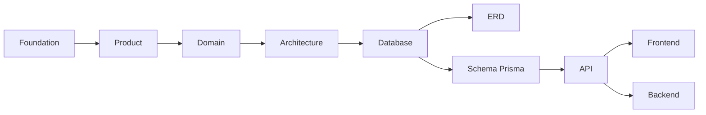
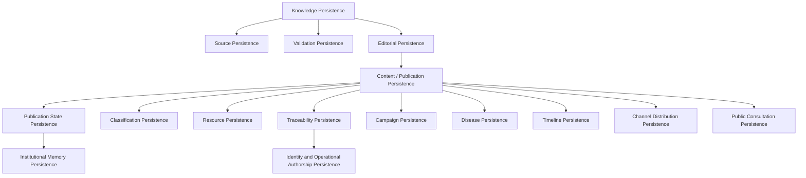

# Estrategia de Persistencia del Dominio

| Campo | Valor |
|-------|-------|
| Proyecto | Plataforma de Gestión, Comunicación y Educación para la Salud |
| Cliente | Jurisdicción Sanitaria de Huejutla de Reyes, Hidalgo |
| Documento | Estrategia de Persistencia del Dominio |
| Código | DOC-010 |
| Versión | 1.0.0 |
| Estado | baseline |
| Fase | Phase 04 — Database |
| Autor | Equipo del Proyecto |
| Rol arquitectónico | Chief Software Architect, Lead Software Architect, Solution Architect & Domain Architect |
| Fecha | 2026-07-07 |

---

## 1. Información del Documento

Este documento pertenece a la **Phase 04 — Database** del proyecto **Plataforma de Gestión, Comunicación y Educación para la Salud** para la Jurisdicción Sanitaria de Huejutla de Reyes, Hidalgo.

Su responsabilidad es definir la estrategia de persistencia del dominio y el modelo lógico conceptual de persistencia que deberán orientar los documentos posteriores de la fase Database.

Este documento no diseña implementación. En particular, no define:

- tablas;
- columnas;
- relaciones físicas;
- cardinalidades físicas;
- Prisma Schema;
- migraciones;
- SQL;
- índices;
- constraints técnicos;
- API;
- endpoints;
- DTOs;
- repositories;
- services;
- controllers;
- pantallas;
- código.

La Phase 04 inicia con este documento porque la persistencia debe comprender primero qué valores del dominio debe preservar. El diseño físico corresponde a documentos posteriores y deberá derivarse de esta estrategia.

---

## 2. Propósito

El propósito de `database.md` es establecer cómo la persistencia deberá proteger, sostener y materializar el ciclo de vida del **Conocimiento Institucional** sin alterar el dominio aprobado.

La base de datos no es el origen del modelo. La base de datos es un mecanismo futuro para conservar información institucional, trazabilidad, vigencia, responsabilidad, clasificación, consulta pública, distribución y memoria. Por tanto, toda decisión de persistencia debe respetar este orden:

```text
Negocio
-> Dominio
-> Arquitectura
-> Persistencia
-> Implementación
```

El documento responde:

- qué necesita persistir el dominio;
- por qué necesita persistirlo;
- qué valores institucionales protege la persistencia;
- cómo la persistencia sirve al Knowledge Core;
- cómo se preservan trazabilidad, vigencia, responsabilidad institucional y memoria;
- cómo se evita que Prisma o PostgreSQL contaminen el dominio;
- cómo se prepara el camino para `erd.md`, `schema-prisma.md` y documentos posteriores;
- qué decisiones quedan explícitamente fuera de este documento.

---

## 3. Relación con la Baseline Oficial

Este documento deriva de la baseline oficial aprobada:

| Fuente | Aporte a este documento |
|--------|--------------------------|
| Foundation | Define que la documentación dirige el desarrollo y que las decisiones deben ser trazables. |
| Product | Define la capacidad central del producto: publicar información confiable. |
| Product Principles | Establece confiabilidad, claridad, accesibilidad, prevención, conocimiento accesible y tecnología como medio. |
| Personas | Define participantes del ecosistema institucional del conocimiento sin convertirlos en modelos técnicos. |
| Ubiquitous Language | Define el contrato semántico: Conocimiento Institucional, Información Oficial, Content, Publicación, Fuente, Validación, Redacción, Canal, Recurso, Campaña, Enfermedad y Línea del Tiempo. |
| Domain | Define el dominio como gestión del ciclo de vida del Conocimiento Institucional. |
| Business Rules | Define las reglas sobre publicación, validación, trazabilidad, vigencia, distribución, memoria y frontera no clínica. |
| Use Cases | Define interacciones actor-dominio que deben sostenerse sin convertirlas todavía en endpoints, tablas o pantallas. |
| Architecture | Define Knowledge Core, Knowledge Lifecycle, Clean Architecture, Modular Monolith, canales desacoplados e IA futura. |
| Transfer Packages | Consolidan decisiones cerradas y evitan reabrir visión, alcance, dominio o arquitectura. |

`database.md` no puede reinterpretar visión, alcance, principios, personas, lenguaje ubicuo, dominio, reglas de negocio, casos de uso ni arquitectura. Si una decisión de persistencia contradice la baseline, la decisión de persistencia debe corregirse.

---

## 4. Posición dentro de la Arquitectura Documental



`database.md` prepara `erd.md` y `schema-prisma.md`, pero no los sustituye.

El documento actual define estrategia, principios, agrupaciones conceptuales y criterios de revisión. `erd.md` deberá traducir estas agrupaciones a un modelo físico revisable. `schema-prisma.md` deberá traducir el ERD a Prisma sin introducir reglas de negocio no aprobadas.

---

## 5. Principio Rector de Persistencia

> La persistencia debe preservar el Conocimiento Institucional, su trazabilidad, vigencia, responsabilidad institucional y memoria, sin contaminar el dominio con decisiones técnicas.

Este principio deriva del propósito central del producto:

> Publicar información confiable.

La información confiable no se logra solamente guardando registros. Requiere preservar origen, validación, redacción, responsabilidad institucional, estado, vigencia, clasificación, relación con recursos, relación con campañas o enfermedades cuando corresponda, preparación para canales, consulta pública y memoria.

La persistencia debe permitir que la institución pueda demostrar por qué una publicación existe, de dónde proviene, bajo qué responsabilidad fue publicada, si sigue vigente, cómo fue actualizada, cuándo fue retirada o archivada y cómo permanece dentro de la memoria institucional.

---

## 6. Qué significa Persistir en este Dominio

En este dominio, persistir no significa únicamente guardar datos. Persistir significa conservar las condiciones necesarias para que la Jurisdicción Sanitaria pueda administrar conocimiento institucional de forma responsable.

Persistir significa permitir que la institución pueda:

- publicar información confiable;
- demostrar origen y responsabilidad;
- distinguir información validada de información no validada;
- mantener vigencia;
- actualizar publicaciones sin perder contexto;
- retirar información cuando corresponda;
- archivar sin destruir memoria institucional;
- facilitar consulta pública clara;
- preparar distribución por canales;
- preservar clasificación institucional;
- relacionar publicaciones con campañas, enfermedades, recursos y eventos históricos;
- evolucionar hacia futuras capacidades de búsqueda, IA y canales sin rediseñar el dominio.

La persistencia debe ser entendida como una responsabilidad arquitectónica. Su función es sostener el dominio durante muchos años, no optimizar prematuramente un esquema físico.

---

## 7. Valores del Dominio que la Persistencia debe Proteger

| Valor del dominio | Necesidad de persistencia | Riesgo si no se preserva |
|-------------------|---------------------------|--------------------------|
| Conocimiento Institucional | Conservar origen, validación, redacción, publicación, distribución, actualización, archivo y memoria. | El sistema se reduce a un CMS genérico sin identidad institucional. |
| Confiabilidad | Preservar evidencia conceptual de fuente, validación, responsabilidad y vigencia. | La población podría consultar información sin respaldo institucional suficiente. |
| Veracidad | Mantener relación con fuentes oficiales, criterios de validación y actualizaciones. | Se publicaría contenido desactualizado, ambiguo o sin soporte. |
| Responsabilidad Institucional | Separar autoría operativa de responsabilidad de la Jurisdicción Sanitaria. | El sistema podría atribuir indebidamente la responsabilidad a un usuario operador. |
| Trazabilidad | Conservar historia conceptual de origen, preparación, publicación, distribución, actualización, retiro y archivo. | No sería posible explicar cómo una publicación llegó a estar disponible públicamente. |
| Vigencia | Distinguir información vigente, actualizada, retirada, archivada o históricamente contextualizada. | La población podría interpretar información histórica o retirada como vigente. |
| Accesibilidad | Preservar clasificación, navegación pública, búsqueda básica y claridad de consulta. | La información existiría internamente pero no sería encontrable ni comprensible. |
| Memoria Institucional | Conservar publicaciones, eventos históricos y contexto aún cuando dejen de estar activos públicamente. | La institución perdería continuidad histórica y capacidad de aprendizaje institucional. |

---

## 8. Principios de Persistencia

### DB-PER-001. Dominio antes que persistencia

La persistencia deriva del dominio y no al contrario.

El modelo persistente futuro deberá responder a reglas de negocio, casos de uso y arquitectura aprobada. Ninguna estructura técnica debe obligar a modificar el lenguaje ubicuo, simplificar artificialmente conceptos institucionales o fragmentar capacidades del dominio.

### DB-PER-002. Knowledge Core no es una tabla

Knowledge Core es un núcleo conceptual y arquitectónico. No debe reducirse a una tabla, módulo físico, clase, servicio, microservicio o modelo Prisma.

Su función es orientar la arquitectura alrededor del ciclo de vida del conocimiento institucional. En persistencia, eso significa coordinar varias agrupaciones conceptuales que conservan fuente, validación, redacción, Content, publicación, distribución, consulta, actualización, archivo y memoria.

### DB-PER-003. Content no reemplaza al Conocimiento Institucional

`Content` puede orientar estructuras persistentes futuras como abstracción editorial común, pero no debe absorber conceptos como Fuente, Validación, Responsabilidad, Vigencia, Canal, Campaña, Enfermedad, Recurso o Memoria.

Content es central, pero está contenido dentro de un ciclo institucional más amplio.

### DB-PER-004. Publicación no es simplemente un registro publicado

Una Publicación representa información institucional preparada para consulta pública, con responsabilidad, trazabilidad, estado, vigencia, clasificación y relación con conocimiento validado.

La persistencia futura no debe tratar "publicado" como una bandera técnica suficiente. La publicación es un hecho institucional, no solo un valor operativo.

### DB-PER-005. Los canales no son fuente de verdad

La persistencia debe impedir que un canal externo se convierta conceptualmente en origen oficial del conocimiento.

Facebook, Instagram, X, TikTok, YouTube, WhatsApp u otros canales pueden participar como mecanismos de distribución, pero la Publicación institucional debe conservarse dentro del sistema como referencia autoritativa.

### DB-PER-006. La trazabilidad no debe perderse

La persistencia debe permitir conocer origen, validación, redacción, responsabilidad, autoría operativa, estado, vigencia, clasificación, relaciones conceptuales, distribución, archivo o retiro.

La trazabilidad es una condición para confianza institucional. No es una característica decorativa ni un reporte opcional.

### DB-PER-007. Archivado no equivale a borrado

Una publicación retirada o archivada puede dejar de estar disponible públicamente, pero no debe perder memoria institucional ni trazabilidad.

El archivo preserva contexto. La eliminación operativa, si se formaliza en fases posteriores, será una decisión técnica y controlada, no un reemplazo del archivado del dominio.

### DB-PER-008. Prisma no contiene reglas de negocio

Prisma está aprobado como mecanismo futuro de mapeo y acceso a persistencia, pero no será autoridad conceptual del dominio.

Las reglas de negocio deberán permanecer en el dominio y la aplicación. Prisma podrá expresar estructura futura, relaciones técnicas y restricciones de apoyo cuando corresponda, pero no debe ser el lugar donde se defina qué significa Publicación, Vigencia, Validación o Responsabilidad Institucional.

### DB-PER-009. PostgreSQL es mecanismo, no modelo de negocio

PostgreSQL es el motor aprobado de persistencia, pero no gobierna el lenguaje del dominio.

Sus capacidades técnicas deberán utilizarse en fases posteriores para servir el modelo conceptual aprobado, no para forzar una forma de negocio basada en tablas, índices o tipos de datos.

### DB-PER-010. Preparación evolutiva sin sobreingeniería

El modelo de persistencia debe permitir evolución futura sin introducir complejidad innecesaria en el MVP.

La estrategia debe preparar búsqueda semántica, IA, integraciones de canales, auditoría avanzada, roles avanzados y versionado editorial avanzado como posibles evoluciones, pero no debe convertir esas capacidades en requisitos del modelo inicial.

---

## 9. Knowledge Core y Persistencia

Knowledge Core es el núcleo conceptual que organiza la arquitectura alrededor del Conocimiento Institucional. En esta fase debe quedar protegido contra dos errores opuestos: reducirlo a una única estructura física o convertirlo en un contenedor donde todo el sistema viva.

Para persistencia, Knowledge Core significa:

- no modelarlo como una única estructura física;
- no tratarlo como tabla;
- no tratarlo como módulo físico obligatorio;
- no tratarlo como microservicio;
- no tratarlo como clase;
- no tratarlo como servicio único;
- no concentrar toda la lógica del sistema en un supuesto módulo monolítico de conocimiento;
- preservarlo mediante varias capacidades persistentes coordinadas;
- conservar relaciones conceptuales entre etapas del ciclo de vida del conocimiento;
- sostener el ciclo de vida del conocimiento, no crear un repositorio genérico de publicaciones.

El flujo conceptual aprobado permanece vigente:

```text
Conocimiento Institucional
-> Información Oficial
-> Content
-> Publicación
-> Distribución
```

El Knowledge Lifecycle complementa ese flujo y orienta la persistencia:

```text
Fuente
-> Validación
-> Redacción
-> Content
-> Publicación
-> Distribución
-> Consulta Pública
-> Actualización
-> Archivado
-> Memoria Institucional
```

La persistencia debe conservar información suficiente para que ese ciclo sea recuperable, explicable y evolutivo. Si una futura estructura física conserva el contenido textual pero pierde fuente, validación, responsabilidad, vigencia o memoria, habrá fallado arquitectónicamente aunque sea técnicamente funcional.

---

## 10. Persistencia del Knowledge Lifecycle

### 10.1 Fuente

La persistencia debe poder conservar conceptualmente:

- origen del conocimiento;
- tipo de fuente;
- vínculo con información oficial;
- soporte institucional o documental;
- relación con publicaciones futuras;
- distinción entre fuente institucional interna, fuente oficial externa, información histórica y conocimiento generado por la Jurisdicción.

No se diseñan tablas. La decisión relevante es que ninguna publicación institucional debería quedar conceptualmente desconectada de su origen cuando el dominio requiera respaldo.

### 10.2 Validación

La persistencia debe conservar evidencia conceptual de validación, criterio de vigencia, pertinencia, responsabilidad institucional y distinción entre fuente oficial externa y conocimiento generado por la Jurisdicción.

Validar no equivale a guardar un valor técnico. Validar significa que la institución reconoce que una información puede avanzar hacia redacción y publicación bajo responsabilidad institucional.

Este documento no diseña flujos editoriales avanzados fuera del MVP. Solo establece que el modelo futuro debe permitir preservar la existencia conceptual de validación.

### 10.3 Redacción

La persistencia debe permitir conservar información preparada para comprensión pública.

Redacción no es lo mismo que validación ni que publicación. Una información puede estar validada y aún requerir redacción clara, accesible, no clínica y adecuada para la población. También puede estar redactada y no estar disponible públicamente.

La persistencia debe proteger esta diferencia para evitar que el sistema publique contenido por el simple hecho de existir internamente.

### 10.4 Content

Content funciona como abstracción conceptual central para publicaciones institucionales.

La persistencia futura debe permitir una base editorial común que evite fragmentar noticias, avisos, comunicados, documentos, infografías, preguntas frecuentes, programas u otros tipos de publicación en sistemas inconexos.

Sin embargo, Content no reemplaza Conocimiento Institucional. Tampoco absorbe Campaña, Enfermedad, Fuente, Validación, Canal, Recurso, Trazabilidad, Vigencia o Memoria. Es una expresión editorial dentro de un ciclo mayor.

### 10.5 Publicación

La persistencia debe permitir representar disponibilidad pública, estado, clasificación, responsabilidad, vigencia y relación con conocimiento validado.

Publicación es el término operativo institucional aprobado. No debe reducirse a "registro visible" ni a una propiedad técnica aislada. Es el punto donde información preparada se vuelve consultable por la población bajo responsabilidad de la Jurisdicción Sanitaria.

### 10.6 Distribución

La persistencia debe permitir preparar o registrar distribución sin convertir canales en fuente oficial.

En el MVP, la distribución se entiende como preparación o publicación manual asistida. No se diseña integración automática avanzada con plataformas externas. La información institucional debe conservar su sentido aunque el canal cambie, falle, desaparezca o modifique sus reglas.

### 10.7 Consulta Pública

La persistencia debe facilitar consulta pública, navegación, clasificación y búsqueda básica.

La población necesita encontrar información clara y comprensible. Esta necesidad no autoriza todavía diseñar índices SQL, queries, endpoints ni estrategias técnicas de búsqueda. Solo establece que el futuro modelo físico debe hacer posible la consulta pública derivada del dominio.

### 10.8 Actualización

La persistencia debe permitir actualizar contenido publicado conservando autoría operativa y responsabilidad institucional.

Actualizar no debe destruir trazabilidad ni memoria. Una publicación puede requerir ajuste por vigencia, claridad, corrección institucional o contexto. Este documento no exige versionado avanzado en el MVP, pero sí exige que el diseño posterior no impida conocer que la información fue actualizada bajo responsabilidad institucional.

### 10.9 Archivado

Archivar o retirar debe preservar memoria y trazabilidad.

El archivado no debe confundirse con eliminación física. Una publicación archivada puede dejar de estar disponible en consulta pública ordinaria y seguir siendo parte de la memoria institucional.

### 10.10 Memoria Institucional

La persistencia debe proteger contexto histórico, publicaciones archivadas, eventos históricos institucionales y relaciones relevantes.

La Línea del Tiempo conserva memoria institucional. No debe convertirse en agenda, calendario operativo, bitácora general ni registro de actividades cotidianas.

---

## 11. Modelo Lógico Conceptual de Persistencia

```text
Este modelo lógico conceptual de persistencia no representa tablas, columnas, claves, relaciones físicas, modelos Prisma, migraciones ni SQL.
Representa agrupaciones conceptuales de persistencia derivadas del dominio aprobado.
```

El modelo lógico conceptual identifica que agrupaciones de información persistente necesita el dominio para proteger el Knowledge Core y el Knowledge Lifecycle. Su objetivo es orientar el futuro ERD sin adelantarlo.

Los nombres en inglés utilizados para las agrupaciones conceptuales son aliases arquitectónicos de análisis. No representan nombres definitivos de módulos, tablas, modelos Prisma, carpetas, servicios ni clases. Su finalidad es facilitar la discusión arquitectónica y deberán traducirse o adaptarse en documentos posteriores si corresponde.



Las flechas representan dependencia conceptual de información. No representan relaciones físicas, cardinalidades, claves, joins, modelos Prisma ni estructura relacional final.

El diagrama expresa que la persistencia futura deberá conservar una red de conceptos alrededor de Content/Publicación, sin convertir esa zona central en sustituto del Conocimiento Institucional completo.

---

## 12. Agrupaciones Conceptuales de Persistencia

Las siguientes agrupaciones son conceptuales. No son tablas, no son nombres finales de modelos y no definen estructura física.

Los nombres en inglés utilizados para estas agrupaciones son aliases arquitectónicos de análisis. No representan nombres definitivos de módulos, tablas, modelos Prisma, carpetas, servicios ni clases. Su finalidad es facilitar la discusión arquitectónica y deberán traducirse o adaptarse en documentos posteriores si corresponde.

| Agrupación conceptual | Propósito | Conceptos del dominio protegidos | Observación para diseño posterior |
|-----------------------|-----------|----------------------------------|-----------------------------------|
| Knowledge Persistence | Preservar continuidad conceptual del conocimiento institucional durante su ciclo de vida. | Conocimiento Institucional, Información Oficial, Knowledge Core. | No debe convertirse en una tabla única ni en módulo físico que concentre todo. |
| Source Persistence | Conservar origen y respaldo conceptual del conocimiento. | Fuente, información oficial, soporte institucional. | El ERD deberá distinguir fuente de canal y recurso. |
| Validation Persistence | Preservar evidencia conceptual de revisión, pertinencia y vigencia. | Validación, veracidad, responsabilidad institucional. | No implica flujo editorial avanzado en MVP. |
| Editorial Persistence | Sostener preparación de información para comprensión pública. | Redacción, claridad, lenguaje accesible. | Debe distinguir contenido redactado de contenido publicado. |
| Content / Publication Persistence | Mantener la abstracción editorial común y su expresión operativa como Publicación. | Content, Publicación, información confiable. | No debe fragmentar cada tipo de publicación como sistema aislado. |
| Publication State Persistence | Permitir distinguir situaciones conceptuales de la publicación. | Vigencia, retiro, archivado, actualización. | Los estados de este documento son orientativos, no enums técnicos. |
| Traceability Persistence | Conservar historia conceptual y explicabilidad institucional. | Trazabilidad, origen, validación, redacción, responsabilidad, distribución, archivo. | No equivale a auditoría avanzada completa en MVP. |
| Classification Persistence | Facilitar organización, navegación y búsqueda básica. | Clasificación, tipos, categorías, etiquetas, consulta pública. | No define índices, queries ni filtros técnicos. |
| Campaign Persistence | Preservar campañas como iniciativas institucionales agrupadoras. | Campaña, prevención, educación, objetivo institucional. | Campaña no debe modelarse como publicación simple. |
| Disease Persistence | Preservar enfermedades como conceptos temáticos de salud pública. | Enfermedad, información temática, frontera no clínica. | Enfermedad no debe modelarse como publicación simple ni como diagnóstico. |
| Resource Persistence | Conservar recursos reutilizables que apoyan comprensión y publicación. | Recurso, multimedia, documentos, infografías. | No define almacenamiento físico, rutas ni proveedores. |
| Timeline Persistence | Preservar eventos históricos institucionales. | Línea del Tiempo, Evento Histórico Institucional, Memoria Institucional. | No debe convertirse en agenda, calendario operativo ni bitácora general. |
| Channel Distribution Persistence | Preparar o registrar distribución hacia canales sin convertirlos en origen. | Canal, Distribución, publicación manual asistida. | No diseña adaptadores ni integraciones automáticas. |
| Public Consultation Persistence | Facilitar acceso ciudadano a información publicada y contextualizada. | Consulta Pública, accesibilidad, claridad, búsqueda básica. | No define endpoints ni componentes de frontend. |
| Identity and Operational Authorship Persistence | Identificar operadores y acciones sin transferir responsabilidad institucional. | Autoría Operativa, usuario autenticado, responsabilidad institucional. | No introduce roles avanzados ni permisos complejos. |
| Institutional Memory Persistence | Preservar contexto, archivo, historia y continuidad institucional. | Memoria Institucional, archivado, publicaciones históricas. | Debe evitar pérdida de información por eliminación física prematura. |
| Administrative Configuration Persistence | Sostener parametros administrativos del MVP que habiliten operación institucional. | Administracion, configuracion institucional, operación del sitio. | Debe servir al dominio sin crear modelos paralelos de negocio. |

---

## 13. Relaciones Conceptuales de Persistencia

Las relaciones siguientes son conceptuales. No son cardinalidades físicas ni diseño relacional.

- Fuente respalda Información Oficial.
- Validación habilita Redacción.
- Redacción prepara Content.
- Content se expresa como Publicación.
- Publicación se clasifica para consulta pública.
- Publicación puede relacionarse con Campaña.
- Publicación puede relacionarse con Enfermedad.
- Publicación puede asociarse con Recursos.
- Publicación puede prepararse para Canales.
- Publicación puede actualizarse, retirarse o archivarse.
- Evento Histórico Institucional preserva Memoria Institucional.
- Autoría Operativa no reemplaza Responsabilidad Institucional.

Estas relaciones deberán guiar `erd.md`, pero todavía no indican cuántas estructuras físicas existirán, cómo se conectarán ni qué claves o restricciones técnicas utilizarán.

---

## 14. Estrategia de Persistencia por Capacidad del Dominio

| Capacidad del dominio | Necesidad persistente | Valor protegido | Observacion |
|-----------------------|-----------------------|-----------------|-------------|
| Adquirir conocimiento | Conservar origen, soporte y contexto de fuente. | Conocimiento Institucional, veracidad. | No convertir canal de comunicación en fuente. |
| Generar conocimiento | Preservar información producida por la Jurisdicción. | Responsabilidad Institucional. | Debe distinguirse de información externa oficial. |
| Validar conocimiento | Conservar evidencia conceptual de pertinencia y vigencia. | Confiabilidad, veracidad. | No implica flujo editorial avanzado en MVP. |
| Organizar conocimiento | Mantener clasificación y relaciones temáticas. | Accesibilidad, búsqueda básica. | No diseñar índices ni taxonomías técnicas finales aquí. |
| Redactar conocimiento | Conservar preparación para lenguaje claro y comprensible. | Claridad pública. | Redacción no equivale a publicación. |
| Publicar información confiable | Representar disponibilidad pública con responsabilidad y vigencia. | Confiabilidad, responsabilidad. | Publicación es hecho institucional, no solo estado técnico. |
| Distribuir publicaciones | Preparar o registrar distribución por canales. | Alcance, desacoplamiento de canales. | En MVP es manual asistida o preparatoria. |
| Actualizar publicaciones | Conservar cambios relevantes sin perder contexto. | Vigencia, trazabilidad. | No exige versionado avanzado inicial. |
| Preservar memoria institucional | Mantener archivo, eventos históricos y contexto. | Memoria Institucional. | Archivado no equivale a borrado. |
| Mantener trazabilidad | Conservar origen, validación, redacción, publicación, distribución y archivo. | Confiabilidad institucional. | Trazabilidad básica no es auditoría avanzada completa. |
| Proteger responsabilidad institucional | Separar operador de responsabilidad de la Jurisdicción. | Responsabilidad Institucional. | No introducir roles complejos fuera del MVP. |
| Mantener clasificación | Facilitar navegación pública, agrupación y búsqueda. | Accesibilidad. | Clasificación debe derivarse del lenguaje ubicuo. |
| Preservar vigencia | Distinguir información vigente, retirada, archivada o histórica. | Veracidad, claridad pública. | Estados conceptuales no son enums técnicos. |
| Facilitar consulta pública | Permitir que la población encuentre información publicada. | Accesibilidad, prevención. | No adelantar API ni frontend. |

---

## 15. Trazabilidad Persistente

Trazabilidad persistente es la capacidad de conservar información suficiente para explicar el recorrido institucional de una publicación o pieza de conocimiento.

Debe cubrir:

- fuente;
- validación;
- redacción;
- responsabilidad institucional;
- autoría operativa;
- estado conceptual;
- vigencia;
- clasificación;
- relaciones conceptuales;
- distribución;
- archivo o retiro.

La trazabilidad protege la confianza pública. Sin trazabilidad, una publicación puede existir técnicamente pero no ser justificable institucionalmente.

La trazabilidad básica requerida para el MVP no significa auditoría avanzada completa. Auditoría avanzada, versionado editorial detallado, flujos de aprobación complejos y controles granulares podrán evaluarse en fases posteriores.

---

## 16. Vigencia y Estados desde la Perspectiva de Persistencia

La persistencia debe permitir diferenciar conceptualmente situaciones de una publicación. De forma orientativa y no técnica, pueden considerarse los siguientes estados:

- borrador;
- preparado;
- publicado;
- actualizado;
- retirado;
- archivado;
- históricamente contextualizado.

Estos estados:

- no son enums técnicos;
- no son modelos Prisma;
- no son nombres definitivos;
- no son columnas;
- no son contratos de API;
- no son decisiones de frontend;
- no deben implementarse directamente desde este documento.

Los estados deberán derivarse de reglas de negocio y casos de uso, y formalizarse posteriormente en `erd.md`, `schema-prisma.md` o documentos técnicos cuando corresponda.

La necesidad arquitectónica es que el modelo futuro pueda distinguir vigencia, retiro, archivo y memoria sin confundirlos con detalles técnicos de almacenamiento.

---

## 17. Archivado, Retiro y Soft Delete Conceptual

La estrategia de persistencia distingue cuatro conceptos:

| Concepto | Sentido en el dominio o tecnología | Regla arquitectónica |
|----------|------------------------------------|----------------------|
| Retirar de consulta pública | La publicación deja de estar disponible como información pública ordinaria. | Debe conservar trazabilidad y razón institucional suficiente. |
| Archivar | La información se preserva como memoria institucional o contexto histórico. | No debe destruirse ni confundirse con eliminación. |
| Eliminar operativamente | Accion excepcional futura sobre información que no debe permanecer activa en operación ordinaria. | Requiere definicion posterior; no sustituye retiro ni archivo. |
| Soft delete técnico futuro | Tecnica posible de implementación para ocultar o excluir registros sin eliminación física inmediata. | Puede evaluarse después, pero no es regla de negocio ni reemplazo conceptual de archivado. |

El dominio exige preservar memoria y trazabilidad. Cualquier técnica futura deberá servir a está exigencia.

Este documento no define implementación concreta de soft delete, ni atributos técnicos, ni estrategia de eliminación física.

---

## 18. Clasificación, Búsqueda y Consulta Pública

La persistencia debe soportar conceptual y posteriormente:

- tipos de publicación;
- categorías;
- etiquetas;
- navegación pública;
- búsqueda básica;
- contenido destacado;
- relaciones con campañas;
- relaciones con enfermedades;
- relaciones con recursos.

Clasificar no debe fragmentar el dominio. La clasificación existe para que la población encuentre información confiable, no para crear sistemas aislados por cada tipo de contenido.

Búsqueda y consulta pública deben trabajar sobre información publicada y contextualizada. En fases posteriores podrán definirse filtros, paginación, endpoints, índices y estrategias técnicas, pero este documento no los diseña.

---

## 19. Recursos Multimedia y Documentales

Los recursos deben persistirse conceptualmente como materiales reutilizables asociados al conocimiento o a publicaciones.

La estrategia distingue:

- recurso como apoyo a comprensión;
- documento como recurso o publicación documental según contexto;
- infografía como recurso visual o publicación visual según contexto;
- archivo físico como detalle de infraestructura posterior.

Un recurso puede apoyar claridad, accesibilidad y educación para la salud. No debe duplicarse innecesariamente ni quedar acoplado a una única publicación cuando el dominio permita reutilización.

Este documento no diseña StorageProvider, rutas físicas, buckets, carpetas, proveedores cloud, permisos de archivos ni almacenamiento físico.

---

## 20. Campañas y Enfermedades desde Persistencia

La persistencia debe proteger decisiones fundamentales del dominio:

- Campaña es un conjunto organizado de publicaciones relacionadas por un objetivo preventivo, educativo o institucional común.
- Campaña no es una publicación simple.
- Enfermedad es un concepto temático de salud pública.
- Enfermedad no es una publicación simple.
- Ambas pueden organizar publicaciones, recursos, preguntas frecuentes, documentos e infografías.

La persistencia futura debe permitir que campañas y enfermedades conserven identidad conceptual propia. Si se reducen a un tipo de Content, se pierde su función de organización institucional y temática.

No se diseñan tablas ni relaciones físicas.

---

## 21. Línea del Tiempo y Memoria Institucional

La persistencia debe permitir conservar Eventos Históricos Institucionales.

Debe proteger:

- fecha o periodo;
- relevancia institucional;
- contexto histórico;
- relación con publicaciones o recursos cuando corresponda;
- memoria institucional.

La Línea del Tiempo no es:

- agenda;
- calendario operativo;
- bitácora general;
- registro de actividades cotidianas.

Su función es preservar memoria histórica y continuidad institucional. Un futuro modelo físico que la convierta en agenda habrá reinterpretado incorrectamente el dominio.

---

## 22. Canales de Comunicación

La persistencia debe permitir preparar distribución hacia canales sin depender de ellos como fuente oficial.

Debe cubrir conceptualmente:

- canal como mecanismo de distribución;
- publicación institucional como origen;
- preparación manual asistida en MVP;
- posible integración futura sin rediseñar Knowledge Core.

Los canales pueden incluir Facebook, Instagram, X, TikTok, YouTube, WhatsApp u otros futuros. Su existencia no debe modificar el sentido de la publicación ni imponer estructura al dominio.

Este documento no diseña adaptadores, integración automática, credenciales, APIs externas ni automatización avanzada.

---

## 23. Identidad, Autoría Operativa y Responsabilidad Institucional

La persistencia debe separar:

- usuario autenticado;
- autoría operativa;
- responsable editorial;
- responsabilidad institucional de la Jurisdicción Sanitaria.

El usuario operador puede crear, redactar, actualizar o preparar información. Eso no significa que sea propietario institucional del contenido. La responsabilidad de toda publicación permanece en la Jurisdicción Sanitaria.

Esta separación protege la confianza pública y evita publicación anónima o informal.

No se diseñan roles avanzados fuera del MVP. No se introducen permisos complejos ni una matriz avanzada de autorización en este documento.

---

## 24. Separación entre Dominio, Persistencia y ORM

El dominio no depende de Prisma.

El dominio no depende de PostgreSQL.

Las reglas de negocio no viven en Prisma.

Prisma será una herramienta futura de mapeo y acceso a persistencia. PostgreSQL será el mecanismo de almacenamiento aprobado. Ambos son decisiones técnicas aprobadas, pero no son fuente del modelo de negocio.

Los repositorios futuros deberán proteger la dirección de dependencias de Clean Architecture. La infraestructura podrá implementar mecanismos de persistencia, pero el dominio no debe importar conceptos técnicos del ORM, del motor de base de datos ni de frameworks.

El modelo físico deberá derivarse del modelo lógico conceptual, no al revés.

---

## 25. Antipatrones de Persistencia

| Antipatrón | Por qué es incorrecto | Riesgo arquitectónico |
|------------|-----------------------|-----------------------|
| Diseñar desde tablas antes del dominio | Invierte el orden aprobado de decisión. | La base de datos redefine el negocio. |
| Crear una estructura independiente por cada tipo de contenido sin análisis conceptual | Rompe Content como abstracción editorial común. | Fragmentación, duplicidad y mantenimiento costoso. |
| Tratar Knowledge Core como tabla, clase, módulo físico o servicio | Reduce un núcleo conceptual a una pieza técnica. | Se crea un módulo monolítico de conocimiento acoplado o una tabla artificial. |
| Tratar Content como sustituto del Conocimiento Institucional | Elimina fuente, validación, responsabilidad, vigencia y memoria. | El sistema se vuelve CMS genérico. |
| Modelar Campaña como Publicación simple | Pierde su naturaleza agrupadora e institucional. | Campañas no podrían organizar esfuerzos preventivos. |
| Modelar Enfermedad como Publicación simple | Pierde su identidad temática de salud pública. | Se confunde información pública con contenido aislado o clínico. |
| Tratar Canal de Comunicación como Fuente | Confunde distribución con origen oficial. | Redes sociales podrían gobernar el contenido. |
| Usar soft delete como sustituto de Archivado o Retiro | Confunde técnica con regla del dominio. | Se pierde memoria institucional o se oculta sin contexto. |
| Guardar reglas de negocio únicamente en Prisma | Ubica autoridad conceptual en infraestructura. | El dominio dependería del ORM. |
| Convertir Línea del Tiempo en agenda o calendario operativo | Cambia memoria institucional por operación diaria. | Se pierde sentido histórico. |
| Introducir IA, embeddings o pgvector en el MVP de persistencia | Adelanta capacidades futuras no funcionales en MVP. | Sobrediseño y acoplamiento prematuro. |
| Diseñar relaciones físicas antes del ERD | Invade el documento posterior. | El modelo conceptual se vuelve ERD encubierto. |
| Convertir el modelo lógico conceptual en diseño físico encubierto | Mezcla estrategia con implementación. | Se pierden criterios arquitectónicos de revisión. |

---

## 26. Criterios para el Futuro Modelo Físico

Esta sección no diseña el modelo físico. Define condiciones de aceptación que deberán usarse posteriormente para revisar `erd.md` y `schema-prisma.md`.

`erd.md` y `schema-prisma.md` deberán cumplir al menos estos criterios:

- no fragmentar Content en modelos inconexos;
- no convertir Knowledge Core en una tabla;
- no convertir Campaña en simple publicación;
- no convertir Enfermedad en simple publicación;
- no convertir Canal en Fuente;
- no perder trazabilidad en actualizaciones;
- no borrar memoria institucional por eliminación física;
- permitir búsqueda básica y clasificación;
- mantener separación entre responsabilidad institucional y autoría operativa;
- preparar evolución futura sin sobrediseñar;
- no introducir IA o búsqueda semántica en el modelo físico del MVP salvo preparación conceptual justificada;
- no colocar reglas de negocio como única garantía en constraints técnicos;
- explicar toda estructura física desde reglas de negocio, casos de uso y arquitectura.

---

## 27. Criterios mínimos para aprobar el futuro ERD

Antes de avanzar de `erd.md` a `schema-prisma.md`, el ERD deberá pasar esta checklist:

- [ ] El ERD deriva del modelo lógico conceptual definido en `database.md`.
- [ ] El ERD no modifica el dominio.
- [ ] El ERD no convierte Knowledge Core en una tabla.
- [ ] El ERD no fragmenta Content en modelos inconexos.
- [ ] El ERD conserva Campaña como concepto agrupador.
- [ ] El ERD conserva Enfermedad como concepto temático.
- [ ] El ERD distingue Fuente, Canal y Recurso.
- [ ] El ERD protege trazabilidad mínima.
- [ ] El ERD permite representar vigencia, retiro y archivado.
- [ ] El ERD no usa soft delete como sustituto conceptual de archivo.
- [ ] El ERD mantiene autoría operativa separada de responsabilidad institucional.
- [ ] El ERD no introduce IA, embeddings ni búsqueda semántica como requisito del MVP.
- [ ] El ERD no adelanta API ni implementación.
- [ ] El ERD mantiene coherencia con Clean Architecture.
- [ ] El ERD puede ser explicado desde reglas de negocio y casos de uso aprobados.

---

## 28. Decisiones de Persistencia de Alto Nivel

| ID | Decisión | Justificación | Consecuencia | Documentos relacionados |
|----|----------|---------------|--------------|-------------------------|
| DB-ADR-001 | Database deriva del dominio. | El dominio aprobado es la fuente de verdad y la persistencia debe servirlo. | Ninguna estructura futura podrá modificar conceptos del lenguaje ubicuo. | Domain, Architecture |
| DB-ADR-002 | Knowledge Core no será estructura física única. | Knowledge Core es núcleo conceptual, no tabla, clase, módulo físico ni servicio. | La persistencia se distribuirá conceptualmente en capacidades coordinadas. | Architecture, Phase 03 Transfer |
| DB-ADR-003 | Content se persistirá como núcleo editorial común, sin absorber conceptos externos. | Content evita fragmentación, pero no reemplaza Conocimiento Institucional. | Fuente, validación, campañas, enfermedades, canales y memoria conservarán identidad conceptual. | Ubiquitous Language, Domain |
| DB-ADR-004 | La trazabilidad será requisito transversal. | La confianza institucional requiere explicar origen, validación, responsabilidad, vigencia y distribución. | Todo modelo físico posterior deberá preservar trazabilidad mínima. | Business Rules, Use Cases |
| DB-ADR-005 | El archivado preservará memoria institucional. | Archivar no equivale a borrar. | El diseño posterior deberá distinguir retiro, archivo y eliminación técnica. | Domain, Architecture |
| DB-ADR-006 | Canales persistidos como mecanismos de distribución, no fuentes. | Los canales no son fuente de verdad. | Las integraciones futuras no podrán gobernar el contenido institucional. | Product Principles, Architecture |
| DB-ADR-007 | Prisma no será fuente de reglas de negocio. | El ORM es mecanismo futuro de mapeo, no autoridad conceptual. | Las reglas permanecerán en dominio y aplicación. | Architecture Guide, Architecture |
| DB-ADR-008 | PostgreSQL será mecanismo de persistencia aprobado, no modelo conceptual. | El motor técnico no debe gobernar lenguaje de negocio. | Capacidades técnicas se usarán posteriormente al servicio del dominio. | Architecture, Context Transfer |
| DB-ADR-009 | El modelo lógico conceptual precede al ERD y al Prisma Schema. | Evita diseño físico prematuro. | ERD y schema deberán justificar sus decisiones desde este documento. | Architecture Roadmap |
| DB-ADR-010 | Campañas y Enfermedades conservarán identidad conceptual propia en persistencia futura. | No son publicaciones simples. | El modelo físico deberá permitir que organicen y contextualicen publicaciones. | Domain, Business Rules |
| DB-ADR-011 | Los estados conceptuales de publicación serán orientativos y no técnicos en este documento. | Esta fase no define enums, columnas, API ni frontend. | Los estados deberán formalizarse después si corresponde. | Use Cases, Business Rules |
| DB-ADR-012 | Las decisiones físicas quedan diferidas a documentos posteriores. | `database.md` es estrategia, no ERD ni Prisma Schema. | Relaciones, claves, campos, tipos e índices quedan fuera de esta entrega. | ERD, Schema Prisma |

---

## 29. Decisiones Diferidas

Las siguientes decisiones no deben resolverse dentro de `database.md`.

### Diferidas a `erd.md`

- relaciones físicas;
- cardinalidades;
- entidades relacionales;
- normalización;
- claves;
- estructura relacional detallada.

### Diferidas a `schema-prisma.md`

- modelos Prisma;
- enums técnicos;
- nombres definitivos de campos;
- relaciones Prisma;
- atributos técnicos del schema, incluyendo `@id`, `@relation` y `@@index`;
- estrategia concreta de soft delete técnico.

### Diferidas a `api.md`

- endpoints;
- contratos request/response;
- DTOs;
- filtros;
- paginación;
- rutas públicas y administrativas.

### Diferidas a Backend

- repositorios;
- servicios;
- casos de uso implementados;
- transacciones;
- validaciones técnicas;
- integración con NestJS.

### Diferidas a fases futuras

- IA;
- embeddings;
- pgvector;
- búsqueda semántica;
- publicación automática completa en redes;
- roles avanzados;
- auditoría avanzada;
- versionado editorial avanzado.

Codex no debe resolver estas decisiones dentro de `database.md`. Cualquier intento de hacerlo debe considerarse adelanto de fase.

---

## 30. Riesgos Arquitectónicos de Persistencia

| Riesgo | Consecuencia | Mitigación en este documento |
|--------|--------------|------------------------------|
| Diseñar desde tablas | El modelo físico redefine el dominio. | Se define modelo lógico conceptual antes del ERD. |
| Introducir reglas de negocio en Prisma | El dominio queda dependiente del ORM. | Se declara Prisma como mecanismo futuro, no autoridad conceptual. |
| Duplicar dominio en modelos técnicos | Aparecen comportamientos divergentes. | Se exige trazabilidad desde dominio y arquitectura. |
| Confundir Content con Knowledge Core | Se pierde el ciclo de vida del conocimiento. | Se separan Conocimiento Institucional, Content y Publicación. |
| Tratar canales como fuentes | Redes sociales gobernarían información institucional. | Se define Canal como distribución desacoplada. |
| Tratar campañas como publicaciones simples | Se pierde agrupación institucional preventiva o educativa. | Se preserva Campaña como identidad conceptual propia. |
| Tratar enfermedades como publicaciones simples | Se pierde organización temática y frontera no clínica. | Se preserva Enfermedad como concepto temático de salud pública. |
| Perder trazabilidad por actualización o borrado | No se podría justificar información publicada o archivada. | Se exige trazabilidad persistente transversal. |
| Convertir Línea del Tiempo en agenda | Se pierde memoria histórica institucional. | Se define Timeline como memoria, no operación diaria. |
| Sobrediseñar IA o búsqueda semántica en MVP | Complejidad prematura y riesgo de respuestas sin fuente. | IA queda como evolución futura sobre conocimiento validado. |
| Romper Clean Architecture desde persistencia | El dominio dependería de PostgreSQL o Prisma. | Se establece separación entre dominio, persistencia y ORM. |
| Generar un modelo lógico conceptual demasiado cercano a tablas físicas | Se adelanta el ERD y se reducen opciones de diseño. | Se prohíben columnas, claves, cardinalidades y modelos técnicos. |
| Resolver silenciosamente decisiones diferidas | Se introducen decisiones sin revisión arquitectónica. | Se declara lista explícita de decisiones diferidas por fase. |

---

## 31. Fuera de Alcance

Este documento no diseña:

- ERD;
- `schema.prisma`;
- migraciones;
- SQL;
- índices;
- constraints;
- tipos de datos;
- endpoints;
- DTOs;
- repositorios;
- servicios;
- controladores;
- pantallas;
- permisos avanzados;
- IA;
- búsqueda semántica;
- publicación automática completa en redes;
- integraciones externas;
- almacenamiento físico de archivos.

Estos elementos podrán abordarse solamente en sus documentos o fases correspondientes.

---

## 32. Preparación para Documentos Posteriores

Este documento prepara:

- `docs/04-database/erd.md`;
- `docs/04-database/schema-prisma.md`;
- `docs/05-api/api.md`;
- `docs/05-api/authentication.md`;
- fases posteriores de frontend, backend, IA y DevOps.

`erd.md` deberá traducir el modelo lógico conceptual a relaciones físicas con revisión arquitectónica. Esa traducción deberá justificar cada decisión desde dominio, reglas de negocio, casos de uso y arquitectura.

`schema-prisma.md` deberá traducir el ERD a Prisma sin introducir reglas de negocio no aprobadas, sin convertir el ORM en fuente de verdad y sin adelantar implementación.

`api.md` deberá derivarse de casos de uso, arquitectura y modelo de persistencia, sin exponer detalles internos de base de datos.

`authentication.md` deberá respetar la separación entre usuario autenticado, autoría operativa y responsabilidad institucional.

Frontend y Backend deberán respetar Clean Architecture, no mezclar UI o controllers con reglas de dominio y no acoplar el dominio a persistencia.

AI y DevOps deberán mantener su carácter futuro y transversal: IA sobre conocimiento validado y DevOps cloud-ready sin dependencia rígida de proveedor.

---

## 33. Criterios de Revisión Arquitectónica

Este documento debe validarse con la siguiente checklist:

- [ ] Mantiene consistencia con Foundation.
- [ ] Mantiene consistencia con Product.
- [ ] Mantiene consistencia con Domain.
- [ ] Mantiene consistencia con Architecture.
- [ ] No define tablas físicas.
- [ ] No define Prisma Schema.
- [ ] No define SQL.
- [ ] Preserva Knowledge Core.
- [ ] Preserva Knowledge Lifecycle.
- [ ] Mantiene separación dominio/persistencia.
- [ ] Incluye modelo lógico conceptual sin diseño físico.
- [ ] Trata estados conceptuales como orientación no técnica.
- [ ] Incluye antipatrones de persistencia.
- [ ] Incluye decisiones diferidas.
- [ ] Protege trazabilidad.
- [ ] Protege vigencia.
- [ ] Protege responsabilidad institucional.
- [ ] Protege memoria institucional.
- [ ] Mantiene frontera no clínica.
- [ ] No adelanta API.
- [ ] No adelanta implementación.

---

## 34. Dictamen Arquitectónico de Fase

Si la estrategia de persistencia mantiene coherencia con Foundation, Product, Domain y Architecture; si no introduce diseño físico prematuro; si protege Knowledge Core, Knowledge Lifecycle, trazabilidad, vigencia, responsabilidad institucional y memoria; entonces el proyecto puede avanzar a la elaboración de `erd.md`.

El avance a `erd.md` no autoriza todavía crear migraciones, generar `schema.prisma`, implementar repositorios, implementar casos de uso, crear endpoints, iniciar frontend, iniciar backend ni ejecutar implementación técnica.

Este dictamen funciona como cierre formal parcial de la fase Database. La aprobación final dependerá de la revisión arquitectónica del documento y del cumplimiento de los criterios definidos.

---

## 35. Autoevaluación

Este documento:

- deriva de la baseline oficial;
- no modifica el dominio;
- no diseña implementación;
- prepara el diseño físico posterior;
- mantiene la base de datos al servicio del dominio;
- protege la evolución a largo plazo;
- define un modelo lógico conceptual sin convertirlo en ERD;
- incluye antipatrones;
- incluye decisiones diferidas;
- incluye criterios mínimos para aprobar el futuro ERD;
- incluye dictamen arquitectónico de fase.

El documento mantiene el principio rector de Phase 04:

> La persistencia sirve al Conocimiento Institucional. El dominio no se adapta a la base de datos.
