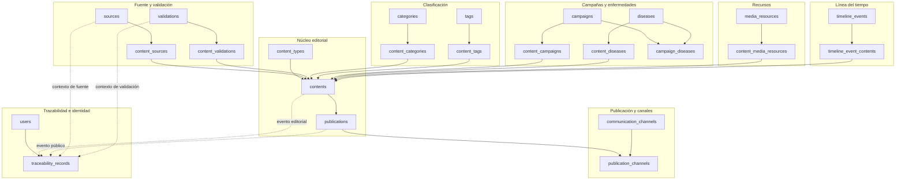

# Modelo Entidad-Relación de Persistencia

## 1. Información del Documento

| Campo | Valor |
|-------|-------|
| Proyecto | Plataforma de Gestión, Comunicación y Educación para la Salud |
| Cliente | Jurisdicción Sanitaria de Huejutla de Reyes, Hidalgo |
| Documento | Modelo Entidad-Relación de Persistencia |
| Código | DOC-011 |
| Versión | 1.0.0 |
| Estado | Draft |
| Fase | Phase 04 — Database |
| Documento anterior | `docs/04-database/database.md` |
| Documento siguiente | `docs/04-database/schema-prisma.md` |
| Rol arquitectónico | Chief Software Architect, Lead Software Architect, Solution Architect, Domain Architect & Database Architect |
| Fecha | 2026-07-07 |

---

## 2. Propósito

Este documento traduce la estrategia de persistencia definida en `database.md` hacia un **modelo entidad-relación físico revisable**.

Su propósito es proponer entidades, relaciones, cardinalidades y nombres físicos tentativos de tablas para preparar `schema-prisma.md`, sin generar todavía Prisma Schema, SQL, migraciones, API ni implementación.

`erd.md` funciona como puente documental:

```text
database.md
↓
erd.md
↓
schema-prisma.md
```

El ERD deberá preservar el propósito central del producto:

> Publicar información confiable.

También deberá preservar el activo principal del sistema:

> Conocimiento Institucional.

Este documento no implementa. Define una propuesta física revisable que deberá ser aprobada arquitectónicamente antes de avanzar a `schema-prisma.md`.

---

## 3. Relación con la Baseline Oficial

Este ERD deriva de la baseline oficial:

| Fuente | Relación con el ERD |
|--------|---------------------|
| Foundation | Establece que la documentación dirige el desarrollo y que la tecnología sirve al dominio. |
| Product | Define la capacidad central: publicar información confiable. |
| Product Principles | Exige confiabilidad, claridad, accesibilidad, prevención y tecnología como medio. |
| Personas | Identifica actores que generan, validan, consultan, distribuyen o preservan conocimiento institucional. |
| Ubiquitous Language | Define los conceptos que el ERD debe respetar: Content, Publicación, Fuente, Validación, Campaña, Enfermedad, Recurso, Canal, Línea del Tiempo y Trazabilidad. |
| Domain | Define el ciclo de vida del Conocimiento Institucional sin conocer persistencia. |
| Business Rules | Establece reglas de confiabilidad, vigencia, responsabilidad institucional, trazabilidad y frontera no clínica. |
| Use Cases | Define interacciones que el modelo físico debe soportar sin adelantar API ni pantallas. |
| Architecture | Define Knowledge Core, Clean Architecture, Modular Monolith, DDD Lite, canales desacoplados e IA futura. |
| Database | Define la estrategia de persistencia y el modelo lógico conceptual que este ERD traduce. |

Cualquier contradicción entre este ERD y documentos anteriores invalida la decisión ERD correspondiente. El dominio aprobado no debe modificarse para facilitar una tabla, relación o cardinalidad.

---

## 4. Relación con `database.md`

`database.md` define la estrategia de persistencia y el modelo lógico conceptual. Este documento propone una primera traducción física revisable.

La diferencia entre ambos documentos es:

| Documento | Nivel | Responsabilidad |
|-----------|-------|-----------------|
| `database.md` | Estrategia y modelo lógico conceptual | Define qué debe preservar la persistencia y qué decisiones quedan diferidas. |
| `erd.md` | Modelo entidad-relación físico revisable | Propone entidades, relaciones, cardinalidades y nombres físicos tentativos. |
| `schema-prisma.md` | Traducción técnica futura | Deberá traducir el ERD aprobado a Prisma sin agregar reglas de negocio no aprobadas. |

Los nombres propuestos en este documento son tentativos, revisables, no definitivos, no Prisma Schema, no migraciones, no SQL y no implementación.

---

## 5. Alcance del ERD

Este documento sí define:

- entidades del modelo entidad-relación;
- nombres físicos tentativos de tablas;
- relaciones entre entidades;
- cardinalidades;
- entidades puente explícitas para relaciones muchos-a-muchos;
- explicación y justificación arquitectónica de cada entidad;
- criterios de trazabilidad hacia `database.md`;
- criterios para preparar `schema-prisma.md`;
- restricciones conceptuales de diseño;
- diagramas Mermaid ER;
- decisiones ERD de alto nivel;
- tablas explícitamente prohibidas;
- checklist de aprobación del ERD.

El alcance se limita a una propuesta física revisable. El hecho de nombrar una tabla tentativa no equivale a crearla, implementarla ni fijarla como nombre final.

---

## 6. Fuera de Alcance

Este documento no genera ni define:

- `schema.prisma`;
- modelos Prisma;
- enums Prisma;
- atributos Prisma;
- migraciones;
- SQL;
- DDL;
- índices concretos;
- constraints técnicos concretos;
- tipos de datos PostgreSQL definitivos;
- código NestJS;
- entidades TypeScript;
- DTOs;
- repositories;
- services;
- controllers;
- endpoints;
- rutas API;
- pantallas frontend;
- componentes React;
- lógica de negocio implementada;
- integración con redes sociales;
- IA;
- embeddings;
- pgvector;
- búsqueda semántica;
- chatbot;
- auditoría avanzada;
- versionado editorial avanzado;
- roles avanzados;
- permisos complejos.

---

## 7. Principios de Diseño del ERD

### ERD-PER-001. Dominio antes que tabla

Cada entidad tentativa debe explicarse desde el dominio, reglas de negocio, casos de uso y arquitectura. Ninguna tabla tentativa debe existir solo por conveniencia técnica.

### ERD-PER-002. Trazabilidad antes que comodidad técnica

El ERD debe permitir explicar origen, validación, preparación editorial, publicación, actualización, retiro, archivo y distribución.

### ERD-PER-003. Content como base editorial común

`contents` será la base editorial común para piezas institucionales. Los tipos editoriales no deberán fragmentarse en tablas principales independientes durante el MVP.

### ERD-PER-004. Publication no es booleano

`publications` representa el hecho institucional de exposición pública de un Content. No deberá reducirse a un valor técnico dentro de `contents`.

### ERD-PER-005. Campaign y Disease son conceptos organizadores

`campaigns` y `diseases` deberán existir como entidades separadas. No son subtipos de Content ni simples categorías.

### ERD-PER-006. Source no es Channel

`sources` representa origen o respaldo del conocimiento. `communication_channels` representa mecanismos de distribución. Confundirlos rompería el Knowledge Lifecycle.

### ERD-PER-007. Trazabilidad mínima explícita

`traceability_records` deberá existir como entidad transversal de trazabilidad institucional mínima. No deberá convertirse en auditoría avanzada.

### ERD-PER-008. Evitar sobreingeniería

El ERD deberá preparar evolución futura sin adelantar IA, roles avanzados, workflow editorial complejo, auditoría avanzada o integración automática con redes sociales.

### ERD-PER-009. Preparar Prisma sin generar Prisma

El ERD deberá facilitar `schema-prisma.md`, pero no deberá definir modelos Prisma, enums, atributos, índices, constraints ni tipos concretos.

---

## 8. Convenciones de Nomenclatura

Los nombres físicos de tablas son:

- tentativos;
- revisables;
- no definitivos;
- no Prisma Schema;
- no migraciones;
- no SQL;
- no implementación.

Convenciones adoptadas para este ERD:

| Nivel | Convención | Ejemplo |
|-------|------------|---------|
| Concepto de dominio | Español institucional | Publicación |
| Entidad ERD tentativa | Inglés, singular conceptual | Publication |
| Tabla tentativa | Inglés, `snake_case`, plural | `publications` |

Se usará inglés y `snake_case` para nombres tentativos de tablas porque preparan la traducción posterior a Prisma/PostgreSQL. Esta convención no reemplaza el lenguaje ubicuo en español ni modifica el dominio.

---

## 9. Decisiones Arquitectónicas del ERD

### ERD-DEC-001 — Nombres físicos tentativos

El ERD propone nombres físicos tentativos de tablas. Estos nombres son revisables en `schema-prisma.md` y no constituyen Prisma Schema, migraciones, SQL ni implementación.

### ERD-DEC-002 — Separación entre Content y Publication

El ERD modela `contents` y `publications` como entidades separadas.

`contents` representa la pieza editorial institucional preparada, clasificable, reutilizable y trazable.

`publications` representa el hecho institucional de exposición pública de un Content.

Relación recomendada para MVP:

```text
contents 1 ── 0..1 publications
```

Un Content puede existir sin estar publicado. Una Publication siempre deriva de un Content. En el MVP se recomienda máximo una publicación activa por Content. No se introduce versionado avanzado.

### ERD-DEC-003 — `contents` como base editorial común

`contents` será entidad base para noticias, avisos, comunicados, documentos, infografías, preguntas frecuentes, contenido informativo sobre programas e información institucional.

La variación editorial deberá representarse con `content_types`, categorías y etiquetas. No se crearán tablas principales como `news`, `notices`, `statements`, `documents`, `infographics`, `faqs` o `programs`.

Programa de Salud como actor o fuente institucional no se modela como `content_type`. La plataforma puede publicar contenido informativo sobre programas, pero eso no convierte Programa de Salud en tipo editorial principal ni en propietario del contenido.

### ERD-DEC-004 — Campaigns y Diseases como entidades organizadoras

El ERD propone `campaigns` y `diseases` como entidades separadas.

`campaigns` representa iniciativas institucionales agrupadoras con objetivo preventivo, educativo o comunicacional.

`diseases` representa conceptos temáticos de salud pública.

Campaign no es tipo de Content. Disease no es tipo de Content.

### ERD-DEC-005 — Sources y Validations separadas

El ERD incluye `sources` y `validations` como entidades separadas.

`sources` representa origen, respaldo o fuente institucional/documental.

`validations` representa confirmación institucional de autenticidad, vigencia, pertinencia o validación completa según el origen del conocimiento.

La separación protege el Knowledge Lifecycle y evita reducir Fuente y Validación a metadatos simples dentro de `contents`.

Una validación puede asociarse con una fuente cuando la validación se refiere a autenticidad, vigencia o pertinencia del origen. Cuando la validación pertenece al conocimiento generado por la Jurisdicción, no deberá forzarse una fuente oficial externa.

### ERD-DEC-006 — Trazabilidad transversal explícita

El ERD incluye `traceability_records` como entidad transversal para trazabilidad institucional mínima.

Debe permitir responder:

- qué ocurrió;
- sobre qué entidad ocurrió;
- quién operó;
- bajo qué responsabilidad institucional;
- cuándo ocurrió;
- con qué contexto mínimo.

No representa auditoría avanzada completa.

### ERD-DEC-007 — Entidades puente explícitas

El ERD incluye entidades puente explícitas para relaciones muchos-a-muchos relevantes.

No se delega a Prisma la decisión de qué relaciones N:M existen. Las relaciones deberán quedar justificadas desde el dominio.

### ERD-DEC-008 — Tablas explícitamente prohibidas

El ERD declara tablas prohibidas para evitar fragmentación, acoplamiento a redes sociales, reducción del Knowledge Core a una tabla e introducción prematura de IA.

---

## 10. Mapa Conceptual hacia Modelo Entidad-Relación

| Concepto de Dominio | Entidad ERD | Tabla tentativa | Justificación |
|---------------------|-------------|-----------------|---------------|
| Conocimiento Institucional | No se modela como entidad única | No aplica | Es activo principal y núcleo conceptual; se preserva mediante varias entidades coordinadas. |
| Content | Content | `contents` | Representa la pieza editorial institucional común, trazable y reutilizable. |
| Publicación | Publication | `publications` | Representa el hecho institucional de exposición pública de un Content. |
| Fuente | Source | `sources` | Preserva origen o respaldo del conocimiento. |
| Validación | Validation | `validations` | Preserva confirmación institucional sin crear workflow avanzado. |
| Campaña | Campaign | `campaigns` | Representa iniciativa institucional agrupadora. |
| Enfermedad | Disease | `diseases` | Representa concepto temático de salud pública, no clínico. |
| Recurso | Media Resource | `media_resources` | Representa material reutilizable asociado a contenidos. |
| Canal | Communication Channel | `communication_channels` | Representa mecanismo de distribución, no fuente de verdad. |
| Línea del Tiempo | Timeline Event | `timeline_events` | Preserva eventos históricos institucionales. |
| Autoría Operativa | User | `users` | Identifica operador autenticado sin reemplazar responsabilidad institucional. |
| Trazabilidad | Traceability Record | `traceability_records` | Conserva eventos relevantes del ciclo de vida. |
| Clasificación | Category / Tag / Content Type | `categories`, `tags`, `content_types` | Facilita navegación, consulta pública y búsqueda básica. |

---

## 11. Entidades Principales

### `contents`

**Propósito:** representar la pieza editorial base del sistema.

**Concepto protegido:** Content como abstracción editorial común, sin reemplazar Conocimiento Institucional.

**Relaciones principales:**

- pertenece a un `content_types`;
- se relaciona con `sources` mediante `content_sources`;
- se relaciona con `validations` mediante `content_validations`;
- se relaciona con `campaigns` mediante `content_campaigns`;
- se relaciona con `diseases` mediante `content_diseases`;
- se relaciona con `media_resources` mediante `content_media_resources`;
- se clasifica mediante `content_categories` y `content_tags`;
- puede tener una `publication`;
- puede tener `traceability_records`.

**Riesgos que evita:** fragmentar el dominio en tablas por tipo editorial.

**No debe fusionarse con:** `publications`, `campaigns`, `diseases`, `sources`, `validations`, `media_resources`, `communication_channels` ni `traceability_records`.

### `publications`

**Propósito:** representar la exposición pública institucional de un Content.

**Concepto protegido:** Publicación como hecho institucional, con vigencia, retiro, archivo, actualización, disponibilidad pública y responsabilidad institucional.

**Relaciones principales:**

- deriva de un `contents`;
- se distribuye mediante `publication_channels`;
- puede tener `traceability_records`.

**Riesgos que evita:** reducir publicación a un booleano técnico dentro de `contents`.

**No debe fusionarse con:** `contents`, porque un Content puede existir sin estar publicado y la publicación requiere trazabilidad institucional propia.

### `campaigns`

**Propósito:** representar iniciativas institucionales temporales o contextuales con objetivo preventivo, educativo o comunicacional.

**Concepto protegido:** Campaña como agrupador institucional.

**Relaciones principales:**

- se relaciona con `contents` mediante `content_campaigns`;
- se relaciona con `diseases` mediante `campaign_diseases`;
- puede relacionarse indirectamente con publicaciones a través de contenidos.

**Riesgos que evita:** modelar Campaña como tipo de Content o publicación simple.

**No debe fusionarse con:** `contents` ni `categories`, porque Campaña tiene identidad institucional propia.

### `diseases`

**Propósito:** representar conceptos temáticos de salud pública.

**Concepto protegido:** Enfermedad como tema sanitario no clínico.

**Relaciones principales:**

- se relaciona con `contents` mediante `content_diseases`;
- se relaciona con `campaigns` mediante `campaign_diseases`.

**Riesgos que evita:** convertir Enfermedad en publicación simple, diagnóstico, expediente clínico o atención individual.

**No debe fusionarse con:** `contents`, `categories` ni `tags`, porque Enfermedad organiza conocimiento temático estable.

---

## 12. Entidades de Soporte

| Tabla tentativa | Propósito | Concepto protegido | Límite arquitectónico |
|-----------------|-----------|--------------------|-----------------------|
| `users` | Identificar operadores autenticados y autoría operativa. | Autoría Operativa. | No representa responsabilidad institucional final ni roles avanzados. |
| `content_types` | Distinguir variantes editoriales de Content. | Clasificación editorial. | No debe fragmentar en tablas por tipo. |
| `sources` | Representar origen o respaldo del conocimiento. | Fuente. | No debe confundirse con Canal de Comunicación. |
| `validations` | Representar validación institucional. | Validación. | No debe convertirse en workflow complejo. |
| `media_resources` | Representar recursos reutilizables. | Recurso multimedia/documental. | No define almacenamiento físico, rutas ni proveedores. |
| `timeline_events` | Representar eventos históricos institucionales. | Línea del Tiempo y Memoria Institucional. | No es agenda, calendario operativo ni bitácora general. |
| `communication_channels` | Representar canales como mecanismos de distribución. | Canal. | No debe crear tablas por red social ni ser fuente de verdad. |
| `categories` | Organizar contenidos para navegación y consulta. | Clasificación. | No sustituye Campaign ni Disease. |
| `tags` | Apoyar clasificación flexible y búsqueda básica. | Organización editorial. | No debe convertirse en taxonomía clínica compleja. |

---

## 13. Entidades Puente

Las entidades puente existen para proteger relaciones muchos-a-muchos explícitas del dominio. Algunas podrán no requerir atributos funcionales complejos en el MVP, pero deberán existir para evitar relaciones implícitas u ocultas en el ORM.

| Entidad puente tentativa | Relación protegida | Justificación |
|--------------------------|--------------------|---------------|
| `content_sources` | `contents` ↔ `sources` | Un contenido puede respaldarse por varias fuentes y una fuente puede respaldar varios contenidos. |
| `content_validations` | `contents` ↔ `validations` | Un contenido puede requerir validaciones y una validación puede respaldar varias piezas relacionadas cuando aplique. |
| `content_campaigns` | `contents` ↔ `campaigns` | Un contenido puede formar parte de varias campañas y una campaña agrupa varios contenidos. |
| `content_diseases` | `contents` ↔ `diseases` | Un contenido puede tratar varias enfermedades y una enfermedad organiza múltiples contenidos. |
| `campaign_diseases` | `campaigns` ↔ `diseases` | Una campaña puede abordar varias enfermedades y una enfermedad puede aparecer en varias campañas. |
| `content_media_resources` | `contents` ↔ `media_resources` | Los recursos deben ser reutilizables y no duplicarse por contenido. |
| `content_categories` | `contents` ↔ `categories` | Un contenido puede clasificarse en varias categorías y una categoría agrupa contenidos. |
| `content_tags` | `contents` ↔ `tags` | Las etiquetas apoyan búsqueda y organización flexible. |
| `publication_channels` | `publications` ↔ `communication_channels` | La distribución parte de publicaciones institucionales hacia canales desacoplados. |
| `timeline_event_contents` | `timeline_events` ↔ `contents` | Un evento histórico puede contextualizar contenidos y un contenido puede relacionarse con eventos históricos. |

---

## 14. Entidades de Trazabilidad

### `traceability_records`

`traceability_records` representa trazabilidad institucional mínima.

Debe registrar eventos relevantes como:

- creación;
- validación;
- preparación editorial;
- publicación;
- actualización;
- retiro;
- archivado;
- distribución;
- cambio relevante de estado.

Debe permitir responder:

- qué ocurrió;
- sobre qué entidad ocurrió;
- quién operó;
- bajo qué responsabilidad institucional;
- cuándo ocurrió;
- con qué contexto mínimo.

Relaciones mínimas recomendadas:

- `users` 1 ── 0..N `traceability_records`;
- `contents` 0..1 ── 0..N `traceability_records`;
- `publications` 0..1 ── 0..N `traceability_records`;
- `sources` 0..1 ── 0..N `traceability_records`;
- `validations` 0..1 ── 0..N `traceability_records`.

Un `traceability_record` no debe interpretarse como dependiente simultáneamente de Content y Publication. Debe relacionarse con la entidad o entidades relevantes para explicar el evento institucional registrado.

Este diseño prefiere relaciones explícitas hacia entidades críticas sobre referencias polimórficas genéricas. No representa auditoría avanzada completa.

---

## 15. Modelo General ERD

```mermaid
erDiagram
    USERS ||--o{ TRACEABILITY_RECORDS : operates

    CONTENT_TYPES ||--o{ CONTENTS : classifies
    CONTENTS ||--o| PUBLICATIONS : may_be_exposed_as

    CONTENTS ||--o{ CONTENT_SOURCES : has
    SOURCES ||--o{ CONTENT_SOURCES : supports

    CONTENTS ||--o{ CONTENT_VALIDATIONS : has
    VALIDATIONS ||--o{ CONTENT_VALIDATIONS : confirms
    SOURCES o|--o{ VALIDATIONS : may_contextualize

    CONTENTS ||--o{ CONTENT_CAMPAIGNS : participates_in
    CAMPAIGNS ||--o{ CONTENT_CAMPAIGNS : groups

    CONTENTS ||--o{ CONTENT_DISEASES : relates_to
    DISEASES ||--o{ CONTENT_DISEASES : organizes

    CAMPAIGNS ||--o{ CAMPAIGN_DISEASES : addresses
    DISEASES ||--o{ CAMPAIGN_DISEASES : appears_in

    CONTENTS ||--o{ CONTENT_MEDIA_RESOURCES : uses
    MEDIA_RESOURCES ||--o{ CONTENT_MEDIA_RESOURCES : supports

    CONTENTS ||--o{ CONTENT_CATEGORIES : categorized_by
    CATEGORIES ||--o{ CONTENT_CATEGORIES : groups

    CONTENTS ||--o{ CONTENT_TAGS : tagged_by
    TAGS ||--o{ CONTENT_TAGS : labels

    PUBLICATIONS ||--o{ PUBLICATION_CHANNELS : distributed_through
    COMMUNICATION_CHANNELS ||--o{ PUBLICATION_CHANNELS : receives

    TIMELINE_EVENTS ||--o{ TIMELINE_EVENT_CONTENTS : contextualizes
    CONTENTS ||--o{ TIMELINE_EVENT_CONTENTS : appears_in

    CONTENTS o|--o{ TRACEABILITY_RECORDS : may_trace_editorial_event
    PUBLICATIONS o|--o{ TRACEABILITY_RECORDS : may_trace_public_event
    SOURCES o|--o{ TRACEABILITY_RECORDS : may_contextualize
    VALIDATIONS o|--o{ TRACEABILITY_RECORDS : may_contextualize
```



El diagrama expresa entidades y cardinalidades revisables. Las relaciones de trazabilidad hacia `contents`, `publications`, `sources` y `validations` son opcionales según el evento institucional registrado; no significan que cada `traceability_record` dependa simultáneamente de todas ellas. No define columnas, tipos de datos, constraints técnicos, índices, Prisma Schema ni SQL.

---

## 16. Modelo por Áreas de Persistencia



El diagrama separa áreas de persistencia para revisión arquitectónica. Las relaciones punteadas hacia `traceability_records` indican contexto opcional según el evento registrado. No representa módulos físicos obligatorios ni estructura de carpetas.

---

## 17. Relaciones y Cardinalidades

| Relación | Cardinalidad | Justificación |
|----------|--------------|---------------|
| `content_types` → `contents` | 1 ── 0..N | Un tipo editorial clasifica muchos contenidos; un Content tiene un tipo editorial principal tentativo. |
| `contents` → `publications` | 1 ── 0..1 | Un Content puede existir sin publicación; una Publication siempre deriva de un Content. |
| `contents` ↔ `sources` | N ── M mediante `content_sources` | Un contenido puede tener varias fuentes; una fuente puede respaldar varios contenidos. |
| `contents` ↔ `validations` | N ── M mediante `content_validations` | Un contenido puede tener validaciones; una validación puede respaldar contenidos relacionados cuando aplique. |
| `contents` ↔ `campaigns` | N ── M mediante `content_campaigns` | Campaña agrupa contenidos sin ser tipo de Content. |
| `contents` ↔ `diseases` | N ── M mediante `content_diseases` | Enfermedad organiza contenidos temáticos sin ser publicación. |
| `campaigns` ↔ `diseases` | N ── M mediante `campaign_diseases` | Campañas pueden abordar múltiples enfermedades y enfermedades aparecer en múltiples campañas. |
| `contents` ↔ `media_resources` | N ── M mediante `content_media_resources` | Recursos reutilizables pueden apoyar varios contenidos. |
| `contents` ↔ `categories` | N ── M mediante `content_categories` | Categorías permiten navegación y clasificación pública. |
| `contents` ↔ `tags` | N ── M mediante `content_tags` | Etiquetas permiten organización flexible y búsqueda básica. |
| `publications` ↔ `communication_channels` | N ── M mediante `publication_channels` | Publicaciones pueden distribuirse por múltiples canales y un canal recibe múltiples publicaciones. |
| `timeline_events` ↔ `contents` | N ── M mediante `timeline_event_contents` | Eventos históricos pueden contextualizar contenidos y contenidos pueden relacionarse con varios eventos. |
| `users` → `traceability_records` | 1 ── 0..N | Un operador puede generar eventos de trazabilidad; cada evento debe identificar autoría operativa. |
| `contents` → `traceability_records` | 0..1 ── 0..N | El ciclo editorial de Content debe ser trazable cuando el evento pertenece a creación, preparación editorial o actualización del contenido. |
| `publications` → `traceability_records` | 0..1 ── 0..N | Publicación, actualización pública, retiro, archivo y distribución requieren trazabilidad cuando el evento pertenece a exposición pública. |
| `sources` → `traceability_records` | 0..1 ── 0..N | Una fuente puede contextualizar eventos de trazabilidad cuando aplique. |
| `validations` → `traceability_records` | 0..1 ── 0..N | Una validación puede contextualizar eventos de trazabilidad cuando aplique. |
| `sources` → `validations` | 0..1 ── 0..N | Una fuente puede participar en una o varias validaciones; una validación puede contextualizar una fuente cuando evalúa autenticidad, vigencia o pertinencia del origen. |

Un `traceability_record` no debe interpretarse como dependiente simultáneamente de Content y Publication. Debe relacionarse con la entidad o entidades relevantes para explicar el evento institucional registrado, manteniendo relaciones explícitas hacia entidades críticas sin adoptar una referencia polimórfica genérica como solución principal.

---

## 18. Estados Conceptuales y Vigencia

El ERD puede considerar estados conceptuales orientativos derivados de `database.md`:

- borrador;
- preparado;
- publicado;
- actualizado;
- retirado;
- archivado;
- históricamente contextualizado.

Estos nombres no son enums Prisma, no son columnas finales, no son contratos de API y no son estados de frontend.

`schema-prisma.md` deberá formalizar los nombres técnicos si corresponde, preservando reglas de negocio sobre vigencia, retiro, archivo y memoria institucional.

---

## 19. Archivado, Retiro y Eliminación Técnica

El ERD distingue:

| Concepto | Sentido | Regla ERD |
|----------|---------|-----------|
| Retiro de consulta pública | La publicación deja de estar disponible como información pública ordinaria. | Debe preservarse trazabilidad y relación con Content. |
| Archivado | Conserva memoria institucional y contexto histórico. | No equivale a eliminación física. |
| Eliminación operativa | Acción excepcional futura. | No se diseña implementación concreta. |
| Soft delete técnico futuro | Técnica posible en `schema-prisma.md`. | No sustituye retiro ni archivo del dominio. |

Este documento no define atributos, columnas, estrategia técnica de soft delete ni reglas de eliminación física.

---

## 20. Clasificación, Búsqueda y Consulta Pública

La clasificación para consulta pública se apoya en:

- `content_types`;
- `categories`;
- `tags`;
- `publications`;
- relaciones con `campaigns`, `diseases` y `media_resources`.

`content_types` permite distinguir variantes editoriales sin crear tablas principales separadas.

Cuando se publique información sobre programas, el tipo editorial deberá entenderse como contenido informativo sobre programas o información institucional de programas. Programa de Salud como actor o fuente institucional no se modela como `content_type`, no es propietario del contenido y no debe confundirse con una variante editorial simple.

`categories` y `tags` apoyan navegación pública, búsqueda básica y organización editorial.

`publications` representa lo consultable públicamente cuando un Content se expone bajo responsabilidad institucional.

Este documento no diseña endpoints, filtros de API, índices SQL, algoritmos de búsqueda ni componentes frontend.

---

## 21. Campañas y Enfermedades

`campaigns` y `diseases` son entidades separadas porque protegen conceptos distintos:

- Campaña es una iniciativa institucional agrupadora.
- Enfermedad es un concepto temático de salud pública.

Ambas pueden organizar contenidos, recursos, documentos, infografías y preguntas frecuentes mediante relaciones explícitas.

Relaciones relevantes:

- `contents` ↔ `campaigns` mediante `content_campaigns`;
- `contents` ↔ `diseases` mediante `content_diseases`;
- `campaigns` ↔ `diseases` mediante `campaign_diseases`.

No deberán modelarse como Content simple, categoría, etiqueta ni publicación.

---

## 22. Fuentes y Validaciones

`sources` y `validations` se separan para proteger el Knowledge Lifecycle.

`sources` representa origen o respaldo del conocimiento:

- fuente oficial externa;
- fuente institucional interna;
- fuente documental;
- información histórica;
- conocimiento generado por la Jurisdicción.

`validations` representa confirmación institucional:

- autenticidad;
- vigencia;
- pertinencia;
- validación institucional completa cuando el conocimiento es generado por la Jurisdicción.

Relaciones relevantes:

- `contents` ↔ `sources` mediante `content_sources`;
- `contents` ↔ `validations` mediante `content_validations`;
- `sources` → `validations` como relación directa revisable para contextualizar validaciones sobre autenticidad, vigencia o pertinencia del origen;
- `sources` y `validations` pueden contextualizar `traceability_records`.

Una fuente puede participar en una o varias validaciones. Una validación puede contextualizar una fuente cuando la validación se refiere al origen del conocimiento. Cuando la validación pertenece al conocimiento generado por la Jurisdicción, el ERD no deberá forzar una fuente oficial externa.

Validación no debe convertirse en workflow complejo, aprobación multinivel, auditoría avanzada ni roles avanzados.

---

## 23. Recursos Multimedia y Documentales

`media_resources` representa recursos reutilizables:

- imágenes;
- infografías;
- PDFs;
- videos por enlace o recurso asociado;
- documentos;
- recursos visuales.

La relación con `contents` se realiza mediante `content_media_resources` para permitir reutilización y evitar duplicación.

Un documento o infografía puede funcionar como recurso o como Content documental/visual según contexto editorial. El ERD preserva esa flexibilidad sin crear tablas principales separadas para documentos o infografías.

Este documento no diseña almacenamiento físico, rutas finales, buckets, proveedores cloud ni StorageProvider.

---

## 24. Línea del Tiempo y Memoria Institucional

`timeline_events` representa eventos históricos institucionales.

Debe preservar:

- fecha o periodo a nivel conceptual;
- relevancia institucional;
- contexto histórico;
- relación con contenidos cuando corresponda;
- memoria institucional.

La relación con `contents` se realiza mediante `timeline_event_contents`.

Línea del Tiempo no deberá convertirse en agenda, calendario operativo, bitácora general ni registro de actividades cotidianas.

---

## 25. Canales de Comunicación y Distribución

`communication_channels` representa canales como mecanismos de distribución.

`publication_channels` representa preparación o distribución de una publicación hacia canales.

En el MVP, esta relación puede representar publicación manual asistida o preparación para compartir.

`publication_channels` representa preparación o registro de distribución. No representa publicación automática, no representa integración con APIs externas, no representa posts independientes por plataforma y no representa que el canal sea fuente de verdad.

El modelo no crea tablas por red social. Facebook, Instagram, X, TikTok, YouTube, WhatsApp u otros canales deberán representarse como instancias o configuraciones futuras del concepto Canal, no como tablas separadas.

Este documento no diseña adaptadores, integración automática, APIs externas, credenciales ni automatización avanzada.

---

## 26. Identidad, Autoría Operativa y Responsabilidad Institucional

`users` representa operadores autenticados y autoría operativa.

No representa responsabilidad institucional final.

La responsabilidad institucional pertenece a la Jurisdicción Sanitaria de Huejutla de Reyes, Hidalgo. El usuario operador puede crear, actualizar, validar operativamente o publicar bajo responsabilidad institucional, pero no se convierte en propietario institucional del contenido.

No se diseñan roles avanzados, permisos complejos ni matrices de autorización en este documento.

---

## 27. Trazabilidad Institucional Mínima

`traceability_records` preserva eventos relevantes del ciclo de vida del conocimiento:

```text
Fuente
↓
Validación
↓
Redacción
↓
Content
↓
Publicación
↓
Distribución
↓
Consulta Pública
↓
Actualización
↓
Archivado
↓
Memoria Institucional
```

La trazabilidad mínima deberá registrar eventos institucionalmente relevantes sin convertirse en auditoría avanzada.

Relaciones explícitas recomendadas:

- hacia `users` para autoría operativa;
- hacia `contents` cuando el evento pertenece al ciclo editorial;
- hacia `publications` cuando el evento pertenece a exposición pública, retiro, archivo o distribución;
- hacia `sources` cuando el evento requiera contexto de fuente;
- hacia `validations` cuando el evento requiera contexto de validación.

Un `traceability_record` no debe interpretarse como dependiente simultáneamente de Content y Publication. Debe relacionarse con la entidad o entidades relevantes para explicar el evento institucional registrado.

Este diseño permite explicar qué ocurrió sin introducir un sistema de auditoría completo fuera del MVP.

---

## 28. Tablas Explícitamente Prohibidas

| Tabla prohibida | Motivo arquitectónico |
|-----------------|-----------------------|
| `knowledge_core` | Knowledge Core es núcleo conceptual, no tabla. |
| `cms_posts` | Reduce el producto a CMS genérico y contradice Knowledge Core. |
| `posts` | Reduce publicaciones institucionales a publicaciones genéricas. |
| `news` | Fragmenta Content en una tabla por tipo editorial. |
| `notices` | Fragmenta Content y duplica reglas editoriales. |
| `statements` | Fragmenta Content y crea modelo paralelo para comunicados. |
| `documents` | Fragmenta Content; documento puede ser recurso o Content documental según contexto. |
| `infographics` | Fragmenta Content; infografía puede ser recurso visual o Content visual según contexto. |
| `faqs` | Fragmenta Content y crea un sistema aislado para preguntas frecuentes. |
| `campaign_contents` | Sugiere que Campaign es subtipo de Content; la relación correcta tentativa es `content_campaigns`. |
| `disease_contents` | Sugiere que Disease es subtipo de Content; la relación correcta tentativa es `content_diseases`. |
| `social_posts` | Convierte canales en publicaciones independientes y debilita la fuente institucional. |
| `facebook_posts` | Acopla el modelo a una plataforma externa. |
| `instagram_posts` | Acopla el modelo a una plataforma externa. |
| `x_posts` | Acopla el modelo a una plataforma externa. |
| `tiktok_posts` | Acopla el modelo a una plataforma externa. |
| `youtube_posts` | Acopla el modelo a una plataforma externa. |
| `ai_knowledge` | Adelanta IA fuera del MVP y crea fuente paralela de conocimiento. |
| `embeddings` | Adelanta búsqueda semántica fuera del MVP. |
| `vectors` | Adelanta modelado vectorial fuera del MVP. |
| `pgvector_documents` | Acopla prematuramente persistencia a pgvector e IA. |
| `chatbot_answers` | Riesgo de convertir respuestas generadas en fuente de verdad. |

---

## 29. Criterios para Preparar `schema-prisma.md`

Antes de avanzar a `schema-prisma.md`, deberán cumplirse estos criterios:

- ERD aprobado arquitectónicamente;
- nombres tentativos revisados;
- relaciones claras;
- cardinalidades justificadas;
- entidades puente definidas;
- trazabilidad mínima resuelta;
- separación entre Content y Publication aceptada;
- Campaign y Disease preservadas como entidades organizadoras;
- Source, Channel y Resource claramente distinguidos;
- ausencia de tablas prohibidas;
- ausencia de contradicción con dominio, reglas de negocio, casos de uso y arquitectura;
- sin IA, embeddings ni pgvector;
- sin endpoints ni contratos API;
- sin implementación backend o frontend.

`schema-prisma.md` deberá traducir este ERD aprobado sin agregar reglas de negocio no documentadas.

---

## 30. Decisiones Diferidas

### Diferidas a `schema-prisma.md`

- modelos Prisma;
- enums;
- nombres definitivos de campos;
- atributos técnicos;
- índices;
- constraints;
- tipos de datos;
- estrategia concreta de soft delete técnico;
- normalización final revisada.

### Diferidas a `api.md`

- endpoints;
- contratos request/response;
- filtros;
- paginación;
- rutas públicas y administrativas.

### Diferidas a Backend

- repositories;
- services;
- use cases implementados;
- transacciones;
- validaciones técnicas;
- integración con NestJS.

### Diferidas a fases futuras

- IA;
- embeddings;
- pgvector;
- búsqueda semántica;
- auditoría avanzada;
- versionado editorial avanzado;
- roles avanzados;
- integración automática completa con redes sociales.

---

## 31. Riesgos del Modelo ERD

| Riesgo | Consecuencia | Mitigación |
|--------|--------------|------------|
| Fragmentar Content | Duplicación de reglas y pérdida de núcleo editorial común. | Usar `contents` y `content_types`. |
| Convertir Campaign en Content | Se pierde su identidad de iniciativa institucional. | Mantener `campaigns` y `content_campaigns`. |
| Convertir Disease en Content | Se pierde organización temática y frontera no clínica. | Mantener `diseases` y `content_diseases`. |
| Convertir Publication en booleano | Se pierde el hecho institucional de exposición pública. | Mantener `publications` separada de `contents`. |
| Confundir Source con Channel | Se altera el Knowledge Lifecycle y los canales se vuelven fuente. | Separar `sources` y `communication_channels`. |
| Sobrediseñar validations | Se introduce workflow avanzado fuera del MVP. | Limitar `validations` a confirmación institucional. |
| Convertir traceability_records en auditoría avanzada | Aumenta complejidad y adelanta capacidades futuras. | Mantener trazabilidad institucional mínima. |
| Introducir IA prematuramente | Se crea fuente paralela o búsqueda semántica fuera de alcance. | Prohibir tablas de IA, embeddings y pgvector. |
| Generar tablas por red social | Acopla el modelo a plataformas externas. | Usar `communication_channels` y `publication_channels`. |
| Romper Clean Architecture desde persistencia | La base de datos empieza a gobernar el dominio. | Exigir trazabilidad desde dominio y `database.md`. |

---

## 32. Checklist de Revisión Arquitectónica

- [ ] El ERD deriva de `database.md`.
- [ ] El ERD no modifica el dominio.
- [ ] El ERD no convierte Knowledge Core en tabla.
- [ ] El ERD separa Content y Publication.
- [ ] El ERD conserva Campaign como concepto organizador.
- [ ] El ERD conserva Disease como concepto temático.
- [ ] El ERD distingue Source, Channel y Resource.
- [ ] El ERD incluye sources y validations separadas.
- [ ] El ERD incluye traceability_records.
- [ ] El ERD incluye entidades puente explícitas.
- [ ] El ERD evita tablas prohibidas.
- [ ] El ERD no genera Prisma.
- [ ] El ERD no genera SQL.
- [ ] El ERD no adelanta API.
- [ ] El ERD no adelanta implementación.
- [ ] El ERD no introduce IA, embeddings ni pgvector.
- [ ] El ERD permite preparar `schema-prisma.md`.

---

## 33. Dictamen Arquitectónico del ERD

Si este documento cumple los criterios de revisión arquitectónica, conserva coherencia con Foundation, Product, Domain, Architecture y `database.md`, y mantiene fuera de alcance Prisma, SQL, API e implementación, entonces puede habilitar la elaboración de `schema-prisma.md`.

Aprobar `erd.md` no autoriza:

- migraciones;
- API;
- repositorios;
- servicios;
- frontend;
- backend;
- implementación técnica.

El avance a `schema-prisma.md` deberá tratar los nombres físicos aquí propuestos como tentativos y revisables.

---

## 34. Autoevaluación

Este documento:

- deriva de `database.md`;
- mantiene coherencia con el dominio;
- propone nombres físicos tentativos;
- define entidades, relaciones y cardinalidades revisables;
- separa Content y Publication;
- conserva Campaign como concepto organizador;
- conserva Disease como concepto temático;
- distingue Source, Channel y Resource;
- incluye entidades puente explícitas;
- incluye trazabilidad institucional mínima;
- no genera Prisma;
- no genera SQL;
- no adelanta API;
- no adelanta implementación;
- protege Knowledge Core;
- protege Knowledge Lifecycle;
- protege trazabilidad;
- prepara `schema-prisma.md`.

El ERD queda formulado como modelo físico revisable, no como implementación:

> La persistencia física propuesta debe servir al dominio institucional; nunca redefinirlo.
