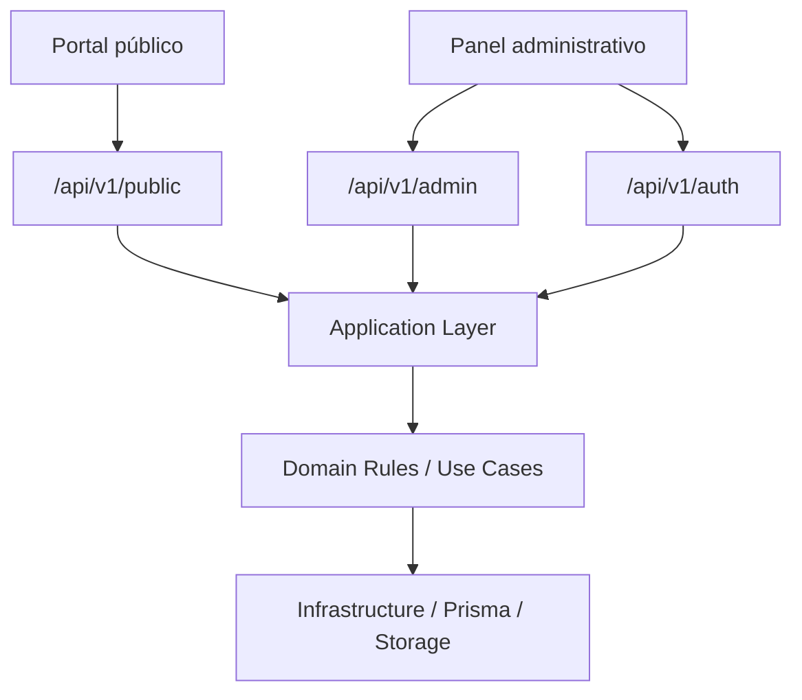

# Especificación Arquitectónica de API

| Campo | Valor |
|-------|-------|
| Proyecto | Plataforma de Gestión, Comunicación y Educación para la Salud |
| Cliente | Jurisdicción Sanitaria de Huejutla de Reyes, Hidalgo |
| Documento | Especificación Arquitectónica de API |
| Código | DOC-013 |
| Versión | 1.0.0 |
| Estado | Baseline |
| Fase | Phase 05 — API |
| Documento anterior | `docs/04-database/schema-prisma.md` |
| Documento posterior recomendado | `docs/05-api/authentication.md` |
| Artefacto técnico de referencia secundaria | `prisma/schema.prisma` |
| Rol arquitectónico | Chief Software Architect, Lead Software Architect, Solution Architect, Domain Architect & API Architect |
| Fecha | 2026-07-08 |

---

## 1. Propósito

Este documento define la **especificación arquitectónica inicial de la API** para la Plataforma de Gestión, Comunicación y Educación para la Salud de la Jurisdicción Sanitaria de Huejutla de Reyes, Hidalgo.

Su propósito es establecer cómo la API deberá exponer capacidades del dominio para administrar, preservar, publicar, distribuir y consultar conocimiento institucional sobre salud pública, sin filtrar directamente la estructura de persistencia ni convertir Prisma en contrato público.

La API deberá proteger la capacidad central del producto:

> **Publicar información confiable.**

Este documento no implementa la API. Define un contrato arquitectónico preliminar y revisable que deberá orientar los documentos posteriores de Frontend, Backend e implementación.

---

## 2. Alcance del documento

Este documento sí define:

- principios de diseño de API;
- separación entre superficie pública y superficie administrativa;
- criterios REST preliminares;
- convenciones de rutas;
- catálogo preliminar de endpoints por capacidad del dominio;
- actores principales por endpoint;
- propósito de cada endpoint;
- reglas de dominio aplicables a nivel conceptual;
- respuestas conceptuales esperadas;
- límites entre API, dominio, persistencia y backend;
- criterios de aceptación arquitectónica de la API.

---

## 3. Fuera de alcance

Este documento no genera ni autoriza:

- controladores NestJS;
- servicios;
- repositorios;
- DTOs reales;
- validadores de clase;
- guards;
- interceptors;
- pipes;
- entidades TypeScript;
- OpenAPI/Swagger definitivo;
- migraciones Prisma;
- SQL;
- seeders;
- frontend;
- integración automática con redes sociales;
- IA;
- embeddings;
- búsqueda semántica;
- chatbot;
- permisos avanzados;
- workflow editorial multinivel.

Los endpoints incluidos son **preliminares** y deberán entenderse como contrato arquitectónico revisable, no como implementación.

---

## 4. Relación con la baseline oficial

La API deriva de la baseline aprobada:

| Fuente | Aporte a la API |
|--------|-----------------|
| Foundation | La documentación gobierna el desarrollo y la tecnología sirve al propósito institucional. |
| Product | La capacidad central es publicar información confiable. |
| Product Principles | La API debe proteger confiabilidad, claridad, accesibilidad, prevención y responsabilidad institucional. |
| Personas | La API debe distinguir actores públicos, operador administrativo y responsabilidad institucional. |
| Ubiquitous Language | La API debe respetar Content, Publicación, Fuente, Validación, Campaña, Enfermedad, Recurso, Canal, Línea del Tiempo y Trazabilidad. |
| Domain | La API debe exponer capacidades del ciclo de vida del conocimiento institucional. |
| Business Rules | La API debe impedir acciones que rompan confiabilidad, vigencia, trazabilidad o frontera no clínica. |
| Use Cases | La API debe soportar interacciones actor-dominio sin convertirse en CRUD directo de persistencia. |
| Architecture | La API debe respetar Clean Architecture, Modular Monolith, DDD Lite y separación entre dominio e infraestructura. |
| Database | La API puede apoyarse en el modelo de persistencia, pero no debe exponerlo como contrato directo. |
| `schema.prisma` | Referencia técnica secundaria para consistencia estructural, no fuente de verdad del dominio ni contrato de API. |

---

## 5. Principio rector de API

> La API debe exponer capacidades institucionales del dominio, no tablas, modelos Prisma ni detalles internos de persistencia.

La API no deberá ser una capa CRUD generada automáticamente a partir de `schema.prisma`.

La API deberá expresar operaciones del producto como:

- consultar información publicada;
- buscar conocimiento publicado;
- gestionar contenido institucional;
- preparar información para publicación;
- publicar información confiable;
- actualizar, retirar, archivar o contextualizar publicaciones;
- gestionar fuentes y validaciones;
- administrar campañas y enfermedades como entidades organizadoras;
- gestionar recursos multimedia reutilizables;
- preservar línea del tiempo institucional;
- preparar distribución por canales;
- consultar trazabilidad institucional mínima.

---

## 6. Decisiones arquitectónicas de API

### API-DEC-001 — REST como estilo inicial

La API utilizará REST como estilo inicial por claridad, compatibilidad con frontend web, facilidad de documentación y alineación con el MVP.

REST no deberá interpretarse como CRUD automático. Las rutas deberán representar recursos o subrecursos del dominio, y las transiciones institucionales relevantes deberán exponerse como recursos de transición cuando sea necesario.

### API-DEC-002 — Versionado explícito

Toda ruta deberá iniciar con:

```text
/api/v1
```

Justificación: permite evolución futura sin romper clientes públicos o administrativos.

### API-DEC-003 — Separación entre superficie pública y administrativa

La API tendrá dos superficies principales:

```text
/api/v1/public/*
/api/v1/admin/*
```

La superficie pública expone información consultable por la población.

La superficie administrativa expone capacidades protegidas de gestión institucional.

### API-DEC-004 — La API pública no expone estados internos innecesarios

La población no necesita conocer los estados técnicos internos de Content o Publication. La API pública deberá exponer información vigente, históricamente contextualizada o disponible para consulta, sin revelar detalles internos del ciclo editorial salvo que aporten claridad pública.

### API-DEC-005 — La API administrativa no sustituye reglas del dominio

La API administrativa recibe intenciones del operador, pero las reglas de negocio deberán residir en la capa de aplicación/dominio. Un endpoint no deberá permitir publicar, retirar, archivar o distribuir información si el dominio no lo permite.

### API-DEC-006 — Los modelos puente no se exponen como recursos principales

Modelos como `ContentSource`, `ContentValidation`, `ContentCampaign`, `ContentDisease`, `ContentMediaResource`, `PublicationChannel`, `TimelineEventContent` y `TimelineEventMediaResource` no deberán exponerse como recursos CRUD principales.

Las relaciones deberán administrarse mediante endpoints del recurso dueño o de la capacidad correspondiente.

### API-DEC-007 — La trazabilidad se genera como consecuencia institucional

La API podrá exponer consulta de trazabilidad administrativa, pero no deberá permitir manipular libremente la trazabilidad como si fuera contenido ordinario.

Los registros de trazabilidad deberán generarse como consecuencia de operaciones relevantes del dominio.

### API-DEC-008 — Línea del Tiempo con recursos multimedia propios

La Línea del Tiempo tendrá capacidad de asociar recursos multimedia directamente a eventos históricos institucionales mediante la relación conceptual:

```text
TimelineEvent -> TimelineEventMediaResource -> MediaResource
```

Esta decisión responde a que los eventos de línea del tiempo pueden ser independientes de los contenidos generales de la aplicación.

`TimelineEventContent` se conserva para relaciones opcionales con Content cuando exista contexto editorial relacionado, pero no será obligatorio para que un evento histórico tenga multimedia propio.

### API-DEC-009 — Autenticación se documentará en archivo separado

Este documento incluye únicamente endpoints mínimos de autenticación para delimitar superficie API. La especificación detallada de sesión, JWT, refresh token, cookies HttpOnly, expiración, rotación y cierre de sesión pertenecerá a:

```text
docs/05-api/authentication.md
```

### API-DEC-010 — Sin IA en la API del MVP

La API no deberá exponer endpoints de IA, embeddings, pgvector, chatbot, respuestas generadas ni búsqueda semántica durante el MVP.

---

## 7. Superficies de API



La separación protege al dominio de dos riesgos:

1. Que la consulta pública conozca detalles editoriales internos.
2. Que la administración se convierta en CRUD directo de tablas.

---

## 8. Convenciones generales

### 8.1 Base path

```text
/api/v1
```

### 8.2 Formato de intercambio

Formato principal:

```text
application/json
```

Para carga de archivos o recursos binarios, la implementación podrá utilizar `multipart/form-data`, pero el detalle pertenece a Backend.

### 8.3 Identificadores

La API administrativa podrá usar identificadores técnicos internos:

```text
{id}
```

La API pública deberá preferir identificadores legibles cuando aplique:

```text
{slug}
{publicSlug}
```

### 8.4 Fechas

Las fechas deberán exponerse en formato ISO 8601.

### 8.5 Paginación

Los listados deberán soportar paginación conceptual:

```text
page
pageSize
```

Respuesta conceptual esperada:

```text
items
pagination.page
pagination.pageSize
pagination.totalItems
pagination.totalPages
```

La forma final del envelope podrá precisarse en Backend.

### 8.6 Filtros y ordenamiento

Los filtros deberán ser explícitos y comprensibles. No se permitirá exponer consultas arbitrarias de base de datos.

Ejemplos aceptables:

```text
q
category
contentType
campaign
disease
from
to
isVisible
status
```

### 8.7 Soft delete y archivado

La API no deberá confundir soft delete técnico con archivado institucional.

- `DELETE` administrativo representa desactivación operativa, retiro técnico o eliminación lógica según el recurso y la política técnica aplicable.
- `DELETE` no representa archivado institucional.
- Archivado, retiro, restauración y contextualización histórica deberán exponerse como transiciones institucionales explícitas cuando apliquen.
- Ninguna eliminación operativa deberá destruir trazabilidad institucional mínima.

### 8.8 Errores

La API deberá utilizar errores consistentes.

| Código HTTP | Uso conceptual |
|------------|----------------|
| 400 | Solicitud inválida o inconsistente. |
| 401 | No autenticado. |
| 403 | Autenticado sin autorización suficiente. |
| 404 | Recurso no encontrado o no disponible. |
| 409 | Conflicto con regla de negocio o estado actual. |
| 422 | Datos semánticamente inválidos para el dominio. |
| 500 | Error interno no esperado. |

Formato conceptual recomendado:

```text
error.code
error.message
error.details
traceId
```

---

## 9. Actores de API

| Actor | Superficie principal | Descripción |
|-------|----------------------|-------------|
| Ciudadano | Pública | Consulta publicaciones, campañas, enfermedades, recursos visibles, búsqueda y línea del tiempo. |
| Estudiante | Pública | Consulta información institucional para aprendizaje. |
| Investigador | Pública | Consulta información y memoria institucional. |
| Medio de Comunicación | Pública | Consulta información oficial para difusión externa. |
| Profesional de la Salud | Pública / Administrativa indirecta | Consulta y puede aportar conocimiento mediante operación institucional, según proceso interno. |
| Responsable Editorial / Administrador de Plataforma | Administrativa | Gestiona contenido, recursos, publicaciones, campañas, enfermedades, fuentes, validaciones, canales y línea del tiempo. |
| Jurisdicción Sanitaria | Responsabilidad institucional | No necesariamente opera endpoints; asume responsabilidad institucional de lo publicado. |

---

## 10. Catálogo preliminar de endpoints públicos

Los endpoints públicos deberán exponer únicamente información disponible para consulta ciudadana, vigente o históricamente contextualizada.

Las rutas públicas específicas deberán declararse antes que las rutas parametrizadas durante la implementación para evitar colisiones; este documento evita esa ambigüedad usando rutas explícitas como `/featured-publications`.

### 10.1 Publicaciones públicas

| Método | Ruta | Propósito | Actor principal | Resultado conceptual |
|--------|------|-----------|-----------------|----------------------|
| GET | `/api/v1/public/publications` | Listar publicaciones disponibles para consulta pública. | Ciudadano | Lista paginada de publicaciones visibles. Soporta filtros por `contentTypeCode`, `categoryId` y `tagId`. |
| GET | `/api/v1/public/publications/{publicSlug}` | Consultar detalle de una publicación pública. | Ciudadano | Publicación con contenido, clasificación, recursos con `caption`/`sortOrder`/`altText`, vigencia y contexto público. |
| GET | `/api/v1/public/featured-publications` | Consultar publicaciones destacadas. | Ciudadano | Lista de publicaciones destacadas para inicio o secciones públicas. |
| GET | `/api/v1/public/categories/{slug}/publications` | Listar publicaciones por categoría (slug). | Ciudadano | Publicaciones visibles filtradas por categoría, paginadas. Incluye metadatos de la categoría. |
| GET | `/api/v1/public/tags/{slug}/publications` | Listar publicaciones por etiqueta (slug). | Ciudadano | Publicaciones visibles filtradas por etiqueta, paginadas. Incluye metadatos de la etiqueta. |

Reglas conceptuales aplicables:

- solo se muestran publicaciones disponibles para consulta pública;
- información retirada no debe aparecer como vigente;
- información histórica debe presentarse con contexto claro;
- la respuesta pública no debe exponer detalles internos innecesarios;
- los filtros por categoría y etiqueta pueden combinarse.

---

### 10.2 Búsqueda pública

| Método | Ruta | Propósito | Actor principal | Resultado conceptual |
|--------|------|-----------|-----------------|----------------------|
| GET | `/api/v1/public/search` | Buscar información publicada mediante criterios básicos. | Ciudadano | Resultados públicos por texto, tipo, categoría, campaña, enfermedad o fecha. |

Filtros conceptuales:

```text
q
contentType
category
tag
campaign
disease
from
to
page
pageSize
```

Fuera de alcance:

- búsqueda semántica;
- embeddings;
- recomendaciones automatizadas;
- chatbot;
- respuestas generadas por IA.

---

### 10.3 Campañas públicas

| Método | Ruta | Propósito | Actor principal | Resultado conceptual |
|--------|------|-----------|-----------------|----------------------|
| GET | `/api/v1/public/campaigns` | Listar campañas visibles o consultables. | Ciudadano | Lista de campañas vigentes o históricas contextualizadas. |
| GET | `/api/v1/public/campaigns/{slug}` | Consultar una campaña. | Ciudadano | Campaña con propósito, periodo, contexto, enfermedades y publicaciones relacionadas. |
| GET | `/api/v1/public/campaigns/{slug}/publications` | Consultar publicaciones relacionadas con una campaña. | Ciudadano | Lista paginada de publicaciones públicas relacionadas. |

Reglas conceptuales aplicables:

- Campaign no es Content;
- Campaign no es Publication;
- una campaña puede finalizar sin retirar automáticamente sus publicaciones;
- campañas históricas deben presentarse con contexto.

---

### 10.4 Enfermedades públicas

| Método | Ruta | Propósito | Actor principal | Resultado conceptual |
|--------|------|-----------|-----------------|----------------------|
| GET | `/api/v1/public/diseases` | Listar enfermedades como conceptos temáticos de salud pública. | Ciudadano | Lista de enfermedades activas o consultables. |
| GET | `/api/v1/public/diseases/{slug}` | Consultar información temática de una enfermedad. | Ciudadano | Enfermedad con descripción pública, campañas y publicaciones relacionadas. |
| GET | `/api/v1/public/diseases/{slug}/publications` | Consultar publicaciones relacionadas con una enfermedad. | Ciudadano | Lista paginada de publicaciones públicas relacionadas. |

Reglas conceptuales aplicables:

- Disease no es Content;
- Disease no es Category ni Tag;
- la información debe mantenerse dentro de comunicación y educación en salud pública;
- no se debe ofrecer diagnóstico, tratamiento individual ni consulta médica.

---

### 10.5 Línea del Tiempo pública

| Método | Ruta | Propósito | Actor principal | Resultado conceptual |
|--------|------|-----------|-----------------|----------------------|
| GET | `/api/v1/public/timeline-events` | Listar eventos históricos institucionales visibles. | Ciudadano / Investigador | Línea del tiempo pública paginada u ordenada cronológicamente. |
| GET | `/api/v1/public/timeline-events/{slug}` | Consultar detalle de evento histórico. | Ciudadano / Investigador | Evento histórico con descripción, periodo, relevancia, recursos multimedia propios y contenidos relacionados opcionales. |
| GET | `/api/v1/public/timeline-events/{slug}/media-resources` | Consultar recursos multimedia propios de un evento histórico. | Ciudadano | Lista de recursos asociados directamente al evento. |
| GET | `/api/v1/public/timeline-events/{slug}/related-publications` | Consultar publicaciones relacionadas opcionales. | Ciudadano | Publicaciones públicas vinculadas al evento, si existen. |

Decisión relevante:

La Línea del Tiempo puede tener recursos multimedia propios sin depender de Content. Esto preserva su independencia como memoria institucional.

---

### 10.6 Clasificación pública

| Método | Ruta | Propósito | Actor principal | Resultado conceptual |
|--------|------|-----------|-----------------|----------------------|
| GET | `/api/v1/public/content-types` | Listar tipos editoriales visibles. | Ciudadano | Tipos usados para navegación pública. |
| GET | `/api/v1/public/categories` | Listar categorías públicas. | Ciudadano | Categorías activas para navegación. |
| GET | `/api/v1/public/tags` | Listar etiquetas públicas. | Ciudadano | Etiquetas activas para navegación o consulta. |

La clasificación pública debe favorecer búsqueda y comprensión, no exponer taxonomía técnica innecesaria.

Los endpoints `/api/v1/public/categories/{slug}/publications` y `/api/v1/public/tags/{slug}/publications` permiten navegar publicaciones por clasificación. El listado general también soporta filtros directos por `categoryId` y `tagId`.

---

### 10.7 Recursos públicos

| Método | Ruta | Propósito | Actor principal | Resultado conceptual |
|--------|------|-----------|-----------------|----------------------|
| GET | `/api/v1/public/media-resources/{id}` | Consultar metadatos públicos de un recurso. | Ciudadano | Recurso visible con título, descripción, tipo, URL pública o referencia de acceso. |

La entrega física del archivo puede resolverse por Storage Provider, CDN o ruta de backend. Este documento no define infraestructura de archivos.

### 10.8 Contrato multimedia unificado

Los recursos multimedia expuestos en respuestas públicas de Content (Publication detail) y TimelineEvent comparten una estructura común que incluye metadatos de la asociación:

```text
id
type             - Tipo de recurso (IMAGE, VIDEO, PDF, AUDIO)
title
description      - Opcional
url              - URL resuelta por StorageProvider.externalUrl
mimeType         - Opcional
altText          - Texto alternativo accesible
caption          - Leyenda de la asociación (opcional, join table)
sortOrder        - Orden dentro del recurso padre (opcional, join table)
```

El endpoint específico `/api/v1/public/media-resources/{id}` expone metadatos del recurso como entidad independiente (sin datos de asociación), incluyendo `resourceUri` y `externalUrl` como referencias de acceso.

---

## 11. Catálogo preliminar de endpoints de autenticación

La especificación detallada se documentará en `authentication.md`. Por ahora se establece el límite mínimo de superficie.

| Método | Ruta | Propósito | Actor principal | Resultado conceptual |
|--------|------|-----------|-----------------|----------------------|
| POST | `/api/v1/auth/login` | Iniciar sesión administrativa. | Responsable Editorial / Administrador | Sesión autenticada. |
| POST | `/api/v1/auth/refresh` | Renovar sesión. | Responsable Editorial / Administrador | Sesión renovada. |
| POST | `/api/v1/auth/logout` | Cerrar sesión. | Responsable Editorial / Administrador | Sesión cerrada. |
| GET | `/api/v1/auth/me` | Consultar identidad operativa actual. | Responsable Editorial / Administrador | Usuario autenticado y estado operativo. |

Pendiente para `authentication.md`:

- estrategia JWT;
- refresh tokens;
- cookies HttpOnly;
- expiración;
- rotación;
- invalidación;
- protección CSRF si aplica;
- manejo de sesión en frontend.

---

## 12. Catálogo preliminar de endpoints administrativos

Los endpoints administrativos requieren autenticación. La autorización fina se documentará posteriormente si el MVP evoluciona a roles avanzados.

---

### 12.1 Gestión de contenido institucional

| Método | Ruta | Propósito | Actor principal | Resultado conceptual |
|--------|------|-----------|-----------------|----------------------|
| GET | `/api/v1/admin/contents` | Listar contenidos institucionales administrables. | Responsable Editorial / Administrador | Lista paginada con filtros administrativos. |
| POST | `/api/v1/admin/contents` | Crear contenido institucional. | Responsable Editorial / Administrador | Content creado en estado inicial. |
| GET | `/api/v1/admin/contents/{id}` | Consultar detalle administrativo de Content. | Responsable Editorial / Administrador | Content con relaciones editoriales y estado. |
| PATCH | `/api/v1/admin/contents/{id}` | Actualizar datos editoriales de Content. | Responsable Editorial / Administrador | Content actualizado. |
| DELETE | `/api/v1/admin/contents/{id}` | Retirar operativamente un Content no requerido. | Responsable Editorial / Administrador | Content desactivado o eliminado lógicamente según política técnica. |

Reglas conceptuales:

- crear Content no equivale a publicarlo;
- Content debe conservar responsabilidad operativa;
- Content no sustituye el Conocimiento Institucional;
- DELETE no debe reemplazar archivado de Publication.

---

### 12.2 Preparación editorial de Content

| Método | Ruta | Propósito | Actor principal | Resultado conceptual |
|--------|------|-----------|-----------------|----------------------|
| POST | `/api/v1/admin/contents/{id}/preparation` | Marcar o registrar preparación editorial. | Responsable Editorial / Administrador | Content preparado para validación/publicación según reglas. |
| POST | `/api/v1/admin/contents/{id}/sources` | Asociar fuente a Content. | Responsable Editorial / Administrador | Fuente vinculada al contenido. |
| DELETE | `/api/v1/admin/contents/{id}/sources/{sourceId}` | Retirar asociación de fuente. | Responsable Editorial / Administrador | Asociación retirada con trazabilidad si corresponde. |
| POST | `/api/v1/admin/contents/{id}/validations` | Asociar validación a Content. | Responsable Editorial / Administrador | Validación vinculada al contenido. |
| DELETE | `/api/v1/admin/contents/{id}/validations/{validationId}` | Retirar asociación de validación. | Responsable Editorial / Administrador | Asociación retirada según reglas. |

Notas:

- estas rutas administran relaciones sin exponer modelos puente como recursos principales;
- la validación no debe reducirse a booleano;
- el dominio debe impedir publicación sin validación suficiente.

---

### 12.3 Clasificación de Content

| Método | Ruta | Propósito | Actor principal | Resultado conceptual |
|--------|------|-----------|-----------------|----------------------|
| PUT | `/api/v1/admin/contents/{id}/categories` | Reemplazar categorías asociadas. | Responsable Editorial / Administrador | Clasificación por categorías actualizada. |
| PUT | `/api/v1/admin/contents/{id}/tags` | Reemplazar etiquetas asociadas. | Responsable Editorial / Administrador | Clasificación por etiquetas actualizada. |
| PATCH | `/api/v1/admin/contents/{id}/content-type` | Cambiar tipo editorial si el dominio lo permite. | Responsable Editorial / Administrador | Tipo editorial actualizado. |

Reglas conceptuales:

- la clasificación debe facilitar consulta pública;
- ContentType, Category y Tag no reemplazan Campaign ni Disease;
- cambios de clasificación relevantes pueden generar trazabilidad.

---

### 12.4 Relaciones de Content con campañas, enfermedades y recursos

| Método | Ruta | Propósito | Actor principal | Resultado conceptual |
|--------|------|-----------|-----------------|----------------------|
| PUT | `/api/v1/admin/contents/{id}/campaigns` | Reemplazar campañas asociadas al Content. | Responsable Editorial / Administrador | Relaciones con campañas actualizadas. |
| PUT | `/api/v1/admin/contents/{id}/diseases` | Reemplazar enfermedades asociadas al Content. | Responsable Editorial / Administrador | Relaciones con enfermedades actualizadas. |
| PUT | `/api/v1/admin/contents/{id}/media-resources` | Reemplazar recursos multimedia asociados al Content. | Responsable Editorial / Administrador | Recursos del contenido actualizados. |
| PATCH | `/api/v1/admin/contents/{id}/media-resources/{mediaResourceId}` | Actualizar metadatos de asociación, como caption u orden. | Responsable Editorial / Administrador | Asociación multimedia actualizada. |

Notas:

- Campaign y Disease siguen siendo entidades organizadoras independientes;
- MediaResource puede reutilizarse en múltiples contenidos;
- recursos de Content no sustituyen recursos propios de TimelineEvent;
- `PUT /media-resources` reemplaza el conjunto completo de asociaciones del Content; si se requiere granularidad futura, podrán agregarse operaciones específicas de agregado y retiro sobre subrecursos.

---

### 12.5 Publicación institucional

| Método | Ruta | Propósito | Actor principal | Resultado conceptual |
|--------|------|-----------|-----------------|----------------------|
| POST | `/api/v1/admin/contents/{id}/publication` | Crear publicación pública a partir de Content. | Responsable Editorial / Administrador | Publication creada si el dominio lo permite. |
| GET | `/api/v1/admin/publications` | Listar publicaciones administrativas. | Responsable Editorial / Administrador | Lista paginada con estado, visibilidad y fechas. |
| GET | `/api/v1/admin/publications/{id}` | Consultar detalle administrativo de Publication. | Responsable Editorial / Administrador | Publication con Content, estado, visibilidad, canales y trazabilidad relacionada. |
| PATCH | `/api/v1/admin/publications/{id}` | Actualizar metadatos públicos de la publicación. | Responsable Editorial / Administrador | Publication actualizada. |

Reglas conceptuales:

- Publication es hecho institucional de exposición pública;
- no es booleano dentro de Content;
- solo puede derivar de Content;
- debe conservar responsabilidad institucional;
- publicar debe generar trazabilidad.

---

### 12.6 Transiciones institucionales de Publication

| Método | Ruta | Propósito | Actor principal | Resultado conceptual |
|--------|------|-----------|-----------------|----------------------|
| POST | `/api/v1/admin/publications/{id}/withdrawal` | Retirar publicación de consulta pública. | Responsable Editorial / Administrador | Publication retirada, con fecha y trazabilidad. |
| POST | `/api/v1/admin/publications/{id}/archive` | Archivar publicación preservando memoria institucional. | Responsable Editorial / Administrador | Publication archivada. |
| POST | `/api/v1/admin/publications/{id}/restoration` | Restaurar publicación cuando el dominio lo permita. | Responsable Editorial / Administrador | Publication restaurada o disponible nuevamente. |
| POST | `/api/v1/admin/publications/{id}/historical-context` | Contextualizar publicación como histórica. | Responsable Editorial / Administrador | Publication disponible con contexto histórico. |

Notas:

- estas rutas representan recursos de transición, no CRUD directo;
- la implementación deberá validar estados permitidos;
- retiro y archivo no eliminan trazabilidad;
- información histórica no debe presentarse como vigente.

---

### 12.7 Fuentes

| Método | Ruta | Propósito | Actor principal | Resultado conceptual |
|--------|------|-----------|-----------------|----------------------|
| GET | `/api/v1/admin/sources` | Listar fuentes institucionales, documentales o externas. | Responsable Editorial / Administrador | Lista paginada de fuentes. |
| POST | `/api/v1/admin/sources` | Crear fuente. | Responsable Editorial / Administrador | Source creada. |
| GET | `/api/v1/admin/sources/{id}` | Consultar fuente. | Responsable Editorial / Administrador | Fuente con relaciones conceptuales. |
| PATCH | `/api/v1/admin/sources/{id}` | Actualizar fuente. | Responsable Editorial / Administrador | Fuente actualizada. |
| DELETE | `/api/v1/admin/sources/{id}` | Desactivar fuente si no rompe trazabilidad. | Responsable Editorial / Administrador | Fuente desactivada o retirada operativamente. |

Reglas conceptuales:

- Source no es Content;
- Source no es Channel;
- una fuente puede respaldar múltiples contenidos;
- no debe forzarse fuente oficial externa para conocimiento generado por la Jurisdicción.

---

### 12.8 Validaciones

| Método | Ruta | Propósito | Actor principal | Resultado conceptual |
|--------|------|-----------|-----------------|----------------------|
| GET | `/api/v1/admin/validations` | Listar validaciones. | Responsable Editorial / Administrador | Lista paginada de validaciones. |
| POST | `/api/v1/admin/validations` | Registrar validación institucional. | Responsable Editorial / Administrador | Validation creada. |
| GET | `/api/v1/admin/validations/{id}` | Consultar validación. | Responsable Editorial / Administrador | Validación con tipo, resultado, fuente opcional y responsable operativo. |
| PATCH | `/api/v1/admin/validations/{id}` | Actualizar metadatos de validación si el dominio lo permite. | Responsable Editorial / Administrador | Validación actualizada. |

Reglas conceptuales:

- Validation no es booleano;
- la validación puede asociarse opcionalmente a Source;
- una validación de conocimiento generado por la Jurisdicción no debe requerir fuente externa;
- la validación protege autenticidad, vigencia, pertinencia o validación completa.

---

### 12.9 Campañas administrativas

| Método | Ruta | Propósito | Actor principal | Resultado conceptual |
|--------|------|-----------|-----------------|----------------------|
| GET | `/api/v1/admin/campaigns` | Listar campañas. | Responsable Editorial / Administrador | Lista administrativa de campañas. |
| POST | `/api/v1/admin/campaigns` | Crear campaña. | Responsable Editorial / Administrador | Campaign creada como entidad organizadora. |
| GET | `/api/v1/admin/campaigns/{id}` | Consultar campaña. | Responsable Editorial / Administrador | Campaña con relaciones a contenidos y enfermedades. |
| PATCH | `/api/v1/admin/campaigns/{id}` | Actualizar campaña. | Responsable Editorial / Administrador | Campaign actualizada. |
| DELETE | `/api/v1/admin/campaigns/{id}` | Desactivar campaña si el dominio lo permite. | Responsable Editorial / Administrador | Campaign desactivada. |
| PUT | `/api/v1/admin/campaigns/{id}/diseases` | Reemplazar enfermedades relacionadas. | Responsable Editorial / Administrador | Relaciones Campaign-Disease actualizadas. |

Reglas conceptuales:

- Campaign no es Content;
- Campaign no es tipo editorial;
- una campaña organiza publicaciones alrededor de una necesidad institucional temporal;
- finalizar una campaña no obliga a retirar sus publicaciones.

---

### 12.10 Enfermedades administrativas

| Método | Ruta | Propósito | Actor principal | Resultado conceptual |
|--------|------|-----------|-----------------|----------------------|
| GET | `/api/v1/admin/diseases` | Listar enfermedades. | Responsable Editorial / Administrador | Lista administrativa de enfermedades. |
| POST | `/api/v1/admin/diseases` | Crear enfermedad como concepto temático. | Responsable Editorial / Administrador | Disease creada. |
| GET | `/api/v1/admin/diseases/{id}` | Consultar enfermedad. | Responsable Editorial / Administrador | Disease con relaciones a campañas y contenidos. |
| PATCH | `/api/v1/admin/diseases/{id}` | Actualizar enfermedad. | Responsable Editorial / Administrador | Disease actualizada. |
| DELETE | `/api/v1/admin/diseases/{id}` | Desactivar enfermedad si el dominio lo permite. | Responsable Editorial / Administrador | Disease desactivada. |

Reglas conceptuales:

- Disease no representa diagnóstico;
- Disease no es Content ni Category;
- la información debe permanecer dentro de salud pública, prevención y educación.

---

### 12.11 Recursos multimedia administrativos

| Método | Ruta | Propósito | Actor principal | Resultado conceptual |
|--------|------|-----------|-----------------|----------------------|
| GET | `/api/v1/admin/media-resources` | Listar recursos multimedia. | Responsable Editorial / Administrador | Lista paginada de recursos. |
| POST | `/api/v1/admin/media-resources` | Crear o registrar recurso multimedia. | Responsable Editorial / Administrador | MediaResource creado. |
| GET | `/api/v1/admin/media-resources/{id}` | Consultar recurso multimedia. | Responsable Editorial / Administrador | Recurso con metadatos y relaciones. |
| PATCH | `/api/v1/admin/media-resources/{id}` | Actualizar metadatos del recurso. | Responsable Editorial / Administrador | Recurso actualizado. |
| DELETE | `/api/v1/admin/media-resources/{id}` | Desactivar recurso si no rompe consulta pública. | Responsable Editorial / Administrador | Recurso desactivado o retirado operativamente. |

Notas:

- MediaResource puede asociarse a Content o TimelineEvent;
- los recursos deben favorecer comprensión pública;
- la API no define todavía proveedor de almacenamiento.

---

### 12.12 Línea del Tiempo administrativa

| Método | Ruta | Propósito | Actor principal | Resultado conceptual |
|--------|------|-----------|-----------------|----------------------|
| GET | `/api/v1/admin/timeline-events` | Listar eventos históricos institucionales. | Responsable Editorial / Administrador | Lista administrativa de eventos. |
| POST | `/api/v1/admin/timeline-events` | Crear evento histórico institucional. | Responsable Editorial / Administrador | TimelineEvent creado. |
| GET | `/api/v1/admin/timeline-events/{id}` | Consultar evento histórico. | Responsable Editorial / Administrador | Evento con recursos propios y contenidos relacionados opcionales. |
| PATCH | `/api/v1/admin/timeline-events/{id}` | Actualizar evento histórico. | Responsable Editorial / Administrador | TimelineEvent actualizado. |
| DELETE | `/api/v1/admin/timeline-events/{id}` | Desactivar evento histórico si el dominio lo permite. | Responsable Editorial / Administrador | Evento desactivado o retirado operativamente. |
| PUT | `/api/v1/admin/timeline-events/{id}/media-resources` | Reemplazar recursos multimedia propios del evento. | Responsable Editorial / Administrador | Relaciones TimelineEvent-MediaResource actualizadas. |
| PATCH | `/api/v1/admin/timeline-events/{id}/media-resources/{mediaResourceId}` | Actualizar caption u orden del recurso en el evento. | Responsable Editorial / Administrador | Asociación multimedia del evento actualizada. |
| PUT | `/api/v1/admin/timeline-events/{id}/related-contents` | Reemplazar contenidos generales relacionados opcionales. | Responsable Editorial / Administrador | Relaciones TimelineEvent-Content actualizadas. |

Reglas conceptuales:

- la Línea del Tiempo preserva memoria institucional;
- no es agenda general;
- no es bitácora administrativa;
- puede tener recursos multimedia propios independientes de Content;
- la relación con Content es opcional y contextual;
- `PUT /media-resources` reemplaza el conjunto completo de recursos propios del TimelineEvent; si se requiere granularidad futura, podrán agregarse operaciones específicas de agregado y retiro sobre subrecursos.

---

### 12.13 Canales y distribución

| Método | Ruta | Propósito | Actor principal | Resultado conceptual |
|--------|------|-----------|-----------------|----------------------|
| GET | `/api/v1/admin/communication-channels` | Listar canales de comunicación. | Responsable Editorial / Administrador | Lista de canales configurados. |
| POST | `/api/v1/admin/communication-channels` | Crear canal de comunicación. | Responsable Editorial / Administrador | CommunicationChannel creado. |
| PATCH | `/api/v1/admin/communication-channels/{id}` | Actualizar canal. | Responsable Editorial / Administrador | Canal actualizado. |
| DELETE | `/api/v1/admin/communication-channels/{id}` | Desactivar canal. | Responsable Editorial / Administrador | Canal desactivado. |
| GET | `/api/v1/admin/publications/{id}/distribution-channels` | Consultar preparación por canales de una publicación. | Responsable Editorial / Administrador | Canales asociados y estado de distribución. |
| PUT | `/api/v1/admin/publications/{id}/distribution-channels` | Reemplazar canales preparados para una publicación. | Responsable Editorial / Administrador | PublicationChannel actualizado. |
| PATCH | `/api/v1/admin/publications/{id}/distribution-channels/{channelId}` | Actualizar texto preparado o estado de distribución. | Responsable Editorial / Administrador | Preparación de canal actualizada. |
| POST | `/api/v1/admin/publications/{id}/distribution-records` | Registrar distribución manual realizada. | Responsable Editorial / Administrador | Distribución registrada como evento institucional. |

Reglas conceptuales:

- Channel no es Source;
- canales distribuyen, no generan verdad institucional;
- en MVP la distribución puede ser manual asistida;
- no se diseña integración automática con redes sociales en este documento.

---

### 12.14 Catálogos administrativos

| Método | Ruta | Propósito | Actor principal | Resultado conceptual |
|--------|------|-----------|-----------------|----------------------|
| GET | `/api/v1/admin/content-types` | Listar tipos editoriales. | Responsable Editorial / Administrador | Lista de ContentType. |
| POST | `/api/v1/admin/content-types` | Crear tipo editorial. | Responsable Editorial / Administrador | ContentType creado. |
| PATCH | `/api/v1/admin/content-types/{id}` | Actualizar tipo editorial. | Responsable Editorial / Administrador | ContentType actualizado. |
| GET | `/api/v1/admin/categories` | Listar categorías. | Responsable Editorial / Administrador | Lista de categorías. |
| POST | `/api/v1/admin/categories` | Crear categoría. | Responsable Editorial / Administrador | Category creada. |
| PATCH | `/api/v1/admin/categories/{id}` | Actualizar categoría. | Responsable Editorial / Administrador | Category actualizada. |
| GET | `/api/v1/admin/tags` | Listar etiquetas. | Responsable Editorial / Administrador | Lista de etiquetas. |
| POST | `/api/v1/admin/tags` | Crear etiqueta. | Responsable Editorial / Administrador | Tag creada. |
| PATCH | `/api/v1/admin/tags/{id}` | Actualizar etiqueta. | Responsable Editorial / Administrador | Tag actualizada. |

Nota:

Estos catálogos apoyan organización editorial. No reemplazan campañas, enfermedades, fuentes ni validaciones.

---

### 12.15 Trazabilidad administrativa

| Método | Ruta | Propósito | Actor principal | Resultado conceptual |
|--------|------|-----------|-----------------|----------------------|
| GET | `/api/v1/admin/traceability-records` | Consultar trazabilidad institucional mínima. | Responsable Editorial / Administrador | Lista paginada de eventos de trazabilidad. |
| GET | `/api/v1/admin/contents/{id}/traceability-records` | Consultar trazabilidad de un Content. | Responsable Editorial / Administrador | Eventos relacionados con el contenido. |
| GET | `/api/v1/admin/publications/{id}/traceability-records` | Consultar trazabilidad de una Publication. | Responsable Editorial / Administrador | Eventos relacionados con la publicación. |
| GET | `/api/v1/admin/sources/{id}/traceability-records` | Consultar trazabilidad de una Source. | Responsable Editorial / Administrador | Eventos relacionados con la fuente. |
| GET | `/api/v1/admin/validations/{id}/traceability-records` | Consultar trazabilidad de una Validation. | Responsable Editorial / Administrador | Eventos relacionados con la validación. |

Restricciones:

- no se define `POST /traceability-records` como operación ordinaria;
- no se define `PATCH /traceability-records/{id}`;
- no se define `DELETE /traceability-records/{id}`;
- la trazabilidad se genera como consecuencia de operaciones relevantes.

---

## 13. Matriz endpoint-capacidad-caso de uso

| Capacidad | Endpoints principales | Casos de uso relacionados |
|-----------|----------------------|---------------------------|
| Consulta pública | `/public/publications`, `/public/search` | UC-001, UC-002 |
| Consulta de campañas | `/public/campaigns` | UC-003 |
| Consulta de enfermedades | `/public/diseases` | UC-004 |
| Línea del tiempo pública | `/public/timeline-events` | UC-005 |
| Administración inicial | `/auth/*` | UC-006 |
| Crear y gestionar publicación | `/admin/contents`, `/admin/contents/{id}/publication` | UC-007, UC-008, UC-009 |
| Actualización y vigencia | `/admin/publications/{id}`, transiciones de Publication | UC-010, UC-011, UC-012 |
| Gestión de fuentes | `/admin/sources`, `/admin/contents/{id}/sources` | UC-007, UC-008, UC-013 |
| Validación | `/admin/validations`, `/admin/contents/{id}/validations` | UC-008, UC-009, UC-013 |
| Recursos multimedia | `/admin/media-resources`, asociaciones con Content y TimelineEvent | UC-014 |
| Distribución | `/admin/publications/{id}/distribution-*` | UC-015 |
| Campañas | `/admin/campaigns` | UC-016 |
| Enfermedades | `/admin/diseases` | UC-017 |
| Línea del tiempo administrativa | `/admin/timeline-events` | UC-018 |
| Trazabilidad | `/admin/traceability-records` | UC-019 |

---

## 14. Relación entre API y persistencia

La API podrá apoyarse en la persistencia aprobada, pero no deberá exponerla mecánicamente.

Ejemplos de traducción correcta:

| Persistencia | Exposición API correcta |
|-------------|--------------------------|
| `contents` | `/admin/contents` como gestión editorial institucional. |
| `publications` | `/admin/publications` y `/public/publications` separando administración de consulta. |
| `content_sources` | `/admin/contents/{id}/sources` como relación de respaldo. |
| `content_validations` | `/admin/contents/{id}/validations` como relación de validación. |
| `publication_channels` | `/admin/publications/{id}/distribution-channels` como preparación de distribución. |
| `timeline_event_media_resources` | `/admin/timeline-events/{id}/media-resources` como multimedia propio de memoria institucional. |
| `traceability_records` | Consulta administrativa, generación por eventos de dominio. |

Ejemplos prohibidos o no recomendados:

```text
/api/v1/admin/content-sources
/api/v1/admin/content-validations
/api/v1/admin/content-campaigns
/api/v1/admin/publication-channels
/api/v1/admin/timeline-event-media-resources
```

Estos endpoints filtrarían modelos puente como recursos principales y debilitarían la orientación por capacidades.

---

## 15. Respuestas conceptuales por superficie

### 15.1 Respuesta pública de Publication

La respuesta pública deberá priorizar comprensión ciudadana:

```text
id o publicSlug
title
summary
body
publishedAt
updatedAtPublic
vigencia o contexto histórico cuando aplique
contentType
categories
tags
campaigns relacionadas
diseases relacionadas
mediaResources públicos (con caption, sortOrder, altText)
institutionalResponsibility cuando aporte confianza pública
```

La respuesta de detalle (`GET /public/publications/{publicSlug}`) incluye adicionalmente:

```text
categories: [ { id, name, slug } ]
tags: [ { id, name, slug } ]
mediaResources: [ { id, type, title, description, url, mimeType, altText, caption, sortOrder } ]
```

No deberá exponer por defecto:

```text
createdById
updatedById
status interno de Content
validations internas completas
traceability interna completa
deletedAt
identificadores de modelos puente
```

### 15.2 Respuesta administrativa de Content

La respuesta administrativa puede incluir mayor detalle operativo:

```text
id
title
slug
summary
body
status editorial
contentType
sources asociadas
validations asociadas
campaigns
diseases
mediaResources
categories
tags
publication relacionada
createdAt
updatedAt
createdBy
updatedBy
```

### 15.3 Respuesta administrativa de Publication

La respuesta administrativa puede incluir:

```text
id
content
publicSlug
publicTitle
status de publicación
publishedAt
updatedAtPublic
withdrawnAt
archivedAt
isVisible
institutionalResponsibility
distributionChannels
traceability resumida
```

### 15.4 Respuesta pública de TimelineEvent

La respuesta pública de un evento histórico deberá incluir:

```text
slug
title
description
occurredAt
periodLabel
historicalRelevance
mediaResources propios (con caption, sortOrder, altText)
relatedPublications opcionales
```

Cada `mediaResources` expone:

```text
{ id, type, title, url, altText, caption, sortOrder }
```

La relación con Content no es obligatoria para que el evento tenga valor público.

---

## 16. Reglas de protección del dominio en API

La API deberá aplicar, mediante capa de aplicación/dominio, las siguientes protecciones:

1. No publicar Content sin condiciones de validación suficientes.
2. No exponer como vigente una publicación retirada, archivada o histórica.
3. No eliminar trazabilidad por operaciones administrativas ordinarias.
4. No convertir Campaign o Disease en tipos editoriales.
5. No convertir Source en Channel ni Channel en Source.
6. No permitir que la distribución externa sea fuente de verdad.
7. No permitir contenido público sin responsabilidad institucional cuando aplique.
8. No permitir que la línea del tiempo se convierta en agenda general.
9. No exponer endpoints de IA en MVP.
10. No derivar endpoints automáticamente desde modelos Prisma.

---

## 17. Seguridad conceptual

La API deberá proteger:

- administración autenticada;
- operaciones de publicación;
- operaciones de retiro, archivo y restauración;
- carga o modificación de recursos;
- modificación de fuentes y validaciones;
- consulta de trazabilidad;
- configuración de canales;
- datos de autoría operativa.

La API pública no requiere autenticación para consulta de información publicada, pero sí debe impedir acceso a información no visible, retirada sin contexto público o administrativa.

El detalle técnico de autenticación y sesión queda pendiente para `authentication.md`.

---

## 18. Criterios de aceptación arquitectónica

La API será aceptable si cumple los siguientes criterios:

- expone capacidades del dominio y no tablas;
- separa superficie pública y administrativa;
- respeta Content y Publication como conceptos separados;
- permite que Content exista sin Publication;
- permite consultar publicaciones públicas por `publicSlug`;
- permite administrar Campaign y Disease como entidades organizadoras;
- permite administrar Source y Validation como entidades separadas;
- permite gestionar recursos multimedia reutilizables;
- permite que TimelineEvent tenga recursos multimedia propios independientes de Content;
- conserva TimelineEventContent solo como relación contextual opcional;
- no expone modelos puente como recursos principales;
- no expone IA, embeddings, pgvector ni chatbot;
- protege trazabilidad como efecto institucional, no como CRUD ordinario;
- diferencia archivado, retiro, restauración y contexto histórico de eliminación técnica;
- prepara Frontend y Backend sin adelantar implementación.

---

## 19. Riesgos identificados

| Riesgo | Impacto | Mitigación |
|--------|---------|------------|
| Convertir API en CRUD de Prisma | Alto | Organizar endpoints por capacidades y subrecursos. |
| Exponer estados internos al público | Medio | Diseñar respuestas públicas orientadas a comprensión. |
| Confundir archivado con delete | Alto | Mantener transiciones institucionales explícitas. |
| Debilitar trazabilidad | Alto | Generar trazabilidad como consecuencia de operaciones. |
| Sobrediseñar autenticación en MVP | Medio | Separar `authentication.md` y mantener MVP controlado. |
| Incorporar IA prematura | Alto | Mantener fuera de alcance todos los endpoints de IA. |
| Forzar TimelineEvent a depender de Content | Medio | Mantener `TimelineEventMediaResource` y relación directa con MediaResource. |

---

## 20. Decisiones pendientes

Las siguientes decisiones pueden resolverse en documentos posteriores sin bloquear esta Baseline:

1. Forma final del envelope de respuesta.
2. Convención exacta para códigos de error internos.
3. Detalle de autenticación y refresh token.
4. Política exacta de carga de archivos y Storage Provider.
5. Nivel de exposición pública de fuente y responsabilidad institucional.
6. Reglas finas de autorización si se separan roles en versiones posteriores.
7. Estructura final de documentación Swagger/OpenAPI.

---

## 21. Dictamen de Phase 05 API Baseline

Este documento establece la especificación arquitectónica baseline de API para continuar la Phase 05 — API.

El catálogo preliminar de endpoints permite avanzar hacia:

```text
api.md
↓
authentication.md
↓
frontend.md
↓
backend.md
```

sin ejecutar implementación, sin generar controladores, sin crear DTOs reales y sin convertir Prisma en contrato de API.

