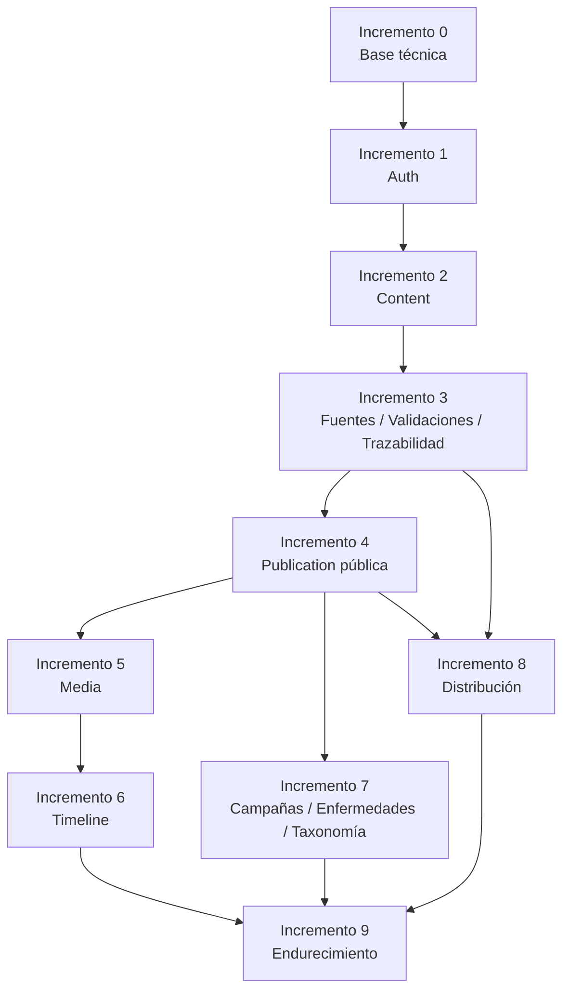

# Plan de Implementación Backend

## 1. Información del Documento

| Campo | Valor |
|-------|-------|
| Proyecto | Plataforma de Gestión, Comunicación y Educación para la Salud |
| Cliente | Jurisdicción Sanitaria de Huejutla de Reyes, Hidalgo |
| Documento | Plan de Implementación Backend |
| Código | DOC-018 |
| Versión | 1.0.0 |
| Estado | Baseline |
| Fase | Phase 07 — Backend |
| Documento anterior | `docs/07-backend/backend.md` |
| Documento siguiente recomendado | `docs/07-backend/application-use-cases.md` |
| Rol arquitectónico | Chief Software Architect, Lead Software Architect, Solution Architect, Backend Architect & Domain Architect |
| Fecha | 2026-07-08 |

---

## 2. Propósito

Este documento define el **plan de implementación backend** para la Plataforma de Gestión, Comunicación y Educación para la Salud.

Su propósito es establecer una secuencia de construcción controlada, incremental y trazable para implementar el backend sin romper la baseline aprobada de negocio, dominio, arquitectura, persistencia, API y frontend.

El plan organiza el trabajo por **entregas incrementales de valor**, no por carpetas, controladores o tablas.

La capacidad central que gobierna este documento permanece vigente:

> Publicar información confiable.

Este documento no genera código. No define controladores NestJS reales, servicios, repositorios, DTOs, entidades TypeScript, migraciones, seeds ni pruebas implementadas.

---

## 3. Relación con la Baseline Oficial

Este documento deriva de la baseline vigente:

| Fuente | Relación con este documento |
|--------|-----------------------------|
| Product | Define propósito, alcance MVP y prioridad de publicar información confiable. |
| Domain | Define conceptos, reglas y casos de uso que backend deberá respetar. |
| Architecture | Define Clean Architecture, Modular Monolith, DDD Lite y separación de capas. |
| Database | Define persistencia subordinada al dominio y uso de Prisma como mecanismo técnico. |
| API | Define contrato REST público, administrativo y autenticación. |
| Frontend | Define rutas/pantallas que consumirán capacidades backend. |
| Backend | Define módulos preliminares, capas, límites y criterios arquitectónicos. |

Este documento no reinterpreta decisiones cerradas. Ordena su implementación futura.

---

## 4. Alcance

Este documento sí define:

- estrategia incremental de implementación backend;
- orden recomendado de construcción;
- entregas de valor;
- módulos backend involucrados por incremento;
- endpoints afectados por incremento;
- entidades persistentes relacionadas;
- criterios de aceptación por incremento;
- riesgos por incremento;
- dependencias entre incrementos;
- límites de implementación;
- criterios para iniciar código;
- criterios para no avanzar a un incremento posterior.

---

## 5. Fuera de Alcance

Este documento no define ni genera:

- código NestJS;
- módulos NestJS reales;
- controllers;
- services;
- repositories;
- DTOs;
- entities TypeScript;
- validators concretos;
- guards reales;
- interceptors reales;
- migraciones;
- seeds;
- comandos Prisma;
- SQL;
- pruebas implementadas;
- frontend;
- DevOps;
- CI/CD;
- despliegue;
- IA;
- embeddings;
- pgvector;
- chatbot;
- roles avanzados;
- workflow editorial multinivel.

---

## 6. Principios del Plan de Implementación

### BE-PLAN-001. Implementar valor antes que carpetas

La implementación deberá avanzar por capacidades verificables del producto, no por creación mecánica de módulos o CRUDs.

Un incremento deberá entregar una capacidad funcional comprobable, aunque sea mínima.

### BE-PLAN-002. Dominio antes que Prisma

Prisma deberá usarse como infraestructura. Los modelos Prisma no deberán convertirse en entidades de dominio ni contrato directo de API.

### BE-PLAN-003. API como contrato, no como origen del dominio

Los endpoints definidos en `api.md` orientan la superficie backend, pero las reglas de negocio provienen de `business-rules.md` y `use-cases.md`.

### BE-PLAN-004. Frontend como consumidor, no como dueño del backend

Las rutas y pantallas frontend ayudan a priorizar, pero no deben imponer reglas de dominio.

### BE-PLAN-005. Implementación vertical mínima

Cada incremento deberá incluir, cuando aplique:

```text
Contrato API
↓
Caso de uso de aplicación
↓
Regla de dominio aplicable
↓
Persistencia necesaria
↓
Respuesta consumible por frontend
↓
Trazabilidad mínima cuando corresponda
```

### BE-PLAN-006. Seguridad desde el primer incremento

La autenticación y protección administrativa no deberán agregarse al final. Toda superficie administrativa deberá nacer protegida.

### BE-PLAN-007. Trazabilidad como parte del comportamiento

Las operaciones relevantes sobre contenido, publicación, validación, distribución, retiro, archivado y multimedia deberán preparar o registrar trazabilidad mínima según corresponda.

### BE-PLAN-008. Evitar sobreingeniería

No se deberán introducir roles avanzados, CQRS completo, event sourcing, colas, microservicios, workflow multinivel, auditoría avanzada ni integración automática con redes sociales en el MVP.

---

## 7. Estrategia General

La implementación backend se organizará en incrementos verticales:

```text
Incremento 0 — Preparación técnica controlada
Incremento 1 — Base backend + autenticación MVP
Incremento 2 — Gestión editorial mínima de Content
Incremento 3 — Fuentes, validaciones y trazabilidad mínima
Incremento 4 — Publicación pública y consulta ciudadana
Incremento 5 — Multimedia y almacenamiento
Incremento 6 — Línea del Tiempo independiente
Incremento 7 — Campañas, enfermedades y clasificación
Incremento 8 — Distribución asistida por canales
Incremento 9 — Endurecimiento, pruebas y cierre backend MVP
```

La secuencia está diseñada para reducir riesgo temprano y permitir validación progresiva.

---

## 8. Mapa de Incrementos

| Incremento | Valor principal | Resultado verificable |
|------------|----------------|------------------------|
| 0 | Preparar base técnica sin lógica de negocio | Backend inicial listo para trabajar sin migraciones accidentales ni estructura inconsistente. |
| 1 | Acceso administrativo seguro | Responsable autorizado puede iniciar sesión y acceder a `/me`. |
| 2 | Crear y preparar Content | Se puede gestionar contenido institucional interno sin publicarlo todavía. |
| 3 | Respaldar confiabilidad | Fuentes, validaciones y trazabilidad mínima asociadas al ciclo editorial antes de exposición pública. |
| 4 | Publicar y consultar información pública | La población puede consultar publicaciones disponibles con soporte mínimo de fuente, validación y trazabilidad. |
| 5 | Asociar recursos multimedia | Content y eventos pueden usar recursos multimedia sin duplicación. |
| 6 | Preservar memoria institucional | Línea del Tiempo administrable y consultable con multimedia propio. |
| 7 | Organizar por campañas, enfermedades y taxonomía | Navegación y clasificación pública/administrativa coherentes. |
| 8 | Preparar distribución por canales | Publicaciones pueden prepararse o registrarse para distribución asistida. |
| 9 | Cierre backend MVP | Backend endurecido, probado y listo para integración final. |

---

## 9. Incremento 0 — Preparación Técnica Controlada

### 9.1 Objetivo

Preparar la base técnica del backend sin implementar aún capacidades de negocio.

### 9.2 Valor

Permite iniciar código con estructura mínima consistente con Clean Architecture, Modular Monolith y la baseline documental.

### 9.3 Módulos involucrados

- App/Core
- Config
- Database Infrastructure
- Health / Operations mínimo
- Shared Kernel técnico mínimo

### 9.4 Capacidades incluidas

- configuración base del proyecto backend;
- configuración de variables de entorno;
- integración inicial controlada con Prisma Client;
- endpoint técnico mínimo de salud si se requiere;
- estructura lógica de capas;
- convenciones de errores base;
- configuración de validación técnica global;
- configuración básica de seguridad HTTP.

### 9.5 Capacidades excluidas

- dominio implementado;
- CRUDs;
- autenticación real;
- migraciones no revisadas;
- seeds definitivos;
- endpoints administrativos reales;
- publicación pública.

### 9.6 Endpoints afectados

| Endpoint | Estado |
|----------|--------|
| `GET /health` o equivalente técnico | Opcional, técnico, no dominio |

### 9.7 Persistencia relacionada

No debe modificar el modelo persistente. Solo prepara conexión técnica cuando corresponda.

### 9.8 Riesgos

| Riesgo | Mitigación |
|--------|------------|
| Crear estructura excesivamente compleja antes de casos reales. | Mantener estructura mínima y documentada. |
| Ejecutar migraciones prematuramente. | Requerir revisión explícita antes de cualquier comando Prisma. |
| Convertir Health/Operations en módulo de dominio. | Declararlo infraestructura técnica, no dominio. |

### 9.9 Criterios de aceptación

- El backend puede iniciar en entorno local.
- La estructura base no contradice `backend.md`.
- No existe lógica de negocio prematura.
- No se han creado endpoints CRUD sin caso de uso.
- No se ha ejecutado migración sin autorización.

---

## 10. Incremento 1 — Base Backend + Autenticación MVP

### 10.1 Objetivo

Implementar autenticación mínima para proteger el panel administrativo.

### 10.2 Valor

Permite acceso seguro al espacio administrativo sin registro público y sin roles avanzados.

### 10.3 Módulos involucrados

- Auth Module
- User / Operator infrastructure
- Security infrastructure
- Traceability support mínimo futuro

### 10.4 Capacidades incluidas

- login administrativo;
- refresh token;
- logout;
- consulta de usuario autenticado;
- protección de `/api/v1/admin/*`;
- hash de contraseña con Argon2;
- access token JWT;
- refresh token en cookie HttpOnly;
- creación inicial del primer usuario fuera de API pública.

### 10.5 Capacidades excluidas

- registro público;
- endpoint bootstrap público;
- gestión avanzada de usuarios;
- roles complejos;
- permisos granulares;
- recuperación de contraseña;
- invitaciones.

### 10.6 Endpoints afectados

| Endpoint | Propósito |
|----------|-----------|
| `POST /api/v1/auth/login` | Iniciar sesión administrativa. |
| `POST /api/v1/auth/refresh` | Renovar sesión mediante refresh token. |
| `POST /api/v1/auth/logout` | Cerrar sesión. |
| `GET /api/v1/auth/me` | Consultar operador autenticado. |
| `/api/v1/admin/*` | Proteger superficie administrativa. |

### 10.7 Persistencia relacionada

- `users`

### 10.8 Reglas relevantes

- Separar autoría operativa de responsabilidad institucional.
- No permitir administración pública anónima.
- No crear registro público.

### 10.9 Riesgos

| Riesgo | Mitigación |
|--------|------------|
| Exponer bootstrap de usuario. | Crear primer usuario por mecanismo técnico controlado fuera de API pública. |
| Confundir usuario operador con responsable institucional. | Mantener `User` como operador autenticado, no dueño del contenido. |
| Sobrediseñar roles. | Mantener actor administrativo unificado para MVP. |

### 10.10 Criterios de aceptación

- Login funciona para usuario administrativo existente.
- Refresh y logout funcionan de forma coherente.
- `/auth/me` devuelve identidad operativa mínima.
- `/admin/*` rechaza acceso anónimo.
- No existe endpoint público de registro ni bootstrap.

---

## 11. Incremento 2 — Gestión Editorial Mínima de Content

### 11.1 Objetivo

Implementar la gestión inicial de Content como base editorial común.

### 11.2 Valor

Permite crear y organizar piezas editoriales institucionales antes de exponerlas públicamente.

### 11.3 Módulos involucrados

- Content Module
- Taxonomy Module mínimo
- Auth Module
- Traceability support mínimo

### 11.4 Capacidades incluidas

- crear Content;
- editar Content;
- listar Content administrativo;
- consultar Content administrativo;
- clasificar por ContentType;
- manejar estado editorial interno;
- preservar autoría operativa cuando aplique;
- preparar campos SEO básicos;
- evitar publicación directa implícita.

### 11.5 Capacidades excluidas

- publicación pública;
- distribución por canales;
- validación institucional completa;
- workflow editorial multinivel;
- versionado avanzado;
- edición colaborativa.

### 11.6 Endpoints afectados

| Endpoint | Propósito |
|----------|-----------|
| `GET /api/v1/admin/contents` | Listar contenidos internos. |
| `POST /api/v1/admin/contents` | Crear Content. |
| `GET /api/v1/admin/contents/{contentId}` | Consultar Content interno. |
| `PATCH /api/v1/admin/contents/{contentId}` | Actualizar Content. |
| `DELETE /api/v1/admin/contents/{contentId}` | Baja/desactivación operativa si aplica; no archivado institucional. |

### 11.7 Persistencia relacionada

- `contents`
- `content_types`
- `users`
- `traceability_records` cuando aplique

### 11.8 Reglas relevantes

- Content no reemplaza Conocimiento Institucional.
- Content no debe fragmentarse en News, Notices, Statements, Documents, Infographics o FAQs.
- Crear Content no equivale a publicar.

### 11.9 Riesgos

| Riesgo | Mitigación |
|--------|------------|
| Implementar CRUD genérico sin reglas. | Nombrar casos de uso de aplicación antes de controllers. |
| Crear modelos separados por tipo editorial. | Usar `ContentType`, categorías y etiquetas. |
| Exponer Content interno como público. | Mantener separación admin/public. |

### 11.10 Criterios de aceptación

- Se puede crear Content interno.
- El Content no aparece públicamente por existir.
- El Content conserva tipo editorial.
- Los endpoints administrativos están protegidos.
- La baja técnica no se confunde con archivado institucional.

---

## 12. Incremento 3 — Fuentes, Validaciones y Trazabilidad Mínima

### 12.1 Objetivo

Implementar soporte institucional para confiabilidad, origen, validación y trazabilidad mínima.

### 12.2 Valor

Permite respaldar la confianza institucional de las publicaciones y sus operaciones relevantes antes de habilitar exposición pública ordinaria.

La trazabilidad mínima registra eventos institucionales relevantes del ciclo editorial y de publicación. No representa auditoría campo por campo, workflow multinivel ni versionado editorial avanzado.

### 12.3 Módulos involucrados

- Source Module
- Validation Module
- Traceability Module
- Content Module

### 12.4 Capacidades incluidas

- administrar Source;
- administrar Validation;
- asociar Source a Content;
- asociar Validation a Content;
- asociar Validation opcionalmente a Source;
- consultar trazabilidad administrativa;
- registrar eventos mínimos relevantes;
- distinguir validación técnica de validación institucional.

### 12.5 Capacidades excluidas

- workflow editorial multinivel;
- auditoría avanzada;
- versionado campo por campo;
- aprobaciones complejas;
- firma digital;
- compliance avanzado.

### 12.6 Endpoints afectados

| Endpoint | Propósito |
|----------|-----------|
| `GET /api/v1/admin/sources` | Listar fuentes. |
| `POST /api/v1/admin/sources` | Crear fuente. |
| `GET /api/v1/admin/sources/{sourceId}` | Consultar fuente. |
| `PATCH /api/v1/admin/sources/{sourceId}` | Actualizar fuente. |
| `DELETE /api/v1/admin/sources/{sourceId}` | Baja operativa si aplica. |
| `GET /api/v1/admin/validations` | Listar validaciones. |
| `POST /api/v1/admin/validations` | Crear validación. |
| `GET /api/v1/admin/validations/{validationId}` | Consultar validación. |
| `PATCH /api/v1/admin/validations/{validationId}` | Actualizar validación. |
| `PUT /api/v1/admin/contents/{contentId}/sources` | Reemplazar asociaciones con fuentes. |
| `PUT /api/v1/admin/contents/{contentId}/validations` | Reemplazar asociaciones con validaciones. |
| `GET /api/v1/admin/traceability-records` | Consultar trazabilidad. |

### 12.7 Persistencia relacionada

- `sources`
- `validations`
- `content_sources`
- `content_validations`
- `traceability_records`
- `users`

### 12.8 Reglas relevantes

- Source y Validation son conceptos separados.
- Validation no es autenticación de usuario.
- La profundidad de validación depende del origen.
- Trazabilidad mínima no es auditoría avanzada.

### 12.9 Riesgos

| Riesgo | Mitigación |
|--------|------------|
| Reducir validación a booleano. | Usar `Validation` como entidad separada. |
| Forzar fuente externa para conocimiento propio. | Permitir validación sin fuente externa cuando aplique. |
| Convertir trazabilidad en auditoría avanzada. | Registrar eventos mínimos relevantes. |

### 12.10 Criterios de aceptación

- Content puede tener fuentes y validaciones asociadas.
- Validation puede vincularse opcionalmente a Source.
- Las operaciones relevantes generan trazabilidad mínima cuando aplique.
- La trazabilidad no usa soft delete operativo ordinario.

---

## 13. Incremento 4 — Publicación Pública y Consulta Ciudadana

### 13.1 Objetivo

Implementar el paso de Content preparado, respaldado y trazable hacia Publication y habilitar consulta pública.

### 13.2 Valor

Permite cumplir la capacidad central mínima: publicar información confiable y consultable, sin exponer públicamente contenido que no cuente con soporte mínimo de fuente, validación y trazabilidad.

### 13.3 Módulos involucrados

- Publication Module
- Content Module
- Public Query Module
- Taxonomy Module mínimo
- Source Module mínimo
- Validation Module mínimo
- Traceability Module mínimo

### 13.4 Capacidades incluidas

- crear Publication desde Content elegible;
- exponer publicaciones públicas;
- consultar detalle público por slug;
- listar publicaciones públicas;
- consultar publicaciones destacadas;
- búsqueda básica pública;
- retirar Publication;
- archivar Publication;
- diferenciar retiro/archivo de eliminación técnica.

### 13.5 Capacidades excluidas

- publicación programada;
- múltiples publicaciones activas por Content;
- workflow multinivel;
- versionado editorial avanzado;
- personalización;
- búsqueda semántica.

### 13.6 Endpoints afectados

| Endpoint | Propósito |
|----------|-----------|
| `POST /api/v1/admin/contents/{contentId}/publication` | Publicar Content como Publication. |
| `GET /api/v1/admin/publications` | Listar publicaciones administrativas. |
| `GET /api/v1/admin/publications/{publicationId}` | Consultar Publication administrativa. |
| `PATCH /api/v1/admin/publications/{publicationId}` | Actualizar metadatos de publicación. |
| `POST /api/v1/admin/publications/{publicationId}/withdrawal` | Retirar de consulta pública. |
| `POST /api/v1/admin/publications/{publicationId}/archive` | Archivar institucionalmente. |
| `GET /api/v1/public/publications` | Listar publicaciones públicas. |
| `GET /api/v1/public/publications/{publicSlug}` | Consultar publicación pública. |
| `GET /api/v1/public/featured-publications` | Consultar publicaciones destacadas. |
| `GET /api/v1/public/search` | Búsqueda básica pública. |

### 13.7 Persistencia relacionada

- `contents`
- `publications`
- `traceability_records`
- `sources`
- `validations`
- `content_sources`
- `content_validations`
- `categories`
- `tags`
- `content_categories`
- `content_tags`

### 13.8 Reglas relevantes

- Publication no es booleano.
- Publication deriva de Content preparado, con soporte mínimo de fuente, validación y trazabilidad.
- Toda Publication debe conservar responsabilidad institucional.
- Retiro y archivado preservan trazabilidad y memoria.

### 13.9 Riesgos

| Riesgo | Mitigación |
|--------|------------|
| Reducir publicación a `isPublished`. | Usar caso de uso explícito de publicación y modelo `Publication`. |
| Permitir consulta pública de contenido no publicado o no respaldado. | Public Query debe leer solo Publication elegible con soporte mínimo institucional. |
| Confundir DELETE con archive. | Usar endpoints explícitos de withdrawal/archive. |

### 13.10 Criterios de aceptación

- Una Publication pública puede consultarse por slug.
- No se publica Content que carezca de soporte mínimo de fuente, validación y trazabilidad.
- Un Content no publicado no aparece públicamente.
- Retirar una Publication la remueve de consulta pública ordinaria.
- Archivar no destruye memoria ni trazabilidad.
- `featured-publications` no colisiona con slugs.

---

## 14. Incremento 5 — Multimedia y Almacenamiento

### 14.1 Objetivo

Implementar gestión básica de recursos multimedia y su asociación con Content.

### 14.2 Valor

Permite enriquecer la comprensión pública mediante imágenes, infografías, documentos PDF, enlaces o videos.

### 14.3 Módulos involucrados

- Media Module
- Storage Module
- Content Module
- Auth Module

### 14.4 Capacidades incluidas

- crear registro de MediaResource;
- listar recursos multimedia;
- consultar recurso;
- actualizar metadatos;
- asociar recursos a Content;
- reemplazar asociaciones completas de Content cuando se use PUT;
- abstraer almacenamiento mediante Storage Provider.

### 14.5 Capacidades excluidas

- DAM avanzado;
- procesamiento avanzado de imágenes;
- CDN;
- integración cloud definitiva;
- transcodificación de video;
- OCR;
- generación automática de miniaturas si no es esencial.

### 14.6 Endpoints afectados

| Endpoint | Propósito |
|----------|-----------|
| `GET /api/v1/admin/media-resources` | Listar recursos. |
| `POST /api/v1/admin/media-resources` | Crear o registrar recurso. |
| `GET /api/v1/admin/media-resources/{mediaResourceId}` | Consultar recurso. |
| `PATCH /api/v1/admin/media-resources/{mediaResourceId}` | Actualizar metadatos. |
| `DELETE /api/v1/admin/media-resources/{mediaResourceId}` | Baja operativa si aplica. |
| `PUT /api/v1/admin/contents/{contentId}/media-resources` | Reemplazar asociaciones completas de recursos del Content. |

### 14.7 Persistencia relacionada

- `media_resources`
- `content_media_resources`
- `contents`

### 14.8 Reglas relevantes

- Los recursos apoyan comprensión pública.
- Los recursos no son fuente de verdad por sí mismos.
- No duplicar archivos innecesariamente.

### 14.9 Riesgos

| Riesgo | Mitigación |
|--------|------------|
| Acoplar Media al filesystem. | Usar Storage Provider como abstracción obligatoria. |
| Confundir MediaResource con Content. | Mantener recurso como soporte reutilizable. |
| Crear gestor documental avanzado. | Limitar MVP a gestión multimedia básica. |

### 14.10 Criterios de aceptación

- Se pueden registrar recursos multimedia.
- Se pueden asociar recursos a Content.
- El módulo Media no accede directamente a almacenamiento físico sin abstracción.
- PUT reemplaza asociaciones completas de forma documentada.

---

## 15. Incremento 6 — Línea del Tiempo Independiente

### 15.1 Objetivo

Implementar Línea del Tiempo como memoria institucional independiente de Content, con multimedia propio.

### 15.2 Valor

Permite preservar eventos históricos institucionales y consultarlos públicamente sin forzar dependencia de contenidos generales.

### 15.3 Módulos involucrados

- Timeline Module
- Media Module
- Storage Module
- Public Query Module
- Traceability support mínimo

### 15.4 Capacidades incluidas

- crear TimelineEvent;
- editar TimelineEvent;
- listar eventos administrativos;
- consultar evento administrativo;
- publicar/activar visibilidad de evento según reglas definidas;
- asociar MediaResource directamente a TimelineEvent;
- consultar línea del tiempo pública;
- consultar detalle público de evento;
- consultar multimedia pública de evento;
- relacionar evento con Content cuando aporte contexto.

### 15.5 Capacidades excluidas

- agenda operativa;
- calendario institucional general;
- bitácora administrativa;
- eventos sin valor histórico;
- automatización de eventos desde publicaciones.

### 15.6 Endpoints afectados

| Endpoint | Propósito |
|----------|-----------|
| `GET /api/v1/admin/timeline-events` | Listar eventos administrativos. |
| `POST /api/v1/admin/timeline-events` | Crear evento. |
| `GET /api/v1/admin/timeline-events/{timelineEventId}` | Consultar evento. |
| `PATCH /api/v1/admin/timeline-events/{timelineEventId}` | Actualizar evento. |
| `DELETE /api/v1/admin/timeline-events/{timelineEventId}` | Baja operativa si aplica. |
| `PUT /api/v1/admin/timeline-events/{timelineEventId}/media-resources` | Reemplazar asociaciones multimedia del evento. |
| `PUT /api/v1/admin/timeline-events/{timelineEventId}/contents` | Relacionar contenidos contextuales. |
| `GET /api/v1/public/timeline-events` | Consultar línea del tiempo pública. |
| `GET /api/v1/public/timeline-events/{timelineEventSlug}` | Consultar evento público. |
| `GET /api/v1/public/timeline-events/{timelineEventSlug}/media-resources` | Consultar multimedia pública del evento. |

### 15.7 Persistencia relacionada

- `timeline_events`
- `timeline_event_media_resources`
- `timeline_event_contents`
- `media_resources`
- `contents`

### 15.8 Reglas relevantes

- Línea del Tiempo preserva memoria institucional.
- No es agenda general.
- Un evento histórico puede tener multimedia propio.
- La relación con Content es opcional y contextual.

### 15.9 Riesgos

| Riesgo | Mitigación |
|--------|------------|
| Convertir Timeline en Content. | Mantener `TimelineEvent` como entidad independiente. |
| Convertir Timeline en agenda. | Exigir relevancia histórica/institucional. |
| Forzar multimedia vía Content. | Usar `TimelineEventMediaResource`. |

### 15.10 Criterios de aceptación

- Se pueden administrar eventos históricos.
- Se puede consultar la línea del tiempo pública.
- Un evento puede tener multimedia propio sin Content.
- Un evento puede relacionarse opcionalmente con Content.
- La línea del tiempo no funciona como agenda operativa.

---

## 16. Incremento 7 — Campañas, Enfermedades y Clasificación

### 16.1 Objetivo

Implementar organización temática y editorial mediante campañas, enfermedades, categorías, etiquetas y tipos de contenido.

### 16.2 Valor

Mejora navegación, búsqueda básica, agrupación institucional y claridad pública.

### 16.3 Módulos involucrados

- Campaign Module
- Disease Module
- Taxonomy Module
- Content Module
- Public Query Module

### 16.4 Capacidades incluidas

- administrar Campaign;
- administrar Disease;
- administrar categorías y etiquetas;
- relacionar Content con Campaign;
- relacionar Content con Disease;
- relacionar Campaign con Disease;
- consultar campañas públicas;
- consultar enfermedades públicas;
- consultar publicaciones relacionadas.

### 16.5 Capacidades excluidas

- Campaign como Content;
- Disease como Content;
- programas de salud como propietarios del contenido;
- taxonomía compleja multinivel si no es necesaria;
- recomendación automática.

### 16.6 Endpoints afectados

| Endpoint | Propósito |
|----------|-----------|
| `GET /api/v1/admin/campaigns` | Listar campañas. |
| `POST /api/v1/admin/campaigns` | Crear campaña. |
| `GET /api/v1/admin/campaigns/{campaignId}` | Consultar campaña. |
| `PATCH /api/v1/admin/campaigns/{campaignId}` | Actualizar campaña. |
| `DELETE /api/v1/admin/campaigns/{campaignId}` | Baja operativa si aplica. |
| `GET /api/v1/admin/diseases` | Listar enfermedades. |
| `POST /api/v1/admin/diseases` | Crear enfermedad. |
| `GET /api/v1/admin/diseases/{diseaseId}` | Consultar enfermedad. |
| `PATCH /api/v1/admin/diseases/{diseaseId}` | Actualizar enfermedad. |
| `DELETE /api/v1/admin/diseases/{diseaseId}` | Baja operativa si aplica. |
| `PUT /api/v1/admin/contents/{contentId}/campaigns` | Reemplazar asociaciones con campañas. |
| `PUT /api/v1/admin/contents/{contentId}/diseases` | Reemplazar asociaciones con enfermedades. |
| `GET /api/v1/public/campaigns` | Listar campañas públicas. |
| `GET /api/v1/public/campaigns/{campaignSlug}` | Consultar campaña pública. |
| `GET /api/v1/public/diseases` | Listar enfermedades públicas. |
| `GET /api/v1/public/diseases/{diseaseSlug}` | Consultar enfermedad pública. |
| `GET /api/v1/public/categories` | Consultar categorías públicas. |
| `GET /api/v1/public/tags` | Consultar etiquetas públicas. |
| `GET /api/v1/public/content-types` | Consultar tipos editoriales públicos. |

### 16.7 Persistencia relacionada

- `campaigns`
- `diseases`
- `categories`
- `tags`
- `content_types`
- `content_campaigns`
- `content_diseases`
- `campaign_diseases`
- `content_categories`
- `content_tags`

### 16.8 Reglas relevantes

- Campaign no es Content.
- Disease no es Content.
- Campaign organiza publicaciones.
- Disease organiza conocimiento temático no clínico.
- Categorías y etiquetas facilitan consulta pública.

### 16.9 Riesgos

| Riesgo | Mitigación |
|--------|------------|
| Fragmentar contenido en modelos por tipo editorial. | Mantener Content como base común. |
| Convertir enfermedad en diagnóstico. | Limitar a salud pública y prevención. |
| Usar Campaign como tipo de Content. | Mantener Campaign como organizador. |

### 16.10 Criterios de aceptación

- Campaign y Disease se administran como entidades organizadoras.
- Public Query puede listar campañas y enfermedades.
- Content puede asociarse a campañas/enfermedades sin convertirse en ellas.
- La navegación pública se beneficia de clasificación.

---

## 17. Incremento 8 — Distribución Asistida por Canales

### 17.1 Objetivo

Implementar preparación y registro básico de distribución de publicaciones por canales de comunicación.

### 17.2 Valor

Permite que la publicación institucional conserve su fuente de verdad en el sistema y pueda distribuirse por canales externos sin acoplarse a ellos.

### 17.3 Módulos involucrados

- Channel / Distribution Module
- Publication Module
- Media Module
- Traceability Module

### 17.4 Capacidades incluidas

- administrar CommunicationChannel;
- asociar canales a Publication;
- preparar distribución por canal;
- actualizar estado de distribución;
- registrar distribución manual asistida;
- conservar trazabilidad de distribución.

### 17.5 Capacidades excluidas

- publicación automática en redes sociales;
- adaptadores externos reales;
- OAuth de plataformas sociales;
- webhooks de redes sociales;
- métricas de interacción;
- programación avanzada.

### 17.6 Endpoints afectados

| Endpoint | Propósito |
|----------|-----------|
| `GET /api/v1/admin/communication-channels` | Listar canales. |
| `POST /api/v1/admin/communication-channels` | Crear canal. |
| `GET /api/v1/admin/communication-channels/{channelId}` | Consultar canal. |
| `PATCH /api/v1/admin/communication-channels/{channelId}` | Actualizar canal. |
| `DELETE /api/v1/admin/communication-channels/{channelId}` | Baja operativa si aplica. |
| `GET /api/v1/admin/publications/{publicationId}/distribution-channels` | Consultar canales de publicación. |
| `PUT /api/v1/admin/publications/{publicationId}/distribution-channels` | Reemplazar canales asociados. |
| `PATCH /api/v1/admin/publications/{publicationId}/distribution-channels/{channelId}` | Actualizar estado de distribución por canal. |
| `POST /api/v1/admin/publications/{publicationId}/distribution-records` | Registrar distribución manual/asistida. |

### 17.7 Persistencia relacionada

- `communication_channels`
- `publication_channels`
- `publications`
- `traceability_records`

### 17.8 Reglas relevantes

- Los canales distribuyen, no generan verdad institucional.
- La distribución parte de una Publication existente.
- El canal no sustituye Source.

### 17.9 Riesgos

| Riesgo | Mitigación |
|--------|------------|
| Acoplar backend a Facebook/Instagram/X. | Mantener distribución asistida y canales desacoplados. |
| Crear tablas específicas por red social. | Usar `communication_channels` y `publication_channels`. |
| Confundir canal con fuente. | Validar lenguaje y reglas en casos de uso. |

### 17.10 Criterios de aceptación

- Una Publication puede tener canales de distribución asociados.
- Se puede registrar preparación o distribución manual.
- No existen adaptadores reales de redes sociales en MVP.
- La publicación institucional sigue siendo la fuente autoritativa.

---

## 18. Incremento 9 — Endurecimiento, Pruebas y Cierre Backend MVP

### 18.1 Objetivo

Consolidar el backend para integración final y preparación de implementación MVP.

### 18.2 Valor

Reduce riesgo antes de avanzar a implementación completa, DevOps o integración final.

### 18.3 Módulos involucrados

Todos los módulos implementados.

### 18.4 Capacidades incluidas

- revisión de errores estándar;
- revisión de validaciones;
- revisión de autenticación;
- revisión de autorización básica;
- revisión de transacciones críticas;
- revisión de trazabilidad;
- pruebas unitarias mínimas;
- pruebas de integración mínimas;
- pruebas de endpoints críticos;
- revisión de seguridad básica;
- revisión de paginación;
- revisión de no exposición pública accidental.

### 18.5 Capacidades excluidas

- observabilidad avanzada;
- carga masiva;
- performance tuning profundo;
- CI/CD avanzado;
- despliegue productivo;
- monitoreo productivo.

### 18.6 Endpoints críticos a verificar

- Auth completo.
- Admin Content.
- Admin Publication.
- Public Publications.
- Public Search.
- Media associations.
- Timeline public/admin.
- Campaigns/Diseases public/admin.
- Sources/Validations admin.
- Distribution admin.

### 18.7 Riesgos

| Riesgo | Mitigación |
|--------|------------|
| Backend funcional pero inconsistente con reglas de dominio. | Validar contra business rules y use cases. |
| Fugas de datos administrativos en endpoints públicos. | Separar Public Query y Admin Query. |
| Estados inválidos de Publication. | Centralizar transiciones en casos de uso de aplicación. |
| Falta de pruebas sobre rutas críticas. | Priorizar pruebas por valor y riesgo. |

### 18.8 Criterios de aceptación

- Endpoints públicos no exponen contenido interno.
- Endpoints administrativos requieren autenticación.
- Publication respeta retiro y archivado explícitos.
- Timeline funciona independiente de Content.
- Media usa Storage Provider.
- Canales no son fuentes.
- No existe IA ni pgvector en MVP.
- No existen roles avanzados ni workflow multinivel.

---

## 19. Dependencias entre Incrementos



---

## 20. Matriz Incremento — Módulo Backend

| Módulo | I0 | I1 | I2 | I3 | I4 | I5 | I6 | I7 | I8 | I9 |
|--------|----|----|----|----|----|----|----|----|----|----|
| Auth |  | Sí | Sí | Sí | Sí | Sí | Sí | Sí | Sí | Sí |
| Content |  |  | Sí | Sí | Sí | Sí |  | Sí |  | Sí |
| Source |  |  |  | Sí | Sí |  |  |  |  | Sí |
| Validation |  |  |  | Sí | Sí |  |  |  |  | Sí |
| Traceability |  |  | Parcial | Sí | Sí |  | Parcial |  | Sí | Sí |
| Publication |  |  |  |  | Sí |  |  |  | Sí | Sí |
| Public Query |  |  |  |  | Sí |  | Sí | Sí |  | Sí |
| Media |  |  |  |  |  | Sí | Sí |  |  | Sí |
| Storage | Sí |  |  |  |  | Sí | Sí |  |  | Sí |
| Timeline |  |  |  |  |  |  | Sí |  |  | Sí |
| Campaign |  |  |  |  |  |  |  | Sí |  | Sí |
| Disease |  |  |  |  |  |  |  | Sí |  | Sí |
| Taxonomy |  |  | Sí |  | Sí |  |  | Sí |  | Sí |
| Distribution |  |  |  |  |  |  |  |  | Sí | Sí |
| Health / Operations | Sí |  |  |  |  |  |  |  |  | Sí |

---

## 21. Matriz Incremento — Riesgo Principal

| Incremento | Riesgo principal | Control arquitectónico |
|------------|------------------|------------------------|
| 0 | Sobreestructura prematura | Base mínima sin lógica de negocio. |
| 1 | Registro o bootstrap inseguro | Primer usuario fuera de API pública. |
| 2 | CRUD genérico de Content | Casos de uso de aplicación antes de controllers. |
| 3 | Validación como booleano o trazabilidad excesiva | Source y Validation separadas; trazabilidad mínima, no auditoría avanzada. |
| 4 | Publicación como booleano o publicación sin respaldo | Publication como hecho institucional respaldado por fuente, validación y trazabilidad mínima. |
| 5 | Acoplamiento a filesystem | Storage Provider. |
| 6 | Timeline como agenda o Content | TimelineEvent independiente. |
| 7 | Campaign/Disease como categorías | Entidades organizadoras separadas. |
| 8 | Canales como fuente de verdad | Canales desacoplados y derivados de Publication. |
| 9 | Backend funcional pero no confiable | Pruebas y revisión contra reglas de dominio. |

---

## 22. Criterios para Iniciar Implementación

Antes de escribir código backend, deberán estar disponibles:

```text
docs/07-backend/backend.md                ✅ Baseline
docs/07-backend/implementation-plan.md    ✅ Baseline
prisma/schema.prisma                      Revisado técnicamente
```

Además:

- no debe haber contradicción abierta entre API y Backend;
- los endpoints críticos deben estar documentados en `api.md`;
- autenticación debe permanecer sin registro público;
- `TimelineEventMediaResource` debe estar reflejado en Prisma y documentos posteriores;
- debe aceptarse que este plan guía implementación incremental, no módulos aislados.

---

## 23. Criterios para No Avanzar a un Incremento Posterior

No se deberá avanzar si ocurre cualquiera de estas condiciones:

- el incremento actual no cumple sus criterios de aceptación;
- se implementó CRUD directo sin caso de uso claro;
- se expuso información interna en endpoints públicos;
- se rompió la separación Content / Publication;
- se convirtió Publication en booleano;
- se intentó avanzar al incremento de publicación pública sin soporte mínimo para fuente, validación y trazabilidad de la publicación;
- se convirtió Campaign o Disease en Content, Category o Tag;
- se confundió Source con CommunicationChannel;
- se omitió autenticación en rutas administrativas;
- se introdujo IA, embeddings, pgvector o chatbot en MVP;
- se introdujeron roles avanzados o workflow multinivel sin decisión formal;
- se ejecutaron migraciones no revisadas.

---

## 24. Documentos Posteriores Recomendados

Después de este documento, los documentos backend recomendados son:

```text
docs/07-backend/application-use-cases.md
docs/07-backend/persistence-integration.md
docs/07-backend/validation-strategy.md
docs/07-backend/error-handling.md
docs/07-backend/testing-strategy.md
docs/07-backend/transfer-package.md
```

`modules.md` puede generarse si se requiere mayor detalle por módulo, pero no debe duplicar `backend.md`. Si se genera, deberá enfocarse en límites y dependencias permitidas, no en carpetas o código.

---

## 25. Checklist de Revisión

- [x] El plan está organizado por incrementos de valor.
- [x] El plan evita organizar la implementación como CRUD por tabla.
- [x] El plan respeta Content y Publication como conceptos separados.
- [x] El plan mantiene Campaign y Disease como entidades organizadoras.
- [x] El plan mantiene Source y Validation separadas.
- [x] El plan impide publicación pública antes de fuente, validación y trazabilidad mínima.
- [x] El plan incorpora TimelineEvent con multimedia propio.
- [x] El plan protege la superficie administrativa con autenticación.
- [x] El plan respeta ausencia de registro público.
- [x] El plan evita IA, embeddings, pgvector y chatbot en MVP.
- [x] El plan evita roles avanzados y workflow multinivel.
- [x] El plan aclara que DELETE no equivale a archivado institucional.
- [x] El plan prepara implementación sin generar código.

---

## 26. Dictamen del Documento

`implementation-plan.md` define una secuencia de implementación backend orientada a capacidades del producto y entregas incrementales de valor.

El documento queda aprobado como Baseline de planificación de implementación backend. Define la secuencia incremental autorizada para orientar la implementación futura sin generar código todavía.

```text
docs/07-backend/implementation-plan.md ✅ Baseline
```
